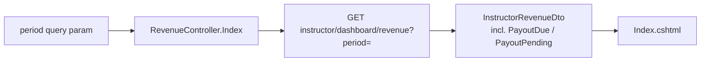
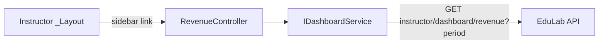

# RevenueController Module Documentation (MVC — Instructor Area)

---

## Overview

### Purpose
Dedicated revenue analytics page: payout breakdown by period with chart + table.

### Business Objective
Instructors track earnings, payouts (due/pending), and trends per period.

### Main Functionality
- Load revenue data for a selected period
- Period presets: `week` / `month` / `year` / `all`
- Export buttons (UI only — dead, see Hidden Behaviors)

### Primary User Roles

| Role | Description |
|------|-------------|
| Instructor | View revenue analytics |

---

## Module Architecture

```
Presentation           Areas/Instructor/Views/Revenue/Index.cshtml
Application            IDashboardService -> GetInstructorRevenueAsync(period)
External               EduLab API: GET instructor/dashboard/revenue?period=
```

### Controllers

| Controller | Responsibility |
|-----------|----------------|
| `RevenueController` | Single `Index(period)` action |

### Services

| Service | Responsibility |
|---------|----------------|
| `DashboardService` | `GetInstructorRevenueAsync(period)` -> GET `instructor/dashboard/revenue?period={Uri.EscapeDataString(period)}` (DashboardService.cs:128); `safePeriod` = blank ? `"month"` : period (DashboardService.cs:123); API failure -> `new InstructorRevenueDto()` (DashboardService.cs:140-150) |

### Dependencies on Other Modules
- **Instructor layout** (sidebar link).
- **EduLab API** (hard dependency).

---

## Folder Structure

```
Areas/Instructor/Controllers/
+-- RevenueController.cs              # 1 action (27 lines)

Areas/Instructor/Views/Revenue/
+-- Index.cshtml                      # Revenue render (dead Export buttons)
```

---

## Database Design

None (MVC). Data is API-derived analytics.

---

## Internal Workflows & Runtime Behavior

### Workflow 1: Revenue Page

#### Flow

```mermaid
flowchart TD
    A[GET Instructor/Revenue/Index?period=] --> B[GetInstructorRevenueAsync period]
    B --> C[GET instructor/dashboard/revenue?period=]
    C -->|ok| D[InstructorRevenueDto]
    C -->|fail| E[empty DTO fallback]
    D --> F[ViewBag.SelectedPeriod = period ?? month]
    E --> F
    F --> G[View(revenue)]
```

#### Runtime Behavior
- `ViewBag.SelectedPeriod = period ?? "month"` (RevenueController.cs:23) — **null-only fallback**, differs from ReportsController's `IsNullOrWhiteSpace` check.
- Passes the revenue DTO as the view model; period switch buttons re-navigate with `?period=`.

---

## Data Flow Analysis



---

## Controllers & Endpoints

### RevenueController

**Route**: `/Instructor/Revenue`  
**Authorization**: `[Authorize(Roles = SD.Instructor)]` (RevenueController.cs:10)  
**Dependencies**: `IDashboardService` only

| Action | HTTP | Route | Description |
|--------|------|-------|-------------|
| Index | GET | `/Instructor/Revenue/Index?period` | Revenue for period |

**Model**: `InstructorRevenueDto` (incl. `PayoutDue`, `PayoutPending`).
**Period presets** (view): `week` / `month` / `year` / `all`.

---

## Frontend Integration

### Index.cshtml
- Revenue chart + payout summary; `ViewBag.SelectedPeriod` drives active preset (Index.cshtml:20-21).
- **Export buttons are dead**: Index.cshtml:135-138 renders export controls with no handler (mirrors Reports/Index.cshtml:137-140).

---

## Business Rules

| Rule | Verified in | Why it exists |
|------|-------------|---------------|
| Instructor-only | `[Authorize(Roles = SD.Instructor)]` | Financial data |
| Null period -> "month" | RevenueController.cs:23 | Sensible default |
| Period presets differ from Reports | `week`/`month`/`year`/`all` vs Reports' `7days`/`month`/`3months`/`year`/`all` | Inconsistent feature sets |

---

## Security Analysis

| Control | Status |
|---------|--------|
| Authentication | ✅ role-gated |
| Authorization | API scopes revenue to calling instructor (JWT) |
| Data exposure | Instructor-owned earnings only |

---

## Module Dependencies



**Internal**: Instructor layout, DashboardService.
**External**: EduLab API only.

---

## Hidden Behaviors & Technical Notes

1. **Period fallback inconsistency**: `?? "month"` (null-only) here vs `IsNullOrWhiteSpace` in ReportsController.cs:27 — `?period=` renders different behavior between the two pages.
2. **Dead Export buttons** (same as Reports).
3. **Period vocabularies diverge** from Reports (`week` vs `7days`, no `3months`) — API must handle both.
4. **Payout fields**: `PayoutDue`/`PayoutPending` are DTO-level — the UI's payout presentation depends on the API filling them correctly.

---

## Configuration

| Key | Purpose |
|-----|---------|
| `EduLab:ApiBaseUrl` | API base |

---

## Change Log

**Current functionality (verified):** period-filtered revenue page backed by `GET instructor/dashboard/revenue?period=`, empty-DTO fallback on API failure.

**Maintenance notes:** wire or remove Export buttons; unify period fallback + presets with Reports.