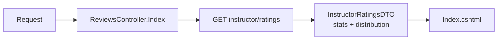
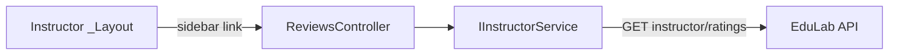

# ReviewsController Module Documentation (MVC — Instructor Area)

---

## Overview

### Purpose
Instructor view of all received ratings: stats, distribution, and per-course review lists.

### Business Objective
Help instructors understand how students rate their courses and spot problem courses.

### Main Functionality
- Load aggregate rating stats + distribution + per-course reviews
- Deterministic color coding of courses/authors in the UI

### Primary User Roles

| Role | Description |
|------|-------------|
| Instructor | Review analytics |

---

## Module Architecture

```
Presentation           Areas/Instructor/Views/Reviews/Index.cshtml
Application            IInstructorService -> GetInstructorRatingsAsync
External               EduLab API: GET instructor/ratings
```

### Controllers

| Controller | Responsibility |
|-----------|----------------|
| `ReviewsController` | Single `Index` action with try/catch fallback |

### Services

| Service | Responsibility |
|---------|----------------|
| `InstructorService` | `GetInstructorRatingsAsync` -> GET `instructor/ratings` (InstructorService.cs:197); image URL prefix from config (InstructorService.cs:36-37) |

### Dependencies on Other Modules
- **Instructor layout** (sidebar link).
- **EduLab API** (hard dependency).

---

## Folder Structure

```
Areas/Instructor/Controllers/
+-- ReviewsController.cs              # 1 action (36 lines)

Areas/Instructor/Views/Reviews/
+-- Index.cshtml                      # Ratings render
```

---

## Database Design

None (MVC). Data comes from the API's `Ratings` table aggregates.

---

## Internal Workflows & Runtime Behavior

### Workflow 1: Reviews Page

#### Flow

```mermaid
flowchart TD
    A[GET Instructor/Reviews/Index] --> B[try GetInstructorRatingsAsync]
    B --> C[GET instructor/ratings]
    C -->|ok| D[View(InstructorRatingsDTO)]
    C -->|exception| E[LogError + View(new InstructorRatingsDTO)]
    D --> F[Index.cshtml stats + distribution + reviews]
    E --> F
```

#### Runtime Behavior
- On ANY exception the controller logs and renders an **empty DTO** (ReviewsController.cs:29-33) — page never crashes but silently shows zeros.
- Rating list entries include course + reviewer info for coloring.

---

## Data Flow Analysis



---

## Controllers & Endpoints

### ReviewsController

**Route**: `/Instructor/Reviews`  
**Authorization**: `[Authorize(Roles = SD.Instructor)]` (ReviewsController.cs:10)  
**Dependencies**: `IInstructorService`, `ILogger<ReviewsController>`

| Action | HTTP | Route | Description |
|--------|------|-------|-------------|
| Index | GET | `/Instructor/Reviews/Index` | Rating stats + reviews |

**Model**: `InstructorRatingsDTO` (stats, distribution, per-course ratings).

---

## Frontend Integration

### Index.cshtml
- `@model InstructorRatingsDTO` (Index.cshtml:1-2); course color derived deterministically: `CourseColor = (courseId*7)%5`; avatar color = name-hash%5; palette: blue/purple/emerald/amber/rose (Index.cshtml:3-28).

---

## Business Rules

| Rule | Verified in | Why it exists |
|------|-------------|---------------|
| Instructor-only | `[Authorize(Roles = SD.Instructor)]` | Reviews are instructor-private analytics |
| Failure renders empty state | ReviewsController.cs:29-33 | Never blank-page |

---

## Security Analysis

| Control | Status |
|---------|--------|
| Authentication | ✅ role-gated |
| Authorization | API scopes ratings to the instructor's courses |
| Data exposure | Reviewer names/avatars shown to the rated instructor only |

---

## Module Dependencies



**Internal**: Instructor layout.
**External**: EduLab API only.

---

## Hidden Behaviors & Technical Notes

1. **Silent zero-state**: API failure looks identical to "no reviews" (empty DTO fallback) — no user-facing error.
2. **Deterministic color hashing** in the view — course colors stable across reloads but colliding hashes share colors.

---

## Configuration

| Key | Purpose |
|-----|---------|
| `EduLab:ApiBaseUrl` | API base; avatar URL prefixing |

---

## Change Log

**Current functionality (verified):** ratings analytics page from `GET instructor/ratings` with stats/distribution/per-course lists and deterministic UI coloring.

**Maintenance notes:** none outstanding.