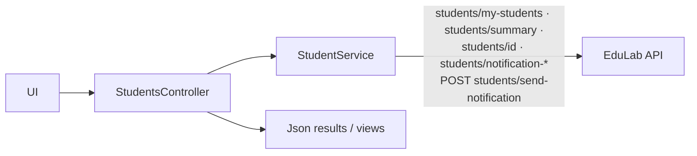
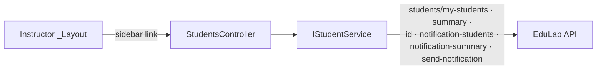

# StudentsController Module Documentation (MVC — Instructor Area)

---

## Overview

### Purpose
Instructor's student management: list enrolled students, view details, send notifications (single or bulk).

### Business Objective
Give instructors visibility into who bought their courses and a channel to announce updates/offers.

### Main Functionality
- Students list + summary (parallel loading)
- Student details JSON (modal)
- Send notification (in-app + optional email)
- Student picker for notifications
- Notification summary statistics

### Primary User Roles

| Role | Description |
|------|-------------|
| Instructor | Manage + notify own students |

---

## Module Architecture

```
Presentation           Areas/Instructor/Views/Students/Index.cshtml
Application            IStudentService (parallel calls for list + summary)
External               EduLab API: GET students/my-students,
                       GET students/summary,
                       GET students/{studentId},
                       GET students/notification-students,
                       GET students/notification-summary,
                       POST students/send-notification
```

### Controllers

| Controller | Responsibility |
|-----------|----------------|
| `StudentsController` | Index, StudentDetails, SendNotification, GetStudentsForNotification, GetNotificationSummary (5 actions) |

### Services

| Service | Responsibility |
|---------|----------------|
| `StudentService` | `GetMyStudentsAsync` (GET `students/my-students`, StudentService.cs:117), `GetStudentsSummaryAsync` (GET `students/summary`, :278), `GetStudentDetailsAsync` (GET `students/{studentId}`, :224), `GetStudentsForNotificationAsync` (GET `students/notification-students`, :377), `GetNotificationSummaryAsync` (GET `students/notification-summary`, :427), `SendNotificationAsync` (POST `students/send-notification`, :327) |

### Dependencies on Other Modules
- **Instructor layout** (sidebar link).
- **Notification DTOs** (Models/DTOs/Notifications).
- **EduLab API** (hard dependency).

---

## Folder Structure

```
Areas/Instructor/Controllers/
+-- StudentsController.cs             # 5 actions (262 lines)

Areas/Instructor/Views/Students/
+-- Index.cshtml                      # Students list + notification UI

Models/DTOs/Student/
+-- StudentDto.cs, StudentDetailsDto.cs, StudentsSummaryDto.cs,
    StudentStatisticsDto.cs, StudentActivityDto.cs, StudentEnrollmentDto.cs,
    StudentProgressDto.cs, StudentNotificationDto.cs, StudentFilterDto.cs
    (PageSize = 10), InstructorNotificationSummaryDto.cs, BulkMessageDto.cs

Models/DTOs/Notifications/
+-- InstructorNotificationRequestDto.cs   # Title [Required <=200],
                                          # Message [Required <=2000],
                                          # Type default 0 (System),
                                          # SendEmail false, SendNotification true,
                                          # SendToAll false
+-- InstructorNotificationResultDto.cs
+-- BulkNotificationResultDto.cs          # IsSuccess = no Errors
```

---

## Database Design

None (MVC). Students/enrollments live in the API's DB; notifications in its `Notifications` table.

---

## Internal Workflows & Runtime Behavior

### Workflow 1: Students Index

#### Flow

```mermaid
flowchart TD
    A[GET Instructor/Students/Index] --> B[parallel: GetMyStudentsAsync +<br/>GetStudentsSummaryAsync]
    B --> C[Task.WhenAll]
    C --> D[ViewBag.StudentsSummary]
    D --> E[View(students)]
    B -->|exception| F[LogError + View(empty list)]
```

#### Runtime Behavior
- Parallel loading via `Task.WhenAll` (StudentsController.cs:73-79).
- Exception -> empty list view (StudentsController.cs:88-94).
- Namespace **anomaly**: `EduLab_MVC.Controllers.Instructor` (StudentsController.cs:11) — the other 7 Instructor controllers use `EduLab_MVC.Areas.Instructor.Controllers`; attribute order also reversed (`[Authorize]` then `[Area]`, :18-19). Routing still works because the area is declared via the `[Area]` attribute.

### Workflow 2: Student Details (AJAX)

#### Behavior
- `GET Instructor/Students/details/{studentId}` — blank id -> 404 JSON (`InvalidStudentId`); null result -> 404 JSON (`StudentNotFound`); exception -> 500 JSON (StudentsController.cs:107-143).

### Workflow 3: Send Notification

#### Flow

```mermaid
flowchart TD
    A[Notification modal<br/>recipients + message] --> B[POST send-notification<br/>[FromBody] request<br/>NO antiforgery]
    B --> C{request null?}
    C -->|yes| D[Json false InvalidNotificationRequest]
    C -->|no| E[SendNotificationAsync]
    E -->|IsSuccess| F[Json true NotificationSentSuccess]
    E -->|else| G[Json false + Errors list]
```

#### Runtime Behavior
- `[HttpPost("Instructor/Students/send-notification")]` — **no `[ValidateAntiForgeryToken]`** (StudentsController.cs:157-158).
- Result carries per-recipient `Errors`; UI surfaces them.

### Workflow 4: Notification Helpers (AJAX)

#### Behavior
- `GetStudentsForNotification` — `GET Instructor/Students/get-students-for-notification?selectedStudentIds=` (StudentsController.cs:203-225).
- `GetNotificationSummary` — **attribute route `[HttpGet("get-notification-summary")]` (StudentsController.cs:237) resolves at root `/get-notification-summary`** — NOT under `/Instructor/Students/`; **never called by the frontend (dead endpoint)**.

---

## Data Flow Analysis



---

## Controllers & Endpoints

### StudentsController

**Route**: `/Instructor/Students` (except GetNotificationSummary at root)  
**Authorization**: `[Authorize(Roles = SD.Instructor)]` (StudentsController.cs:18)  
**Dependencies**: `IStudentService`, `ILogger<StudentsController>`, `IStringLocalizer<SharedResources>`

| Action | HTTP | Route | Description | Anti-forgery |
|--------|------|-------|-------------|--------------|
| Index | GET | `/Instructor/Students/Index` | List + summary | — |
| StudentDetails | GET | `/Instructor/Students/details/{studentId}` | Detail JSON | — |
| SendNotification | POST | `/Instructor/Students/send-notification` | Send notification | ❌ |
| GetStudentsForNotification | GET | `/Instructor/Students/get-students-for-notification` | Recipient picker JSON | — |
| GetNotificationSummary | GET | `/get-notification-summary` (root!) | Summary JSON — **unused** | — |

**Models**: `List<StudentDto>` (Index), `StudentDetailsDto` (details), `InstructorNotificationRequestDto` (send), `InstructorNotificationResultDto`/`BulkNotificationResultDto` (result), `InstructorNotificationSummaryDto` (summary).

---

## Frontend Integration

### Index.cshtml
- Student table + summary cards (`ViewBag.StudentsSummary`); details modal via `StudentDetails`; notification modal with recipient multi-select (`GetStudentsForNotification`) and send (`SendNotification`).
- **Dead UI**: `sendMessage()` at Index.cshtml:1384-1396 is never called; orphaned `showMessageModal` — the notification flow uses its own modal instead.

---

## Business Rules

| Rule | Verified in | Why it exists |
|------|-------------|---------------|
| Instructor-only | `[Authorize(Roles = SD.Instructor)]` | Student/notification data is course-owner scoped |
| Title <=200 / Message <=2000 | `InstructorNotificationRequestDto` validation | Payload limits |
| Type default 0 (System) | DTO default | UI sets explicit types when needed |
| SendEmail default false | DTO default | Email opt-in per send |
| SendToAll default false | DTO default | Bulk requires explicit opt-in |

---

## Security Analysis

| Control | Status |
|---------|--------|
| Authentication | ✅ role-gated |
| Authorization | API scopes students/notifications to calling instructor (JWT) |
| Anti-forgery | ❌ `SendNotification` POST unprotected (verified) |
| Data exposure | Student PII (names/emails) exposed only to their instructors |

---

## Module Dependencies



**Internal**: Instructor layout, notification DTOs.
**External**: EduLab API only.

---

## Hidden Behaviors & Technical Notes

1. **Namespace + attribute-order anomalies** (StudentsController.cs:11, 18-19) — cosmetic; routing unaffected.
2. **`GetNotificationSummary` is a dead root-level route** (`/get-notification-summary`) — never called by the frontend and outside the area path.
3. **CSRF-exposed SendNotification** — verified.
4. **Dead `sendMessage()` JS** + orphaned `showMessageModal` in Index.cshtml (1384-1396).
5. **Documented-but-unused pattern**: heavy `#region`/XML-doc style only in this controller (the others are terse).

---

## Configuration

| Key | Purpose |
|-----|---------|
| `EduLab:ApiBaseUrl` | API base |

---

## Change Log

**Current functionality (verified):** students list + summary (parallel), details JSON, notification send with recipient picker + summary, localized error messages.

**Maintenance notes:** add antiforgery to `SendNotification`; remove or fix the root `get-notification-summary` route; delete dead JS/modal; align namespace with the other Instructor controllers.