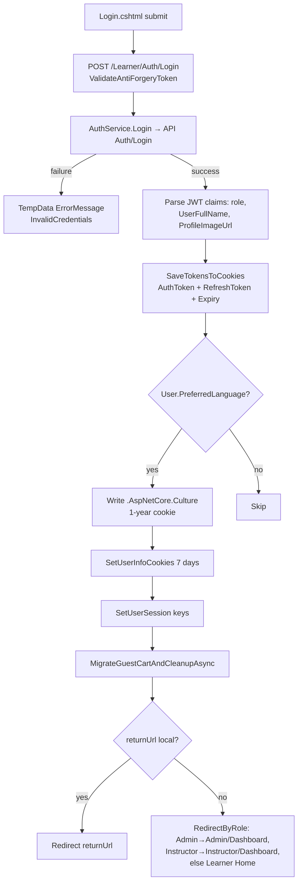
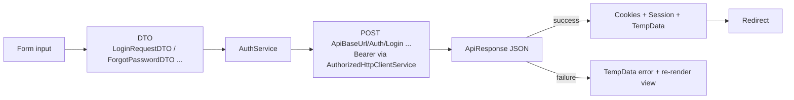
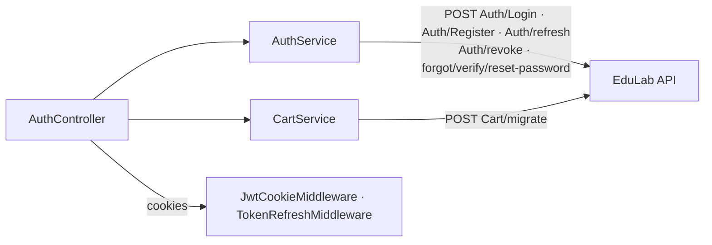

# AuthController Module Documentation (MVC)

---

## Overview

### Purpose
Handle the complete learner identity lifecycle in the MVC layer: login, registration, password reset, email verification, external (OAuth) login confirmation, token refresh, and logout — orchestrating the EduLab API and managing cookie/session state.

### Business Objective
Authenticate users against the API, establish the cookie-based session every page depends on, migrate guest carts on login, and keep the auth UX in Arabic/English with zero client-side token logic.

### Main Functionality
- Login / Register (form + JSON AJAX)
- Password reset (code-based, 3-step) and email verification
- External login confirmation + popup-mode handoff
- Token refresh and revoke
- Guest cart migration on login; cookie/session cleanup on logout

### Primary User Roles
| Role | Description |
|------|-------------|
| Anonymous | Login/register/forgot-password/reset flows |
| Student / Instructor / Admin | Post-login redirects are role-based; existing sessions are bounced from auth pages |

---

## Module Architecture

```
Presentation           Views/Auth/*.cshtml (Login, Register, ForgotPassword,
                       ExternalLoginConfirmation — all Layout = null, Tailwind CDN)
                       Page scripts: fetch() JSON to the actions below
Application            IAuthService -> AuthService (Services/)
                       ICartService (guest cart migration)
External               EduLab API: POST Auth/Login, Auth/Register, Auth/forgot-password,
                       Auth/verify-reset-code, Auth/reset-password, Auth/refresh,
                       Auth/revoke, Cart/migrate
State                  Cookies: AuthToken, RefreshToken, RefreshTokenExpiry (HttpOnly,
                       Secure, SameSite=Strict); UserFullName, UserRole,
                       ProfileImageUrl (7 days, non-HttpOnly); .AspNetCore.Culture
                       Session: AuthToken, UserFullName, UserRole, ProfileImageUrl
```

### Controllers

| Controller | Responsibility |
|-----------|----------------|
| `AuthController` (737 lines) | All identity actions + cookie/session helpers |

### Services

| Service | Responsibility |
|---------|----------------|
| `AuthService` | API login/register/reset/refresh/revoke calls, `IsTokenExpired`, `SaveTokensToCookies` |
| `CartService` | `MigrateGuestCartAsync` → POST `Cart/migrate` (guest cart merge on login) |

### Dependencies on Other Modules
- **Cart module**: guest cart migration runs at login; `GuestId` cookie deleted afterwards.
- **Home/Profile modules**: `UserFullName`/`UserRole`/`ProfileImageUrl` cookies feed nav UI.
- **EduLab API** (hard dependency).

---

## Folder Structure

```
Areas/Learner/Controllers/
+-- AuthController.cs                  # 737 lines — all identity actions

Areas/Learner/Views/Auth/
+-- Login.cshtml                       # Form + JSON submit
+-- Register.cshtml                    # Form + JSON submit
+-- ForgotPassword.cshtml              # Code-based reset (3 steps)
+-- ExternalLoginConfirmation.cshtml   # Finish external signup (Layout=null)

Models/DTOs/Auth/                      # LoginRequestDTO, RegisterRequestDTO,
                                       # ForgotPasswordDTO, VerifyEmailDTO,
                                       # ResetPasswordDTO, SendCodeDTO,
                                       # ExternalLoginConfirmationDto
Models/DTOs/Token/                     # RefreshTokenRequestDTO, TokenResponseDTO

Services/
+-- AuthService.cs                     # API orchestration
+-- CartService.cs                     # Guest cart migration
```

---

## Database Design

The MVC module has no database. Persistent state:

| Store | Name | Lifetime | HttpOnly | Notes |
|-------|------|----------|----------|-------|
| Cookie | `AuthToken` | per JWT | ✅ | API-issued JWT; parsed by `JwtCookieMiddleware` |
| Cookie | `RefreshToken` / `RefreshTokenExpiry` | 7 days | ✅ | Used by `TokenRefreshMiddleware` |
| Cookie | `UserFullName`, `UserRole`, `ProfileImageUrl` | 7 days | ❌ | Nav UI only (AuthController.cs:657-671) |
| Cookie | `.AspNetCore.Culture` | 1 year, essential | ❌ | Set on login from `User.PreferredLanguage` (AuthController.cs:131-138) |
| Cookie | `GuestId` | 30 days | ✅ | Deleted after cart migration (AuthController.cs:648) |
| Session | `AuthToken`, `UserFullName`, `UserRole`, `ProfileImageUrl` | 1h | — | AuthController.cs:680-686 |

---

## Internal Workflows & Runtime Behavior

### Workflow 1: Login

#### Purpose
Authenticate via the API and bootstrap every auth artifact the app relies on.

#### Flow Diagram



#### Runtime Behavior
1. Login POST is `[ValidateAntiForgeryToken]` (AuthController.cs:97).
2. `AuthService.Login` calls POST `Auth/Login`; success → tokens saved as HttpOnly/Secure/SameSite=Strict cookies.
3. Preferred language from the API user profile becomes the culture cookie (1 year, essential).
4. Guest cart merged via POST `Cart/migrate`; `GuestId` cookie deleted even if migration fails (warning only, AuthController.cs:643-648).

#### Side Effects
Info cookies, session keys, culture cookie, guest cart migration, `TempData["SuccessMessage"]="LoginSuccess"`.

#### Edge Cases
- GET Login/Register/ForgotPassword bounce already-authenticated users using `AuthToken` + `IAuthService.IsTokenExpired` (AuthController.cs:57-63).
- Exceptions during login → `TempData["ErrorMessage"]="ErrorDuringLogin"` (AuthController.cs:167).

### Workflow 2: Password Reset (3-step code)

#### Purpose
Allow password recovery without an authenticated session.

#### Flow
1. `SendResetCode` (POST, `[FromBody] ForgotPasswordDTO`) → API `Auth/forgot-password` → `{isSuccess, message}`.
2. `VerifyResetCode` (POST, `VerifyEmailDTO`) → API `Auth/verify-reset-code` → `{isSuccess, message}`.
3. `ResetPassword` (POST, `ResetPasswordDTO`) → API `Auth/reset-password` → `{isSuccess, message}`.

All three are antiforgery-protected JSON endpoints (AuthController.cs:191, 228, 265); errors return `{isSuccess=false, errorMessages:[...]}`.

### Workflow 3: External Login Callback & Confirmation

#### Purpose
Complete OAuth flows (Facebook/Google/Microsoft) after the API callback.

#### Flow
- `ExternalLoginCallbackFromApi` (GET, `email, isNewUser, token, popup`): new user → confirmation view; existing user → parse token → `SaveTokensToCookies(token, "", +7 days)` → cookies/session → guest cart migration → `popup=true` → `postMessage({type:'auth_success', url})` + `window.close()` (AuthController.cs:463-527).
- Missing token → `TempData["ErrorMessage"]="ErrorProcessingLogin"` + redirect Login (AuthController.cs:479-484).
- `ExternalLoginConfirmation` (POST, form DTO) completes registration for new users; success without token → `"AccountCreatedPleaseLogin2"` + redirect Login (AuthController.cs:574-576).

### Workflow 4: Logout

#### Purpose
Revoke the refresh token server-side and clear every client artifact.

#### Flow
1. Read `RefreshToken` cookie → `AuthService.RevokeToken` (POST `Auth/revoke`).
2. `ClearAuthenticationCookies`: delete AuthToken, RefreshToken, RefreshTokenExpiry, UserFullName, UserRole, ProfileImageUrl (AuthController.cs:691-707).
3. `Session.Clear()` → redirect Learner Home.

---

## Data Flow Analysis



#### Mapping & Transformations
- JWT claims → cookies: `role`, `UserFullName`, `ProfileImageUrl` parsed from the decoded token (AuthController.cs:119-121).
- `User.PreferredLanguage` → culture cookie (1-year).
- Error text: API `ErrorMessage` preferred, else localized key `"InvalidCredentials"` / `"ErrorDuringLogin"`.

---

## Controllers & Endpoints

### AuthController

**Route**: `/Learner/Auth` (area convention)  
**Authorization**: `[AllowAnonymous]` class-level  
**Dependencies**: `IAuthService`, `ILogger<AuthController>`, `IStringLocalizer<SharedResources>`, `ICartService`

| Action | HTTP | Route | Description | Anti-forgery |
|--------|------|-------|-------------|--------------|
| Login | GET | `/Learner/Auth/Login` | Login view (bounces authenticated) | — |
| Login | POST | `/Learner/Auth/Login` | Authenticate + bootstrap session | ✅ |
| Register | GET | `/Learner/Auth/Register` | Register view | — |
| Register | POST | `/Learner/Auth/Register` | Create account (JSON) | ✅ |
| ForgotPassword | GET | `/Learner/Auth/ForgotPassword` | Reset view | — |
| SendResetCode | POST | `/Learner/Auth/SendResetCode` | Request reset code (JSON) | ✅ |
| VerifyResetCode | POST | `/Learner/Auth/VerifyResetCode` | Validate code (JSON) | ✅ |
| ResetPassword | POST | `/Learner/Auth/ResetPassword` | Set new password (JSON) | ✅ |
| RefreshToken | POST | `/Learner/Auth/RefreshToken` | Client refresh (JSON) | ✅ |
| VerifyEmail | POST | `/Learner/Auth/VerifyEmail` | Verify email code (JSON) | ✅ |
| SendCode | POST | `/Learner/Auth/SendCode` | Resend verification (JSON) | ✅ |
| ExternalLoginCallbackFromApi | GET | `/Learner/Auth/ExternalLoginCallbackFromApi` | OAuth handoff (`email, isNewUser, token, popup`) | — |
| ExternalLoginConfirmation | POST | `/Learner/Auth/ExternalLoginConfirmation` | Finish external signup | ✅ |
| Logout | POST | `/Learner/Auth/Logout` | Revoke + clear all | ✅ |

**Request/response models**: `LoginRequestDTO`, `RegisterRequestDTO`, `ForgotPasswordDTO`, `VerifyEmailDTO`, `ResetPasswordDTO`, `SendCodeDTO`, `ExternalLoginConfirmationDto`, `RefreshTokenRequestDTO`, `TokenResponseDTO`; JSON responses `{isSuccess, message|errorMessages}` / `{success, accessToken}`.

---

## Frontend Integration

### Login / Register / ForgotPassword pages
- All `Layout = null`; Tailwind CDN; jQuery Validate + unobtrusive (CDN copies).
- Submits are `fetch()` POSTs with the antiforgery token; JSON responses drive success/error rendering.
- ForgotPassword is a 3-step wizard (send code → verify → reset) with 3 separate AJAX endpoints.

### ExternalLoginConfirmation
- Rendered inside the OAuth popup; success → `postMessage({type:'auth_success', url})` then `window.close()`; parent window navigates to `url`.

### Toasts
- Success/error via `TempData` rendered by the shared alert system (`showAlert` in `site.js`).

---

## Business Rules

| Rule | Verified in | Why it exists |
|------|-------------|---------------|
| Auth pages bounce authenticated users | AuthController.cs:57-63, 76-82, 179-185 | Prevents redundant re-login and role confusion |
| Role-based post-login redirect | AuthController.cs:721-733 | Users land in their own workspace (Admin/Instructor/Learner) |
| Guest cart migrated on login, never on register | `MigrateGuestCartAndCleanupAsync` at login only | Cart belongs to the anonymous session, not the new account |
| Preferred language applied at login | AuthController.cs:131-138 | Keeps UI language consistent with profile |
| Local redirects only | `LocalRedirect(returnUrl)` | Open-redirect protection |

---

## Security Analysis

| Control | Status |
|---------|--------|
| Authentication | API-issued JWT; MVC never validates itself (middleware does) |
| Cookie hardening | `AuthToken`/`RefreshToken`/`RefreshTokenExpiry`: HttpOnly + Secure + SameSite=Strict (AuthController.cs:361-371) |
| Anti-forgery | ✅ Every POST in this controller |
| CSRF-safe logout | Logout is POST + antiforgery |
| External flows | Token passed via callback query param — **not logged**; popup uses `postMessage` with explicit origin handling |
| GuestId cleanup | Deleted after migration — guest identity cannot outlive the login |

---

## Module Dependencies



**Internal**: Home (role redirects), MyLearning (session), Cart (migration), Nav layout (info cookies).
**External**: EduLab API only (no direct Stripe/SMTP/SignalR).

---

## Hidden Behaviors & Technical Notes

1. **RefreshToken endpoint is client-only by design**: `/Learner/Auth/RefreshToken` exists for the (never-loaded) `tokenManager.js`; real refresh is server-side in `TokenRefreshMiddleware`.
2. **Guest cart migration failure is non-fatal**: logged warning; `GuestId` still deleted (AuthController.cs:643-648) — the guest cart is effectively lost on API failure.
3. **External callback popup mode**: the same callback serves both full-page and popup flows via the `popup` flag — the parent window is instructed via `postMessage`, not a redirect.
4. **Info cookies are readable by JS** (non-HttpOnly) by design — they hold only display data (name/role/image).
5. **`SaveTokensToCookies(token, "", +7 days)`** on external login: no refresh token is stored from the OAuth flow (empty refresh), relying on the access token's 7-day lifetime.

---

## Configuration

| Key | Purpose |
|-----|---------|
| `EduLab:ApiBaseUrl` (appsettings.json:12) | API base `https://edulabapi.runasp.net/api/` — all auth calls target it |
| Culture cookie | `CookieRequestCultureProvider` standard key `.AspNetCore.Culture` |

No feature flags, no environment variables specific to this module.

---

## Change Log

**Current functionality (verified):** full identity flows (login/register/reset/verify/external), guest-cart migration, cookie+session bootstrap, role-based redirects, logout with server-side revoke, all POSTs antiforgery-protected, full localization.

**Maintenance notes:**
- Register does not migrate a guest cart (only login does) — confirm this is intended product behavior.
- External login stores no refresh token (`SaveTokensToCookies(token, "", ...)`) — a session longer than the JWT lifetime relies on `TokenRefreshMiddleware`, which needs a refresh cookie; verify popup flow behaves after 7 days.