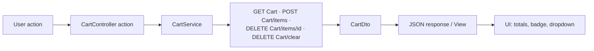
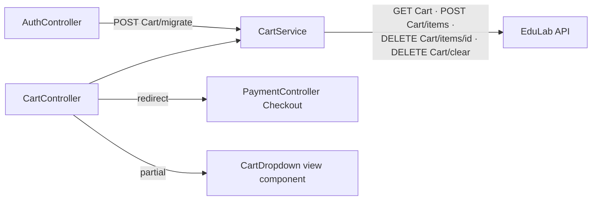

# CartController Module Documentation (MVC)

---

## Overview

### Purpose
Manage the shopping cart for both anonymous (guest) and authenticated users, bridging the MVC UI to the API cart service.

### Business Objective
Keep the cart usable pre-login, sync it to the user account on login (guest migration), and drive the checkout flow without server-side cart state.

### Main Functionality
- Cart page with line items, totals, and checkout CTA
- Add / toggle / remove / clear operations
- AJAX summary + dropdown partial for the navbar badge
- Guest cart support via `GuestId` cookie

### Primary User Roles

| Role | Description |
|------|-------------|
| Anonymous (guest) | Full cart lifecycle on `GuestId` identity |
| Student / Instructor / Admin | Cart keyed to user account after login |

---

## Module Architecture

```
Presentation           Views/Cart/Index.cshtml (915 lines)
                       Shared/Components/CartDropdown/_CartDropdown.cshtml (396 lines)
Application            ICartService -> CartService
External               EduLab API: GET Cart, POST Cart/items, DELETE Cart/items/{id},
                       DELETE Cart/clear, POST Cart/migrate
State                  GuestId cookie (30 days, HttpOnly) from GuestIdMiddleware
```

### Controllers

| Controller | Responsibility |
|-----------|----------------|
| `CartController` (274 lines) | All cart actions |

### Services

| Service | Responsibility |
|---------|----------------|
| `CartService` | `GetUserCartAsync` (GET `Cart`), `AddItemToCartAsync` (POST `Cart/items`), `RemoveItemFromCartAsync` (DELETE), `ClearCartAsync` (DELETE `Cart/clear`), `MigrateGuestCartAsync` (POST `Cart/migrate`) |

### Dependencies on Other Modules
- **Auth**: guest cart migration at login (`MigrateGuestCartAndCleanupAsync`).
- **Payment**: checkout proceeds to `/Learner/Payment/Checkout`.
- **Wishlist**: same dropdown pattern.
- **EduLab API** (hard dependency).

---

## Folder Structure

```
Areas/Learner/Controllers/
+-- CartController.cs                # 274 lines (namespace EduLab_MVC.Controllers)

Areas/Learner/Views/Cart/
+-- Index.cshtml                     # Cart page (915 lines)

Areas/Learner/Views/Shared/Components/CartDropdown/
+-- _CartDropdown.cshtml             # Navbar dropdown (396 lines)

Models/DTOs/Cart/
+-- CartDto.cs                       # Items + TotalItems + TotalPrice
+-- CartItemDto.cs
+-- AddToCartRequest.cs              # CourseId, Quantity (default 1)
+-- CartSummaryDto.cs
```

---

## Database Design

None (MVC). Cart identity: `GuestId` cookie (Guid, 30 days, HttpOnly — GuestIdMiddleware.cs:14-23) for guests; Bearer token for authenticated users. The API resolves the cart by whichever identity it receives.

---

## Internal Workflows & Runtime Behavior

### Workflow 1: Add to Cart (from course card / details)

#### Purpose
Queue a course for purchase from anywhere on the site.

#### Flow Diagram

```mermaid
flowchart TD
    A[Course card / Details button] --> B[POST Learner/Cart/AddToCart<br/>{courseId, quantity:1}]
    B --> C{Request valid?}
    C -->|no| D[{success:false, message: InvalidRequest}]
    C -->|yes| E[CartService.AddItemToCartAsync<br/>POST Cart/items]
    E -->|InvalidOperationException| F{API message contains enrolled?}
    F -->|yes| G[{success:false, AlreadyEnrolled}]
    F -->|no| H[{success:false, CourseAlreadyInCart}]
    E -->|ok| I[{success:true, message, cartCount}]
    I --> J[UI: sync [data-cart-count] + refresh dropdown]
```

#### Runtime Behavior
- Duplicate detection is API-side; the MVC maps the API's **Arabic exception text** (`"مسجل بالفعل"`) to the localized `AlreadyEnrolled` message (CartController.cs:94-99).

#### Side Effects
Badge count updates; dropdown refresh (`refreshCartDropdown` -> GET `/Learner/Cart/GetDropdown`).

### Workflow 2: Toggle Cart (Details page)

#### Purpose
One button that adds or removes the course.

#### Behavior
1. Load current cart -> if item exists -> `RemoveItemFromCartAsync(existingItem.Id)`; else `AddItemToCartAsync`.
2. Return `{success, inCart, cartCount, message}` (CartController.cs:125-148).
3. Same Arabic-exception mapping for duplicates.

### Workflow 3: Remove / Clear

#### Behavior
- `RemoveItem(cartItemId)` -> `{success, totalItems, totalPrice, items}`; the view animates the row out and reloads when empty (Index.cshtml:627-683).
- `ClearCart` -> `{success}` or `{success:false, message}` (CartController.cs:200-223).

### Workflow 4: Guest Cart Migration (on login)

#### Purpose
Merge the anonymous cart into the user's account.

#### Flow
1. Login succeeds -> `MigrateGuestCartAndCleanupAsync(token)` (AuthController.cs:632-649).
2. Sets `HttpContext.Items["AuthToken"]` -> `CartService.MigrateGuestCartAsync` -> POST `Cart/migrate`.
3. `GuestId` cookie deleted regardless of migration outcome.

---

## Data Flow Analysis



#### Mapping & Transformations
- `CartDto.TotalItems` computed = `Items.Sum(i => i.Quantity)`.
- Dropdown shows first 3 items, "+N OtherItems", total, checkout button.
- Old price struck through when `CourseDiscount > 0` (view logic).

---

## Controllers & Endpoints

### CartController

**Route**: `/Learner/Cart` (area convention; namespace quirk `EduLab_MVC.Controllers`)  
**Authorization**: **none** (guest carts supported)  
**Dependencies**: `ICartService`, `ILogger<CartController>`, `IStringLocalizer<SharedResources>`

| Action | HTTP | Route | Description | Anti-forgery |
|--------|------|-------|-------------|--------------|
| Index | GET | `/Learner/Cart/Index` | Cart page | — |
| AddToCart | POST | `/Learner/Cart/AddToCart` | Add item (JSON) | ❌ |
| ToggleCart | POST | `/Learner/Cart/ToggleCart` | Add/remove toggle (JSON) | ❌ |
| RemoveItem | POST | `/Learner/Cart/RemoveItem?cartItemId` | Remove line (JSON) | ❌ |
| ClearCart | POST | `/Learner/Cart/ClearCart` | Empty cart (JSON) | ❌ |
| GetCartSummary | GET | `/Learner/Cart/GetCartSummary` | Totals JSON | — |
| GetDropdown | GET | `/Learner/Cart/GetDropdown` | Navbar dropdown partial | — |

**Models**: `CartDto`, `CartItemDto`, `AddToCartRequest` (Quantity default 1), `CartSummaryDto`.

---

## Frontend Integration

### Cart page (Index.cshtml, 915 lines)
- Model `CartDto`; empty state + populated state; `@Html.AntiForgeryToken()` present (Index.cshtml:241) but the JS sends the token only on some calls.
- Coupon input exists **with no wired handler** (Index.cshtml:314-327).
- Checkout modal; login-required modal for guests -> `/Learner/Auth/Login?returnUrl=/Learner/Payment/Checkout` (Index.cshtml:450).
- Clear-cart confirmation modal; mobile sticky CTA.
- JS: `removeItem` (POST + antiforgery header, animation, reload on empty), `clearCartConfirmed`, `handleCheckout` (authenticated gate), `validateCartBeforeCheckout` (items > 0), `proceedToCheckout` -> `/Learner/Payment/Checkout`, `updateCartUI` (subtotal/total animation + badge sync), Ctrl+Enter checkout shortcut (Index.cshtml:781-794), toast system (3s auto-hide).

### Navbar dropdown (_CartDropdown.cshtml, 396 lines)
- First 3 items + "+N", total, checkout button; badge `[data-cart-count]`.

---

## Business Rules

| Rule | Verified in | Why it exists |
|------|-------------|---------------|
| Guest carts fully supported | no `[Authorize]` on controller | Anonymous users must be able to pre-purchase |
| Duplicate add returns friendly error | API Arabic-text mapping | No double-purchase confusion |
| Checkout gated on auth in UI only | Index.cshtml:742-751 | Guests are steered to login first |
| Migration happens at login, not register | AuthController flow | Cart belongs to the anonymous session |
| Item removal returns full totals | CartController.cs:179-191 | Single AJAX refresh of totals |

---

## Security Analysis

| Control | Status |
|---------|--------|
| Authentication | None required — by design (guest carts) |
| Guest identity | `GuestId` cookie (30d, HttpOnly) — unguessable Guid |
| Anti-forgery | ❌ **All POSTs lack `[ValidateAntiForgeryToken]`** (verified) — SameSite=Strict cookies mitigate CSRF |
| Ownership | Cart keyed to token/guest cookie — users only see their own cart (API-side) |
| Data exposure | Only cart DTOs returned (no PII beyond billing totals) |

---

## Module Dependencies



**Internal**: Auth (migration), Payment (checkout redirect), Layout (dropdown refresh).
**External**: EduLab API only.

---

## Hidden Behaviors & Technical Notes

1. **Coupon input is inert**: the UI has a coupon field but no handler/endpoint — potential future feature placeholder.
2. **Arabic exception sniffing**: the controller inspects the API's exception message text (`"مسجل بالفعل"`) to pick the localized user message — fragile if the API localizes differently.
3. **Namespace quirk**: `CartController` lives in namespace `EduLab_MVC.Controllers` while sitting in the Learner area folder — harmless for routing (`[Area("Learner")]` present) but confusing for conventions.
4. **GetDropdown failure returns empty HTML** (Content(string.Empty)) — the navbar silently loses the dropdown on API failure.
5. **Guest checkout is UX-gated only** — the API itself would accept a guest cart checkout call if the token existed; no server-side gate on the MVC side.

---

## Configuration

| Key | Purpose |
|-----|---------|
| `EduLab:ApiBaseUrl` | API base for cart calls |
| `GuestId` cookie | 30-day guest identity (GuestIdMiddleware) |

No feature flags or environment variables specific to this module.

---

## Change Log

**Current functionality (verified):** guest + user carts, add/toggle/remove/clear with full totals, navbar dropdown + badge sync, guest migration at login, checkout redirect, login-gated checkout UX.

**Maintenance notes:**
- Wire or remove the coupon input.
- Add antiforgery tokens to the POST actions (or document the SameSite=Strict reliance).
- Replace the Arabic exception-text sniffing with a structured API error code.