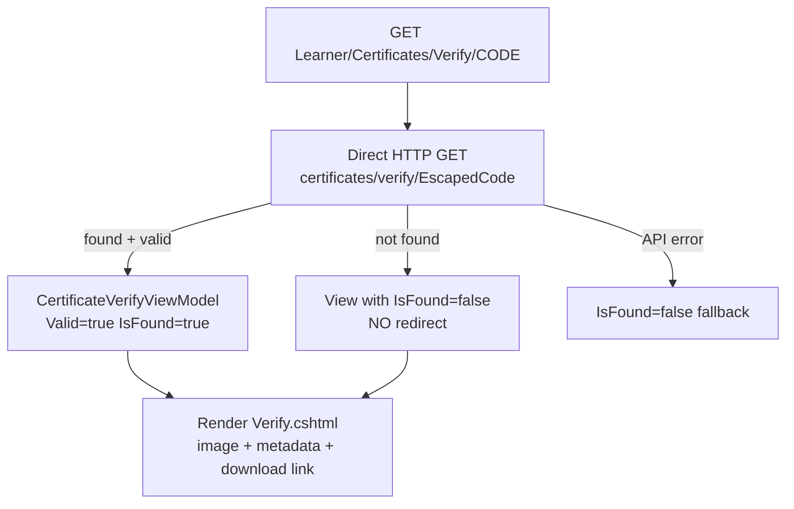
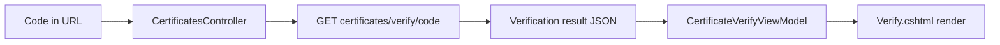
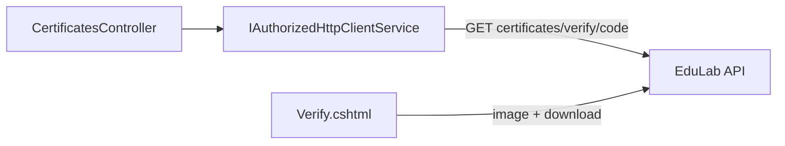

# CertificatesController Module Documentation (MVC)

---

## Overview

### Purpose
Public certificate verification page: given a code, display the certificate with validity state, and link to the PNG download.

### Business Objective
Let anyone (employers, schools) verify a course completion certificate without logging in — trust infrastructure for the credential.

### Main Functionality
- Verify by code (anonymous)
- Show certificate image + metadata
- Download link (API-hosted PNG)

### Primary User Roles

| Role | Description |
|------|-------------|
| Anonymous | Verify + download |
| Learners | View their own certificates via this page |

---

## Module Architecture

```
Presentation           Views/Certificates/Verify.cshtml
Application            IAuthorizedHttpClientService (raw HTTP — bypasses CertificateService)
External               EduLab API: GET certificates/verify/{code},
                       GET certificates/download/{code}
```

### Controllers

| Controller | Responsibility |
|-----------|----------------|
| `CertificatesController` | Single `Verify` action |

### Services

| Service | Responsibility |
|---------|----------------|
| `IAuthorizedHttpClientService` | Direct HTTP call to `certificates/verify/{code}` (CertificateService is registered but **not used** here) |

### Dependencies on Other Modules
- **API file storage**: certificate PNG served from `uploads/certificates/`.
- **EduLab API** (hard dependency).

---

## Folder Structure

```
Areas/Learner/Controllers/
+-- CertificatesController.cs         # 1 action (no class-level [Authorize])

Areas/Learner/Views/Certificates/
+-- Verify.cshtml                     # Verification page

Models/ViewModels/
+-- CertificateVerifyViewModel.cs     # Valid, IsFound, Code, StudentName,
                                      # CourseTitle, IssuedDate, CertificateCode
```

---

## Database Design

None (MVC). Certificates live in the API's `CourseCertificates` table.

---

## Internal Workflows & Runtime Behavior

### Workflow 1: Verify a Certificate

#### Purpose
Resolve a certificate code against the API and render the result.

#### Flow Diagram



#### Runtime Behavior
- Code is `Uri.EscapeDataString`-escaped into the URL (CertificatesController.cs:30-31, 45).
- Invalid/unknown codes re-render the same view with `IsFound=false` (no redirect — URL stays shareable).
- Image: `{apiRootUrl}uploads/certificates/Certificate_{Code}.png` (Verify.cshtml:30).
- Download: `{apiBaseUrl}certificates/download/{code}` (Verify.cshtml:46).

---

## Data Flow Analysis



---

## Controllers & Endpoints

### CertificatesController

**Route**: `/Learner/Certificates`  
**Authorization**: none on class; `[AllowAnonymous]` on Verify (CertificatesController.cs:12, 30-31)  
**Dependencies**: `IAuthorizedHttpClientService`, config, logger

| Action | HTTP | Route | Description |
|--------|------|-------|-------------|
| Verify | GET | `/Learner/Certificates/Verify/{code}` | Public verification page |

**Model**: `CertificateVerifyViewModel` (Valid, IsFound, Code, StudentName, CourseTitle, IssuedDate, CertificateCode).

---

## Frontend Integration

### Verify.cshtml
- `IsFound` branches: valid certificate card (image + student + course + date + download) vs "not found" state.
- Image hosted by the API; download hits the public API endpoint.

---

## Business Rules

| Rule | Verified in | Why it exists |
|------|-------------|---------------|
| Verification is anonymous | `[AllowAnonymous]` | Employers verify without accounts |
| Invalid code keeps the page | no redirect | Shareable URL stays meaningful |
| Download is public | `certificates/download/{code}` anonymous API | Credential portability |

---

## Security Analysis

| Control | Status |
|---------|--------|
| Authentication | None — by design |
| Code exposure | Code appears in the URL (escaping only, not hashing) — codes are GUID-based, hard to guess |
| Download | Public by design (the credential's point) |

---

## Module Dependencies



**Internal**: MyLearning links to this page for earned certificates.
**External**: EduLab API only.

---

## Hidden Behaviors & Technical Notes

1. **CertificateService bypassed**: the controller uses raw HTTP instead of the registered `CertificateService` wrapper (which is used by MyLearning/Course) — two code paths for the same API call.
2. **Verification result shape**: the controller maps the API response directly into the ViewModel — schema coupling without DTO.
3. **Anonymous download**: anyone with the code can download the PNG — codes are unguessable GUIDs, so exposure is limited to the code itself.

---

## Configuration

| Key | Purpose |
|-----|---------|
| `EduLab:ApiBaseUrl` | API base for verify + download URLs |

No feature flags or environment variables specific to this module.

---

## Change Log

**Current functionality (verified):** public verification by code with metadata display, PNG image + download links, graceful not-found state.

**Maintenance notes:**
- Consider routing the verify call through `CertificateService` for consistency.