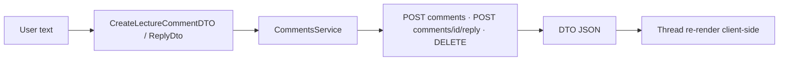
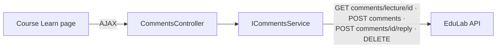

# CommentsController Module Documentation (MVC)

---

## Overview

### Purpose
Threaded lecture comments: list, add, reply, and delete via AJAX from the Learn page.

### Business Objective
Enable discussion under lectures — Q&A between students and instructors.

### Main Functionality
- List comments for a lecture (JSON)
- Add a top-level comment
- Reply to a comment
- Delete own comment

### Primary User Roles

| Role | Description |
|------|-------------|
| Enrolled learners | Comment + reply |
| Course instructor | Comment/reply (privileged, flagged `isInstructorReply`) |

---

## Module Architecture

```
Presentation           No views — pure JSON endpoints consumed by Course/Learn.cshtml
Application            ICommentsService -> CommentsService
External               EduLab API: GET comments/lecture/{lectureId},
                       POST comments, POST comments/{commentId}/reply,
                       DELETE comments/{commentId}
```

### Controllers

| Controller | Responsibility |
|-----------|----------------|
| `CommentsController` | All comment actions (4) |

### Services

| Service | Responsibility |
|---------|----------------|
| `CommentsService` | `GetLectureCommentsAsync` (GET `comments/lecture/{lectureId}`), `AddCommentAsync` (POST `comments`), `ReplyToCommentAsync` (POST `comments/{commentId}/reply`), `DeleteCommentAsync` (DELETE `comments/{commentId}`) |

### Dependencies on Other Modules
- **Course**: Learn page hosts the comment UI.
- **EduLab API** (hard dependency; API enforces enrolled/instructor-only).

---

## Folder Structure

```
Areas/Learner/Controllers/
+-- CommentsController.cs             # 4 actions

Models/DTOs/Comments/
+-- LectureCommentDTO.cs              # Newtonsoft JsonProperty; isInstructorReply,
                                      # timeAgo computed client-side
+-- CreateLectureCommentDTO.cs        # Content 1-1000 chars
+-- ReplyDto.cs
```

---

## Database Design

None (MVC). Comments live in the API's `LectureComments` table (threaded via `ParentCommentId`).

---

## Internal Workflows & Runtime Behavior

### Workflow 1: Load Comments

#### Behavior
- `GET GetLectureComments?lectureId` -> `GET comments/lecture/{lectureId}` -> JSON `LectureCommentDTO[]` with nested `Replies` (Learn.cshtml:2691).

### Workflow 2: Add / Reply / Delete

#### Flow Diagram

```mermaid
flowchart TD
    A[Comment box submit] --> B[POST AddComment<br/>[FromBody] CreateLectureCommentDTO<br/>NO antiforgery]
    B --> C[POST comments]
    C -->|ok| D[Reload comment thread]
    E[Reply button] --> F[POST ReplyToComment<br/>[FromBody] ReplyDto<br/>NO antiforgery]
    F --> G[POST comments/id/reply]
    H[Delete button] --> I[POST DeleteComment<br/>NO antiforgery]
    I --> J[DELETE comments/id]
```

#### Runtime Behavior
- Learn.cshtml calls: `GetLectureComments` (:2691), `AddComment` (:2801), `DeleteComment` POST (:2822), `ReplyToComment` (:2846).
- **All three POST actions lack `[ValidateAntiForgeryToken]`** and the JS sends no token (CommentsController.cs:40-41, 60-61, 77-78).

---

## Data Flow Analysis



#### Mapping & Transformations
- `LectureCommentDTO` uses Newtonsoft `JsonProperty` attributes; `isInstructorReply` flag and `timeAgo` computed client-side (CommentsService.cs:33-35).

---

## Controllers & Endpoints

### CommentsController

**Route**: `/Learner/Comments`  
**Authorization**: `[Authorize]` (CommentsController.cs:10-11)  
**Dependencies**: `ICommentsService`, `ILogger`, `IStringLocalizer`

| Action | HTTP | Route | Description | Anti-forgery |
|--------|------|-------|-------------|--------------|
| GetLectureComments | GET | `/Learner/Comments/GetLectureComments?lectureId` | Comment thread JSON | — |
| AddComment | POST | `/Learner/Comments/AddComment` | Top-level comment | ❌ |
| ReplyToComment | POST | `/Learner/Comments/ReplyToComment` | Nested reply | ❌ |
| DeleteComment | POST | `/Learner/Comments/DeleteComment?id` | Delete own comment | ❌ |

**Models**: `CreateLectureCommentDTO` (Content 1-1000), `ReplyDto`, `LectureCommentDTO`.

---

## Frontend Integration

### Learn.cshtml comment section
- Thread render from `GetLectureComments` JSON; add/reply/delete via fetch; optimistic refresh; instructor replies styled distinctly (`isInstructorReply`).

---

## Business Rules

| Rule | Verified in | Why it exists |
|------|-------------|---------------|
| Content 1–1000 chars | `CreateLectureCommentDTO` | Length control |
| Enrolled-or-instructor only | API `comments` controller (403) | Comment walls protect course value |
| Delete own only | API ownership check | Moderation safety |

---

## Security Analysis

| Control | Status |
|---------|--------|
| Authentication | ✅ `[Authorize]` |
| Authorization | API-side (enrolled/instructor gate; own-comment delete) |
| Anti-forgery | ❌ **all 3 POSTs unprotected** (verified) — CSRF risk mitigated only by SameSite=Strict |

---

## Module Dependencies



**Internal**: Course Learn page.
**External**: EduLab API only.

---

## Hidden Behaviors & Technical Notes

1. **CSRF-exposed POSTs** (all three) — verified.
2. **`timeAgo` is client-side**: server sends timestamps; relative time computed in JS.
3. **No view layer**: everything is JSON — the Learn page is the only consumer.

---

## Configuration

| Key | Purpose |
|-----|---------|
| `EduLab:ApiBaseUrl` | API base for comment calls |

No feature flags or environment variables specific to this module.

---

## Change Log

**Current functionality (verified):** threaded comment list, add, reply, delete with API-enforced authorization, JSON-only surface.

**Maintenance notes:**
- Add antiforgery tokens to the three POSTs.