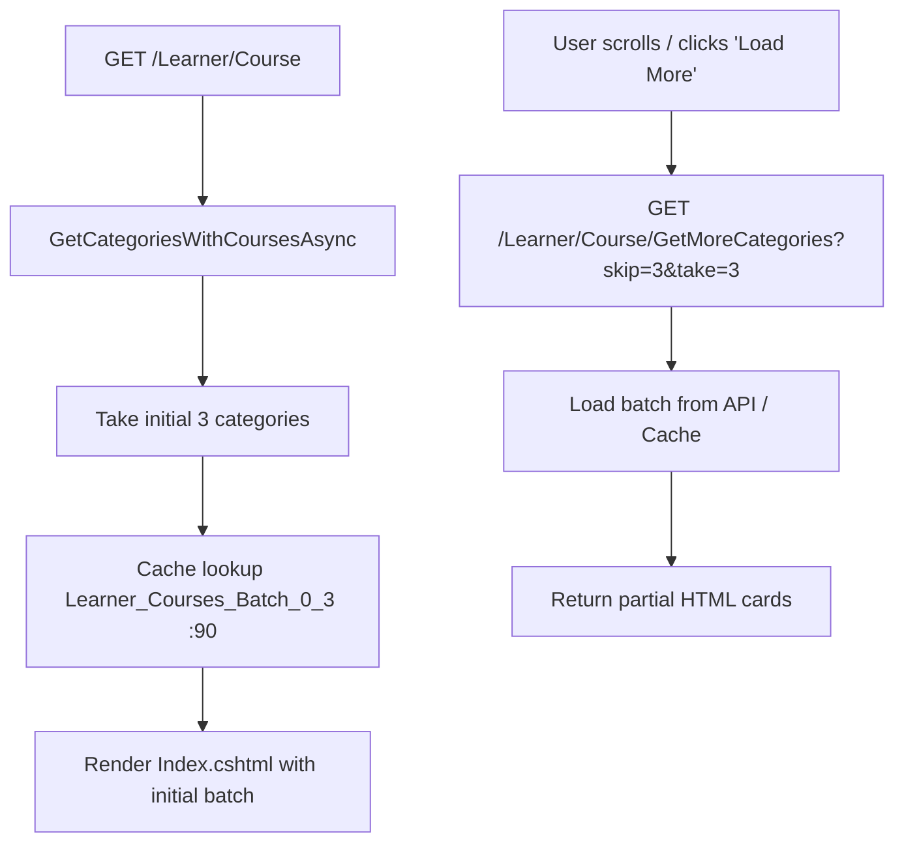

# CourseController Module Documentation (MVC — Learner Area)

---

## Overview

### Purpose
The learner's course browsing experience: catalog, category-filtered views, featured/new/recommended listings, search with autocomplete suggestions, course details, and the learning player with progress tracking.

### Business Objective
Help learners discover courses, preview curriculum details, enroll, and complete lectures while synchronized progress tracks to the backend API.

### Main Functionality
- Catalog (`Index`) with lazy-loaded category batches and memory caching
- Filtered course lists (`ByCategory`, `Featured`, `New`, `Recommended`, `GetCategoryCoursesPartial`)
- Course search with filter/sort combinations and live AJAX autocomplete (`Suggest`)
- Course details page (`Details`) with syllabus preview and enrollment/cart detection
- Learning player (`Learn`) with video/content rendering and lecture navigation
- Progress tracking (`GetLectureData`, `SaveProgress`, `GetCourseProgress`, `GetLectureStatus`, `ToggleLectureCompletion`)
- Course completion certificate fetching (`GetCourseCertificate`)

### Primary User Roles

| Role | Description |
|------|-------------|
| Anonymous | Browse catalog, categories, search, suggestions, and course details |
| Enrolled learner | Access learning player (`Learn`), watch lectures, track progress, download certificates |

---

## Module Architecture

```
Presentation           Views/Course/{Index, Details, Learn, Search}.cshtml
                       Partials: _CategoryCoursesPartial, _CourseCard, _SyllabusPartial
Application            ICourseService, ICategoryService, IEnrollmentService,
                       ICartService, ICourseProgressService, ICertificateService
Caching                IMemoryCache (Learner_Courses_Batch_*)
External               EduLab API: course/*, courseprogress/*, enrollment/*, certificate/*
```

### Controllers

| Controller | Responsibility |
|-----------|----------------|
| `CourseController` | 17 actions (`Areas/Learner/Controllers/CourseController.cs` — 1294 lines) |

### Services

| Service | Responsibility |
|---------|----------------|
| `CourseService` | Catalog, featured, new, recommended, and category course API calls |
| `CategoryService` | Category listing and metadata |
| `EnrollmentService` | Enrollment verification and user enrollment lists |
| `CartService` | Cart item check and cart toggling |
| `CourseProgressService` | Lecture completion status, progress percentage, save progress |
| `CertificateService` | Certificate eligibility and download verification |

### Dependencies on Other Modules
- **EduLab API** (core backend).
- **CommentsController** & **RatingController**: comments and ratings widgets on `Details` and `Learn` pages interact directly with their dedicated controllers.
- **MyLearningController**: enrolled courses listing is managed in `MyLearningController`.

---

## Folder Structure

```
Areas/Learner/Controllers/
+-- CourseController.cs               # 17 actions (1294 lines)

Areas/Learner/Views/Course/
+-- Index.cshtml                      # Catalog with lazy-loading categories
+-- Details.cshtml                    # Course overview, instructor card, curriculum
+-- Learn.cshtml                      # Video player, lecture sidebar, progress bar
+-- Search.cshtml                     # Filterable search results grid
+-- Partials/                         # _CategoryCoursesPartial.cshtml, etc.
```

---

## Endpoints

**Route**: `/Learner/Course`  
**Authorization**: mixed (`Learn`, `SaveProgress`, `ToggleLectureCompletion`, and lecture status require `[Authorize]`; catalog and details are open)

| Action | HTTP | Route | Auth | Description | Anti-forgery |
|--------|------|-------|------|-------------|--------------|
| Index | GET | `/Learner/Course` | 🔓 | Catalog home with initial category batch (:74) | — |
| GetMoreCategories | GET | `/Learner/Course/GetMoreCategories?skip=&take=` | 🔓 | AJAX lazy-load more category sections (:122) | — |
| ByCategory | GET | `/Learner/Course/ByCategory/{id}?page=&pageSize=` | 🔓 | Paginated courses for a specific category (:159) | — |
| Featured | GET | `/Learner/Course/Featured?page=&pageSize=` | 🔓 | Paginated featured (top-rated) courses (:216) | — |
| New | GET | `/Learner/Course/New?page=&pageSize=` | 🔓 | Paginated newest courses (:279) | — |
| Recommended | GET | `/Learner/Course/Recommended?page=&pageSize=` | 🔓/🔐 | Personalized recommended courses (:339) | — |
| GetCategoryCoursesPartial | GET | `/Learner/Course/GetCategoryCoursesPartial?categoryId=&page=` | 🔓 | Partial view of courses for tab switching (:401) | — |
| Search | GET | `/Learner/Course/Search?search=&category=&level=&price=&sort=` | 🔓 | Full catalog search with multi-faceted filtering (:457) | — |
| Suggest | GET | `/Learner/Course/Suggest?term=` | 🔓 | Live AJAX search autocomplete dropdown data (:678) | — |
| Details | GET | `/Learner/Course/Details/{id}` | 🔓 | Course details, syllabus, enrollment status (:819) | — |
| Learn | GET | `/Learner/Course/Learn/{id}` | 🔐 | Learning player for enrolled course (:858) | — |
| GetCourseCertificate | GET | `/Learner/Course/GetCourseCertificate/{courseId}` | 🔐 | Retrieve certificate verification/download link (:936) | — |
| GetLectureData | GET | `/Learner/Course/GetLectureData?lectureId=&courseId=` | 🔐 | Fetch lecture video URL, article, and completed state (:971) | — |
| SaveProgress | POST | `/Learner/Course/SaveProgress` | 🔐 | Save lecture completion state and return new course progress (:1025) | — |
| GetCourseProgress | GET | `/Learner/Course/GetCourseProgress?courseId=` | 🔐 | Returns `{success, progressPercentage, completedLectures}` (:1097) | — |
| GetLectureStatus | GET | `/Learner/Course/GetLectureStatus?lectureId=` | 🔐 | Returns `{success, isCompleted, completedAt}` (:1128) | — |
| ToggleLectureCompletion | POST | `/Learner/Course/ToggleLectureCompletion` | 🔐 | Toggle completed state of a lecture (:1153) | — |

---

## Internal Workflows & Runtime Behavior

### Workflow 1: Catalog Browsing & Lazy Loading



### Workflow 2: Learning Player & Progress Tracking

```mermaid
flowchart TD
    A[GET /Learner/Course/Learn/id] --> B{Enrolled?}
    B -->|no| C[Redirect to Details page]
    B -->|yes| D[Load course sections, lectures, progress]
    D --> E[Render Learn.cshtml player]
    F[Learner clicks lecture] --> G[GET GetLectureData]
    G --> H[Load video/article content]
    I[Learner finishes lecture / clicks complete] --> J[POST SaveProgress {lectureId, courseId, isCompleted}]
    J --> K[CourseProgressService: sync to API]
    K --> L[Return updated percentage & auto-issue certificate if 100%]
```

---

## Frontend Integration

### Learn.cshtml
- Integrated video player (supporting external and local video URLs).
- Sidebar with sections accordion, lecture completion checkboxes, and total progress bar.
- Interactive tab controls: Overview, Resources, Notes, Comments (powered by `CommentsController`), Reviews (powered by `RatingController`).

### Details.cshtml
- Course trailer preview, dynamic pricing badge, "Enroll / Go to Course / Add to Cart" smart button state.
- Expandable curriculum breakdown showing total hours and lectures.

---

## Security Analysis

| Control | Status |
|---------|--------|
| Authentication | `Learn`, `SaveProgress`, `ToggleLectureCompletion` strictly enforce `[Authorize]` |
| Enrollment verification | `Learn` verifies the user is enrolled before rendering player content (:876-884) |
| Search safety | Search query parameters are sanitized and clamped (max page size 50) |

---

## Change Log

**Current functionality (verified):** Updated documentation to accurately reflect all 17 actions in `CourseController.cs`. Removed phantom actions belonging to `CommentsController`, `RatingController`, and `MyLearningController`.