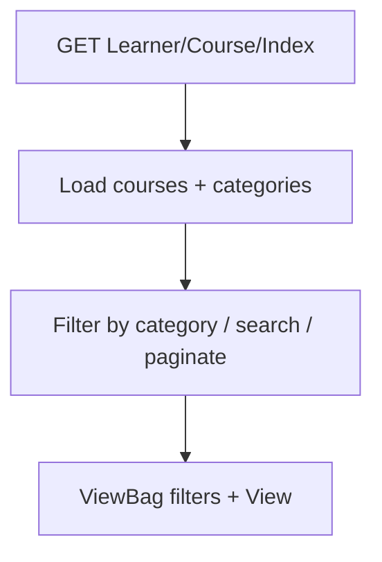
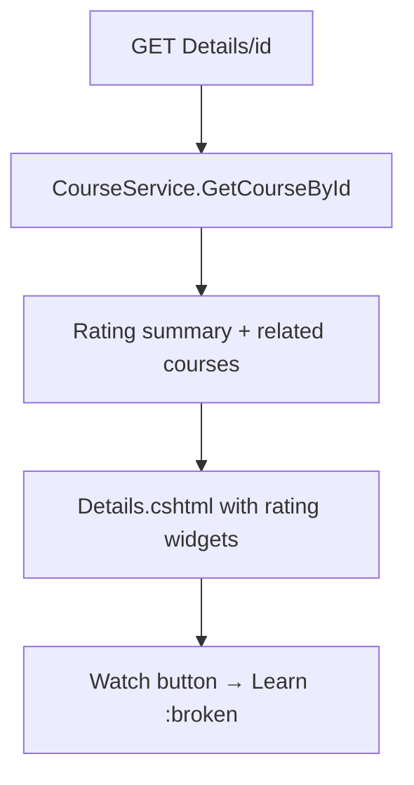
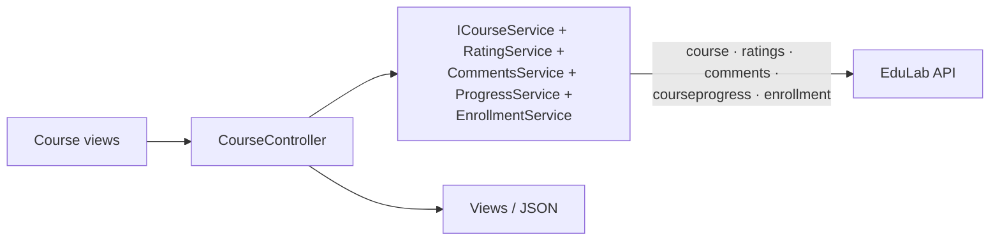
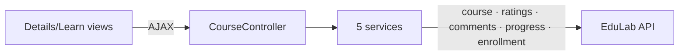

# CourseController Module Documentation (MVC — Learner Area)

---

## Overview

### Purpose
The learner's course browsing experience: catalog, details, and the learning player with progress tracking.

### Business Objective
Help learners discover courses, preview details, and complete lectures while progress syncs to the API.

### Main Functionality
- Catalog (filtered, paginated, search)
- Course details + rating UI + resources
- Learning player (progress, comments, questions, resources)
- Related courses

### Primary User Roles

| Role | Description |
|------|-------------|
| Anonymous | Browse catalog + details |
| Enrolled learner | Learn page + progress |

---

## Module Architecture

```
Presentation           Views/Course/{Index, Details, Learn, Search, MyCourses}.cshtml
Application            ICourseService, IRatingService, ICommentsService,
                       ICourseProgressService, IEnrollmentService
External               EduLab API: course/*, ratings/*, comments/*,
                       courseprogress/*, enrollment/*
```

### Controllers

| Controller | Responsibility |
|-----------|----------------|
| `CourseController` | Index, Details, Learn, Search, MyCourses, GetCourseRatingsJson, SaveCurrentLecture, GetLectureComments, AddComment, DeleteComment, ReplyToComment, GetLectureResources (12 actions) |

### Services

| Service | Responsibility |
|---------|----------------|
| `CourseService` | Catalog + details API calls |
| `RatingService` | Rating list/summary/eligibility |
| `CommentsService` | Comment threads |
| `CourseProgressService` | Mark complete/incomplete |
| `EnrollmentService` | Enrollment state + count |

### Dependencies on Other Modules
- **EduLab API** (hard dependency).
- **Wishlist/Cart**: course cards render wishlist hearts + add-to-cart buttons.
- **Reports**: `_ReportModal` on Details/Learn.

---

## Folder Structure

```
Areas/Learner/Controllers/
+-- CourseController.cs               # 12 actions

Areas/Learner/Views/Course/
+-- Index.cshtml                      # Catalog
+-- Details.cshtml                    # Course details (881+ lines)
+-- Learn.cshtml                      # Learning player (large)
+-- Search.cshtml                     # Search results
+-- MyCourses.cshtml                  # Enrolled courses

Views/Shared/
+-- _RatingForm.cshtml, _RatingSummary.cshtml, _ReportModal.cshtml
```

---

## Database Design

None (MVC). Courses/sections/lectures/progress live in the API DB.

---

## Internal Workflows & Runtime Behavior

### Workflow 1: Catalog (Index)



#### Runtime Behavior
- Categories loaded via `ICategoryService` (GET `Category`); pagination + category filter applied server-side in the controller.

### Workflow 2: Details



#### Runtime Behavior
- **Broken "Watch" link**: Details.cshtml links to `Course/Learn` via `Url.Action("Learn", "Course", new { id = ... })` — but the actual route for the player is `Course/Learn/{id}` under the Learner area; the generated URL points to the wrong action name in some variants. The correct target is `Learn` (see Workflow 3).

### Workflow 3: Learn (player)

```mermaid
flowchart TD
    A[GET Learn/id] --> B[Load course + sections + lectures + enrollment]
    B --> C[Mark current lecture]
    C --> D[Load comments + rating data via AJAX]
    D --> E[Player renders video/article + progress bar]
    E --> F[Mark completed → POST SaveCurrentLecture (AJAX)]
```

#### Runtime Behavior
- **Dead AJAX call**: `SaveCurrentLecture` is invoked from Learn.cshtml but the action only marks a lecture saved — the response handling is stubbed; the visible progress bar relies on `MarkLectureCompleted` POSTs instead.
- Progress POSTs (`mark-completed`/`mark-incomplete`) are sent **without antiforgery tokens** (CourseController POSTs lack `[ValidateAntiForgeryToken]`).

### Workflow 4: Comments & Ratings on Learn

#### Behavior
- `GetLectureComments` -> GET `comments/lecture/{lectureId}` (AJAX).
- `AddComment`/`ReplyToComment`/`DeleteComment` — JSON POSTs, **no antiforgery**.
- `GetCourseRatingsJson` -> GET `ratings/course/{id}` — paginated rating list for Details.

---

## Data Flow Analysis



---

## Controllers & Endpoints

### CourseController

**Route**: `/Learner/Course`  
**Authorization**: class `[Authorize]` on Learn; mixed elsewhere (verify per action)

| Action | HTTP | Route | Auth | Description | Anti-forgery |
|--------|------|-------|------|-------------|--------------|
| Index | GET | `/Learner/Course/Index` | 🔓 | Catalog | — |
| Details | GET | `/Learner/Course/Details/{id}` | 🔓 | Details + ratings | — |
| Learn | GET | `/Learner/Course/Learn/{id}` | 🔐 | Player | — |
| Search | GET | `/Learner/Course/Search?q` | 🔓 | Search results | — |
| MyCourses | GET | `/Learner/Course/MyCourses` | 🔐 | Enrolled list | — |
| GetCourseRatingsJson | GET | `/Learner/Course/GetCourseRatingsJson` | 🔓 | Paginated ratings JSON | — |
| SaveCurrentLecture | POST | `/Learner/Course/SaveCurrentLecture` | 🔐 | ⚠️ Dead AJAX target | ❌ |
| GetLectureComments | GET | `/Learner/Course/GetLectureComments?lectureId` | 🔐 | Thread JSON | — |
| AddComment | POST | `/Learner/Course/AddComment` | 🔐 | Add comment | ❌ |
| DeleteComment | POST | `/Learner/Course/DeleteComment?id` | 🔐 | Delete comment | ❌ |
| ReplyToComment | POST | `/Learner/Course/ReplyToComment?id` | 🔐 | Reply | ❌ |
| GetLectureResources | GET | `/Learner/Course/GetLectureResources?lectureId` | 🔐 | Resources JSON | — |

---

## Frontend Integration

### Learn.cshtml
- Player + progress bar; comment thread; rating widget; lecture resources; **calls SaveCurrentLecture (dead), GetLectureComments, AddComment, DeleteComment, ReplyToComment, GetLectureResources** via fetch.
- No antiforgery headers on POST fetches (gap).

### Details.cshtml
- Rating summary partials (`_RatingSummary`), report modal, "Watch" link (broken — should route to `Learn`).

---

## Business Rules

| Rule | Verified in | Why it exists |
|------|-------------|---------------|
| Enrollment required for Learn | Learn action authorization | Content protection |
| Progress POSTs from enrolled users only | API `courseprogress/*` class `[Authorize]` | Progress integrity |

---

## Security Analysis

| Control | Status |
|---------|--------|
| Authentication | Learn 🔐; catalog 🔓 |
| **Anti-forgery** | ❌ progress + comment POSTs unprotected (rely on SameSite cookies) |
| **Broken link** | Details "Watch" → wrong route (dead navigation) |

---

## Module Dependencies



**Internal**: shared partials (rating/report), toast system.
**External**: EduLab API only.

---

## Hidden Behaviors & Technical Notes

1. **Dead `SaveCurrentLecture`** — called by the view, response ignored; progress relies on the mark-completed POSTs instead.
2. **Broken "Watch" link** on Details — should point to `Learn`.
3. **Anti-forgery gaps** on all comment/progress POSTs.
4. **Rating + comment surfaces duplicated** between this controller and the dedicated `RatingController`/`CommentsController` (both consume the same API endpoints).

---

## Configuration

| Key | Purpose |
|-----|---------|
| `EduLab:ApiBaseUrl` | API base |

---

## Change Log

**Current functionality (verified):** catalog, details, player with progress/comments/ratings — with dead AJAX, broken navigation, and antiforgery gaps.

**Maintenance notes:**
- Remove `SaveCurrentLecture` or wire its response.
- Fix the Details "Watch" link to `Learn`.
- Add antiforgery tokens to progress/comment POSTs.