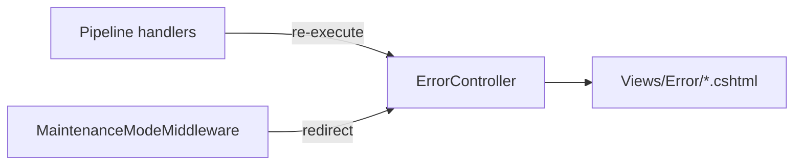

# ErrorController Module Documentation (MVC)

---

## Overview

### Purpose
Friendly status-code error pages and the maintenance-mode page.

### Business Objective
Replace raw browser errors with branded, localized pages that guide users (and hide stack traces).

### Main Functionality
- 12 error pages (400/401/402/403/404/408/429/500/502/503/504 + Maintenance)
- Pipeline integration via exception/status-code handlers

### Primary User Roles

| Role | Description |
|------|-------------|
| Everyone | Error pages |
| Non-admin during maintenance | Maintenance page |

---

## Module Architecture

```
Presentation           Views/Error/Error{400..504}.cshtml + Maintenance.cshtml
                       Shared/_ErrorLayout.cshtml
Pipeline               app.UseExceptionHandler("/Error/{0}") — Program.cs:135
                       app.UseStatusCodePagesWithReExecute("/Error/{0}") — Program.cs:138
                       MaintenanceModeMiddleware redirects non-admins
                       to /Error/Maintenance (allowlist for auth/admin/css/js)
```

### Controllers

| Controller | Responsibility |
|-----------|----------------|
| `ErrorController` | 12 one-line actions (no auth, no DI) |

---

## Folder Structure

```
Areas/Learner/Controllers/
+-- ErrorController.cs                # 12 actions

Areas/Learner/Views/Error/
+-- Error400.cshtml … Error504.cshtml # 11 status pages (localized titles)
+-- Maintenance.cshtml                # Maintenance page

Views/Shared/
+-- _ErrorLayout.cshtml               # Minimal branded layout
```

---

## Database Design

None.

---

## Internal Workflows & Runtime Behavior

### Workflow 1: Status-Code Handling

#### Flow

```mermaid
flowchart TD
    A[Response with status code] --> B[UseStatusCodePagesWithReExecute<br/>/Error/{0}]
    B --> C[ErrorController action for that code]
    C --> D[View with localized title]
    E[Unhandled exception] --> F[UseExceptionHandler /Error/{0}]
    F --> G{Path resolves?}
    G -->|no — {0} literal| H[Falls through to 404 handling]
```

#### Runtime Behavior
- All 12 routes (`Error/400` … `Error/Maintenance`) are reachable — `[Area]` route values become pattern defaults, not URL requirements, so attribute routes match without an area segment (verified against `ActionEndpointFactory.ResolveDefaultsAndRequiredValues`).
- The `{0}` placeholder is valid for `UseStatusCodePagesWithReExecute` (status-code substitution).
- **`UseExceptionHandler` does not document `{0}` support** — the path is literal, matches no endpoint, and unhandled exceptions fall through to the status-code 404 page instead of the 500 page (see Hidden Behaviors).

### Workflow 2: Maintenance Mode

#### Behavior
- `MaintenanceModeMiddleware` redirects non-admins to `/Error/Maintenance` (Middlewares/MaintenanceModeMiddleware.cs:29-31).
- Admin bypass via role check; allowlist for `/Learner/auth`, `/admin`, `/css`, `/js` etc. (Middleware:40-45).

---

## Controllers & Endpoints

### ErrorController

**Route**: `/Error/{code}` (attribute routes)  
**Authorization**: none  
**Dependencies**: none

| Action | HTTP | Route | Description |
|--------|------|-------|-------------|
| Error400 … Error504 | GET | `/Error/400` … `/Error/504` | Status pages |
| Maintenance | GET | `/Error/Maintenance` | Maintenance page |

---

## Frontend Integration

- All views use `_ErrorLayout.cshtml` and localizer keys (e.g., `Error404Title` — Error404.cshtml:2-4).

---

## Business Rules

| Rule | Verified in | Why it exists |
|------|-------------|---------------|
| Maintenance blocks non-admins | Middleware redirect | Platform downtime UX |
| Auth/admin assets bypass maintenance | middleware allowlist | Keep login reachable during maintenance |

---

## Security Analysis

| Control | Status |
|---------|--------|
| Authentication | None on error pages (by design) |
| Maintenance bypass | Admin role + allowlist — admins keep working during maintenance |
| Information disclosure | Error views are branded/localized; dev-mode detail only in `View("Error")` fallbacks elsewhere |

---

## Module Dependencies



**Internal**: Program.cs pipeline, shared error layout.
**External**: none.

---

## Hidden Behaviors & Technical Notes

1. **Exception handler path is likely ineffective**: `UseExceptionHandler("/Error/{0}")` treats `{0}` as a literal path; unhandled exceptions therefore render the 404 flow, not the 500 page (verified reasoning; `{0}` is documented for `UseStatusCodePagesWithReExecute` only).
2. **401 handling gap**: cookie auth returns 401 directly without a body (Program.cs:96-99) — the `Error/401` page is only reachable via manual navigation.
3. **402/408/429 pages have no triggering mechanism** in the app — dead pages unless future code uses them.

---

## Configuration

| Key | Purpose |
|-----|---------|
| (pipeline) | Exception + status-code handler paths (Program.cs:135, 138) |

No feature flags or environment variables specific to this module.

---

## Change Log

**Current functionality (verified):** 11 localized status pages + maintenance page, status-code re-execution pipeline, middleware-driven maintenance redirect.

**Maintenance notes:**
- Replace the exception-handler path with `/Error/500` (or a real handler) so unhandled exceptions land on the 500 page.