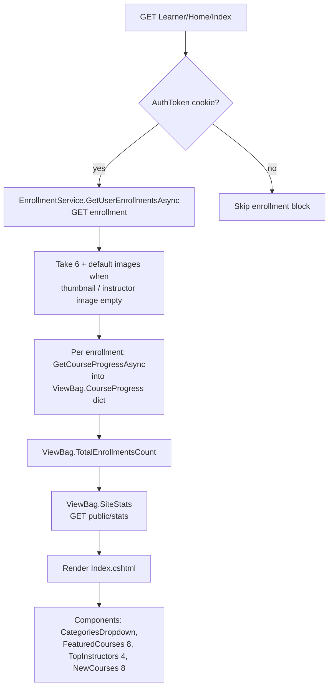
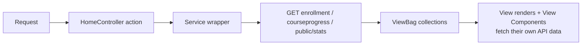
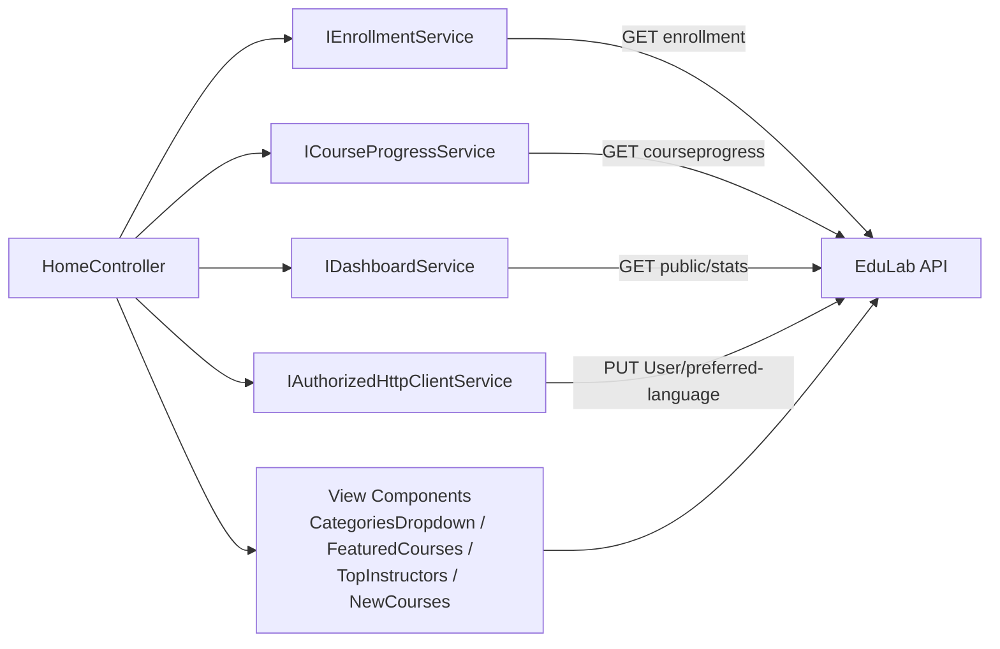

# HomeController Module Documentation (MVC)

---

## Overview

### Purpose
Serve the public landing experience: the personalized home page, static informational pages (About, FAQ, Help, Contact, Privacy, Terms), the blog feed, the learning roadmap, and the language switcher.

### Business Objective
Convert visitors into learners: show featured/new courses and top instructors immediately, surface the visitor's own in-progress enrollments when logged in, and keep the site localized and easily navigable.

### Main Functionality
- Personalized landing (enrollments + progress for logged-in users, site stats)
- Blog list + details (static in-code data)
- Static pages: About, FAQ, Help, Contact, Privacy, Terms
- Roadmap page (learning path)
- Language switching with API-side preference sync

### Primary User Roles

| Role | Description |
|------|-------------|
| Anonymous | Public sections only |
| Student / Instructor / Admin | Landing additionally shows "continue learning" enrollments (cookie check) |

---

## Module Architecture

```
Presentation           Views/Home/*.cshtml (Index ~1126 lines, blog, blogDetails,
                       faq, contact, Privacy, terms, help, Roadmap)
Application            IEnrollmentService, ICourseProgressService,
                       IAuthorizedHttpClientService, IDashboardService
External               EduLab API: GET enrollment, GET courseprogress/...,
                       GET public/stats, PUT User/preferred-language
State                  Read-only: AuthToken cookie (identity check)
```

### Controllers

| Controller | Responsibility |
|-----------|----------------|
| `HomeController` (748 lines) | Landing + static pages + `SetLanguage` |

### Services

| Service | Responsibility |
|---------|----------------|
| `IEnrollmentService` | `GetUserEnrollmentsAsync` -> GET `enrollment` |
| `ICourseProgressService` | `GetCourseProgressAsync` -> GET `courseprogress/...` per enrollment |
| `IDashboardService` | `GetPublicStatsAsync` -> GET `public/stats` (Services/DashboardService.cs:166) |
| `IAuthorizedHttpClientService` | PUT `User/preferred-language` for culture sync |

### Dependencies on Other Modules
- **View Components**: `CategoriesDropdown`, `FeaturedCourses` (8), `TopInstructors` (4), `NewCourses` (8) drive the landing content.
- **MyLearning**: enrollment cards link to the learner dashboard.
- **EduLab API** (hard dependency).

---

## Folder Structure

```
Areas/Learner/Controllers/
+-- HomeController.cs                  # 748 lines

Areas/Learner/Views/Home/
+-- Index.cshtml                       # Landing (hero, categories, courses, stats)
+-- blog.cshtml / blogDetails.cshtml   # Static blog feed + article
+-- faq.cshtml / contact.cshtml / help.cshtml
+-- Privacy.cshtml / terms.cshtml
+-- Roadmap.cshtml                     # Learning path
+-- about.cshtml                       # ORPHANED - no matching action (see Hidden)

Models/ViewModels/
+-- BlogListViewModel.cs / Blog.cs
+-- RoadmapViewModel.cs (+ RoadmapStep)
```

---

## Database Design

None. `AllBlogs` is a static in-code list; no persistence touched. Culture preference is persisted to the API (`PUT User/preferred-language`) when an authenticated user switches language.

---

## Internal Workflows & Runtime Behavior

### Workflow 1: Landing Page (Index)

#### Purpose
Render a personalized, conversion-oriented landing page.

#### Flow Diagram



#### Runtime Behavior
- Authenticated check is a raw cookie read (`Request.Cookies["AuthToken"]`), not the claims principal (HomeController.cs:41).
- Thumbnail/avatar fallbacks: `/images/default-course.jpg`, `/images/default-instructor.jpg` (HomeController.cs:50-59).
- Any exception -> `View()` without TempData (silent degradation, HomeController.cs:78-82).

#### Side Effects
None (read-only).

#### Edge Cases
- `Index.cshtml` declares `@model List<CourseDTO>` but the action returns no model — the view only uses it defensively; all content comes from components/ViewBag.
- API failure anywhere -> empty fallback rendering, no user-visible error.

### Workflow 2: Language Switching (SetLanguage)

#### Purpose
Persist UI culture and keep the API user profile in sync.

#### Flow
1. Write `.AspNetCore.Culture` cookie (1 year, essential) via `CookieRequestCultureProvider`.
2. If `AuthToken` cookie exists -> PUT `User/preferred-language` with `{preferredLanguage = culture}` through `AuthorizedHttpClientService`.
3. Failures are caught + warning-logged (API sync must never break the redirect).
4. `LocalRedirect(returnUrl)` (open-redirect safe).

#### Runtime Behavior
Culture applies immediately to the next request; API preference survives new browsers.

### Workflow 3: Blog & Static Pages

- `blog(page=1, category=null)`: pageSize 6 over the static `AllBlogs` list -> `BlogListViewModel`.
- `blogDetails(id)`: single article.
- Static views (About/FAQ/Help/Contact/Privacy/Terms) render without data loading.

---

## Data Flow Analysis



#### Mapping & Transformations
- Progress percentage rounded into a `Dictionary<int, decimal>` keyed by CourseId (ViewBag.CourseProgress).
- Enrollment DTOs normalized with default images before display.

---

## Controllers & Endpoints

### HomeController

**Route**: `/Learner/Home` (area convention; also the app default route)  
**Authorization**: `[AllowAnonymous]`  
**Dependencies**: `ILogger`, `IEnrollmentService`, `ICourseProgressService`, `IAuthorizedHttpClientService`, `IDashboardService`

| Action | HTTP | Route | Description |
|--------|------|-------|-------------|
| Index | GET | `/Learner/Home/Index` | Personalized landing |
| about | GET | `/Learner/Home/about` | About EduLab page (loads public site stats) (:133) |
| blog | GET | `/Learner/Home/blog?page&category` | Paginated static blog (6/page) |
| blogDetails | GET | `/Learner/Home/blogDetails/{id}` | Article page |
| faq | GET | `/Learner/Home/faq` | FAQ page |
| contact | GET | `/Learner/Home/contact` | Contact page |
| Privacy | GET | `/Learner/Home/Privacy` | Privacy policy |
| terms | GET | `/Learner/Home/terms` | Terms page |
| help | GET | `/Learner/Home/help` | Help center |
| Roadmap | GET | `/Learner/Home/Roadmap/{id?}` | Learning roadmap |
| SetLanguage | POST | `/Learner/Home/SetLanguage?culture&returnUrl` | Culture switch + API sync |

---

## Frontend Integration

### Landing page (Index.cshtml, ~1126 lines)
- Hero with Swiper, topic pills, category blocks (top 10 per category), grid-mode course swipers.
- View components invoked inline: `CategoriesDropdown` (type=Home), `FeaturedCourses` (count=8), `TopInstructors` (count=4), `NewCourses` (count=8).
- Search box navigates to `Course/Search?search=`.
- `window.formatDuration` helper defined for duration display (Index.cshtml:578-587).

### Site-wide JS (`wwwroot/js/site.js`, loaded by Learner layout)
- Dark mode from `localStorage.theme` (system-pref default).
- Hero swiper (fade, 5s autoplay), FAQ accordions, course swipers.
- Global alert system `showAlert(type, message, duration)` renders TempData-driven alerts.

---

## Business Rules

| Rule | Verified in | Why it exists |
|------|-------------|---------------|
| Enrollment block only for cookie-authenticated users | HomeController.cs:41-72 | Personalized content without hitting the API anonymously |
| Default images when media missing | HomeController.cs:50-59 | Consistent cards for courses without thumbnails |
| Landing degrades silently on API failure | HomeController.cs:78-82 | The public page must never 500 because stats are down |
| Language sync must never break redirect | SetLanguage try/catch | Switching language is UX-critical; API sync is best-effort |
| Local redirects only | `LocalRedirect(returnUrl)` | Open-redirect protection |

---

## Security Analysis

| Control | Status |
|---------|--------|
| Authentication | `[AllowAnonymous]` — public by design |
| Identity check | Raw `AuthToken` cookie presence (not a validated principal) — display-only decision |
| Open redirect | `LocalRedirect` prevents external redirect targets |
| API calls | Anonymous endpoints only (`public/stats`); protected calls (`enrollment`, `courseprogress`) rely on `AuthorizedHttpClientService` attaching the Bearer token from the cookie |
| Culture sync | PUT `User/preferred-language` requires the valid token; failure logged, never surfaces |

---

## Module Dependencies



**Internal**: View components (own API data), `_CourseCard` shared partial, `_ToastMessages`, `_Layout` nav.
**External**: EduLab API only.

---

## Hidden Behaviors & Technical Notes

1. **Orphaned About page**: `about.cshtml` has no action — dead route (verified by action grep).
2. **Model mismatch**: `Index.cshtml` declares `List<CourseDTO>` but `Index` returns no model; the landing depends entirely on ViewBag + components.
3. **Cookie-not-claims identity check**: Home decides personalization by raw cookie presence; a stale cookie (expired token) still triggers the personalized block, which then fails silently and renders the public layout anyway.
4. **Blog is hardcoded**: `AllBlogs` is static in-code content — editing blog posts requires a code change.
5. **ViewBag-driven components**: New/Featured/TopInstructors counts are fixed (8/8/4) at the view call site.

---

## Configuration

| Key | Purpose |
|-----|---------|
| `EduLab:ApiBaseUrl` | API base for all service calls |
| Culture cookie | `.AspNetCore.Culture` (1-year, essential) |

No feature flags or environment variables specific to this module.

---

## Change Log

**Current functionality (verified):** personalized landing with progress, static pages, static blog, roadmap, language switching with API-side preference persistence, all anonymous.

**Maintenance notes:**
- Either add an `about` action or delete `about.cshtml`.
- Blog content is code-static; consider a CMS/data source if posts change often.
- Home is the app default route — performance matters; it performs up to N+1 progress calls for 6 enrollments.