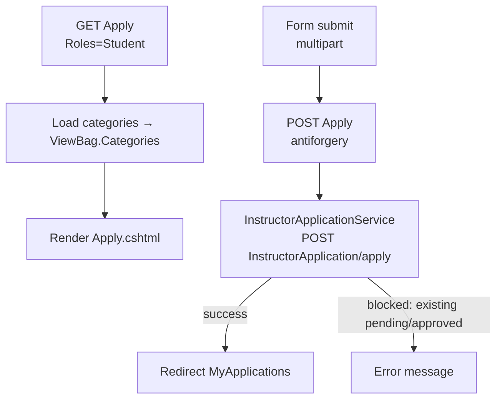
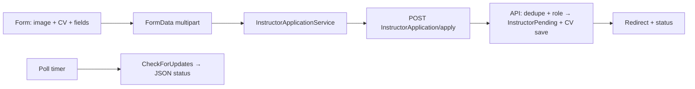
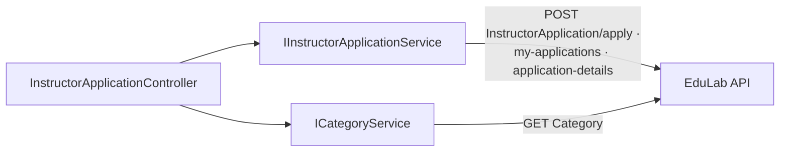

# InstructorApplicationController Module Documentation (MVC)

---

## Overview

### Purpose
The "Become an Instructor" flow: apply with CV + profile image, track application status, and view details.

### Business Objective
Onboard qualified instructors through a reviewable application process while keeping applicants informed of progress.

### Main Functionality
- Application form (multipart: profile image + CV)
- My applications list with status badges
- Application details
- Polling endpoint for status updates

### Primary User Roles

| Role | Description |
|------|-------------|
| Student role | Apply (only Students may apply) |
| InstructorPending / others | Track applications |

---

## Module Architecture

```
Presentation           Views/InstructorApplication/{Apply, MyApplications,
                       ApplicationDetails}.cshtml
Application            IInstructorApplicationService, IUserService, ICategoryService
External               EduLab API: POST InstructorApplication/apply (multipart),
                       GET InstructorApplication/my-applications,
                       GET InstructorApplication/application-details/{id}
```

### Controllers

| Controller | Responsibility |
|-----------|----------------|
| `InstructorApplicationController` | Apply, MyApplications, ApplicationDetails, CheckForUpdates |

### Services

| Service | Responsibility |
|---------|----------------|
| `InstructorApplicationService` | Apply (multipart), my applications, details |
| `CategoryService` | `GetAllCategoriesAsync` -> GET `Category` (specialization dropdown) |
| `IUserService` | Current user helpers |

### Dependencies on Other Modules
- **Profile**: apply form includes profile image upload.
- **EduLab API** (hard dependency).

---

## Folder Structure

```
Areas/Learner/Controllers/
+-- InstructorApplicationController.cs

Areas/Learner/Views/InstructorApplication/
+-- Apply.cshtml                      # Form (CV + image + skills)
+-- MyApplications.cshtml             # Status cards + 30s polling
+-- ApplicationDetails.cshtml         # Detail view

Models/DTOs/Instructor/
+-- InstructorApplicationDTO.cs       # Includes IFormFile ProfileImage + CvFile
+-- InstructorApplicationResponseDto.cs
```

---

## Database Design

None (MVC). Applications live in the API's `InstructorApplications` table; CVs stored under `Images/cv-files`.

---

## Internal Workflows & Runtime Behavior

### Workflow 1: Apply

#### Purpose
Submit a complete instructor application.

#### Flow Diagram



#### Runtime Behavior
- Multipart FormData + `RequestVerificationToken` header (Apply.cshtml:1270-1275).
- Profile image accept `image/*`; CV accept `.pdf` — **client-side only validation** (Apply.cshtml:673, 747).
- Skills submitted as a JSON string (Apply.cshtml:1257).
- API blocks duplicates: existing Pending/Approved application.

### Workflow 2: Track Status (polling)

#### Purpose
Keep the applicant updated without manual refresh.

#### Behavior
- `MyApplications` polls `GET CheckForUpdates` (attribute route `[HttpGet("CheckForUpdates")]`) **every 30 seconds while a Pending card exists** (MyApplications.cshtml:555-561, 568).
- Status badge text via `GetStatusText` (MyApplications.cshtml:614).
- Statuses from `SD.cs`: `ApplicationStatusPending/Approved/Rejected` (SD.cs:41-43).

---

## Data Flow Analysis



---

## Controllers & Endpoints

### InstructorApplicationController

**Route**: `/Learner/InstructorApplication`  
**Authorization**: `[Authorize]` class; `Apply` additionally `[Authorize(Roles=SD.Student)]` (GET :57-58, POST :121-123)  
**Dependencies**: `IInstructorApplicationService`, `IUserService`, `ILogger`, `ICategoryService`, `IStringLocalizer`

| Action | HTTP | Route | Auth | Description | Anti-forgery |
|--------|------|-------|------|-------------|--------------|
| Apply | GET | `/Learner/InstructorApplication/Apply` | 🎓Student | Application form | — |
| Apply | POST | `/Learner/InstructorApplication/Apply` | 🎓Student | Submit (multipart) | ✅ |
| MyApplications | GET | `/Learner/InstructorApplication/MyApplications` | 🔐 | Status cards | — |
| ApplicationDetails | GET | `/Learner/InstructorApplication/ApplicationDetails/{id}` | 🔐 | Detail view | — |
| CheckForUpdates | GET | `/Learner/InstructorApplication/CheckForUpdates` | 🔐 | Polled status JSON | — |

**Models**: `InstructorApplicationDTO` (with `IFormFile ProfileImage`/`CvFile`), `InstructorApplicationResponseDto`.

---

## Frontend Integration

### Apply.cshtml
- Multipart fetch with token header; image/CV previews; skills JSON serialization.

### MyApplications.cshtml
- Status cards with 30-second polling; details links; `GetStatusText` badges.

---

## Business Rules

| Rule | Verified in | Why it exists |
|------|-------------|---------------|
| Only Students can apply | `[Authorize(Roles=SD.Student)]` | Instructors/instructors-pending already have a path |
| One active application | API dedupe (Pending/Approved) | Prevent application spam |
| File-type checks are client-side only | Apply.cshtml accept attributes | Server enforcement would be stronger (API-side) |
| Polling only while pending | MyApplications.cshtml:555-561 | Stop polling after resolution |

---

## Security Analysis

| Control | Status |
|---------|--------|
| Authentication | ✅ `[Authorize]` |
| Role gate | ✅ Apply restricted to Student role |
| Anti-forgery | ✅ POST protected |
| File uploads | Client-side type restriction only — API accepts whatever's sent (check API-side validation) |
| Polling endpoint | Authenticated, user-scoped |

---

## Module Dependencies



**Internal**: Profile (image), SD constants.
**External**: EduLab API only.

---

## Hidden Behaviors & Technical Notes

1. **30-second polling loop**: every pending application page keeps hitting `CheckForUpdates` even when the user is idle — server load consideration.
2. **CV validation is cosmetic**: `.pdf` accept attribute is client-side; the API must validate server-side.
3. **Skills as JSON string**: free-form JSON in a text field — parsing errors would fail silently if malformed.

---

## Configuration

| Key | Purpose |
|-----|---------|
| `EduLab:ApiBaseUrl` | API base for application calls |

No feature flags or environment variables specific to this module.

---

## Change Log

**Current functionality (verified):** student-only application flow with CV + image upload, status tracking with polling, application details.

**Maintenance notes:**
- Add server-side CV file-type/size validation (API).
- Consider SignalR/SSE instead of 30s polling.