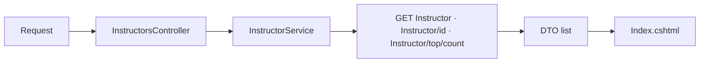
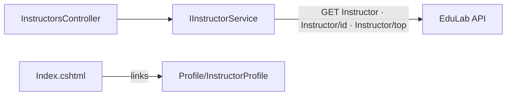

# InstructorsController Module Documentation (MVC)

---

## Overview

### Purpose
Public instructor directory: list instructors, instructor details, and top-rated instructors.

### Business Objective
Showcase instructor talent to convert learners and support instructor personal brands.

### Main Functionality
- Instructor list
- Instructor details (by id)
- Top instructors (default 4)

### Primary User Roles

| Role | Description |
|------|-------------|
| Anonymous | Browse instructors |

---

## Module Architecture

```
Presentation           Views/Instructors/Index.cshtml (only view that exists)
Application            IInstructorService -> InstructorService
External               EduLab API: GET Instructor, GET Instructor/{id},
                       GET Instructor/top/{count},
                       GET instructor/ratings/{instructorId}
```

### Controllers

| Controller | Responsibility |
|-----------|----------------|
| `InstructorsController` | Index, Details, Top (3 actions) |

### Services

| Service | Responsibility |
|---------|----------------|
| `InstructorService` | `GetAllInstructorsAsync` (GET `Instructor`), `GetInstructorByIdAsync` (GET `Instructor/{id}`), `GetTopInstructorsAsync` (GET `Instructor/top/{count}`), ratings lookups (GET `instructor/ratings/{instructorId}`) |

### Dependencies on Other Modules
- **Profile**: directory cards link to `Profile/InstructorProfile` (public instructor page).
- **EduLab API** (hard dependency).

---

## Folder Structure

```
Areas/Learner/Controllers/
+-- InstructorsController.cs          # 3 actions

Areas/Learner/Views/Instructors/
+-- Index.cshtml                      # Directory (only view present)

Models/DTOs/Instructor/
+-- InstructorDTO.cs / InstructorListDTO.cs
```

---

## Database Design

None (MVC). Instructors are `ApplicationUser` rows with the Instructor role, served by the API.

---

## Internal Workflows & Runtime Behavior

### Workflow 1: Directory

#### Flow

```mermaid
flowchart TD
    A[GET Learner/Instructors/Index] --> B[GET Instructor]
    B -->|ok| C[View(instructors ?? empty)]
    B -->|exception| D[View Error]
```

#### Runtime Behavior
- Exceptions -> `View("Error")` (falls back to shared error view with ErrorViewModel) (InstructorsController.cs:45, 52-64).

### Workflow 2: Details / Top

#### Behavior
- `Details(id)`: blank/null id -> `NotFound()`; exception -> `View("Error")`; cancellation -> redirect Index (InstructorsController.cs:73, 78-104).
- `Top(count=4)`: `count<=0` reset to 4; exception -> `View("Error")` (InstructorsController.cs:113, 118-127).
- **`Details` and `Top` have no views** — `Views/Instructors` contains only `Index.cshtml` -> view-not-found 500 at runtime.

---

## Data Flow Analysis



#### Mapping & Transformations
- Image URL prefix from config (InstructorService.cs:36-37).

---

## Controllers & Endpoints

### InstructorsController

**Route**: `/Learner/Instructors`  
**Authorization**: `[AllowAnonymous]` (InstructorsController.cs:10-11)  
**Dependencies**: `IInstructorService`, `ILogger`

| Action | HTTP | Route | Description |
|--------|------|-------|-------------|
| Index | GET | `/Learner/Instructors/Index` | Directory |
| Details | GET | `/Learner/Instructors/Details/{id}` | ⚠️ No view — 500 at runtime |
| Top | GET | `/Learner/Instructors/Top?count` | ⚠️ No view — 500 at runtime |

**Models**: `InstructorDTO`, `InstructorListDTO`.

---

## Frontend Integration

### Index.cshtml
- Cards link to `Profile/InstructorProfile` (not `Details`) (Index.cshtml:387).
- "Apply as instructor" CTA (Index.cshtml:426).

---

## Business Rules

| Rule | Verified in | Why it exists |
|------|-------------|---------------|
| Top count defaults to 4, reset if <=0 | InstructorsController.cs:113 | Sensible default |
| Directory is anonymous | `[AllowAnonymous]` | Marketing page |
| Error fallback to shared error view | `View("Error")` | Never blank-page |

---

## Security Analysis

| Control | Status |
|---------|--------|
| Authentication | None — public directory |
| Data exposure | Public instructor profiles (name, bio, socials) — by design |
| Anti-forgery | No POSTs |

---

## Module Dependencies



**Internal**: Profile public pages.
**External**: EduLab API only.

---

## Hidden Behaviors & Technical Notes

1. **Dead actions**: `Details` and `Top` return views that don't exist — runtime 500s (verified: only `Index.cshtml` in the folder).
2. **Directory links bypass `Details`**: cards go straight to the richer `Profile/InstructorProfile` page.
3. **Silent error fallback**: exceptions render the shared error view instead of a friendly message.

---

## Configuration

| Key | Purpose |
|-----|---------|
| `EduLab:ApiBaseUrl` | API base; image URL prefixing |

No feature flags or environment variables specific to this module.

---

## Change Log

**Current functionality (verified):** public directory with instructor cards, top-instructors logic, error-safe fallbacks.

**Maintenance notes:**
- Create `Details.cshtml`/`Top.cshtml` views or remove the actions.