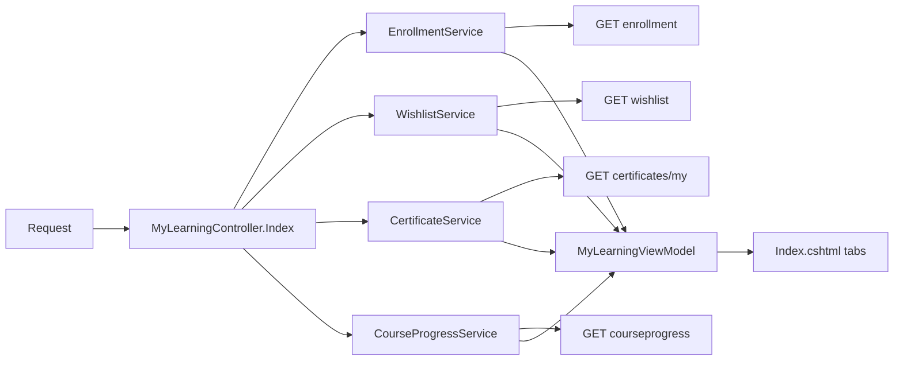
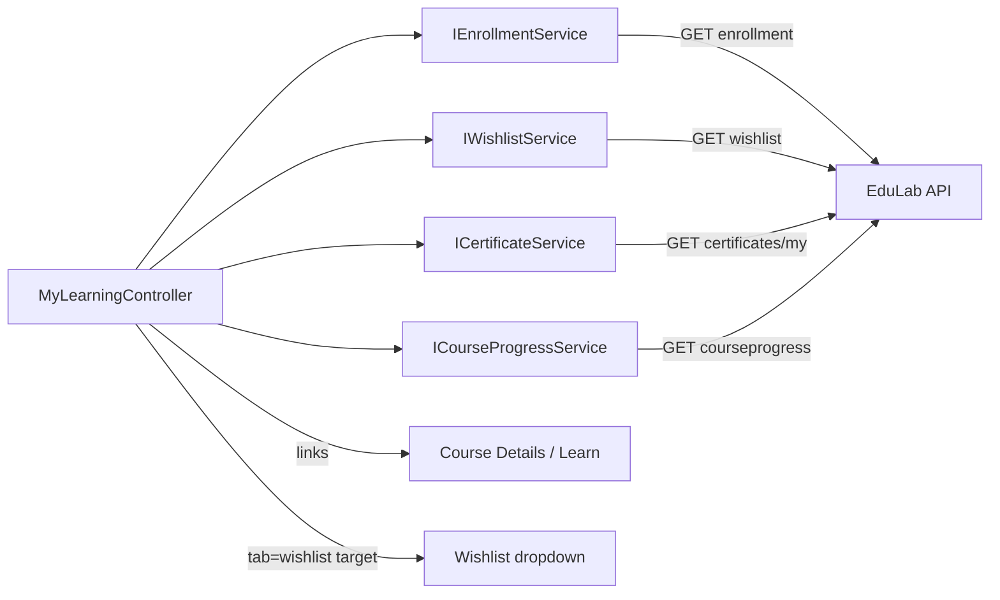

# MyLearningController Module Documentation (MVC)

---

## Overview

### Purpose
The learner's personal dashboard: their enrollments with progress, wishlist, and earned certificates in one tabbed page.

### Business Objective
Give learners a single place to continue learning, revisit saved courses, and download/verify their certificates.

### Main Functionality
- Enrollments grid with per-course progress bars and completion stats
- Wishlist tab (saved courses)
- Certificates tab (earned certificates with enrollment linkage)
- Aggregated stats: totals, completed, in-progress, hours

### Primary User Roles

| Role | Description |
|------|-------------|
| Authenticated learner | Full dashboard |
| Instructor / Admin | Same dashboard (their learner view) |

---

## Module Architecture

```
Presentation           Views/MyLearning/Index.cshtml (1261 lines)
Application            IEnrollmentService, IWishlistService,
                       ICourseProgressService, ICertificateService
External               EduLab API: GET enrollment, GET wishlist,
                       GET certificates/my, GET courseprogress/...
State                  Bearer token only
```

### Controllers

| Controller | Responsibility |
|-----------|----------------|
| `MyLearningController` (134 lines) | Single `Index` action assembling the dashboard |

### Services

| Service | Responsibility |
|---------|----------------|
| `IEnrollmentService` | `GetUserEnrollmentsAsync` -> GET `enrollment` |
| `IWishlistService` | `GetUserWishlistAsync` -> GET `wishlist` |
| `ICourseProgressService` | per-enrollment progress -> GET `courseprogress/...` |
| `ICertificateService` | `GetMyCertificatesAsync` -> GET `certificates/my` |

### Dependencies on Other Modules
- **Course**: cards/links to Details and Learn.
- **Wishlist**: dropdown links here with `tab=wishlist`.
- **Certificates**: download/verify links.
- **EduLab API** (hard dependency).

---

## Folder Structure

```
Areas/Learner/Controllers/
+-- MyLearningController.cs           # 134 lines

Areas/Learner/Views/MyLearning/
+-- Index.cshtml                      # Dashboard (1261 lines)

Models/ViewModels/
+-- MyLearningViewModel.cs            # Enrollments, WishlistItems, Certificates,
                                      # CertificateEnrollmentIds, CourseProgress,
                                      # TotalCourses, CompletedCourses,
                                      # InProgressCourses, TotalHours,
                                      # Categories, Instructors
```

---

## Database Design

None (MVC). All data fetched live from the API per request — no caching.

---

## Internal Workflows & Runtime Behavior

### Workflow 1: Dashboard Assembly

#### Purpose
Load three independent data sources and compute aggregate stats.

#### Flow Diagram

```mermaid
flowchart TD
    A[GET Learner/MyLearning/Index?tab] --> B[ViewBag.ActiveTab = tab ?? all]
    B --> C[Enrollments: GetUserEnrollmentsAsync]
    C --> D[Per enrollment: default images + progress]
    D --> E[Accumulate: categories set, instructors set,<br/>totalHours += ceil(Duration/3600),<br/>completedCourses when pct >= 100]
    C -->|failure| F[Warning log, skip block]
    B --> G[Wishlist: GetUserWishlistAsync]
    G -->|failure| H[Warning log, skip block]
    B --> I[Certificates: GetMyCertificatesAsync]
    I -->|failure| J[Warning log, skip block]
    E --> K[Build MyLearningViewModel<br/>+ CertificateEnrollmentIds]
    K --> L[Render Index.cshtml]
```

#### Runtime Behavior
- Each data source is independently try/caught — one failing API call never blanks the page (MyLearningController.cs:62-108).
- "Completed course" = progress percentage >= 100 (MyLearningController.cs:83).
- `CertificateEnrollmentIds` links certificates to enrollments for UI badges.
- Outer catch -> `View(new MyLearningViewModel())` (MyLearningController.cs:127-131).

#### Side Effects
None (read-only).

#### Edge Cases
- No pagination — all enrollments/wishlist/certificates load at once.
- Partial failure leaves default-empty sections.

---

## Data Flow Analysis



#### Mapping & Transformations
- `totalHours` = sum of `ceil(Duration/3600)` per enrollment.
- Progress percentages rounded into `Dictionary<int, decimal>` keyed by CourseId.
- Default images applied when thumbnail/instructor image empty.

---

## Controllers & Endpoints

### MyLearningController

**Route**: `/Learner/MyLearning`  
**Authorization**: `[Authorize]` (MyLearningController.cs:19-21)  
**Dependencies**: `IEnrollmentService`, `IWishlistService`, `ICourseProgressService`, `ICertificateService`, `ILogger<MyLearningController>`, `IStringLocalizer<SharedResources>` (all null-checked)

| Action | HTTP | Route | Description |
|--------|------|-------|-------------|
| Index | GET | `/Learner/MyLearning/Index?tab=all\|courses\|wishlist\|certificates` | Dashboard |

**Model**: `MyLearningViewModel`.

---

## Frontend Integration

### Index.cshtml (1261 lines)
- Tabs: `all` / `courses` / `wishlist` / `certificates` (driven by `ViewBag.ActiveTab`).
- `ml-*` styles shared with the Notifications page.
- JS: `filterWishlist` / `filterCertificates` client-side search by `data-title` / `data-instructor` card attributes.
- `toArDigits` converts numbers to Arabic-Indic digits (Index.cshtml:1256-1258).
- `refreshWishlistDropdown` keeps navbar badge in sync.
- Header cart/wishlist dropdowns link here with `tab=wishlist` (WishlistDropdown.cshtml:315, 373, 393).

---

## Business Rules

| Rule | Verified in | Why it exists |
|------|-------------|---------------|
| Completed = progress >= 100 | MyLearningController.cs:83 | Progress is per-lecture percentage; 100% is the completion line |
| Independent failure isolation per source | MyLearningController.cs:62-108 | Dashboard resilience — one API outage shouldn't kill the page |
| Certificate linkage by EnrollmentId | `CertificateEnrollmentIds` | Match certificates to the course card that earned them |
| Tab state via query string | `ViewBag.ActiveTab` | Deep-linkable tabs |

---

## Security Analysis

| Control | Status |
|---------|--------|
| Authentication | ✅ `[Authorize]` |
| Authorization | API returns only the caller's enrollments/wishlist/certificates (Bearer-scoped) |
| Data exposure | No PII beyond the learner's own data |
| Anti-forgery | No POSTs in this controller |

---

## Module Dependencies



**Internal**: Course (links), Wishlist dropdown (deep link), Certificates verify.
**External**: EduLab API only.

---

## Hidden Behaviors & Technical Notes

1. **N+1 progress calls**: the dashboard issues one progress call per enrollment — up to N+1 API round-trips per load.
2. **No pagination**: large libraries degrade the page (all data rendered at once).
3. **Client-side filtering only**: wishlist/certificates search filters DOM elements; the full list is always downloaded.
4. **Arabic-Indic digits**: `toArDigits` converts displayed numbers in Arabic UI.

---

## Configuration

| Key | Purpose |
|-----|---------|
| `EduLab:ApiBaseUrl` | API base for all dashboard calls |

No feature flags or environment variables specific to this module.

---

## Change Log

**Current functionality (verified):** enrollments with progress bars, wishlist tab, certificates tab, aggregate stats (total/completed/in-progress/hours), category/instructor groupings, resilient partial-failure rendering, tab deep-linking.

**Maintenance notes:**
- Consider paging or lazy-loading for large libraries.
- Consider batching the progress calls into one API endpoint.