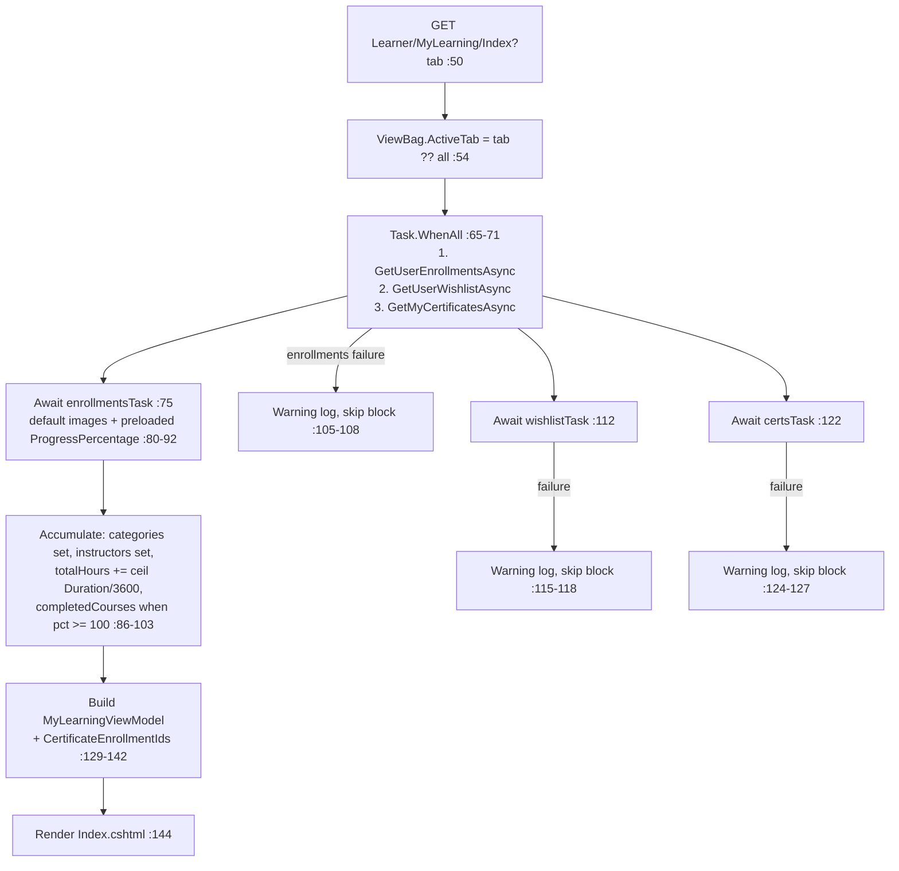
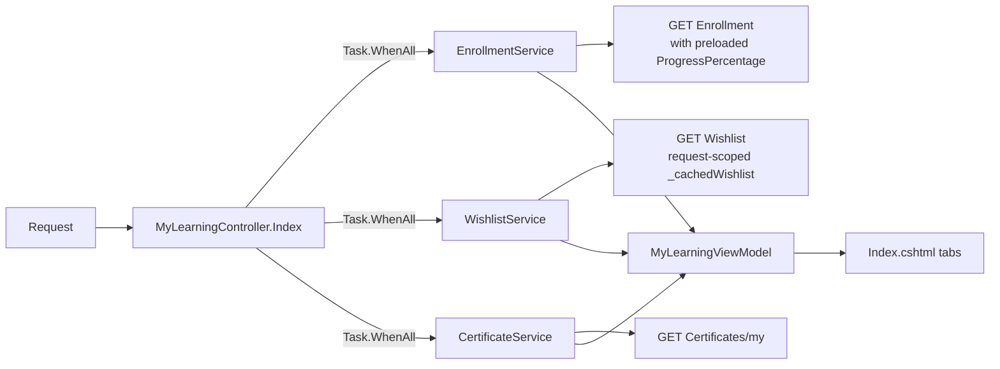
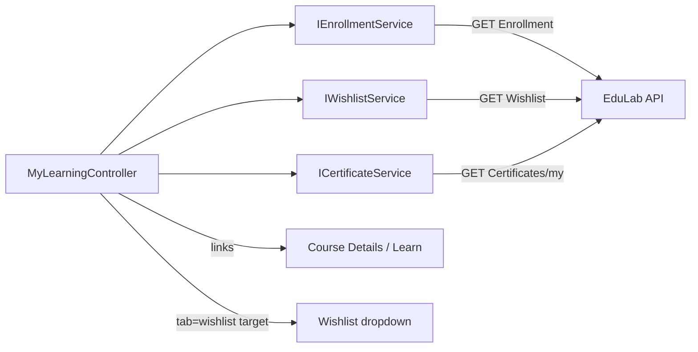

# MyLearningController Module Documentation (MVC)

---

## Overview

### Purpose
The learner's personal dashboard: their enrollments with progress, wishlist, and earned certificates in one tabbed page.

### Business Objective
Give learners a single place to continue learning, revisit saved courses, and download/verify their certificates.

### Main Functionality
- Enrollments grid with per-course progress bars and completion stats
- Wishlist tab (saved courses)
- Certificates tab (earned certificates with enrollment linkage)
- Aggregated stats: totals, completed, in-progress, hours

### Primary User Roles

| Role | Description |
|------|-------------|
| Authenticated learner | Full dashboard |
| Instructor / Admin | Same dashboard (their learner view) |

---

## Module Architecture

```
Presentation           Views/MyLearning/Index.cshtml (1261 lines)
Application            IEnrollmentService, IWishlistService,
                       ICourseProgressService, ICertificateService
External               EduLab API: GET Enrollment (`ApiEndpoints.Enrollment.Base`),
                       GET Wishlist (`ApiEndpoints.Wishlist.Base`),
                       GET Certificates/my (`ApiEndpoints.Certificates.My`)
State                  Bearer token + request-scoped `_cachedWishlist` in WishlistService
```

### Controllers

| Controller | Responsibility |
|-----------|----------------|
| `MyLearningController` (151 lines) | Single `Index` action assembling the dashboard concurrently via `Task.WhenAll` |

### Services

| Service | Responsibility |
|---------|----------------|
| `IEnrollmentService` | `GetUserEnrollmentsAsync` -> GET `Enrollment` (`ApiEndpoints.Enrollment.Base`) with preloaded `ProgressPercentage` |
| `IWishlistService` | `GetUserWishlistAsync` -> GET `Wishlist` (request-scoped `_cachedWishlist` in `WishlistService.cs:19-20`) |
| `ICertificateService` | `GetMyCertificatesAsync` -> GET `Certificates/my` (`ApiEndpoints.Certificates.My`) |
| `ICourseProgressService` | Injected constructor dependency (`MyLearningController.cs:35`); no longer called per enrollment because `enrollment.ProgressPercentage` is preloaded (`:91-92`) |

### Dependencies on Other Modules
- **Course**: cards/links to Details and Learn.
- **Wishlist**: dropdown links here with `tab=wishlist`.
- **Certificates**: download/verify links.
- **EduLab API** (hard dependency).

---

## Folder Structure

```
Areas/Learner/Controllers/
+-- MyLearningController.cs           # 151 lines

Areas/Learner/Views/MyLearning/
+-- Index.cshtml                      # Dashboard (1261 lines)

Models/ViewModels/
+-- MyLearningViewModel.cs            # Enrollments, WishlistItems, Certificates,
                                      # CertificateEnrollmentIds, CourseProgress,
                                      # TotalCourses, CompletedCourses,
                                      # InProgressCourses, TotalHours,
                                      # Categories, Instructors
```

---

## Database Design

None (MVC). All data fetched live from the API per request (`WishlistService` caches the wishlist within the current HTTP request scope so `MyLearningController` and the layout `WishlistDropdown` share a single call).

---

## Internal Workflows & Runtime Behavior

### Workflow 1: Dashboard Assembly

#### Purpose
Load three independent data sources in parallel (`Task.WhenAll`) and compute aggregate stats without N+1 progress calls.

#### Flow Diagram


```mermaid
flowchart TD
    A[GET Learner/MyLearning/Index?tab :50] --> B[ViewBag.ActiveTab = tab ?? all :54]
    B --> C[Task.WhenAll :65-71<br/>1. GetUserEnrollmentsAsync<br/>2. GetUserWishlistAsync<br/>3. GetMyCertificatesAsync]
    C --> D[Await enrollmentsTask :75<br/>default images + preloaded ProgressPercentage :80-92]
    D --> E[Accumulate: categories set, instructors set,<br/>totalHours += ceil Duration/3600,<br/>completedCourses when pct >= 100 :86-103]
    C -->|enrollments failure| F[Warning log, skip block :105-108]
    C --> G[Await wishlistTask :112]
    G -->|failure| H[Warning log, skip block :115-118]
    C --> I[Await certsTask :122]
    I -->|failure| J[Warning log, skip block :124-127]
    E --> K[Build MyLearningViewModel<br/>+ CertificateEnrollmentIds :129-142]
    K --> L[Render Index.cshtml :144]
```

#### Runtime Behavior
- **Parallel Fan-Out**: `GetUserEnrollmentsAsync()`, `GetUserWishlistAsync()`, and `GetMyCertificatesAsync()` are launched simultaneously and awaited via `try { await Task.WhenAll(enrollmentsTask, wishlistTask, certsTask); } catch { /* handled individually below */ }` (`MyLearningController.cs:65-71`).
- **N+1 Progress Elimination**: Reads preloaded `enrollment.ProgressPercentage` directly (`var progressPct = Math.Round(enrollment.ProgressPercentage, 0); courseProgress[enrollment.CourseId] = progressPct;`, `MyLearningController.cs:91-92`) instead of calling `ICourseProgressService` per enrollment.
- Each task result is independently try/caught (`MyLearningController.cs:73-128`) — one failing API call never blanks the page.
- "Completed course" = `progressPct >= 100` (`MyLearningController.cs:93-95`).
- `CertificateEnrollmentIds` links certificates to enrollments for UI badges (`MyLearningController.cs:134`).
- Outer catch -> `View(new MyLearningViewModel())` (`MyLearningController.cs:146-149`).

#### Side Effects
None (read-only).

#### Edge Cases
- No pagination — all enrollments/wishlist/certificates load at once.
- Partial failure leaves default-empty sections.

---

## Data Flow Analysis


```mermaid
flowchart LR
    A[Request] --> B[MyLearningController.Index]
    B -->|Task.WhenAll| C[EnrollmentService] --> D[GET Enrollment<br/>with preloaded ProgressPercentage]
    B -->|Task.WhenAll| E[WishlistService] --> F[GET Wishlist<br/>request-scoped _cachedWishlist]
    B -->|Task.WhenAll| G[CertificateService] --> H[GET Certificates/my]
    C --> K[MyLearningViewModel]
    E --> K
    G --> K
    K --> L[Index.cshtml tabs]
```

#### Mapping & Transformations
- `totalHours` = sum of `ceil(Duration/3600)` per enrollment (`MyLearningController.cs:89-90`).
- Preloaded `enrollment.ProgressPercentage` rounded into `Dictionary<int, decimal>` keyed by `CourseId` (`MyLearningController.cs:91-92`).
- Default images applied when thumbnail/instructor image empty (`MyLearningController.cs:80-85`).

---

## Controllers & Endpoints

### MyLearningController

**Route**: `/Learner/MyLearning`  
**Authorization**: `[Authorize]` (`MyLearningController.cs:19-21`)  
**Dependencies**: `IEnrollmentService`, `IWishlistService`, `ICourseProgressService`, `ICertificateService`, `ILogger<MyLearningController>`, `IStringLocalizer<SharedResources>` (all null-checked)

| Action | HTTP | Route | Description |
|--------|------|-------|-------------|
| Index | GET | `/Learner/MyLearning/Index?tab=all\|courses\|wishlist\|certificates` | Dashboard (parallel `Task.WhenAll` :65-71) |

**Model**: `MyLearningViewModel`.

---

## Frontend Integration

### Index.cshtml (1261 lines)
- Tabs: `all` / `courses` / `wishlist` / `certificates` (driven by `ViewBag.ActiveTab`).
- `ml-*` styles shared with the Notifications page.
- JS: `filterWishlist` / `filterCertificates` client-side search by `data-title` / `data-instructor` card attributes.
- `toArDigits` converts numbers to Arabic-Indic digits (Index.cshtml:1256-1258).
- `refreshWishlistDropdown` keeps navbar badge in sync.
- Header cart/wishlist dropdowns link here with `tab=wishlist` (WishlistDropdown.cshtml:315, 373, 393).

---

## Business Rules

| Rule | Verified in | Why it exists |
|------|-------------|---------------|
| Parallel dashboard loading with independent failure isolation | MyLearningController.cs:65-128 | Cuts latency to slowest single endpoint while keeping one API outage from blanking the page |
| Completed = progress >= 100 (from preloaded `ProgressPercentage`) | MyLearningController.cs:91-95 | Eliminates N+1 HTTP calls per enrollment |
| Certificate linkage by EnrollmentId | `CertificateEnrollmentIds` (:134) | Match certificates to the course card that earned them |
| Tab state via query string | `ViewBag.ActiveTab` (:54) | Deep-linkable tabs |

---

## Security Analysis

| Control | Status |
|---------|--------|
| Authentication | ✅ `[Authorize]` |
| Authorization | API returns only the caller's enrollments/wishlist/certificates (Bearer-scoped) |
| Data exposure | No PII beyond the learner's own data |
| Anti-forgery | No POSTs in this controller |

---

## Module Dependencies


```mermaid
flowchart LR
    M[MyLearningController] --> E[IEnrollmentService] -->|GET Enrollment| API[EduLab API]
    M --> W[IWishlistService] -->|GET Wishlist| API
    M --> C[ICertificateService] -->|GET Certificates/my| API
    M -->|links| CO[Course Details / Learn]
    M -->|tab=wishlist target| WD[Wishlist dropdown]
```

**Internal**: Course (links), Wishlist dropdown (deep link + shared request-scoped `_cachedWishlist`), Certificates verify.
**External**: EduLab API only.

---

## Hidden Behaviors & Technical Notes

1. **Zero N+1 progress calls**: `GetUserEnrollmentsAsync` returns `ProgressPercentage` pre-populated by the API, and `MyLearningController.cs:91-92` reads it directly without calling `ICourseProgressService`.
2. **Request-scoped wishlist deduplication**: `WishlistService` caches `_cachedWishlist` for the HTTP request lifetime (`WishlistService.cs:19-20`), so `MyLearningController` and the navbar `WishlistViewComponent` only hit `GET api/Wishlist` once per page load.
3. **No pagination**: large libraries render all items at once.
4. **Client-side filtering only**: wishlist/certificates search filters DOM elements; the full list is always downloaded.
5. **Arabic-Indic digits**: `toArDigits` converts displayed numbers in Arabic UI.

---

## Configuration

| Key | Purpose |
|-----|---------|
| `EduLab:ApiBaseUrl` | API base for all dashboard calls |

No feature flags or environment variables specific to this module.

---

## Change Log

**Current functionality (verified):** parallel `Task.WhenAll` dashboard assembly (`GetUserEnrollmentsAsync`, `GetUserWishlistAsync`, `GetMyCertificatesAsync`), preloaded `enrollment.ProgressPercentage` eliminating N+1 progress calls, aggregate stats (total/completed/in-progress/hours), category/instructor groupings, resilient partial-failure rendering, tab deep-linking.

**Maintenance notes:**
- Consider paging or lazy-loading for very large libraries.