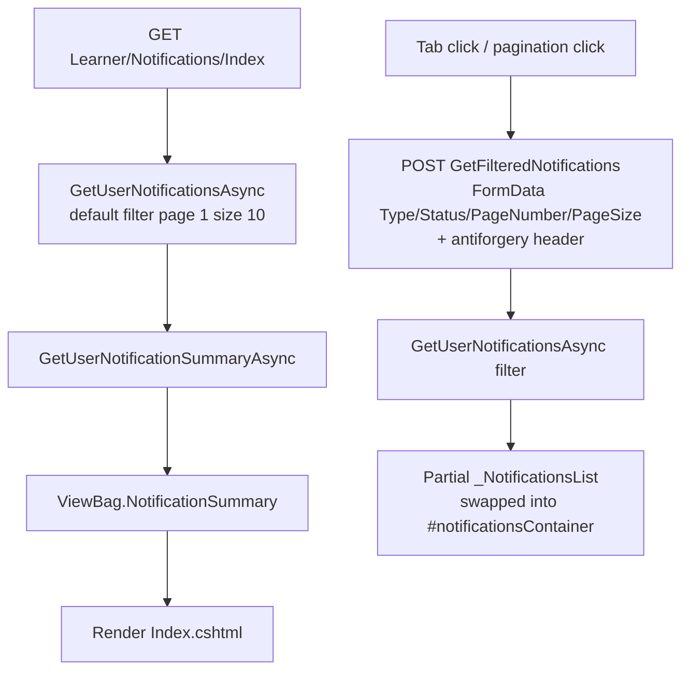
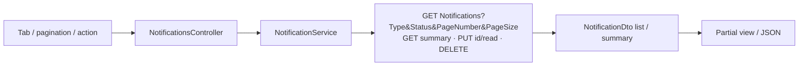
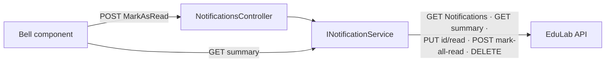

# NotificationsController Module Documentation (MVC)

---

## Overview

### Purpose
The learner's notification center: list, filter, mark read, and delete notifications; power the navbar bell badge.

### Business Objective
Keep users informed (system, promotional, course, enrollment, reminder) with read/unread state and bulk management.

### Main Functionality
- Paginated notification list with type/status tabs
- Mark single / all as read
- Delete single / all
- Summary JSON for badges and pagination

### Primary User Roles

| Role | Description |
|------|-------------|
| Authenticated users (all roles) | Full notification management |

---

## Module Architecture

```
Presentation           Views/Notifications/Index.cshtml (695 lines)
                       _NotificationsList.cshtml (partial)
                       Shared/Components/Notification/Default.cshtml (navbar bell)
Application            INotificationService -> NotificationService
External               EduLab API: GET Notifications, GET Notifications/summary,
                       GET Notifications/unread-count, POST Notifications/mark-all-read,
                       PUT Notifications/{id}/read, DELETE Notifications/{id},
                       DELETE Notifications/delete-all
State                  Bearer token only
```

### Controllers

| Controller | Responsibility |
|-----------|----------------|
| `NotificationsController` (143 lines) | List, filter, mark read, delete, summary |

### Services

| Service | Responsibility |
|---------|----------------|
| `NotificationService` | `GetUserNotificationsAsync` (GET `Notifications?Type=&Status=&PageNumber=&PageSize=`), `GetUserNotificationSummaryAsync` (GET `Notifications/summary`), `MarkNotificationAsReadAsync` (PUT `Notifications/{id}/read`), `MarkAllNotificationsAsReadAsync` (POST `Notifications/mark-all-read`), `DeleteNotificationAsync` (DELETE), `DeleteAllNotificationsAsync` (DELETE `Notifications/delete-all`) |

### Dependencies on Other Modules
- **Layout**: navbar bell component (top 3 + badge).
- **EduLab API** (hard dependency).

---

## Folder Structure

```
Areas/Learner/Controllers/
+-- NotificationsController.cs        # 143 lines

Areas/Learner/Views/Notifications/
+-- Index.cshtml                      # Center (695 lines)
+-- _NotificationsList.cshtml         # Filtered list partial

Views/Shared/Components/Notification/
+-- Default.cshtml                    # Navbar bell (top 3)

Models/DTOs/Notifications/
+-- NotificationDto.cs
+-- NotificationFilterDto.cs          # PageNumber=1, PageSize=10
+-- NotificationSummaryDto.cs         # TotalCount, UnreadCount,
                                      # SystemCount, PromotionalCount
+-- NotificationTypeDto / NotificationStatusDto (enums)
```

---

## Database Design

None (MVC). All notification state lives in the API's `Notifications` table.

---

## Internal Workflows & Runtime Behavior

### Workflow 1: Center Page + Filtering

#### Purpose
Browse and filter notifications by type/status with server paging.

#### Flow Diagram



#### Runtime Behavior
- JS keeps `currentFilter = {type:null, status:null, pageNumber:1, pageSize:10}` (Index.cshtml:399-404).
- Tab click -> `loadFilteredNotifications()` -> POST with antiforgery header -> replaces container innerHTML (Index.cshtml:561-606).
- `markAllAsRead`/`deleteAllNotifications` -> POST then `location.reload()` (Index.cshtml:513-559).
- `updatePagination()` renders buttons calling `changePage(page)` (Index.cshtml:629-693).

### Workflow 2: Navbar Bell

#### Purpose
Show the latest notifications + unread badge globally.

#### Behavior
- `Notification/Default.cshtml` renders top 3 server-side (`Take(3)`, Default.cshtml:320) + view-all link to `Notifications/Index`.
- Item click -> `fetch('/Notifications/MarkAsRead/{id}')` (Default.cshtml:397).
- **No client polling** — the badge is server-rendered per page load.

---

## Data Flow Analysis



#### Mapping & Transformations
- `_NotificationsList.cshtml`: `GetRejectionReason()` parses `Parameters` JSON `"reason"` for Refund-type notifications; `GetNotificationGradient()` maps type -> colors (System=purple, Promotional=yellow, Course=blue, Enrollment=green, Reminder=red); `GetTypeBadgeClass()`.
- Localized titles/messages resolved client-side? No — resolved by the API DTO (`LocalizeTitle`/`LocalizeMessage` use the resx).

---

## Controllers & Endpoints

### NotificationsController

**Route**: `/Learner/Notifications`  
**Authorization**: `[Authorize]` (NotificationsController.cs:10-12)  
**Dependencies**: `INotificationService`, `ILogger<NotificationsController>`, `IStringLocalizer<SharedResources>`

| Action | HTTP | Route | Description |
|--------|------|-------|-------------|
| Index | GET | `/Learner/Notifications/Index` | Center page |
| GetFilteredNotifications | POST | `/Learner/Notifications/GetFilteredNotifications` | Filtered list partial (form-bound `NotificationFilterDto`) |
| MarkAllAsRead | POST | `/Learner/Notifications/MarkAllAsRead` | Mark all read + redirect |
| MarkAsRead | POST | `/Learner/Notifications/MarkAsRead/{id}` | Mark one read (JSON) |
| Delete | POST | `/Learner/Notifications/Delete/{id}` | Delete one + redirect |
| DeleteAll | POST | `/Learner/Notifications/DeleteAll` | Delete all + redirect |
| GetNotificationSummary | GET | `/Learner/Notifications/GetNotificationSummary` | Summary JSON |

**Models**: `NotificationDto`, `NotificationFilterDto` (PageNumber=1, PageSize=10), `NotificationSummaryDto`, enums `NotificationTypeDto`, `NotificationStatusDto`.

---

## Frontend Integration

### Index.cshtml (695 lines)
- Stats cards (UnreadCount, SystemCount, PromotionalCount); tabs all/unread/system/promotional.
- AJAX tab/pagination filtering with antiforgery header; container swap; pagination buttons.
- Bulk actions reload the page (TempData alerts).

### Notification bell (Default.cshtml)
- Server-rendered top 3; mark-read via fetch; view-all link.

---

## Business Rules

| Rule | Verified in | Why it exists |
|------|-------------|---------------|
| Filter paging defaults 10/page | `NotificationFilterDto` defaults | Consistent center behavior |
| Bulk actions redirect with TempData | MarkAllAsRead/Delete/DeleteAll | Full-page confirmation pattern |
| Unread badge server-rendered | bell component | No polling overhead |
| Summary drives pagination math | Index.cshtml:631-633 | Page-count rendering |

---

## Security Analysis

| Control | Status |
|---------|--------|
| Authentication | ✅ `[Authorize]` |
| Authorization | API returns only the caller's notifications (Bearer-scoped) |
| Anti-forgery | ✅ POSTs carry antiforgery (header + form token) |
| Data exposure | Notification payloads only |

---

## Module Dependencies



**Internal**: Layout bell component, shared alert system.
**External**: EduLab API only.

---

## Hidden Behaviors & Technical Notes

1. **`showToast()` is a stub**: `Notifications/Index.cshtml:624-627` defines `showToast()` that calls `alert(message)` — bulk-action errors surface as native browser alerts.
2. **Pagination math mismatch**: JS uses `summary.TotalCount` (unfiltered server total) even when a tab filter is active (Index.cshtml:631-633) — filtered pagination can overshoot the actual page count.
3. **No polling**: the navbar badge refreshes only on page loads; long-lived pages show stale counts.
4. **Refund rejection reasons** are parsed from `Parameters` JSON at render time — the shape `{"reason": "..."}` is a contract with the API.

---

## Configuration

| Key | Purpose |
|-----|---------|
| `EduLab:ApiBaseUrl` | API base for notification calls |

No feature flags or environment variables specific to this module.

---

## Change Log

**Current functionality (verified):** paginated filtered notification center, mark single/all read, delete single/all, summary badge, navbar bell with top-3, localized messages + refund-reason rendering.

**Maintenance notes:**
- Replace the `alert()` stub with the toast system.
- Fix filtered-pagination math (use filtered totals).
- Consider polling/SignalR for the bell badge.