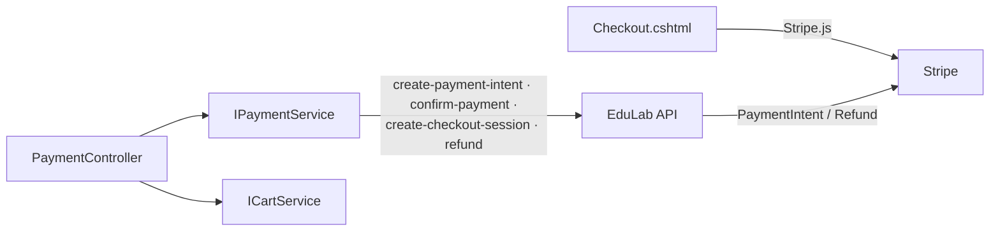

# PaymentController Module Documentation (MVC)

---

## Overview

### Purpose
Stripe checkout orchestration: payment intents, checkout sessions, transaction history, and refund requests.

### Business Objective
Convert carts into paid enrollments with minimal friction (card or hosted Stripe checkout) and provide post-purchase management (transactions + refunds).

### Main Functionality
- Checkout page with Stripe.js card form
- PaymentIntent + ConfirmPayment (client-side confirmation)
- CheckoutSession (hosted Stripe flow)
- Transactions history + refund request
- Success/Cancel landing pages

### Primary User Roles

| Role | Description |
|------|-------------|
| Authenticated user with cart items | Checkout, transactions, refunds |

---

## Module Architecture

```
Presentation           Views/Payment/Checkout.cshtml (Stripe.js v3)
                       Views/Payment/Transactions.cshtml
                       Views/Payment/Refund.cshtml
Application            IPaymentService, ICartService
External               EduLab API: POST payment/create-payment-intent,
                       POST payment/confirm-payment,
                       POST payment/create-checkout-session,
                       GET payment/user-payments, POST payment/refund,
                       GET payment/success|cancel
                       Stripe.js + publishable key
```

### Controllers

| Controller | Responsibility |
|-----------|----------------|
| `PaymentController` | Checkout, intents, sessions, transactions, refunds (namespace quirk: `EduLab_MVC.Controllers`) |

### Services

| Service | Responsibility |
|---------|----------------|
| `PaymentService` | `CreatePaymentIntentAsync` (POST `payment/create-payment-intent`), `ConfirmPaymentAsync` (POST `payment/confirm-payment`), `CreateCheckoutSessionAsync` (POST `payment/create-checkout-session`), `GetUserPaymentsAsync` (GET `payment/user-payments`), `RequestRefundAsync` (POST `payment/refund`), `GetBaseUrl()` for return URLs |
| `CartService` | Cart load for checkout page |

### Dependencies on Other Modules
- **Cart**: checkout requires a non-empty cart.
- **Stripe** (client + API-side).
- **EduLab API** (hard dependency).

---

## Folder Structure

```
Areas/Learner/Controllers/
+-- PaymentController.cs              # Namespace EduLab_MVC.Controllers (mismatch)

Areas/Learner/Views/Payment/
+-- Checkout.cshtml                   # Stripe.js card form
+-- Transactions.cshtml               # Payment history + refund links
+-- Refund.cshtml                     # Refund request form
+-- (PaymentResult / Success / Cancel views MISSING — see Hidden)

Models/DTOs/Payment/
+-- PaymentRequest.cs / PaymentResponse.cs
+-- CheckoutRequest.cs
+-- RefundRequestDto.cs / RefundResponseDto.cs
+-- PaymentDto.cs
```

---

## Database Design

None (MVC). Payments live in the API's `Payments` table.

---

## Internal Workflows & Runtime Behavior

### Workflow 1: Checkout (Card)

#### Purpose
Pay for the cart with a card via PaymentIntent.

#### Flow Diagram

```mermaid
flowchart TD
    A[GET Learner/Payment/Checkout] --> B{Cart empty?}
    B -->|yes| C[Redirect Cart]
    B -->|no| D[ViewBag.Cart / ViewBag.StripePublishableKey<br/>hardcoded pk_test / ViewBag.UserData]
    D --> E[Checkout.cshtml loads Stripe.js]
    E --> F[Card form → stripe.createToken]
    F --> G[POST CreatePaymentIntent<br/>[FromBody] PaymentRequest + antiforgery]
    G --> H{Intent or free checkout?}
    H -->|intent| I[stripe.confirmCardPayment]
    H -->|free| J[Skip Stripe confirmation]
    I --> K[POST ConfirmPayment<br/>[FromBody] paymentIntentId + antiforgery]
    J --> K
    K --> L[API processes success → enrollments]
    L --> M[Redirect Transactions / Success]
```

#### Runtime Behavior
- CSRF token read via `getCsrfToken()` from the first `input[name="__RequestVerificationToken"]` (Checkout.cshtml:523-525) — **the checkout page has no `@Html.AntiForgeryToken()`**; the token exists only because `_LoginPartialView.cshtml:949` renders a hidden token in the layout's logout form.
- Free orders still invoke `CreatePaymentIntent` (API short-circuits with a `free_{guid}` reference).
- All 3 payment POSTs are antiforgery-protected.

### Workflow 2: Checkout Session (Hosted Stripe)

#### Purpose
Alternative flow using Stripe's hosted checkout.

#### Behavior
- `POST CreateCheckoutSession` `[FromBody] CheckoutRequest` + antiforgery -> API returns session; Stripe redirects to `payment/success|cancel`.

### Workflow 3: Transactions & Refund

#### Flow

```mermaid
flowchart TD
    A[GET Learner/Payment/Transactions] --> B[GET payment/user-payments]
    B --> C[Render Transactions.cshtml<br/>refund links per payment]
    D[GET Learner/Payment/Refund?id] --> E{Payment found + owned?}
    E -->|no| F[TempData error + redirect Transactions]
    E -->|yes| G[Render Refund.cshtml]
    H[POST RequestRefund<br/>[FromBody] RefundRequestDto + antiforgery] --> I[POST payment/refund]
    I --> J[{success, message} JSON]
```

#### Runtime Behavior
- Ownership check before showing the refund form (PaymentController.cs:370-375).
- Refund form JS enforces a 2-second minimum submit delay (Refund.cshtml:300).

---

## Data Flow Analysis

```mermaid
flowchart LR
    A[Cart] --> B[Checkout]
    B --> C[CreatePaymentIntent → Stripe intent]
    C --> D[stripe.confirmCardPayment client-side]
    D --> E[ConfirmPayment → API]
    E --> F[Payment + Enrollment records]
    F --> G[Transactions page]
    G --> H[RefundRequest → API → Stripe refund (admin)]
```

---

## Controllers & Endpoints

### PaymentController

**Route**: `/Learner/Payment`  
**Authorization**: `[Authorize]` (class); `[AllowAnonymous]` on `PaymentResult`  
**Dependencies**: `IPaymentService`, `ICartService`, `ILogger`, `IStringLocalizer`

| Action | HTTP | Route | Description | Anti-forgery |
|--------|------|-------|-------------|--------------|
| Checkout | GET | `/Learner/Payment/Checkout` | Checkout page | — |
| CreatePaymentIntent | POST | `/Learner/Payment/CreatePaymentIntent` | Stripe intent | ✅ |
| ConfirmPayment | POST | `/Learner/Payment/ConfirmPayment` | Confirm + process | ✅ |
| CreateCheckoutSession | POST | `/Learner/Payment/CreateCheckoutSession` | Hosted checkout | ✅ |
| PaymentResult | GET | `/Learner/Payment/PaymentResult?session_id` | Stripe return (anonymous) | — |
| Success | GET | `/Learner/Payment/Success` | Success page | — |
| Cancel | GET | `/Learner/Payment/Cancel` | Cancel page | — |
| Refund | GET | `/Learner/Payment/Refund?id` | Refund form | — |
| Transactions | GET | `/Learner/Payment/Transactions` | Payment history | — |
| RequestRefund | POST | `/Learner/Payment/RequestRefund` | Submit refund (JSON) | ✅ |

**Models**: `PaymentRequest`, `PaymentResponse`, `CheckoutRequest`, `RefundRequestDto`, `RefundResponseDto`, `PaymentDto`.

---

## Frontend Integration

### Checkout.cshtml
- Stripe.js v3 with `Stripe(ViewBag.StripePublishableKey)`; `createToken` + `confirmCardPayment`.
- `createIntentUrl`/`confirmUrl` via `Url.Action` (Checkout.cshtml:509-520).
- CSRF token from layout's hidden field (no local `AntiForgeryToken()`).

### Refund.cshtml
- `@Html.AntiForgeryToken()` present (Refund.cshtml:351); fetch JSON + token header; 2s min-delay; reason field.

### Transactions.cshtml
- Refund links `asp-action="Refund"` per payment (Transactions.cshtml:359-369).

---

## Business Rules

| Rule | Verified in | Why it exists |
|------|-------------|---------------|
| Checkout requires non-empty cart | PaymentController.cs:63-64 | Nothing to pay for |
| Refund form only for owned payments | PaymentController.cs:370-375 | Prevent refunding others' payments |
| Refund eligibility enforced API-side | `GET payment/user-payments` | 7-day / progress rules live in the API |
| Publishable key in config + code | PaymentController.cs:82 vs appsettings.json:10 | Duplication risk |

---

## Security Analysis

| Control | Status |
|---------|--------|
| Authentication | 🔐 class-level; `PaymentResult` anonymous (Stripe return) |
| Anti-forgery | ✅ all 3 payment POSTs + RequestRefund |
| Stripe key handling | Publishable key exposed to client (by design); **secret key never leaves the API** |
| Ownership | Refund flow verifies payment ownership |
| CSRF caveat | Checkout relies on the layout's hidden token (fragile coupling) |

---

## Module Dependencies



**Internal**: Cart (gate), Layout (hidden CSRF token).
**External**: Stripe.js, EduLab API.

---

## Hidden Behaviors & Technical Notes

1. **Three actions have no views** — `PaymentResult`, `Success`, `Cancel` return `View()` but **no view files exist** -> runtime `InvalidOperationException` (view-not-found) when Stripe redirects back (PaymentController.cs:297-343).
2. **Hardcoded Stripe test key** in `PaymentController.cs:82` (duplicated with appsettings.json:10).
3. **CSRF token availability is accidental**: Checkout has no `AntiForgeryToken()`; it reads the token rendered by the layout's logout form — removing that form breaks checkout POSTs.
4. **Free orders still hit CreatePaymentIntent** — the API short-circuits, but the client round-trip happens anyway.

---

## Configuration

| Key | Purpose |
|-----|---------|
| `EduLab:StripePublishableKey` (appsettings.json:10) | Stripe publishable key |
| `EduLab:ApiBaseUrl` | API base for payment calls |

No feature flags or environment variables specific to this module.

---

## Change Log

**Current functionality (verified):** card checkout (PaymentIntent + confirmCardPayment), hosted checkout session, transactions list, refund request with ownership check, antiforgery-protected POSTs.

**Maintenance notes:**
- Create the missing `PaymentResult`/`Success`/`Cancel` views — Stripe returns currently crash.
- Remove the hardcoded key from the controller.
- Add an explicit `AntiForgeryToken()` to Checkout.cshtml.