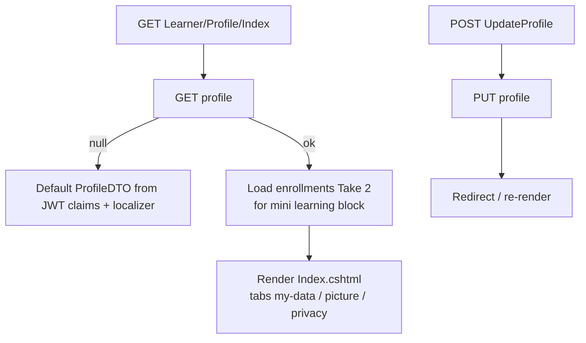
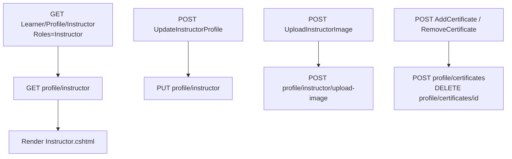
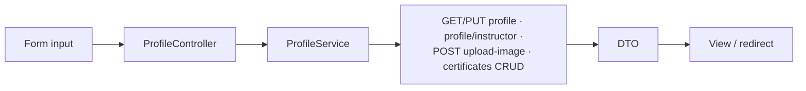
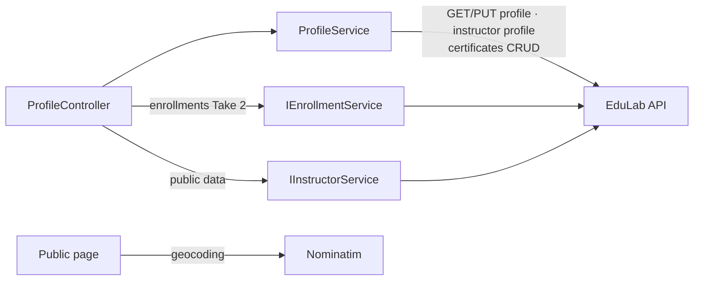

# ProfileController Module Documentation (MVC)

---

## Overview

### Purpose
Manage the user's own profile data (general info, avatar, instructor profile, certificates) and render the public instructor profile page.

### Business Objective
Keep profile data fresh for personalization and instructor credibility — public instructor pages convert learners; the "instructor panel" collects the data required to publish courses.

### Main Functionality
- Own profile view/edit (general tab, picture tab, privacy)
- Avatar upload (user + instructor)
- Instructor panel: edit instructor profile, add/remove certificates
- Public instructor profile page with map, social links, ratings

### Primary User Roles

| Role | Description |
|------|-------------|
| Authenticated user | Own profile management |
| Instructor | Instructor panel + certificate management |
| Anonymous | Public instructor profiles |

---

## Module Architecture

```
Presentation           Views/Profile/Index.cshtml (876 ln, tabs my-data/picture/privacy)
                       Views/Profile/Instructor.cshtml (1107 ln, instructor panel)
                       Views/Profile/InstructorProfile.cshtml (1061 ln, public page)
Application            IProfileService, ICourseService, IEnrollmentService,
                       ICourseProgressService, IInstructorService
External               EduLab API: GET/PUT profile, profile/public/instructor/{id},
                       POST profile/upload-image, profile/instructor*,
                       profile/certificates*
                       Nominatim (OpenStreetMap) geocoding in public page
```

### Controllers

| Controller | Responsibility |
|-----------|----------------|
| `ProfileController` | All profile actions (9) |

### Services

| Service | Responsibility |
|---------|----------------|
| `ProfileService` | `GET profile`, `PUT profile`, `GET profile/public/instructor/{id}`, `POST profile/upload-image`, `GET profile/instructor`, `PUT profile/instructor`, `POST profile/instructor/upload-image`, `POST profile/certificates`, `DELETE profile/certificates/{certId}` |

### Dependencies on Other Modules
- **Course**: `IEnrollmentService`/`ICourseProgressService` for the mini "my learning" list (Take 2).
- **Instructor**: `IInstructorService` for public profile data.
- **Nominatim** (OpenStreetMap) — external geocoding on the public profile page.
- **EduLab API** (hard dependency).

---

## Folder Structure

```
Areas/Learner/Controllers/
+-- ProfileController.cs              # 9 actions

Areas/Learner/Views/Profile/
+-- Index.cshtml                      # Own profile tabs (876 lines)
+-- Instructor.cshtml                 # Instructor panel (1107 lines)
+-- InstructorProfile.cshtml          # Public profile (1061 lines)

Models/DTOs/Profile/                 # ProfileDTO, UpdateProfileDTO,
                                     # InstructorProfileDTO, UpdateInstructorProfileDTO,
                                     # SocialLinksDTO, ProfileImageDTO, CertificateDTO
```

---

## Database Design

None (MVC). Profile data lives in the API (`ApplicationUser` + `Certificate` tables); avatar URLs are rewritten to absolute against `ApiBaseUrl` (ProfileService.cs:72).

---

## Internal Workflows & Runtime Behavior

### Workflow 1: Own Profile Page

#### Purpose
Show and edit personal profile data.

#### Flow



#### Runtime Behavior
- User id comes from JWT `sub` claim (ProfileController.cs:529-538).
- Relative avatar URLs prefixed with `ApiBaseUrl` minus `/api`.

#### Edge Cases
- All 6 POST actions **lack `[ValidateAntiForgeryToken]`** (ProfileController.cs:244, 288, 394, 438, 493, 545) — CSRF-exposed.
- `Take(2)` happens after fetching the full enrollment list.

### Workflow 2: Instructor Panel

#### Purpose
Edit instructor-specific profile + credentials.

#### Flow



#### Runtime Behavior
- `Instructor.cshtml` submits `UpdateInstructorProfile` via fetch FormData **without antiforgery token** (Instructor.cshtml:1072-1074).
- Certificate add/remove via forms (Instructor.cshtml:846, 890).

### Workflow 3: Public Instructor Profile

#### Purpose
Marketing page for a specific instructor.

#### Behavior
- `GET /Learner/Profile/instructor/{id}` — `[AllowAnonymous]`, attribute route (area defaults make it reachable).
- `GET profile/public/instructor/{id}`; `ViewBag.IsOwnProfile` when the viewer is the owner (InstructorProfile.cshtml:7).
- Social links (InstructorProfile.cshtml:326-349).
- **Nominatim geocoding** converts the location string to a Leaflet map marker (InstructorProfile.cshtml:938, 955, 1191, 1208) — external dependency.

---

## Data Flow Analysis



#### Mapping & Transformations
- Avatar/image URLs rewritten to absolute (ProfileService.cs:72).
- `ProfileDTO` fallback built from claims when API returns null.

---

## Controllers & Endpoints

### ProfileController

**Route**: `/Learner/Profile` (area convention)  
**Authorization**: `[Authorize]` class-level; `[AllowAnonymous]` on `InstructorProfile`  
**Dependencies**: `IProfileService`, `IWebHostEnvironment`, `IHttpContextAccessor`, `ICourseService`, `ILogger`, `IEnrollmentService`, `ICourseProgressService`, `IInstructorService`, `IStringLocalizer`

| Action | HTTP | Route | Auth | Description | Anti-forgery |
|--------|------|-------|------|-------------|--------------|
| Index | GET | `/Learner/Profile/Index` | 🔐 | Own profile page | — |
| InstructorProfile | GET | `/Learner/Profile/instructor/{id}` | 🔓 | Public instructor page | — |
| UpdateProfile | POST | `/Learner/Profile/UpdateProfile` | 🔐 | Save general data | ❌ |
| UploadImage | POST | `/Learner/Profile/UploadImage` | 🔐 | Avatar upload (multipart) | ❌ |
| Instructor | GET | `/Learner/Profile/Instructor` | 🎓 | Instructor panel | — |
| UpdateInstructorProfile | POST | `/Learner/Profile/UpdateInstructorProfile` | 🎓 | Save instructor profile | ❌ |
| UploadInstructorImage | POST | `/Learner/Profile/UploadInstructorImage` | 🎓 | Instructor avatar | ❌ |
| AddCertificate | POST | `/Learner/Profile/AddCertificate` | 🎓 | Add credential | ❌ |
| RemoveCertificate | POST | `/Learner/Profile/RemoveCertificate` | 🎓 | Remove credential | ❌ |

**Models**: `ProfileDTO`, `UpdateProfileDTO`, `InstructorProfileDTO`, `UpdateInstructorProfileDTO`, `SocialLinksDTO`, `ProfileImageDTO`, `CertificateDTO`.

---

## Frontend Integration

### Own profile (Index.cshtml)
- Tabs: `my-data` / `picture` / `privacy` (Index.cshtml:566-576).
- Avatar preview + upload form; privacy toggle tab.

### Instructor panel (Instructor.cshtml)
- fetch FormData submits; certificate add/remove forms; no CSRF token sent.

### Public profile (InstructorProfile.cshtml)
- Leaflet map + Nominatim geocoding; social links; course list via `_CourseCard`.

---

## Business Rules

| Rule | Verified in | Why it exists |
|------|-------------|---------------|
| Instructor panel requires `Instructor` role | `[Authorize(Roles=SD.Instructor)]` | Only real instructors manage instructor profiles |
| Public profile is anonymous | `[AllowAnonymous]` | Marketing page |
| Own-profile fallback data | ProfileController.cs:79-99 | Page never breaks on missing API data |
| Certificates limited to instructors | `[Authorize(Roles=Instructor)]` | Credentials belong to instructor marketing |

---

## Security Analysis

| Control | Status |
|---------|--------|
| Authentication | 🔐 class-level; public page anonymous |
| Role check | Instructor actions `[Authorize(Roles=SD.Instructor)]` |
| Anti-forgery | ❌ **All 6 POST actions lack `[ValidateAntiForgeryToken]`** (verified) |
| External dependency | Nominatim geocoding — privacy: user location sent to OpenStreetMap on page load |

---

## Module Dependencies



**Internal**: Course cards, enrollment service.
**External**: EduLab API, Nominatim.

---

## Hidden Behaviors & Technical Notes

1. **All profile POSTs are CSRF-exposed** (no antiforgery attributes; forms don't send tokens).
2. **Nominatim dependency**: profile pages geocode via OpenStreetMap — requires internet; failure leaves the map blank.
3. **`Take(2)` inefficiency**: the full enrollment list is fetched then trimmed.
4. **JWT-derived fallback**: when the API profile is missing, the MVC fabricates a profile from claims (full name/role) — may render stale data.

---

## Configuration

| Key | Purpose |
|-----|---------|
| `EduLab:ApiBaseUrl` | API base; avatar URL prefix derivation |

No feature flags or environment variables specific to this module.

---

## Change Log

**Current functionality (verified):** own profile tabs, avatar uploads, instructor panel with certificates, public instructor page with map/socials, role-gated instructor actions.

**Maintenance notes:**
- Add antiforgery to the 6 POSTs.
- Consider trimming the enrollment fetch before the API call.