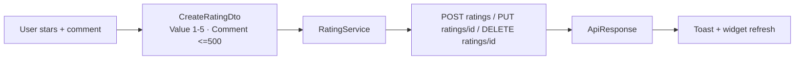
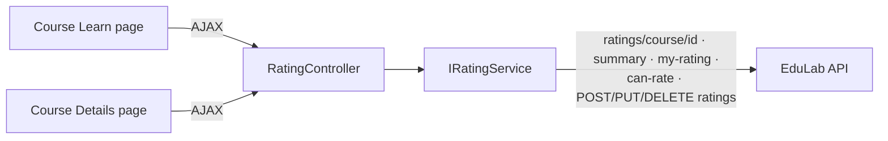

# RatingController Module Documentation (MVC)

---

## Overview

### Purpose
Course rating operations consumed via AJAX from the Details and Learn pages: paginated rating lists, summaries, and full CRUD.

### Business Objective
Collect social proof (star ratings + comments) and give learners eligibility-aware rating controls.

### Main Functionality
- Paginated course ratings + summary
- Add / update / delete own rating
- Can-rate eligibility + my-rating lookup
- AJAX JSON endpoints for the views

### Primary User Roles

| Role | Description |
|------|-------------|
| Anonymous | Read ratings + summary |
| Authenticated enrolled learner | Rate / edit / delete own rating |

---

## Module Architecture

```
Presentation           Shared partials: _RatingForm.cshtml, _RatingSummary.cshtml
                       (consumed by Course/Details.cshtml and Course/Learn.cshtml)
Application            IRatingService -> RatingService
External               EduLab API: GET ratings/course/{id},
                       GET ratings/course/{id}/summary,
                       GET ratings/course/{id}/my-rating,
                       POST ratings, PUT ratings/{id}, DELETE ratings/{id},
                       GET ratings/can-rate/{id}
```

### Controllers

| Controller | Responsibility |
|-----------|----------------|
| `RatingController` | All rating actions (namespace quirk: `EduLab_MVC.Controllers`) |

### Services

| Service | Responsibility |
|---------|----------------|
| `RatingService` | All rating API calls (6 endpoints above) |

### Dependencies on Other Modules
- **Course**: Details + Learn pages host the rating UI.
- **EduLab API** (hard dependency).

---

## Folder Structure

```
Areas/Learner/Controllers/
+-- RatingController.cs               # Namespace EduLab_MVC.Controllers

Views/Shared/
+-- _RatingForm.cshtml                # Star input + comment form
+-- _RatingSummary.cshtml             # Distribution bars

Views/Rating/                         # ⚠️ DOES NOT EXIST — CourseRatings has no view
```

---

## Database Design

None (MVC). Ratings live in the API's `Ratings` table.

---

## Internal Workflows & Runtime Behavior

### Workflow 1: Load Rating Data (Learn page)

#### Purpose
Bootstrap the rating widget: can I rate? my existing rating? current summary?

#### Flow Diagram

```mermaid
flowchart TD
    A[Learn.cshtml load] --> B[GET GetRatingData<br/>Authorize]
    B --> C[3 parallel service calls]
    C --> D[GET ratings/course/id/my-rating]
    C --> E[GET ratings/course/id/summary]
    C --> F[GET ratings/can-rate/id]
    D --> G[{success, canRate, existingRating, summary}]
    E --> G
    F --> G
    G --> H[JS renders rating widget state]
```

#### Runtime Behavior
- `GetRatingData` is `[Authorize]` (RatingController.cs:250-271).
- Summary + paginated list are also available anonymously for the Details page.

### Workflow 2: Add / Update / Delete

#### Flow

```mermaid
flowchart TD
    A[Submit rating form] --> B[POST AddRating<br/>[FromBody] CreateRatingDto + antiforgery]
    B --> C[POST ratings]
    C -->|ok| D[Toast + refresh summary]
    E[Edit existing] --> F[POST UpdateRating<br/>[FromBody] UpdateRatingDto + antiforgery]
    F --> G[PUT ratings/id]
    H[Delete] --> I[POST DeleteRating + antiforgery]
    I --> J[DELETE ratings/id]
```

#### Runtime Behavior
- Learn.cshtml calls: `GetRatingData` (:2231), `AddRating` with token header (:2519-2526), `UpdateRating` (:2555), `DeleteRating` (:2583).
- All mutation POSTs are antiforgery-protected.

---

## Data Flow Analysis



---

## Controllers & Endpoints

### RatingController

**Route**: `/Learner/Rating`  
**Authorization**: `[Authorize]` class-level; `[AllowAnonymous]` on read endpoints  
**Dependencies**: `IRatingService`, `ILogger`, `IStringLocalizer`

| Action | HTTP | Route | Auth | Description | Anti-forgery |
|--------|------|-------|------|-------------|--------------|
| CourseRatings | GET | `/Learner/Rating/CourseRatings?page&pageSize` | 🔓 | **No view exists — unreachable (500)** | — |
| AddRating | POST | `/Learner/Rating/AddRating` | 🔐 | Add rating (JSON) | ✅ |
| UpdateRating | POST | `/Learner/Rating/UpdateRating` | 🔐 | Edit rating (JSON) | ✅ |
| DeleteRating | POST | `/Learner/Rating/DeleteRating` | 🔐 | Delete rating (JSON) | ✅ |
| GetRatingData | GET | `/Learner/Rating/GetRatingData` | 🔐 | Can-rate + my + summary | — |
| GetCourseRatingsJson | GET | `/Learner/Rating/GetCourseRatingsJson` | 🔓 | Paginated ratings JSON | — |

**Models**: `CreateRatingDto` (Value 1-5, Comment <=500), `UpdateRatingDto`, `RatingDto`, `CourseRatingSummaryDto`, `CanRateResponseDto`, `RatingFormViewModel`.

---

## Frontend Integration

### Learn.cshtml
- `GetRatingData` on load; AddRating/UpdateRating/DeleteRating with antiforgery headers; toasts via `ToastMessages`.

### Details.cshtml
- `GetCourseRatingsJson` paginated loading (Details.cshtml:1296) + `_RatingSummary` render.

### Shared partials
- `_RatingForm.cshtml`: star input + comment (used on Learn).
- `_RatingSummary.cshtml`: distribution bars (used on Details).

---

## Business Rules

| Rule | Verified in | Why it exists |
|------|-------------|---------------|
| Rating value 1–5, comment <=500 chars | `CreateRatingDto` validation | Data quality + spam control |
| Can-rate requires enrollment + not rated | API `ratings/can-rate/{id}` | One rating per enrolled learner |
| Read endpoints anonymous | `[AllowAnonymous]` | Ratings are social proof for visitors |

---

## Security Analysis

| Control | Status |
|---------|--------|
| Authentication | Mutations 🔐; reads 🔓 |
| Authorization | API enforces enrollment + one-per-course |
| Anti-forgery | ✅ all mutation POSTs protected |
| Data exposure | Paginated DTOs only; anonymous read of summaries is by design |

---

## Module Dependencies



**Internal**: Course views, shared partials, toast system.
**External**: EduLab API only.

---

## Hidden Behaviors & Technical Notes

1. **`CourseRatings` is dead**: returns `View()` but `Views/Rating/` doesn't exist -> view-not-found 500 (RatingController.cs:56-57).
2. **Namespace mismatch**: `RatingController` sits in the Learner area folder with namespace `EduLab_MVC.Controllers`.
3. **Anonymous summary exposure**: summaries/ratings are public by design — moderation happens via reports, not gating.

---

## Configuration

| Key | Purpose |
|-----|---------|
| `EduLab:ApiBaseUrl` | API base for rating calls |

No feature flags or environment variables specific to this module.

---

## Change Log

**Current functionality (verified):** paginated rating lists, summaries, add/update/delete with eligibility checks, AJAX JSON surface for Details + Learn.

**Maintenance notes:**
- Remove the dead `CourseRatings` action or create the view.
- Fix the namespace to `Areas.Learner.Controllers`.