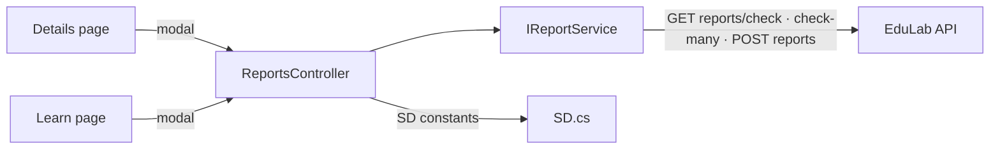

# ReportsController Module Documentation (MVC — Learner Area)

---

## Overview

### Purpose
Abuse/moderation reporting from the learner side: check report state, batch-check multiple targets, and create reports.

### Business Objective
Give learners a low-friction way to flag courses, comments, and reviews for admin moderation.

### Main Functionality
- Single-target report state check
- Batch state check (multiple target ids)
- Create report (type + target + reason)

### Primary User Roles

| Role | Description |
|------|-------------|
| Authenticated learner | Report content |
| Anonymous | No reporting (reports are user-attributed) |

---

## Module Architecture

```
Presentation           Shared/_ReportModal.cshtml (reason dropdown from SD.GetReportReasons)
Application            IReportService -> ReportService
External               EduLab API: GET reports/check, GET reports/check-many,
                       POST reports
Constants              SD.cs: report types (Course/Comment/Review),
                       reasons arrays, statuses (pending/resolved/dismissed)
```

### Controllers

| Controller | Responsibility |
|-----------|----------------|
| `ReportsController` | Check, CheckMany, Create (3 actions) |

### Services

| Service | Responsibility |
|---------|----------------|
| `ReportService` | `CheckReportedAsync` (GET `reports/check`), `CheckManyReportedAsync` (GET `reports/check-many`), `CreateReportAsync` (POST `reports`) |

### Dependencies on Other Modules
- **Course**: Details + Learn pages host the report modal.
- **SD constants**: types/reasons shared with the API.
- **EduLab API** (hard dependency).

---

## Folder Structure

```
Areas/Learner/Controllers/
+-- ReportsController.cs              # 3 actions

Views/Shared/
+-- _ReportModal.cshtml               # Reason dropdown + submit (fetch)

Models/DTOs/Reports/
+-- CreateReportRequest.cs            # Type, TargetId, Reason
```

---

## Database Design

None (MVC). Reports live in the API's `Reports` table (unique per reporter/type/target).

---

## Internal Workflows & Runtime Behavior

### Workflow 1: Report State Checks

#### Behavior
- `GET Check?type=&targetId=` -> `{reported: bool}` (ReportsController.cs:29).
- `GET CheckMany?type=&ids=` -> comma-split ids, `int.TryParse` drops invalid ones **silently** (ReportsController.cs:43-44).
- Callers: Details (`Check` :1162, `CheckMany` :1411), Learn (`CheckMany` :2755).

### Workflow 2: Create Report

#### Flow Diagram

```mermaid
flowchart TD
    A[Report modal open] --> B[GET CheckMany → which targets<br/>already reported]
    B --> C[User selects reason from SD.GetReportReasons]
    C --> D[POST Create<br/>[FromBody] CreateReportRequest<br/>NO antiforgery]
    D --> E[POST reports]
    E -->|ok| F[Toast success + disable button]
    E -->|409 already reported| G[Toast already-reported]
    E -->|404 target missing| H[Toast target not found]
```

#### Runtime Behavior
- `_ReportModal.cshtml` fetches `Url.Action("Create","Reports")` (ReportModal.cshtml:245).
- **`Create` lacks `[ValidateAntiForgeryToken]`** (ReportsController.cs:65-66).

---

## Data Flow Analysis

```mermaid
flowchart LR
    A[User pick: type + reason] --> B[CreateReportRequest]
    B --> C[ReportService]
    C --> D[POST reports]
    D --> E[API: dedupe check (unique index),<br/>target existence, reason validity]
    E --> F[{success / 400 / 404 / 409}]
    F --> G[Toast]
```

---

## Controllers & Endpoints

### ReportsController

**Route**: `/Learner/Reports`  
**Authorization**: `[Authorize]` (ReportsController.cs:10-11)  
**Dependencies**: `IReportService`, `IStringLocalizer`, `ILogger`

| Action | HTTP | Route | Description | Anti-forgery |
|--------|------|-------|-------------|--------------|
| Check | GET | `/Learner/Reports/Check?type&targetId` | Single target state | — |
| CheckMany | GET | `/Learner/Reports/CheckMany?type&ids` | Batch state (comma ids) | — |
| Create | POST | `/Learner/Reports/Create` | Submit report | ❌ |

**Models**: `CreateReportRequest` (Type, TargetId, Reason).

---

## Frontend Integration

### _ReportModal.cshtml
- Reasons rendered from `SD.GetReportReasons(type)` (ReportModal.cshtml:4-6).
- Report buttons on Details (course), Learn (comments), and reviews — disabled once reported.

---

## Business Rules

| Rule | Verified in | Why it exists |
|------|-------------|---------------|
| One report per (user, type, target) | API unique index | Prevent report spam |
| Reasons from SD constants | `SD.GetReportReasons` switch | Consistent labels between UI and API |
| Invalid ids silently dropped in CheckMany | ReportsController.cs:43-44 | Tolerance for sloppy callers |
| Reports require authentication | `[Authorize]` | Attribution for moderation |

---

## Security Analysis

| Control | Status |
|---------|--------|
| Authentication | ✅ `[Authorize]` |
| Anti-forgery | ❌ `Create` POST unprotected (verified) |
| Abuse control | API dedupe (unique index) + reason validation |
| Data exposure | Only report state booleans exposed publicly per target |

---

## Module Dependencies



**Internal**: Course views, SD constants, toast system.
**External**: EduLab API only.

---

## Hidden Behaviors & Technical Notes

1. **CSRF-exposed Create** (no antiforgery) — verified.
2. **CheckMany over long id lists**: ids string can exceed 2000 chars with many targets (no cap on MVC side).
3. **Dedupe UX**: the modal disables already-reported targets based on CheckMany — race conditions fall back to the API's 409.

---

## Configuration

| Key | Purpose |
|-----|---------|
| `EduLab:ApiBaseUrl` | API base for report calls |

---

## Change Log

**Current functionality (verified):** single/batch report-state checks, report creation with dedupe + reason validation, modal integration on Details and Learn.

**Maintenance notes:**
- Add antiforgery to `Create`.
- Cap the ids string length in `CheckMany`.