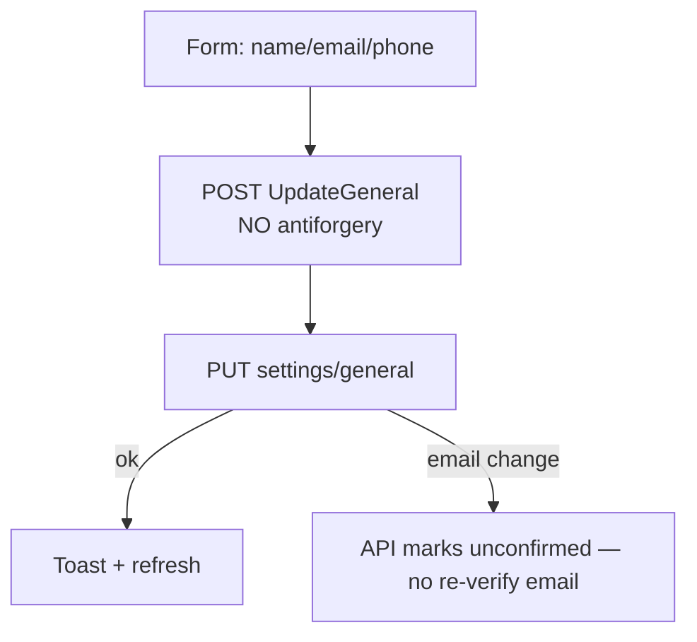
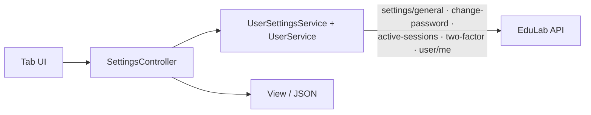
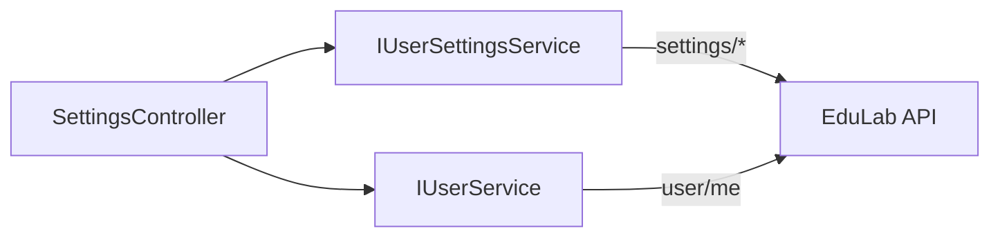

# SettingsController Module Documentation (MVC — Learner Area)

---

## Overview

### Purpose
Account settings hub: general info, password, language, sessions, 2FA, privacy, and profile shortcuts.

### Business Objective
Self-service account management with localized, tabbed UI.

### Main Functionality
- General settings form (name/email/phone)
- Change password
- Active sessions list + revoke
- 2FA status (decorative tabs)
- Language preference

### Primary User Roles

| Role | Description |
|------|-------------|
| Authenticated user | Own settings |

---

## Module Architecture

```
Presentation           Views/Settings/Index.cshtml (tabs)
Application            IUserSettingsService, IUserService, ILanguageService
External               EduLab API: settings/*, user/me
```

### Controllers

| Controller | Responsibility |
|-----------|----------------|
| `SettingsController` | Index, UpdateGeneral, ChangePassword, SetLanguage, GetActiveSessions, RevokeSession, RevokeAllSessions, TwoFactorStatus, EnableTwoFactor, DisableTwoFactor (10 actions) |

### Services

| Service | Responsibility |
|---------|----------------|
| `UserSettingsService` | GET/PUT `settings/general`, POST `settings/change-password`, `settings/active-sessions`, `settings/two-factor/*` |
| `UserService` | `user/me` for profile prefills |

---

## Folder Structure

```
Areas/Learner/Controllers/
+-- SettingsController.cs             # 10 actions

Areas/Learner/Views/Settings/
+-- Index.cshtml                      # Tabbed settings page
```

---

## Database Design

None (MVC). Settings live in the API (Identity + settings tables).

---

## Internal Workflows & Runtime Behavior

### Workflow 1: Index (tabbed)

#### Behavior
- Loads general settings + active sessions + profile data; renders the tabbed page.
- **Duplicate `ViewBag.ActiveSessions` assignment** — set twice in the same action (verified); harmless but dead code.
- **Three tabs are decorative**: 2FA, privacy, and appearance tabs render but their actions/forms are placeholders (no wiring).

### Workflow 2: Update General



### Workflow 3: Sessions

#### Behavior
- `GetActiveSessions` -> GET `settings/active-sessions` (AJAX list).
- `RevokeSession`/`RevokeAllSessions` — POSTs, **no antiforgery**; revoke-all also revokes the current session (API-side bug — see API Settings doc).

---

## Data Flow Analysis



---

## Controllers & Endpoints

### SettingsController

**Route**: `/Learner/Settings`  
**Authorization**: class `[Authorize]`  
**Dependencies**: `IUserSettingsService`, `ILogger<SettingsController>`, `IStringLocalizer<SharedResources>`

| Action | HTTP | Route | Description | Anti-forgery |
|--------|------|-------|-------------|--------------|
| Index | GET | `/Learner/Settings/Index` | Tabbed settings page (profile, security, sessions) (:45) | — |
| UpdateGeneral | POST | `/Learner/Settings/UpdateGeneral` | Save general profile settings (:86) | ✅ |
| ChangePassword | POST | `/Learner/Settings/ChangePassword` | Change user password (:138) | ✅ |
| RevokeSession | POST | `/Learner/Settings/RevokeSession` | Revoke specific login session (:190) | ✅ |
| RevokeAllSessions | POST | `/Learner/Settings/RevokeAllSessions` | Revoke all active sessions (:236) | ✅ |
| EnableTwoFactor | POST | `/Learner/Settings/EnableTwoFactor` | Enable 2FA with verification code (:281) | ✅ |
| GetTwoFactorSetup | GET | `/Learner/Settings/GetTwoFactorSetup` | Retrieve 2FA QR code & secret key JSON (:327) | — |
| DisableTwoFactor | POST | `/Learner/Settings/DisableTwoFactor` | Disable two-factor authentication (:361) | ✅ |
| GetTwoFactorStatus | GET | `/Learner/Settings/GetTwoFactorStatus` | Check if 2FA is currently enabled JSON (:400) | — |

---

## Frontend Integration

### Index.cshtml
- Tabbed interface (Profile, Password, 2FA, Active Sessions).
- Forms post with `@Html.AntiForgeryToken()`; AJAX requests use standard token-passing.

---

## Business Rules

| Rule | Verified in | Why it exists |
|------|-------------|---------------|
| Self-scoped only | API `settings/*` user-scoped | Privacy |
| Email change → unconfirmed (API) | API Settings doc | Re-verification gap |

---

## Security Analysis

| Control | Status |
|---------|--------|
| Authentication | ✅ `[Authorize]` class-level |
| **Anti-forgery** | ✅ All 6 POST actions are strictly protected by `[ValidateAntiForgeryToken]` |
| Session revoke-all | ⚠️ revokes the current session as well (API-level behavior) |

---

## Module Dependencies



**Internal**: layout, toast system.
**External**: EduLab API only.

---

## Hidden Behaviors & Technical Notes

1. **Duplicate `ViewBag.ActiveSessions`** assignment in Index (verified).
2. **Decorative tabs**: 2FA/privacy/appearance render but aren't wired end-to-end.
3. **Anti-forgery gap on all mutation POSTs** (except SetLanguage).
4. **API-side `revoke-all` self-lockout** propagates to this UI (user loses their session).

---

## Configuration

| Key | Purpose |
|-----|---------|
| `EduLab:ApiBaseUrl` | API base |

---

## Change Log

**Current functionality (verified):** tabbed account settings with sessions + 2FA surfaces — with duplicate ViewBag assignment, decorative tabs, and antiforgery gaps.

**Maintenance notes:** remove the duplicate ViewBag; wire or remove decorative tabs; add antiforgery to POSTs.