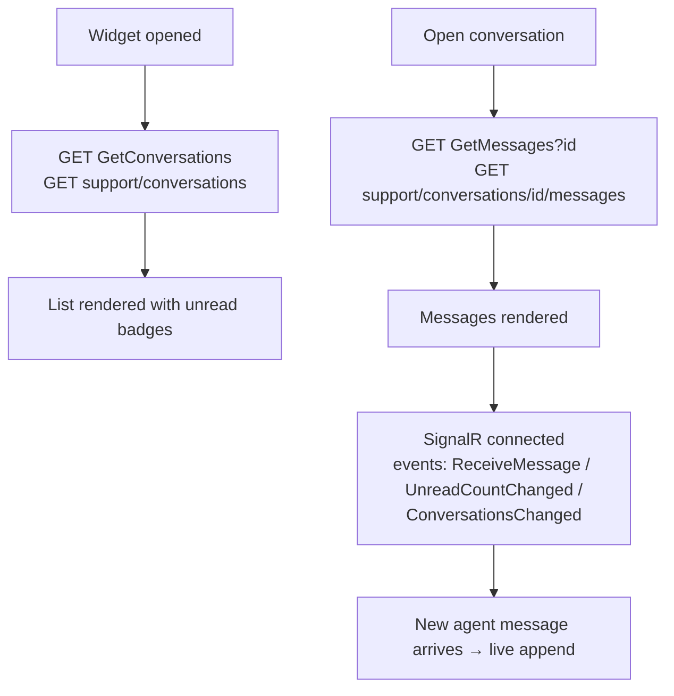
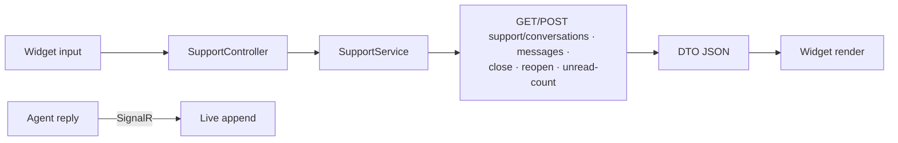
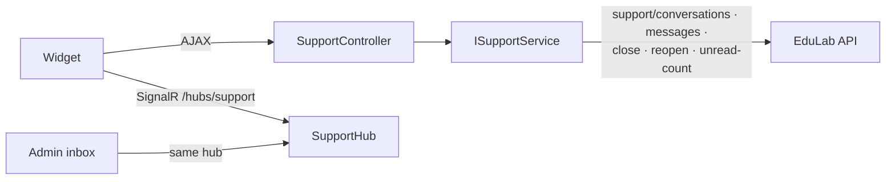

# SupportController Module Documentation (MVC — Learner Area)

---

## Overview

### Purpose
Backend for the floating support chat widget: conversations, messages, close/reopen, and unread counts.

### Business Objective
Provide live support: users open tickets and chat with agents in real time (SignalR) from anywhere on the site.

### Main Functionality
- Conversation list + messages
- Create conversation / send message
- Close / reopen conversations
- Unread count

### Primary User Roles

| Role | Description |
|------|-------------|
| Authenticated users | Open and chat within their own tickets |
| Agents (Support/Admin) | Reply from the Admin inbox (API-side) |

---

## Module Architecture

```
Presentation           Views/Shared/_SupportChatWidget.cshtml (731 lines, global widget)
                       Views/Support/ (EMPTY folder — Index redirects to Home)
Application            ISupportService -> SupportService
External               EduLab API: GET support/conversations,
                       POST support/conversations,
                       GET support/conversations/{id}/messages,
                       POST support/conversations/{id}/messages,
                       POST .../close, POST .../reopen, GET support/unread-count
                       SignalR hub /hubs/support (ReceiveMessage,
                       UnreadCountChanged, ConversationsChanged)
```

### Controllers

| Controller | Responsibility |
|-----------|----------------|
| `SupportController` | Widget endpoints (8 actions) |

### Services

| Service | Responsibility |
|---------|----------------|
| `SupportService` | All conversation/message/unread API calls |

### Dependencies on Other Modules
- **Layout**: widget rendered on specific Home pages.
- **SignalR**: real-time message delivery.
- **EduLab API** (hard dependency).

---

## Folder Structure

```
Areas/Learner/Controllers/
+-- SupportController.cs              # 8 actions

Views/Support/                        # EMPTY (Index redirects away)
Views/Shared/
+-- _SupportChatWidget.cshtml         # Floating widget (731 lines)
```

---

## Database Design

None (MVC). Conversations/messages live in the API's `SupportConversations`/`SupportMessages` tables.

---

## Internal Workflows & Runtime Behavior

### Workflow 1: Chat Widget Session

#### Purpose
Load the user's conversations and open a live chat.

#### Flow Diagram



#### Runtime Behavior
- Widget shown only when `isLoggedIn && controller==Home && action ∈ {contact, faq, privacy, terms, help}` (_Layout.cshtml:2161-2170).
- `widgetApiBase = apiBaseUrl` minus `/api/` for media URLs (Widget:10).
- SignalR events wired (Widget:396-404).

### Workflow 2: Send / Create / Close / Reopen

#### Flow

```mermaid
flowchart TD
    A[New conversation form<br/>subject + message] --> B[POST CreateConversation<br/>[FromForm] subject, message<br/>NO antiforgery]
    B --> C[POST support/conversations]
    D[Send message] --> E[POST SendMessage<br/>[FromBody] raw string content<br/>NO antiforgery]
    E --> F[POST support/conversations/id/messages]
    G[Close / Reopen buttons] --> H[POST CloseConversation / ReopenConversation<br/>NO antiforgery]
    H --> I[POST support/conversations/id/close|reopen]
```

#### Runtime Behavior
- `SendMessage` binds a **raw JSON string body** (`[FromBody] string content`), sent with `Content-Type: application/json` (Widget:598-601).
- **All 5 POST actions lack `[ValidateAntiForgeryToken]`** (SupportController.cs:39-40, 56-57, 66-67, 73-74).

### Workflow 3: Unread Counts

#### Behavior
- `GET UnreadCount` -> `GET support/unread-count`.
- Per-conversation `c.unreadCount` drives badges — **the `UnreadCount` endpoint is not called by the widget** (only the conversation list's unreadCount is used).

---

## Data Flow Analysis



---

## Controllers & Endpoints

### SupportController

**Route**: `/Learner/Support`  
**Authorization**: `[Authorize]` (SupportController.cs:10-11)  
**Dependencies**: `ISupportService`, `ILogger`

| Action | HTTP | Route | Description | Anti-forgery |
|--------|------|-------|-------------|--------------|
| Index | GET | `/Learner/Support/Index` | Redirects to Home (widget replaced the page) | — |
| GetConversations | GET | `/Learner/Support/GetConversations` | My conversations | — |
| CreateConversation | POST | `/Learner/Support/CreateConversation` | New ticket (form) | ❌ |
| GetMessages | GET | `/Learner/Support/GetMessages?id` | Messages of a conversation | — |
| SendMessage | POST | `/Learner/Support/SendMessage?id` | Send message (raw string body) | ❌ |
| CloseConversation | POST | `/Learner/Support/CloseConversation` | Close ticket | ❌ |
| ReopenConversation | POST | `/Learner/Support/ReopenConversation` | Reopen ticket | ❌ |
| UnreadCount | GET | `/Learner/Support/UnreadCount` | Unread count JSON | — |

---

## Frontend Integration

### _SupportChatWidget.cshtml (731 lines)
- Conversation list, message thread, composer; global `spwConnection` (SignalR) — globally scoped JS variable.
- fetch calls: GetConversations (:412), GetMessages?id= (:490), SendMessage?id= (:598-601), Close/Reopen (:621), CreateConversation (:666).
- Unread badges per conversation; real-time updates from SignalR.

---

## Business Rules

| Rule | Verified in | Why it exists |
|------|-------------|---------------|
| Widget only on 5 Home pages | _Layout.cshtml:2161-2170 | Chat is a support feature, not global noise |
| Conversations user-scoped | API (Bearer) | Users only see their own tickets |
| Raw-string message body | SupportController.cs:56-57 | Single-field payload contract |

---

## Security Analysis

| Control | Status |
|---------|--------|
| Authentication | ✅ `[Authorize]` |
| Authorization | API scopes conversations to caller |
| Anti-forgery | ❌ **all 5 POSTs unprotected** (verified) |
| SignalR | Hub `[Authorize]`; token from query param; group isolation |

---

## Module Dependencies



**Internal**: Layout (widget render), Home pages.
**External**: EduLab API, SignalR.

---

## Hidden Behaviors & Technical Notes

1. **`Index` is a redirect**: the old support page was replaced by the widget; the action just bounces to Home.
2. **CSRF-exposed POSTs** (all 5) — verified.
3. **UnreadCount endpoint unused by the widget** — badge counts come from the conversation list payload.
4. **Globally-scoped `spwConnection`**: any other script can collide with the widget's SignalR connection.
5. **Widget availability is page-limited**: users on Course/Learn/MyLearning pages see no chat — support reachability depends on page.

---

## Configuration

| Key | Purpose |
|-----|---------|
| `EduLab:ApiBaseUrl` | API base; widget media URL derivation |

---

## Change Log

**Current functionality (verified):** floating chat widget with conversation CRUD, messaging, close/reopen, real-time SignalR updates, unread badges.

**Maintenance notes:**
- Add antiforgery to the POSTs.
- Either use `UnreadCount` or remove it.
- Consider widening widget availability beyond Home pages.