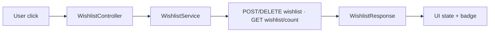
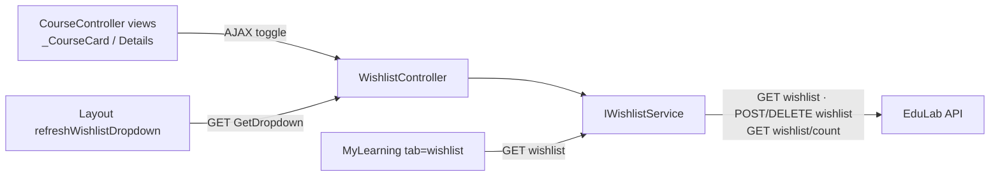

# WishlistController Module Documentation (MVC)

---

## Overview

### Purpose
Manage the authenticated user's saved-courses wishlist: toggle membership, query state, and render the navbar dropdown.

### Business Objective
Let learners bookmark courses for later, with instant UI feedback everywhere (course cards, details page, dropdown badge).

### Main Functionality
- Add / remove course (JSON, from any course card or details page)
- Check membership state (AJAX + server-side view state)
- Navbar dropdown partial with count badge

### Primary User Roles

| Role | Description |
|------|-------------|
| Authenticated (Student/Instructor/Admin) | Full wishlist access |
| Anonymous | No wishlist (button hidden/redirected to login) |

---

## Module Architecture

```
Presentation           Shared/Components/WishlistDropdown/_WishlistDropdown.cshtml (400 lines)
Application            IWishlistService -> WishlistService
External               EduLab API: GET wishlist, GET wishlist/count,
                       POST wishlist/{courseId}, DELETE wishlist/{courseId}
State                  Bearer token via AuthorizedHttpClientService
```

### Controllers

| Controller | Responsibility |
|-----------|----------------|
| `WishlistController` (121 lines) | Toggle, check, dropdown |

### Services

| Service | Responsibility |
|---------|----------------|
| `WishlistService` | `AddToWishlistAsync` (POST `wishlist`), `RemoveFromWishlistAsync` (DELETE `wishlist`), `IsCourseInWishlistAsync` (GET `wishlist/check/{courseId}`), `GetUserWishlistAsync` (GET `wishlist`), `GetWishlistCountAsync` (GET `wishlist/count`) |

### Dependencies on Other Modules
- **Course**: cards + details invoke toggle; `MyLearning` shows the full wishlist (tab=wishlist).
- **Layout**: `refreshWishlistDropdown` syncs the badge.
- **EduLab API** (hard dependency).

---

## Folder Structure

```
Areas/Learner/Controllers/
+-- WishlistController.cs            # 121 lines (namespace EduLab_MVC.Controllers)

Areas/Learner/Views/Shared/Components/WishlistDropdown/
+-- _WishlistDropdown.cshtml         # Navbar dropdown (400 lines)

Models/DTOs/Wishlist/
+-- AddToWishlistRequest.cs          # CourseId
+-- RemoveFromWishlistRequest.cs     # CourseId
+-- WishlistResponse.cs
+-- WishlistItemDto.cs
+-- WishlistCheckResponse.cs
```

---

## Database Design

None (MVC). Wishlist data lives in the API's `WishlistItems` table; the MVC holds no state.

---

## Internal Workflows & Runtime Behavior

### Workflow 1: Toggle from Course Card / Details

#### Purpose
One-click save/unsave with immediate badge sync.

#### Flow Diagram

```mermaid
flowchart TD
    A[Heart button on card / details] --> B{isInWishlist?}
    B -->|no| C[POST Learner/Wishlist/AddToWishlist<br/>{courseId} + antiforgery header]
    B -->|yes| D[POST Learner/Wishlist/RemoveFromWishlist<br/>{courseId} + antiforgery header]
    C --> E[WishlistService.AddToWishlistAsync<br/>POST wishlist + wishlist/count]
    D --> F[WishlistService.RemoveFromWishlistAsync<br/>DELETE wishlist]
    E --> G[WishlistResponse JSON]
    F --> G
    G --> H[UI: toggle heart state, update badge,<br/>refreshWishlistDropdown]
```

#### Runtime Behavior
- `AddToWishlist`/`RemoveFromWishlist` are `[FromBody]` JSON POSTs; the views send an antiforgery header (Details.cshtml:1496-1591).
- Responses are serialized `WishlistResponse` objects (WishlistController.cs:59-60, 83-84).

### Workflow 2: Membership Check

#### Behavior
- `IsCourseInWishlist(courseId)` -> `Json({isInWishlist})` via GET `wishlist/check/{courseId}` (WishlistController.cs:94-99).
- Cards also compute state server-side when authenticated (`_CourseCard.cshtml:75-80`).

### Workflow 3: Dropdown

#### Behavior
- `GetDropdown` -> `PartialView("_WishlistDropdown", wishlist)`; catch -> `Content(string.Empty)` **with no logging** (WishlistController.cs:106-117).

---

## Data Flow Analysis



#### Mapping & Transformations
- Dropdown: first 3 items -> links to `Course/Details?id=`; footer "+N" -> `MyLearning/Index?tab=wishlist` (WishlistDropdown.cshtml:315, 373, 393).
- Old price struck through when `CourseDiscount > 0` (WishlistDropdown.cshtml:353-365).

---

## Controllers & Endpoints

### WishlistController

**Route**: `/Learner/Wishlist` (area convention; namespace quirk `EduLab_MVC.Controllers`)  
**Authorization**: `[Authorize]` (class-level, WishlistController.cs:18)  
**Dependencies**: `IWishlistService` only

| Action | HTTP | Route | Description |
|--------|------|-------|-------------|
| AddToWishlist | POST | `/Learner/Wishlist/AddToWishlist` | Save course (JSON) |
| RemoveFromWishlist | POST | `/Learner/Wishlist/RemoveFromWishlist` | Unsave course (JSON) |
| IsCourseInWishlist | GET | `/Learner/Wishlist/IsCourseInWishlist?courseId` | Membership check |
| GetDropdown | GET | `/Learner/Wishlist/GetDropdown` | Navbar dropdown partial |

**Models**: `AddToWishlistRequest`, `RemoveFromWishlistRequest`, `WishlistResponse`, `WishlistItemDto`, `WishlistCheckResponse`.

---

## Frontend Integration

### Wishlist dropdown (_WishlistDropdown.cshtml, 400 lines)
- First 3 items, "+N" footer -> MyLearning wishlist tab; badge `[data-wishlist-count]`.
- JS consumers (`_CourseCard`, `Details`) call `window.refreshWishlistDropdown` after toggles (defined in `_Layout.cshtml:1399-1411`).

### Client-side toggles
- `toggleWishlist(courseId, btn)` in `_CourseCard.cshtml` and `Details.cshtml`: optimistic UI + POST with antiforgery header + badge sync.
- `checkWishlistStatus` (GET `/Learner/Wishlist/IsCourseInWishlist?courseId`) used by cards on load.

---

## Business Rules

| Rule | Verified in | Why it exists |
|------|-------------|---------------|
| Wishlist requires authentication | class-level `[Authorize]` | Saved courses belong to an account |
| Wishlist is not available to guests | same | Guest session is disposable |
| Toggle is one course per call | DTO shape | Simple, idempotent UI logic |

---

## Security Analysis

| Control | Status |
|---------|--------|
| Authentication | ✅ class-level `[Authorize]` |
| Authorization | User-scoped via token (API) |
| Anti-forgery | ✅ views send antiforgery headers with the POSTs |
| Error handling | ⚠️ `GetDropdown` swallows exceptions silently (empty HTML, no log) |

---

## Module Dependencies



**Internal**: Course views, Layout, MyLearning.
**External**: EduLab API only.

---

## Hidden Behaviors & Technical Notes

1. **Null-reference bug**: `_localizer` is declared but **never injected** (constructor takes only `IWishlistService`, WishlistController.cs:32-35). `AddToWishlist(null)` and `RemoveFromWishlist(null)` dereference `_localizer["InvalidRequest"].Value` -> `NullReferenceException` -> 500 instead of the intended JSON error (WishlistController.cs:52-56, 75-80).
2. **Silent dropdown failure**: `GetDropdown` returns empty HTML without logging on exception.
3. **Namespace quirk**: same as CartController (`EduLab_MVC.Controllers` namespace in a Learner area folder).
4. **No server-side optimistic state**: cards rely on server-rendered state + check endpoint; the API is the source of truth.

---

## Configuration

| Key | Purpose |
|-----|---------|
| `EduLab:ApiBaseUrl` | API base for wishlist calls |

No feature flags or environment variables specific to this module.

---

## Change Log

**Current functionality (verified):** authenticated wishlist with add/remove/check/dropdown, badge sync across cards/details/layout, MyLearning wishlist tab integration.

**Maintenance notes:**
- Fix the `_localizer` injection (or guard null) to turn the 500s into proper JSON errors.
- Add logging to `GetDropdown`'s catch.