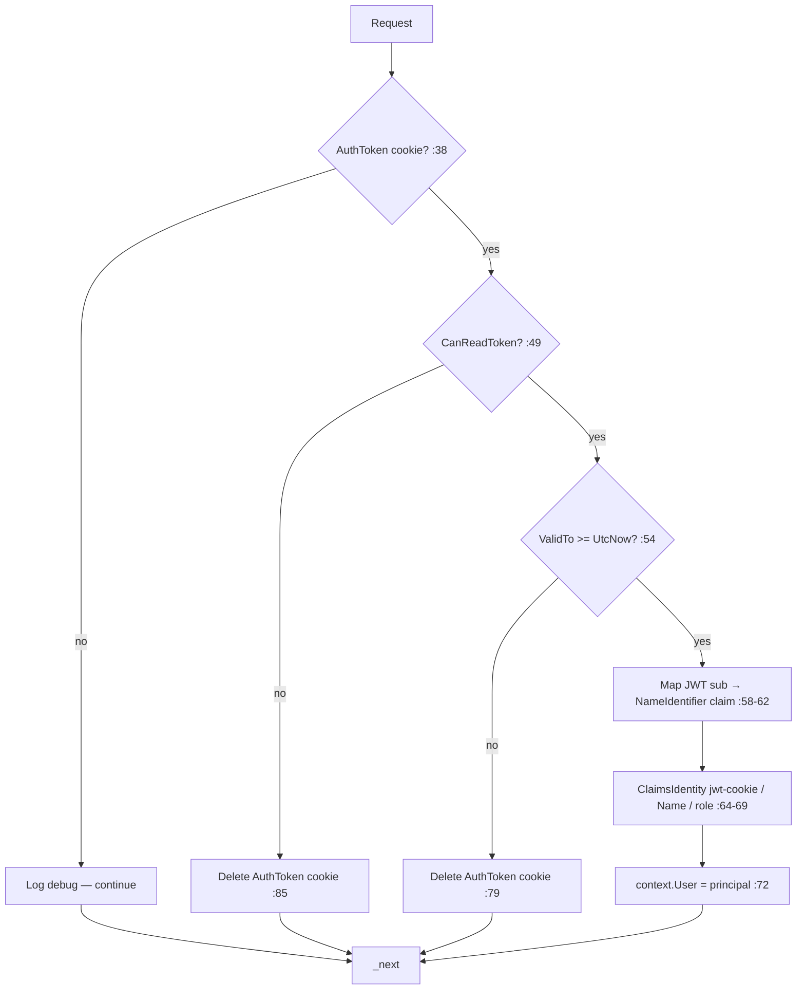
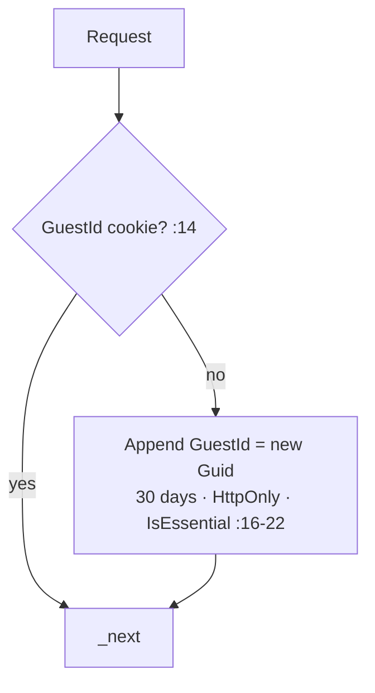
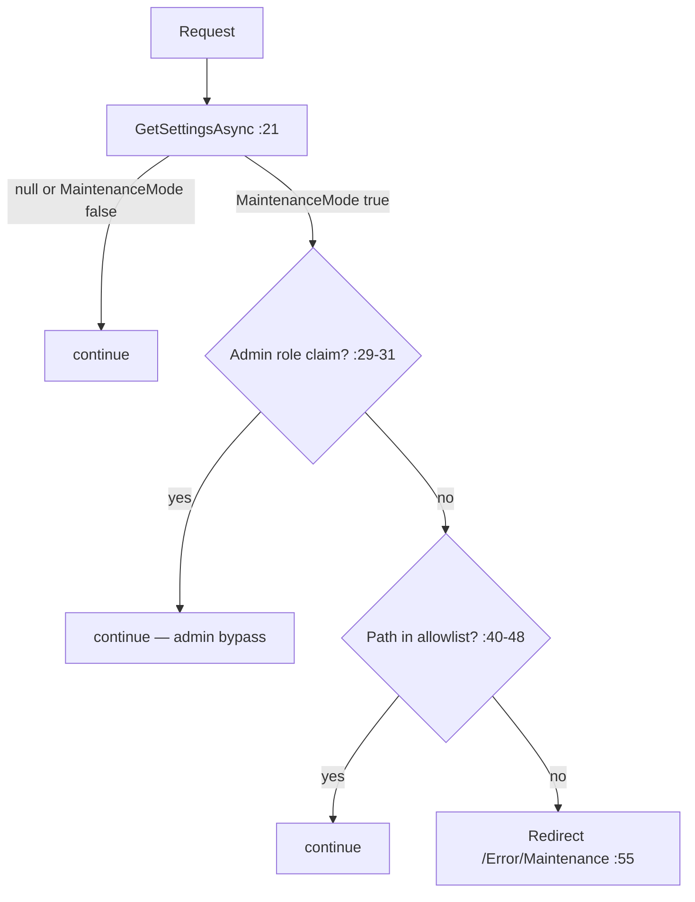

# Middlewares Module Documentation (MVC)

---

## Overview

### Purpose
The MVC request pipeline's four custom middlewares: cookie→principal conversion, guest identity, silent token refresh, and maintenance-mode gating.

### Business Objective
Bridge the cookie-based MVC session to the JWT-based API: authenticate from cookies, keep anonymous carts working, keep sessions alive, and gate the site during maintenance.

### Main Functionality
- `JwtCookieMiddleware` — read `AuthToken` cookie → build the `User` principal
- `GuestIdMiddleware` — ensure a 30-day guest id cookie for anonymous carts
- `TokenRefreshMiddleware` — auto-refresh expired access tokens (+ forced logout on invalid refresh)
- `MaintenanceModeMiddleware` — block non-admins when `MaintenanceMode` is on

---

## Pipeline Position

```
Program.cs:145-148 (registration order)
JwtCookie → GuestId → TokenRefresh → MaintenanceMode → UseAuthentication → UseAuthorization (149-150)
```

All four are **middlewares, not filters** — they run before authentication/authorization and operate on the raw `HttpContext`.

---

## 1. JwtCookieMiddleware (113 lines)

### Behavior



#### Key facts
- Reads the cookie named `AuthToken` (JwtCookieMiddleware.cs:38).
- Uses `JwtSecurityTokenHandler` — **no signature/issuer validation at this layer**; only `ValidTo` expiry is checked (:54). Signature validation happens at the API.
- Maps the JWT registered `sub` claim to `ClaimTypes.NameIdentifier` so MVC code can use `FindFirst(ClaimTypes.NameIdentifier)` (:58-62).
- Claim types: name → `ClaimTypes.Name`, role → literal `"role"` type (:66-68).
- Any parse failure (malformed, invalid format, exceptions) **deletes the `AuthToken` cookie** (:79, :85, :91, :96) and continues the pipeline.
- Never short-circuits — always calls `_next` (:110).

---

## 2. GuestIdMiddleware (28 lines)

### Behavior



#### Key facts
- Only writes the cookie; never reads its value (cart services read it later) (GuestIdMiddleware.cs:14-23).
- **`IsEssential = true`** (:21) — survives cookie-consent gating.
- **No `Secure` flag** — differs from the API's guest-cart cookie which is `Secure=true` (CartService.cs:67-74); over plain HTTP the MVC cookie works but the API's doesn't (dev inconsistency).

---

## 3. TokenRefreshMiddleware (190 lines)

### Behavior

```mermaid
flowchart TD
    A[Request] --> B{AuthToken AND RefreshToken cookies? :42}
    B -->|no| C[continue]
    B -->|yes| D{IsTokenExpired accessToken? :46}
    D -->|no| E[continue]
    D -->|yes| F[RefreshToken access+refresh :58]
    F -->|ok| G[SaveTokensToCookies :62-66]
    G --> H[context.Items[AuthToken] = new token :70]
    H --> I[continue — same-request services use Items]
    F -->|UnauthorizedAccessException| J[LogoutUser :83]
    F -->|other error| K[Log + continue :88-89]
    J --> L[Revoke refresh :129 → clear cookies :175-180<br/>→ clear session :142 → redirect /Learner/Auth/Login :150]
```

#### Key facts
- **`IsTokenExpired`** decides when to refresh (TokenRefreshMiddleware.cs:46); the middleware does not verify expiry itself.
- **Same-request propagation**: the new access token is stored in `context.Items["AuthToken"]` (:70) because the cookie isn't re-read mid-request — services must read `HttpContext.Items` to use the refreshed token (documented in the Arabic comment :68-69).
- **Soft failure**: transient refresh failure (API down) continues without logging out (:76-78).
- **Hard failure**: `UnauthorizedAccessException` (invalid/revoked refresh token) → `LogoutUser` (:80-85):
  - revokes the refresh token (:129),
  - clears 6 auth cookies (`AuthToken`, `RefreshToken`, `RefreshTokenExpiry`, `UserFullName`, `UserRole`, `ProfileImageUrl`) with `Secure` + `SameSite=Strict` + `UnixEpoch` expiry (:163-188),
  - clears the session (:142),
  - redirects to `/Learner/Auth/Login` unless already there (:146-151).
- Never throws outward — outer try/catch continues the pipeline (:102-108).

---

## 4. MaintenanceModeMiddleware (66 lines)

### Behavior



#### Key facts
- Reads settings via `ISiteSettingsService` (the API `admin/settings` surface) (MaintenanceModeMiddleware.cs:21).
- Admin bypass: role claim equals `SD.Admin` **case-insensitively** (:29-31).
- Allowlist (lowercased path prefixes, :40-48): `/learner/auth/`, `/admin`, `/css`, `/js`, `/lib`, `/img`, `/fonts`, `/error/maintenance` — login, the admin area, static assets, and the maintenance page itself stay reachable.
- Everything else → 302 redirect to `/Error/Maintenance` (:55).
- **Settings-loading exceptions are swallowed** (:58-61) — if the API is down, maintenance mode silently deactivates (fail-open).

---

## Cross-Cutting Analysis

| Aspect | Finding (verified) |
|--------|--------------------|
| Ordering | JwtCookie before TokenRefresh — principal is built from the OLD cookie, then the refresh updates the cookie; the current request still uses the old principal (fresh principal only next request) |
| JWT validation depth | MVC checks only expiry; signature/issuer validation is API-side |
| Fail-open design | both TokenRefresh (soft-fail) and MaintenanceMode (exception → continue) degrade open |
| Cookie flags | logout clears with `Secure`+`Strict`; GuestId is `IsEssential` without `Secure`; API guest cookie is `Secure` (dev-HTTP mismatch) |
| Items propagation | refreshed token is only usable via `HttpContext.Items["AuthToken"]` — a documented convention services must follow |

---

## Business Rules

| Rule | Verified in | Why it exists |
|------|-------------|---------------|
| Admin bypasses maintenance | role claim check :29-31 | Platform ops during downtime |
| Login/static/admin always reachable | allowlist :40-48 | Users can still authenticate + assets load |
| Soft-fail refresh | :76-78 | Don't log out on API hiccups |
| Hard-fail logout | :80-85 | Invalid refresh token = real problem |

---

## Security Analysis

| Control | Status |
|---------|--------|
| Token handling | cookie-only; MVC never exposes the JWT in memory beyond Items |
| Maintenance fail-open | ⚠️ API outage disables maintenance (exception → continue, :58-63) |
| JWT expiry-only check | ⚠️ a tampered-but-unexpired token passes MVC and is rejected only at the API |
| Logout hygiene | ✅ revokes refresh + clears 6 cookies + session |
| GuestId | HttpOnly + IsEssential; no Secure (HTTP dev works, but no TLS protection) |

---

## Configuration

| Key | Purpose |
|-----|---------|
| (cookie names) | `AuthToken`, `RefreshToken`, `RefreshTokenExpiry`, `GuestId` (hardcoded in middleware) |

---

## Change Log

**Current functionality (verified):** cookie→principal bridge, guest identity cookie, silent token refresh with hard-fail logout, maintenance-mode gating with admin bypass + allowlist.

**Maintenance notes:**
- Align GuestId `Secure` flag with the API guest cookie.
- Consider full JWT validation in JwtCookieMiddleware (or document that API is the enforcement point).