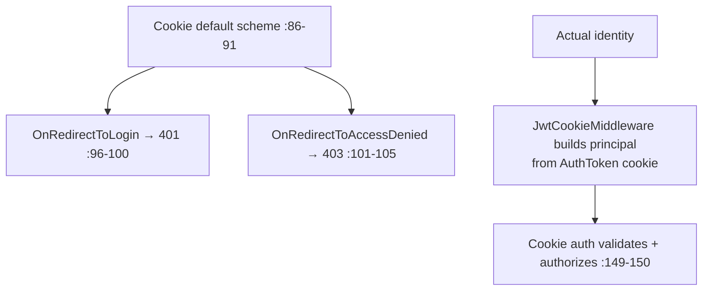

# Program.cs Module Documentation (MVC — Startup & Configuration)

---

## Overview

### Purpose
Startup and configuration for the EduLab_MVC frontend: service registration, authentication scheme, localization, pipeline, and routes.

### Business Objective
Compose the cookie-authenticated MVC app that talks to the EduLab API exclusively via HTTP (no direct DB access).

### Main Functionality
- Mandatory `ApiBaseUrl` configuration
- 26 scoped service registrations (API client services)
- Cookie authentication with JSON-friendly 401/403 redirects
- 20-culture localization (default `ar`)
- Middleware chain (see `Middlewares.md`) + error pages
- Area + default routes (default area = `Learner`)

---

## Configuration Surface

### Required settings

| Key | Purpose | Verified in |
|-----|---------|-------------|
| `ApiBaseUrl` | Base URL of the EduLab API — **app throws if missing** | Program.cs:12-16 |

### Kestrel / form limits

| Setting | Value | Verified in |
|---------|-------|-------------|
| `MaxRequestBodySize` | 524288000 (500MB) | Program.cs:20-23 |
| `MultipartBodyLengthLimit` | 524288000 (500MB) | Program.cs:25-30 |
| `ValueLengthLimit` / `MemoryBufferThreshold` | `int.MaxValue` | Program.cs:28-29 |

---

## Service Registration

### Core MVC

| Service | Notes | Verified in |
|---------|-------|-------------|
| `AddControllersWithViews` | + `AdminAreaAuthorizationConvention` (:32-35) | Program.cs:32 |
| View + DataAnnotations localization | :36-37 | |
| `AdminArea` policy | any claim in `AdminClaims.All` (case-insensitive) | Program.cs:39-44 |
| `HttpClient("EduLabAPI")` | BaseAddress = `ApiBaseUrl` | Program.cs:46-49 |
| `HttpContextAccessor` | :51 | |
| Session | 1h idle · HttpOnly · IsEssential | Program.cs:78-83 |

### Authentication



#### Key facts
- **Default scheme is Cookie** (:89-90) — but the cookie contains no real auth ticket; `JwtCookieMiddleware` manufactures the principal from the API JWT before `UseAuthentication` runs (Program.cs:145-148).
- Redirect events are replaced with raw **401/403 status codes** (:96-105) — AJAX-friendly (no HTML redirect).
- No cookie ticket encryption config here — the `AuthToken` cookie value is the JWT itself.

### Services (26 scoped registrations, Program.cs:52-77)

`IInstructorApplicationService`, `IAuthorizedHttpClientService`, `ICartService`, `IUserSettingsService`, `IProfileService`, `IInstructorService`, `IEnrollmentService`, `IAuthService`, `IRoleService`, `IPaymentService`, `INotificationService`, `IUserService`, `ICategoryService`, `IRatingService`, `IWishlistService`, `ICourseProgressService`, `ICourseService`, `IStudentService`, `IHistoryService`, `ISiteSettingsService`, `ICommentsService`, `IRefundRequestService`, `ICertificateService`, `IReportService`, `IDashboardService`, `ISupportService` — all `AddScoped`, all HTTP wrappers over the API.

---

## Localization

| Aspect | Value | Verified in |
|--------|-------|-------------|
| Cultures | 20 (ar, en, zh, nl, fr, de, hi, id, it, ja, ko, ms, pt, ru, es, vi, tr, uk, ur, pl) | Program.cs:117 |
| Default culture | **`ar`** | Program.cs:120 |
| Providers | QueryString → Cookie → AcceptLanguageHeader | Program.cs:123-128 |

---

## Request Pipeline

```mermaid
flowchart TD
    A[ExceptionHandler /Error/{0} non-dev :133-137] --> B[StatusCodePages /Error/{0} :138]
    B --> C[HttpsRedirection :139]
    C --> D[StaticFiles :140]
    D --> E[Routing :141]
    E --> F[Session :142]
    F --> G[JwtCookie :145]
    G --> H[GuestId :146]
    H --> I[TokenRefresh :147]
    I --> J[MaintenanceMode :148]
    J --> K[Authentication :149]
    K --> L[Authorization :150]
    L --> M[Endpoint execution]
```

#### Key facts
- `UseExceptionHandler("/Error/{0}")` (:135) — the `{0}` placeholder is **not** substituted for exceptions (literal path); unhandled exceptions fall through to status-code handling (see `ErrorController.md`).
- `UseStatusCodePagesWithReExecute("/Error/{0}")` (:138) — substitutes the status code correctly.
- HSTS only outside development (:136).

---

## Routes

| Route | Pattern | Defaults | Verified in |
|-------|---------|----------|-------------|
| `areas` | `{area:exists}/{controller}/{action}/{id?}` | controller=Home, action=Index | Program.cs:152-154 |
| `default` | `{controller}/{action}/{id?}` | **area=Learner**, controller=Home, action=Index | Program.cs:156-159 |

#### Key facts
- The default route pins `area = Learner` — bare URLs land in the Learner area.
- All three areas (`Learner`, `Instructor`, `Admin`) are reachable via the areas route.

---

## Business Rules

| Rule | Verified in | Why it exists |
|------|-------------|---------------|
| `ApiBaseUrl` mandatory | Program.cs:12-16 | App is a pure API client |
| Default culture Arabic | Program.cs:120 | Target market |
| 401/403 instead of redirects | Program.cs:96-105 | AJAX consistency |
| 500MB limits | Program.cs:22, :27 | Large lecture videos/uploads |

---

## Security Analysis

| Control | Status |
|---------|--------|
| AdminArea policy | any single admin claim (Program.cs:39-44) — broad by design |
| Cookie auth + JWT bridge | principal built by middleware; cookie scheme validates claims |
| No HTTPS enforcement in dev | HSTS non-dev only (:136); HttpsRedirection always (:139) |
| Secrets | `ApiBaseUrl` only — no API secrets in the MVC app |

---

## Configuration

| Key | Purpose |
|-----|---------|
| `ApiBaseUrl` | Required — API base (appsettings.json:12) |

---

## Change Log

**Current functionality (verified):** full startup composition — 26 scoped API-client services, cookie auth with 401/403 events, 20-culture Arabic-default localization, the 4-middleware chain, area+Learner-default routes.

**Maintenance notes:**
- Fix the exception-handler path (see ErrorController.md finding).