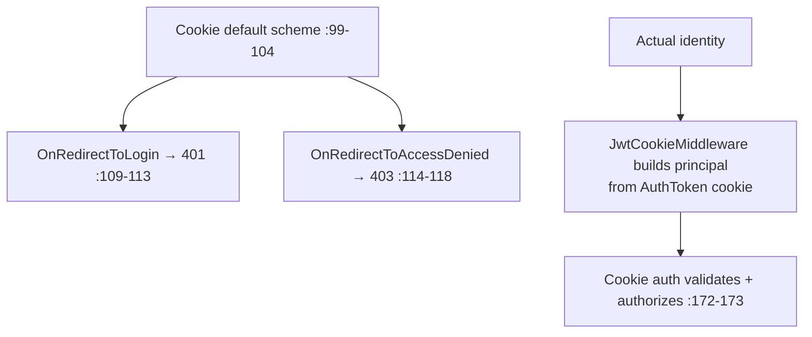

# Program.cs Module Documentation (MVC — Startup & Configuration)

---

## Overview

### Purpose
Startup and configuration for the EduLab_MVC frontend: service registration, authentication scheme, localization, pipeline, and routes.

### Business Objective
Compose the cookie-authenticated MVC app that talks to the EduLab API exclusively via HTTP (no direct DB access).

### Main Functionality
- Mandatory `ApiBaseUrl` configuration
- `AddMemoryCache()` + Brotli/Gzip response compression (`EnableForHttps = true`)
- `HttpClient("EduLabAPI")` with 15-second timeout and `AutomaticDecompression = DecompressionMethods.All`
- 26 scoped service registrations (API client services)
- Cookie authentication with JSON-friendly 401/403 redirects
- 20-culture localization (default `ar`)
- 7-day static-file `Cache-Control` + 4-middleware chain (see `Middlewares.md`) + error pages
- Area + default routes (default area = `Learner`)

---

## Configuration Surface

### Required settings

| Key | Purpose | Verified in |
|-----|---------|-------------|
| `ApiBaseUrl` | Base URL of the EduLab API — **app throws if missing** | Program.cs:13-17 |

### Kestrel / form limits

| Setting | Value | Verified in |
|---------|-------|-------------|
| `MaxRequestBodySize` | 524288000 (500MB) | Program.cs:27-30 |
| `MultipartBodyLengthLimit` | 524288000 (500MB) | Program.cs:32-37 |
| `ValueLengthLimit` / `MemoryBufferThreshold` | `int.MaxValue` | Program.cs:35-36 |

---

## Service Registration

### Core MVC & HTTP Pipeline

| Service | Notes | Verified in |
|---------|-------|-------------|
| `AddMemoryCache` | Shared `IMemoryCache` for `SiteSettingsService` (60m), `CategoryService` (15m), `CourseService` (10m), `InstructorService` (10m), `UserService` (10m) | Program.cs:19 |
| `AddResponseCompression` | `EnableForHttps = true`; `BrotliCompressionProvider` + `GzipCompressionProvider` | Program.cs:20-25 |
| `AddControllersWithViews` | + `AdminAreaAuthorizationConvention` (:39-42) | Program.cs:39 |
| View + DataAnnotations localization | :43-44 | |
| `AdminArea` policy | any claim in `AdminClaims.All` (case-insensitive) | Program.cs:46-51 |
| `HttpClient("EduLabAPI")` | `BaseAddress = ApiBaseUrl`, **`Timeout = TimeSpan.FromSeconds(15)`** (:57), **`AutomaticDecompression = DecompressionMethods.All`** (:59-62) | Program.cs:53-62 |
| `HttpContextAccessor` | :64 | |
| Session | 1h idle · HttpOnly · IsEssential | Program.cs:91-96 |

### Authentication

```mermaid
flowchart TD
    A[Cookie default scheme :99-104] --> B[OnRedirectToLogin → 401 :109-113]
    A --> C[OnRedirectToAccessDenied → 403 :114-118]
    D[Actual identity] --> E[JwtCookieMiddleware builds principal<br/>from AuthToken cookie]
    E --> F[Cookie auth validates + authorizes :172-173]
```

#### Key facts
- **Default scheme is Cookie** (:102-103) — but the cookie contains no real auth ticket; `JwtCookieMiddleware` manufactures the principal from the API JWT before `UseAuthentication` runs (Program.cs:168-171).
- Redirect events are replaced with raw **401/403 status codes** (:109-118) — AJAX-friendly (no HTML redirect).
- No cookie ticket encryption config here — the `AuthToken` cookie value is the JWT itself.

### Services (26 scoped registrations, Program.cs:65-90)

`IInstructorApplicationService`, `IAuthorizedHttpClientService`, `ICartService`, `IUserSettingsService`, `IProfileService`, `IInstructorService`, `IEnrollmentService`, `IAuthService`, `IRoleService`, `IPaymentService`, `INotificationService`, `IUserService`, `ICategoryService`, `IRatingService`, `IWishlistService`, `ICourseProgressService`, `ICourseService`, `IStudentService`, `IHistoryService`, `ISiteSettingsService`, `ICommentsService`, `IRefundRequestService`, `ICertificateService`, `IReportService`, `IDashboardService`, `ISupportService` — all `AddScoped`, all HTTP wrappers over the API.

---

## Localization

| Aspect | Value | Verified in |
|--------|-------|-------------|
| Cultures | 20 (ar, en, zh, nl, fr, de, hi, id, it, ja, ko, ms, pt, ru, es, vi, tr, uk, ur, pl) | Program.cs:130 |
| Default culture | **`ar`** | Program.cs:133 |
| Providers | QueryString → Cookie → AcceptLanguageHeader | Program.cs:136-141 |

---

## Request Pipeline

```mermaid
flowchart TD
    A[ExceptionHandler /Error/{0} + HSTS non-dev :146-150] --> B[StatusCodePages /Error/{0} :151]
    B --> C[HttpsRedirection :152]
    C --> C2[ResponseCompression non-dev :153-156]
    C2 --> D[StaticFiles + 7-day Cache-Control :157-163]
    D --> E[Routing :164]
    E --> F[Session :165]
    F --> G[JwtCookie :168]
    G --> H[GuestId :169]
    H --> I[TokenRefresh :170]
    I --> J[MaintenanceMode :171]
    J --> K[Authentication :172]
    K --> L[Authorization :173]
    L --> M[Endpoint execution :175-182]
```

#### Key facts
- `UseExceptionHandler("/Error/{0}")` (:148) — the `{0}` placeholder is **not** substituted for exceptions (literal path); unhandled exceptions fall through to status-code handling (see `ErrorController.md`).
- `UseStatusCodePagesWithReExecute("/Error/{0}")` (:151) — substitutes the status code correctly.
- HSTS and `UseResponseCompression()` are enabled outside development (:149, :153-156) to avoid conflicting with the BrowserLink dev proxy.
- `UseStaticFiles` (:157-163) sets `Cache-Control: public,max-age=604800` (7 days) in `OnPrepareResponse` (:159-162).

---

## Routes

| Route | Pattern | Defaults | Verified in |
|-------|---------|----------|-------------|
| `areas` | `{area:exists}/{controller}/{action}/{id?}` | controller=Home, action=Index | Program.cs:175-177 |
| `default` | `{controller}/{action}/{id?}` | **area=Learner**, controller=Home, action=Index | Program.cs:179-182 |

#### Key facts
- The default route pins `area = Learner` — bare URLs land in the Learner area.
- All three areas (`Learner`, `Instructor`, `Admin`) are reachable via the areas route.

---

## Business Rules

| Rule | Verified in | Why it exists |
|------|-------------|---------------|
| `ApiBaseUrl` mandatory | Program.cs:13-17 | App is a pure API client |
| 15s `HttpClient` timeout + `DecompressionMethods.All` | Program.cs:57-62 | Prevent hung backend calls and transparently decompress Brotli/Gzip API responses |
| 7-day static-file `Cache-Control` | Program.cs:157-163 | Browser caching for CSS, JS, fonts, and images |
| Default culture Arabic | Program.cs:133 | Target market |
| 401/403 instead of redirects | Program.cs:109-118 | AJAX consistency |
| 500MB limits | Program.cs:29, :34 | Large lecture videos/uploads |

---

## Security Analysis

| Control | Status |
|---------|--------|
| AdminArea policy | any single admin claim (Program.cs:46-51) — broad by design |
| Cookie auth + JWT bridge | principal built by middleware; cookie scheme validates claims |
| No HTTPS enforcement in dev | HSTS non-dev only (:149); HttpsRedirection always (:152) |
| Secrets | `ApiBaseUrl` only — no API secrets in the MVC app |

---

## Configuration

| Key | Purpose |
|-----|---------|
| `ApiBaseUrl` | Required — API base (appsettings.json:12) |

---

## Change Log

**Current functionality (verified):** full startup composition — `AddMemoryCache`, Brotli/Gzip response compression, 15s `HttpClient` with `DecompressionMethods.All`, 7-day static-file `Cache-Control`, 26 scoped API-client services, cookie auth with 401/403 events, 20-culture Arabic-default localization, the 4-middleware chain, area+Learner-default routes.

**Maintenance notes:**
- Fix the exception-handler path (see ErrorController.md finding).