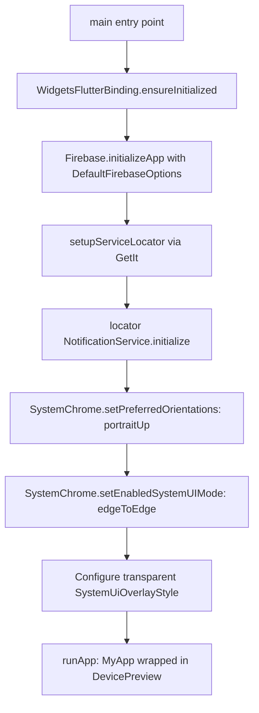
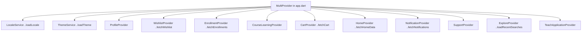

# Mobile Architecture & Engineering Guide (Flutter)

---

## Overview

### Purpose
Comprehensive engineering and architectural specification for the EduLab Flutter mobile client (`apps/mobile`), targeting iOS and Android (with experimental desktop and web builds) powered by Dart SDK `^3.11.0`.

### Core Architectural Philosophy
The application follows a **Feature-First Clean Architecture** with unidirectional data flow:
1. **Presentation Layer:** Widgets, Screens, and `ChangeNotifier` Providers.
2. **Data Layer:** Models (immutable DTOs with JSON serialization), API Services (HTTP calls via `ApiClient`), and Repositories (business logic orchestration & error wrapping).
3. **Core Layer:** Cross-cutting concerns including networking, authentication caching, theming, localization, and dependency injection.

---

## Technology Stack & Dependencies

| Layer | Package | Version | Architectural Responsibility |
|---|---|---|---|
| **Core UI** | `flutter` | SDK | Framework runtime and Material 3 design system |
| **State Management** | `provider` | `^6.1.5+1` | Reactive state binding via `MultiProvider` and `Consumer` |
| **Dependency Injection** | `get_it` | `^8.0.3` | Decoupled service locator for singleton services (`locator<T>()`) |
| **Networking** | `dio` | `^5.11.0` | HTTP engine, Bearer auth interceptor, timeouts, custom logger |
| | `http` | `^1.2.0` | Lightweight multipart requests and legacy integrations |
| **Local Cache** | `shared_preferences` | `^2.5.5` | Non-volatile key-value storage for tokens and user preferences |
| **Push Notifications** | `firebase_core` | `^4.14.0` | Firebase project bootstrap |
| | `firebase_messaging` | `^16.6.0` | FCM device token sync, background isolate handler, push delivery |
| | `flutter_local_notifications` | `^22.3.0` | Android notification channel (`education_lab_channel`), foreground heads-up |
| **Real-Time WebSockets** | `signalr_netcore` | `^1.4.4` | Two-way WebSocket connection to `/hubs/support` for live chat |
| **Video Playback** | `video_player` | `^2.9.2` | High-performance video decoding for lecture player & trailer preview |
| **Audio Effects** | `audioplayers` | `^6.1.2` | Success chimes, interaction sounds from `assets/sounds/` |
| **Images & Media** | `cached_network_image` | `^3.4.1` | Remote image disk caching, memory deduplication, shimmer placeholders |
| | `image_picker` | `^1.1.2` | Native camera & gallery image capture for user avatar and CV files |
| **Navigation Chrome** | `flutter_floating_bottom_bar` | `^2.1.0` | Floating animated bottom bar for `MainNavigationScreen` |
| **Authentication** | `google_sign_in` | `^6.3.0` | Native Google OAuth SDK for mobile ID token exchange |
| **Localization** | `flutter_localizations` | SDK | RTL/LTR bidirectional support, dynamic localization delegates |
| | `intl` | `0.20.2` | Date, currency, and pluralization formatting |
| **Inspection** | `device_preview` | `^1.2.0` | Runtime responsive testing across screen form factors |

---

## Application Bootstrap & Lifecycle (`main.dart`)

### Bootstrap Mechanics (main.dart:10-49)
1. **Binding Initialization:** Ensures the Flutter engine is fully attached before asynchronous platform channels are called.
2. **Firebase Setup:** Platform-specific credentials loaded from `firebase_options.dart`. Catches exceptions gracefully if credentials are not configured in dev environments.
3. **Service Locator:** Registers lazy singletons in `GetIt`.
4. **Notification Pre-warming:** Creates the Android notification channel and sets up the background message handler.
5. **System Chrome:** Locks orientation to `DeviceOrientation.portraitUp` and establishes an edge-to-edge transparent system navigation bar.

---

## Root State Provider Tree (`app.dart`)

All root-level state providers are declared in `MultiProvider` at the top of `MyApp` (`app.dart:54-68`), ensuring single-instance lifetime across navigation:

### Eager vs Lazy Initialization
- **Eager Providers (Cascade Operator `..`):**
  - `LocaleService`: Loads saved language from disk immediately before first frame.
  - `ThemeService`: Loads saved theme mode (Light/Dark/System) immediately.
  - `WishlistProvider`, `EnrollmentProvider`, `CartProvider`, `HomeProvider`, `NotificationProvider`, `ExploreProvider`: Eagerly trigger initial network requests to populate the UI without flashing empty states.
- **Lazy Providers:** `CourseLearningProvider`, `SupportProvider`, and `TeachApplicationProvider` remain dormant until the user navigates into their respective sub-flows.

---

## Theming & Typography System

### Color Palette (`lib/core/theme/app_colors.dart`)

| Semantic Token | Light Mode Hex | Dark Mode Hex | Usage |
|---|---|---|---|
| **Primary** | `#1D61E7` | `#1D61E7` | Brand actions, active tab indicators, primary buttons |
| **Primary Dark** | `#134BB8` | `#134BB8` | Button pressed states, gradient stops |
| **Primary Light** | `#EFF4FF` | `#1F2937` | Badge backgrounds, highlighted container tint |
| **Accent** | `#3B82F6` | `#3B82F6` | Links, secondary buttons, tags |
| **Background** | `#F8FAFC` | `#0B0F19` | Scaffold canvas background |
| **Surface** | `#FFFFFF` | `#161E2E` | Cards, app bars, dialogs, bottom sheets |
| **Surface Muted** | `#F1F5F9` | `#1F2937` | Input field fills, table headers |
| **Card Fill** | `#FFFFFF` | `#182234` | Course cards, instructor cards |
| **Text Primary** | `#0F172A` | `#F8FAFC` | Main headings, body text |
| **Text Secondary** | `#64748B` | `#94A3B8` | Subtitles, timestamps, metadata |
| **Text Muted** | `#94A3B8` | `#64748B` | Disabled hints, placeholder text |
| **Border / Divider** | `#E2E8F0` / `#F1F5F9` | `#263348` / `#1E293B` | Card outlines, row dividers |
| **Success** | `#10B981` (Light: `#ECFDF5`) | `#10B981` | Completed badges, active status |
| **Warning** | `#F59E0B` (Light: `#FEF3C7`) | `#F59E0B` | Pending status, star ratings |
| **Error** | `#EF4444` (Light: `#FEE2E2`) | `#EF4444` | Form errors, delete actions |

### Typography & Fonts (`pubspec.yaml:53-72`)
- **Arabic Typography:** **Tajawal** (Weights: `300 Light`, `400 Regular`, `500 Medium`, `700 Bold`).
- **English Typography:** **Inter** (Weights: `400 Regular`, `500 Medium`, `700 Bold`).
- **Dynamic Font Resolution:** The theme automatically applies `Tajawal` as the default family when Arabic locale is selected, ensuring optimal baseline alignment and Arabic ligature rendering.

### Platform Transitions
`AppTheme.lightTheme` and `darkTheme` enforce `CupertinoPageTransitionsBuilder` across Android and iOS (`app_theme.dart:21-27`), delivering a unified, smooth iOS-style swipe-back experience on all devices.

---

## Localization & RTL Architecture

1. **Configuration (`l10n.yaml`):** Configures code generation from ARB files located in `lib/l10n/`.
2. **Supported Locales:**
   - Arabic: `Locale('ar', 'SA')` (RTL, default language).
   - English: `Locale('en', 'US')` (LTR).
3. **LocaleService (`core/services/locale_service.dart`):**
   - Reads `app_language` from `SharedPreferences`.
   - Emits change events to re-render the widget tree with matching `Directionality`.
   - Fires an asynchronous background sync to `PUT api/User/preferred-language` to keep backend email notifications aligned with the mobile app's selected language.

---

## Declarative Named Routes Table (`app.dart:91-130`)

The app uses named routes with strongly-typed arguments:

| Route Path | Target Screen Widget | Required Arguments / Type | Authorization Policy |
|---|---|---|---|
| `/splash` | `SplashScreen` | `none` | 🔓 Public |
| `/` | `OnboardingScreen` | `none` | 🔓 Public |
| `/login` | `LoginScreen` | `none` | 🔓 Public |
| `/main` | `MainNavigationScreen` | `none` (accepts initial tab index) | 🔓 / 🔐 Hybrid |
| `/cart` | `CartScreen` | `none` | 🔓 Public |
| `/checkout` | `CheckoutScreen` | `none` | 🔐 Requires Login |
| `/notifications` | `NotificationsScreen` | `none` | 🔐 Requires Login |
| `/messages` | `MessagesScreen` | `none` | 🔐 Requires Login |
| `/settings` | `SettingsScreen` | `none` | 🔓 Public |
| `/profile` | `ProfileScreen` | `none` | 🔐 Requires Login |
| `/edit-profile` | `EditProfileScreen` | `UserProfileModel` | 🔐 Requires Login |
| `/account-security` | `AccountSecurityScreen`| `none` | 🔐 Requires Login |
| `/purchase-history` | `PurchaseHistoryScreen`| `none` | 🔐 Requires Login |
| `/teach-apply` | `TeachApplicationScreen`| `none` | 🔐 Requires Login |
| `/explore` | `ExploreScreen` | `int? initialCategoryId` | 🔓 Public |
| `/wishlist` | `WishlistScreen` | `none` | 🔐 Requires Login |
| `/my-courses` | `LearningScreen(showTabs: false)` | `none` | 🔐 Requires Login |
| `/learning` | `LearningScreen(showTabs: true)` | `none` | 🔐 Requires Login |
| `/course-details` | `CourseDetailsScreen` | `int courseId` or `Map courseData` | 🔓 Public |
| `/lesson-player` | `LessonPlayerScreen` | `int courseId, int? initialLectureId` | 🔐 Requires Enrollment |
| `/assignments` | `AssignmentsScreen` | `int courseId` | 🔐 Requires Enrollment |
| `/schedule` | `ScheduleScreen` | `int courseId` | 🔐 Requires Enrollment |
| `/certificates` | `MyCertificatesScreen` | `none` | 🔐 Requires Login |
| `/certificate-detail`| `CertificateViewScreen` | `CertificateModel certificate` | 🔐 Requires Login |
| `/instructors` | `InstructorsScreen` | `none` | 🔓 Public |
| `/instructor-profile`| `InstructorProfileScreen`| `int instructorId` | 🔓 Public |
| `/legal` | `LegalContentScreen` | `LegalTab? initialTab` | 🔓 Public |
| `/about` | `LegalContentScreen(initialTab: LegalTab.about)` | `none` | 🔓 Public |
| `/privacy` | `LegalContentScreen(initialTab: LegalTab.privacy)` | `none` | 🔓 Public |
| `/terms` | `LegalContentScreen(initialTab: LegalTab.terms)` | `none` | 🔓 Public |
