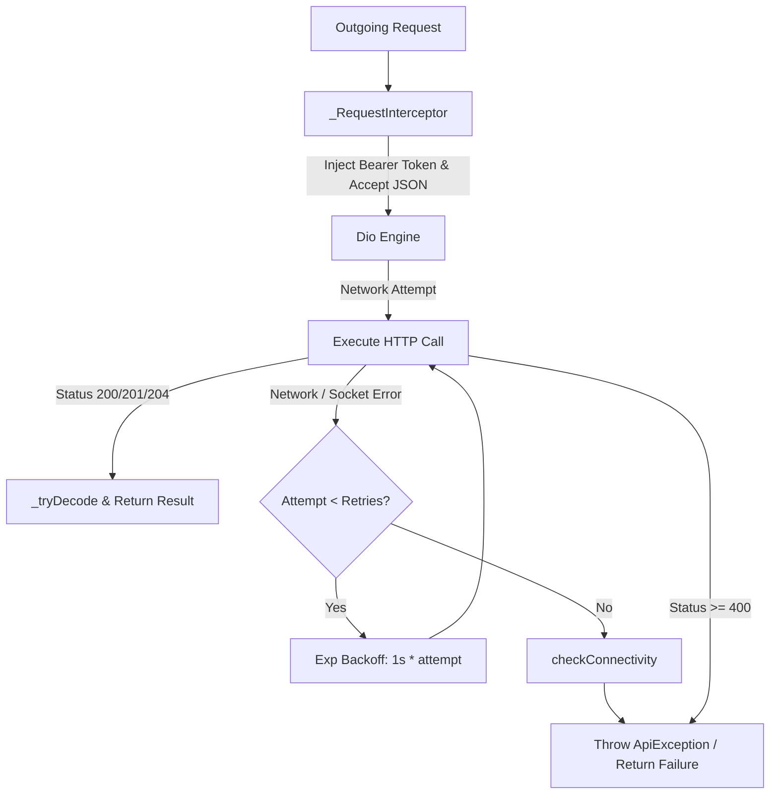
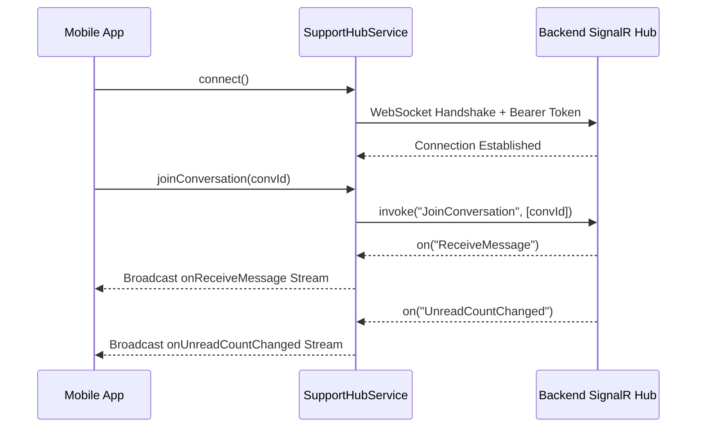

# Mobile Core Services Architecture & Reference

> **Directory:** `apps/mobile/lib/core/services/` & `apps/mobile/lib/features/inbox/data/services/`  
> **Target Framework:** Flutter 3.x / Dart 3.11  
> **Key Dependencies:** `dio: ^5.7.0`, `signalr_netcore: ^1.4.2`, `firebase_messaging: ^15.1.4`, `flutter_local_notifications: ^17.2.3`, `shared_preferences: ^2.3.2`, `google_sign_in: ^6.2.1`, `audioplayers: ^6.0.0`

This document provides a comprehensive technical reference for the core infrastructure and background networking services supporting the EducationLab Flutter mobile client.

---

## 1. Core Network Layer: `ApiClient`

**File:** [`apps/mobile/lib/core/services/api_client.dart`](file:///d:/Programming/MonoRepo%20Porjects/EducationLab/apps/mobile/lib/core/services/api_client.dart)

`ApiClient` is a singleton HTTP client wrapper around `dio.Dio`, engineered for high network resilience, automated token injection, unified error parsing, and safe response unboxing.



### 1.1 Architectural Specifications
- **Base URL:** Defined via `ApiConstants.baseUrl` (`https://edulabapi.runasp.net/api/`).
- **Default Timeouts:** `connectTimeout: 30s`, `receiveTimeout: 30s`, `sendTimeout: 30s`.
- **Automatic Retry Policy:** Default of 2 retries with linear backoff (`Future.delayed(Duration(seconds: 1 * (attempt + 1)))`). Retries trigger specifically on transport/socket failures (`SocketException`, `Failed host lookup`, `Connection closed`, `HandshakeException`, etc.).
- **Global Network State:** `ValueNotifier<NetworkStatus> networkStatus` tracks `NetworkStatus.connected`, `NetworkStatus.networkError`, and `NetworkStatus.serverError`.

### 1.2 Result Pattern & Safe Unboxing
The client exposes functional sealed classes for exception-free consumption across ViewModels and Repositories:
```dart
sealed class Result<T> { const Result(); }
class Success<T> extends Result<T> { final T data; const Success(this.data); }
class Failure<T> extends Result<T> { final String message; final Object? error; const Failure(this.message, {this.error}); }
```

### 1.3 Method Catalog
| Method | Signature | Description |
| :--- | :--- | :--- |
| `get` | `Future<dynamic> get(String url, {queryParameters, headers, retries, timeout})` | Direct HTTP GET returning decoded JSON or throwing `ApiException`. |
| `getSafe` | `Future<Result<dynamic>> getSafe(...)` | Functional wrapper returning `Success` or `Failure`. |
| `post` | `Future<dynamic> post(String url, {body, headers, retries, timeout})` | Direct HTTP POST with JSON content type. |
| `postSafe` | `Future<Result<dynamic>> postSafe(...)` | Functional POST wrapper returning `Success` or `Failure`. |
| `postFormDataSafe` | `Future<Result<dynamic>> postFormDataSafe(String url, {required FormData formData, ...})` | Multipart file upload client used for avatar and CV uploads. |
| `put` / `putSafe` | `Future<dynamic> put(...)` / `Future<Result<dynamic>> putSafe(...)` | PUT updates (e.g. user profiles, notification toggles). |
| `delete` / `deleteSafe`| `Future<dynamic> delete(...)` / `Future<Result<dynamic>> deleteSafe(...)` | DELETE requests (e.g. cart items, wishlist removal). |
| `checkConnectivity` | `Future<NetworkStatus> checkConnectivity()` | Pings `ApiConstants.publicStats` (5s timeout) to verify server responsiveness. |

### 1.4 Request Interceptor
[`_RequestInterceptor`](file:///d:/Programming/MonoRepo%20Porjects/EducationLab/apps/mobile/lib/core/services/api_client.dart#L453-L468) intercepts every outgoing request:
1. Injects `Accept: application/json`.
2. Checks `AuthStorageService.getAccessToken()`. If available and no explicit `Authorization` header exists, attaches `Authorization: Bearer <token>`.

---

## 2. Authentication Storage: `AuthStorageService`

**File:** [`apps/mobile/lib/core/services/auth_storage_service.dart`](file:///d:/Programming/MonoRepo%20Porjects/EducationLab/apps/mobile/lib/core/services/auth_storage_service.dart)

`AuthStorageService` provides thread-safe local persistence for session credentials using `shared_preferences`.

### 2.1 Storage Key Registry
| Key Constant | Storage Type | Payload Description |
| :--- | :--- | :--- |
| `_userKey` (`user_info`) | String (JSON) | Serialized user identity payload (`id`, `fullName`, `email`, `roles`). |
| `_accessTokenKey` (`access_token`) | String | JWT access token bearer header. |
| `_refreshTokenKey` (`refresh_token`) | String | Cryptographic refresh token string. |
| `_isLoggedInKey` (`is_logged_in`) | Boolean | Fast synchronous flag verifying active authentication. |

### 2.2 Core Methods
- `saveAuth({required accessToken, required refreshToken, required user})`: Atomic batch write committing all session attributes.
- `saveTokens({required accessToken, required refreshToken})`: Updates rotated tokens without touching stored user profile.
- `getAccessToken()` / `getRefreshToken()`: Reads stored JWT and refresh tokens.
- `getUser()`: Deserializes the JSON profile dictionary into `Map<String, dynamic>`.
- `isLoggedIn()`: Returns `true` if active session exists.
- `logout()`: Clears `_userKey`, `_accessTokenKey`, `_refreshTokenKey`, and resets `_isLoggedInKey` to `false`.
- Profile shortcuts: `getUserId()`, `getUserName()`, `getUserEmail()`.

---

## 3. Push & Local Notifications: `NotificationService`

**File:** [`apps/mobile/lib/core/services/notification_service.dart`](file:///d:/Programming/MonoRepo%20Porjects/EducationLab/apps/mobile/lib/core/services/notification_service.dart)

Integrates Google Firebase Cloud Messaging (FCM) and `flutter_local_notifications` for both foreground and background push notification delivery.

### 3.1 Background Message Isolate
```dart
@pragma('vm:entry-point')
Future<void> firebaseMessagingBackgroundHandler(RemoteMessage message) async {
  await Firebase.initializeApp(options: DefaultFirebaseOptions.currentPlatform);
  debugPrint('[NotificationService] Background message received: ${message.messageId}');
}
```
Registered via `FirebaseMessaging.onBackgroundMessage` to handle notifications when the app is suspended or terminated.

### 3.2 Android Notification Channel Configuration
- **Channel ID:** `education_lab_channel`
- **Channel Name:** `Education Lab Notifications`
- **Description:** `Notifications for Education Lab updates and alerts`
- **Importance:** `Importance.max` (heads-up banner and sound enabled)
- **Small Icon:** `@mipmap/ic_launcher`

### 3.3 Lifecycle & Token Synchronization
1. **`initialize({onNotificationResponse})`**:
   - Boots Firebase Core with platform options.
   - Sets up iOS Darwin alert/badge/sound permissions and Android launcher icons.
   - Creates the notification channel via `AndroidFlutterLocalNotificationsPlugin`.
   - Subscribes to `FirebaseMessaging.onMessage` for foreground display via `_notificationsPlugin.show(...)`.
   - Subscribes to `FirebaseMessaging.instance.onTokenRefresh` to automatically propagate rotated tokens to the backend.
2. **`syncDeviceTokenWithServer()`**:
   - Queries `AuthStorageService.isLoggedIn()`.
   - Resolves FCM device token (handles APNs token delay on iOS physical hardware with 3 retries).
   - Issues a POST request to `/api/Notifications/device-token` with `{ "deviceToken": token }`.
3. **`requestTestPushNotification()`**:
   - Calls `/api/Notifications/test-push` to trigger a loopback push verification notification.

---

## 4. Real-Time Support Hub: `SupportHubService`

**File:** [`apps/mobile/lib/features/inbox/data/services/support_hub_service.dart`](file:///d:/Programming/MonoRepo%20Porjects/EducationLab/apps/mobile/lib/features/inbox/data/services/support_hub_service.dart)

Manages real-time bidirectional WebSocket communication with the backend ASP.NET Core SignalR hub (`/hubs/support`).

### 4.1 Hub Connection Life-Cycle
- **Hub Endpoint:** `ApiConstants.supportHubUrl` (`https://edulabapi.runasp.net/hubs/support`).
- **Authentication:** `HttpConnectionOptions(accessTokenFactory: () => AuthStorageService.getAccessToken())`.
- **Auto Reconnect:** Enabled via `.withAutomaticReconnect()`.



### 4.2 SignalR Client Event Subscriptions
| Event Name | Parameter Type | Action Taken |
| :--- | :--- | :--- |
| `ReceiveMessage` | `Map<String, dynamic>` | Parses into `SupportMessageModel` and emits to `onReceiveMessage` broadcast stream. |
| `UnreadCountChanged` | `int` | Emits updated badge counter to `onUnreadCountChanged` broadcast stream. |
| `ConversationsChanged` | `void` | Signals conversation list invalidation to `onConversationsChanged` stream. |
| `onclose` / `onreconnecting` / `onreconnected` | `HubConnectionState` | Emits current connection state to `onConnectionStateChanged`. |

### 4.3 Client Invocations
- `joinConversation(int conversationId)`: Invokes server method `JoinConversation` to subscribe to room `conv-{conversationId}`.
- `leaveConversation(int conversationId)`: Invokes server method `LeaveConversation` when exiting the chat screen.
- `disconnect()`: Stops connection and cleans up WebSocket sockets.

---

## 5. Stripe Payments: `StripeService`

**File:** [`apps/mobile/lib/core/services/stripe_service.dart`](file:///d:/Programming/MonoRepo%20Porjects/EducationLab/apps/mobile/lib/core/services/stripe_service.dart)

Enables client-side Stripe tokenization and 2-step PaymentIntent confirmation without heavy binary dependencies.

### 5.1 Two-Step Payment Workflow
1. **Create PaymentMethod (`createPaymentMethod`)**:
   - Posts card data (`number`, `exp_month`, `exp_year`, `cvc`) and billing details directly to `https://api.stripe.com/v1/payment_methods` with publishable key `ApiConstants.stripePublishableKey`.
   - **Test Mode Fallback:** If client-side tokenization is restricted on test accounts (`pk_test_...`), automatically resolves official Stripe test PaymentMethod tokens (`pm_card_visa`, `pm_card_mastercard`, `pm_card_amex`, `pm_card_discover`, `pm_card_chargeCustomerFail`) based on the card prefix.
2. **Confirm PaymentIntent (`confirmPaymentIntent`)**:
   - Posts `payment_method` and `client_secret` to `https://api.stripe.com/v1/payment_intents/{id}/confirm`.
   - Returns `StripeResult.success(status: 'succeeded')` or human-readable Arabic localized errors for declined cards, insufficient funds, or expired cards.

---

## 6. Google Sign-In: `GoogleAuthService`

**File:** [`apps/mobile/lib/core/services/google_auth_service.dart`](file:///d:/Programming/MonoRepo%20Porjects/EducationLab/apps/mobile/lib/core/services/google_auth_service.dart)

Wraps `google_sign_in` for federated OAuth2 authentication.

### 6.1 OAuth Client Identifiers
- **Android / Server Client ID:** `114806076172-tqtrrqupp076ilo8j3hgpb8jhggju8fv.apps.googleusercontent.com`
- **iOS Client ID:** `114806076172-be913jqrvsnprd7ei3nk61lpfc41aia3.apps.googleusercontent.com`
- **Scopes:** `['email', 'profile']`

### 6.2 Token Acquisition & Cache Resilience
- `signInWithGoogle()`: Clears any lingering authentication cache to force account picker selection.
- If `auth.idToken` returns null on first query (common Android Google Play Services caching issue), executes `account.clearAuthCache()` and re-fetches.
- Provides fallback to `_googleSignIn.signInSilently(reAuthenticate: true)`.
- Returns the Google ID token string to be exchanged against backend `/api/Auth/google-mobile`.

---

## 7. Sound Effects: `SoundService`

**File:** [`apps/mobile/lib/core/services/sound_service.dart`](file:///d:/Programming/MonoRepo%20Porjects/EducationLab/apps/mobile/lib/core/services/sound_service.dart)

Provides low-latency auditory feedback for user transactions using `audioplayers`.
- **Modes:** `ReleaseMode.stop`, `PlayerMode.lowLatency`.
- **`playSuccess()`**: Plays `assets/sounds/success.mp3` on successful course purchase, enrollment, or certificate generation. Falls back to `SystemSound.play(SystemSoundType.click)`.
- **`playFailed()`**: Plays `assets/sounds/failed.mp3` on payment decline or error. Falls back to `SystemSound.play(SystemSoundType.alert)`.

---

## 8. App Session & Preferences Services

### 8.1 `AppSessionService`
**File:** [`apps/mobile/lib/core/services/app_session_service.dart`](file:///d:/Programming/MonoRepo%20Porjects/EducationLab/apps/mobile/lib/core/services/app_session_service.dart)
- **`clearSession(BuildContext context)`**: Executes atomic teardown upon logout or guest reset:
  1. `locator<AuthRepository>().logout()`
  2. `GoogleAuthService.signOut()`
  3. Resets in-memory state on `ProfileProvider`, `CartProvider`, `WishlistProvider`, `NotificationProvider`, `EnrollmentProvider`, and `SupportProvider`.

### 8.2 `ThemeService`
**File:** [`apps/mobile/lib/core/services/theme_service.dart`](file:///d:/Programming/MonoRepo%20Porjects/EducationLab/apps/mobile/lib/core/services/theme_service.dart)
- Manages `ThemeMode` (`light`, `dark`, `system`) with SharedPreferences key `app_theme_mode`.
- Extends `ChangeNotifier` to trigger reactive UI re-builds across the application tree.

### 8.3 `LocaleService`
**File:** [`apps/mobile/lib/core/services/locale_service.dart`](file:///d:/Programming/MonoRepo%20Porjects/EducationLab/apps/mobile/lib/core/services/locale_service.dart)
- Manages active application language (`ar` / `en`) with SharedPreferences key `language`.
- Defaults to Arabic (`AppConstants.arCode = 'ar'`).
- Controls RTL/LTR text direction and layout mirroring.
