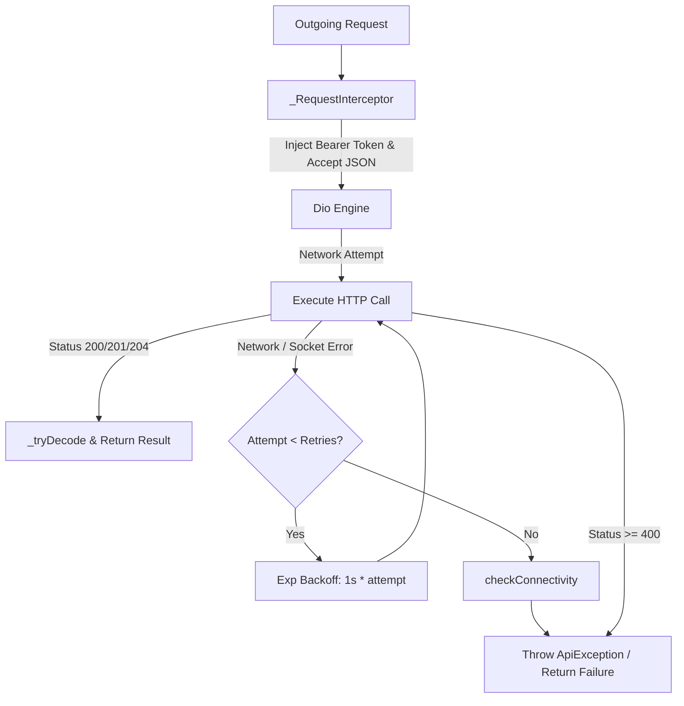
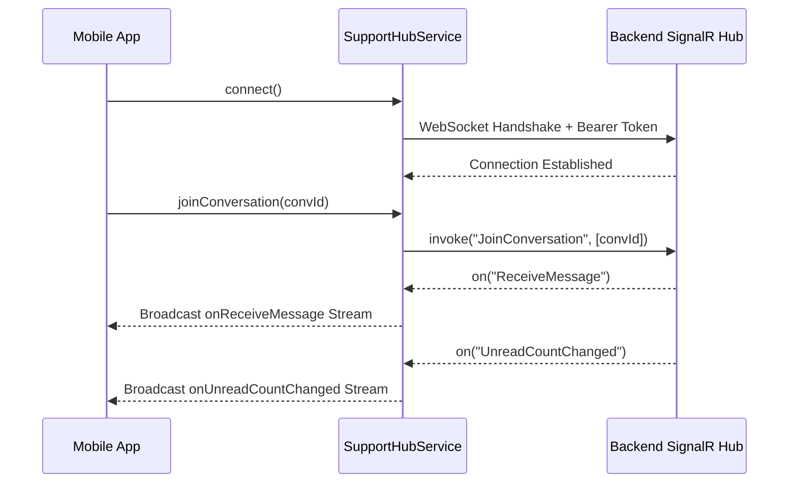

# Mobile Core Services Architecture & Reference

> **Directory:** `apps/mobile/lib/core/services/` & `apps/mobile/lib/features/inbox/data/services/`  
> **Target Framework:** Flutter 3.x / Dart 3.11  
> **Key Dependencies:** `dio: ^5.11.0`, `signalr_netcore: ^1.4.4`, `firebase_messaging: ^16.6.0`, `flutter_local_notifications: ^22.3.0`, `shared_preferences: ^2.5.5`, `flutter_secure_storage: ^9.2.4`, `google_sign_in: ^6.3.0`, `flutter_facebook_auth: ^7.1.5`, `audioplayers: ^6.1.2`

This document provides a comprehensive technical reference for the core infrastructure and background networking services supporting the EducationLab Flutter mobile client.

---

## 1. Core Network Layer: `ApiClient`

**File:** `apps/mobile/lib/core/services/api_client.dart`

`ApiClient` is a singleton HTTP client wrapper around `dio.Dio`, engineered for high network resilience, automated token injection, unified error parsing, and safe response unboxing.


```mermaid
flowchart TD
    Req[Outgoing Request] --> Interceptor[_RequestInterceptor]
    Interceptor -->|Inject Bearer Token & Accept JSON| DioEngine[Dio Engine]
    DioEngine -->|Network Attempt| Exec[Execute HTTP Call]
    Exec -->|Status 200/201/204| Decode[_tryDecode & Return Result]
    Exec -->|Network / Socket Error| RetryCheck{Attempt < Retries?}
    RetryCheck -->|Yes| Delay[Exp Backoff: 1s * attempt] --> Exec
    RetryCheck -->|No| CheckConn[checkConnectivity] --> ThrowErr[Throw ApiException / Return Failure]
    Exec -->|Status >= 400| ThrowErr
```

### 1.1 Architectural Specifications
- **Base URL:** Defined via `ApiConstants.baseUrl` (`https://edulabapi.runasp.net/api/`).
- **Default Timeouts:** `connectTimeout: 30s`, `receiveTimeout: 30s`, `sendTimeout: 30s` (`api_client.dart:36-38`).
- **In-Memory HTTP GET Cache (`_memoryCache`, `api_client.dart:45-50, 100-130`)**:
  - Static map `_memoryCache = <String, ({dynamic data, DateTime expiry})>{}` (`api_client.dart:45`) stores decoded GET responses keyed by `'${LocaleService.cachedLanguageCode}:$url?${queryParameters ?? {}}'` (`:103`).
  - `get` (`:96-109`) and `getSafe` (`:236-248`) accept an optional `Duration? cacheDuration`; when specified and a non-expired entry exists (`entry.expiry.isAfter(DateTime.now())`), the cached response is returned in **0ms** without network I/O.
  - `static void clearCache()` (`api_client.dart:48-50`) flushes `_memoryCache` on locale switches (`LocaleService.setLocale`, `locale_service.dart:24`) and session teardown (`AppSessionService.clearSession`, `app_session_service.dart:28`).
- **Automatic Retry Policy:** Default of 2 retries with linear backoff (`Future.delayed(Duration(seconds: 1 * (attempt + 1)))`). Retries trigger specifically on transport/socket failures (`SocketException`, `Failed host lookup`, `Connection closed`, `HandshakeException`, etc.).
- **Global Network State:** `ValueNotifier<NetworkStatus> networkStatus` tracks `NetworkStatus.connected`, `NetworkStatus.networkError`, and `NetworkStatus.serverError`.

### 1.2 Result Pattern & Safe Unboxing
The client exposes functional sealed classes for exception-free consumption across ViewModels and Repositories:
```dart
sealed class Result<T> { const Result(); }
class Success<T> extends Result<T> { final T data; const Success(this.data); }
class Failure<T> extends Result<T> { final String message; final Object? error; const Failure(this.message, {this.error}); }
```

### 1.3 Method Catalog
| Method | Signature | Description |
| :--- | :--- | :--- |
| `get` | `Future<dynamic> get(String url, {queryParameters, headers, retries, timeout, Duration? cacheDuration})` | Direct HTTP GET with optional TTL in-memory caching (`api_client.dart:96-130`). |
| `getSafe` | `Future<Result<dynamic>> getSafe(String url, {..., Duration? cacheDuration})` | Functional GET wrapper returning `Success` or `Failure` (`api_client.dart:236-256`). |
| `clearCache` | `static void clearCache()` | Evicts all entries in `_memoryCache` (`api_client.dart:48-50`). |
| `post` | `Future<dynamic> post(String url, {body, headers, retries, timeout})` | Direct HTTP POST with JSON content type. |
| `postSafe` | `Future<Result<dynamic>> postSafe(...)` | Functional POST wrapper returning `Success` or `Failure`. |
| `postFormDataSafe` | `Future<Result<dynamic>> postFormDataSafe(String url, {required FormData formData, ...})` | Multipart file upload client used for avatar and CV uploads. |
| `put` / `putSafe` | `Future<dynamic> put(...)` / `Future<Result<dynamic>> putSafe(...)` | PUT updates (e.g. user profiles, notification toggles). |
| `delete` / `deleteSafe`| `Future<dynamic> delete(...)` / `Future<Result<dynamic>> deleteSafe(...)` | DELETE requests (e.g. cart items, wishlist removal). |
| `checkConnectivity` | `Future<NetworkStatus> checkConnectivity()` | Pings `ApiConstants.publicStats` (5s timeout) to verify server responsiveness. |

### 1.4 Request Interceptor & PII Sanitization
1. **`_RequestInterceptor` (`api_client.dart:519-546`)**: Intercepts every outgoing request:
   - Injects `Accept: application/json`.
   - Reads `LocaleService.cachedLanguageCode` synchronously in 0ms and attaches `Accept-Language`.
   - Reads `AuthStorageService.getAccessToken()` (backed by 0ms in-memory cache + guest short-circuit flags) and attaches `Authorization: Bearer <token>`.
2. **`_SanitizingLogInterceptor`**:
   - Sanitizes `Authorization: Bearer ***REDACTED***` and `Cookie` headers.
   - Cleans JSON request bodies and responses using `AppLogger.sanitize` to mask passwords, credit card numbers, and CVVs.

---

## 2. Authentication Storage: `AuthStorageService`

**File:** `apps/mobile/lib/core/services/auth_storage_service.dart`

`AuthStorageService` provides thread-safe, hardware-encrypted local persistence for session credentials using `FlutterSecureStorage` (iOS Keychain & Android EncryptedSharedPreferences) alongside an ultra-fast **In-Memory Cache** and **0ms Guest Short-Circuit Flags**.

### 2.1 Storage Architecture & Security
- **Hardware Encryption**: Sensitive JWT `access_token` and `refresh_token` are written to encrypted hardware storage.
- **In-Memory Caching & 0ms Guest Short-Circuit (`auth_storage_service.dart:21-27, 146-185`)**:
  - Static variables (`_cachedAccessToken`, `_cachedRefreshToken`, `_cachedUser`, `_cachedIsLoggedIn`) serve authenticated read operations in **0ms**.
  - Static boolean flags `_hasCheckedAccessToken` and `_hasCheckedRefreshToken` (`auth_storage_service.dart:26-27`) record whether secure storage has already been probed. When a user is browsing as a guest (`_cachedAccessToken == null` and `_hasCheckedAccessToken == true`), `getAccessToken()` (`:147-149`) and `getRefreshToken()` (`:180-182`) return `null` immediately in **0ms** instead of invoking platform-channel Keychain/EncryptedSharedPreferences I/O on every public API call.
- **JWT Role & Claim Extraction**: Decodes claims and roles directly from the JWT payload using `extractRolesAndClaimsFromJwt(token)`.
- **Automatic Migration**: Automatically migrates any legacy unencrypted tokens from SharedPreferences into secure storage upon first read.

### 2.2 Core Methods
- `saveAuth({required accessToken, required refreshToken, required user})`: Atomic batch write committing all session attributes to secure storage, SharedPreferences, and memory cache (`_hasCheckedAccessToken = true`, `_hasCheckedRefreshToken = true`, `:49-50`).
- `saveTokens({required accessToken, required refreshToken})`: Updates rotated tokens without touching stored user profile (`:119-120`).
- `getAccessToken()` / `getRefreshToken()`: Reads from memory cache or short-circuits in 0ms if already checked (`:146-185`).
- `getUser()`: Deserializes the JSON profile dictionary into `Map<String, dynamic>`.
- `isLoggedIn()`: Returns `true` if active session exists.
- `isAdmin()` / `isInstructor()` / `hasAdminClaims()`: Evaluates user roles and admin claims.
- `logout()`: Clears hardware keys, user JSON, and resets in-memory cache while keeping `_hasCheckedAccessToken = true` and `_hasCheckedRefreshToken = true` (`:387-392`).

---

## 3. Push & Local Notifications: `NotificationService`

**File:** `apps/mobile/lib/core/services/notification_service.dart`

Integrates Google Firebase Cloud Messaging (FCM) and `flutter_local_notifications` for both foreground and background push notification delivery.

### 3.1 Background Message Isolate
```dart
@pragma('vm:entry-point')
Future<void> firebaseMessagingBackgroundHandler(RemoteMessage message) async {
  await Firebase.initializeApp(options: DefaultFirebaseOptions.currentPlatform);
  debugPrint('[NotificationService] Background message received: ${message.messageId}');
}
```
Registered via `FirebaseMessaging.onBackgroundMessage` to handle notifications when the app is suspended or terminated.

### 3.2 Android Notification Channel Configuration
- **Channel ID:** `education_lab_channel`
- **Channel Name:** `Education Lab Notifications`
- **Description:** `Notifications for Education Lab updates and alerts`
- **Importance:** `Importance.max` (heads-up banner and sound enabled)
- **Small Icon:** `@mipmap/ic_launcher`

### 3.3 Lifecycle & Token Synchronization
1. **`initialize({onNotificationResponse})`**:
   - Boots Firebase Core with platform options.
   - Sets up iOS Darwin alert/badge/sound permissions and Android launcher icons.
   - Creates the notification channel via `AndroidFlutterLocalNotificationsPlugin`.
   - Subscribes to `FirebaseMessaging.onMessage` for foreground display via `_notificationsPlugin.show(...)`.
   - Subscribes to `FirebaseMessaging.instance.onTokenRefresh` to automatically propagate rotated tokens to the backend.
2. **`syncDeviceTokenWithServer()`**:
   - Queries `AuthStorageService.isLoggedIn()`.
   - Resolves FCM device token (handles APNs token delay on iOS physical hardware with 3 retries).
   - Issues a POST request to `/api/Notifications/device-token` with `{ "deviceToken": token }`.
3. **`requestTestPushNotification()`**:
   - Calls `/api/Notifications/test-push` to trigger a loopback push verification notification.

---

## 4. Real-Time Support Hub: `SupportHubService`

**File:** `apps/mobile/lib/features/inbox/data/services/support_hub_service.dart`

Manages real-time bidirectional WebSocket communication with the backend ASP.NET Core SignalR hub (`/hubs/support`).

### 4.1 Hub Connection Life-Cycle
- **Hub Endpoint:** `ApiConstants.supportHubUrl` (`https://edulabapi.runasp.net/hubs/support`).
- **Authentication:** `HttpConnectionOptions(accessTokenFactory: () => AuthStorageService.getAccessToken())`.
- **Auto Reconnect:** Enabled via `.withAutomaticReconnect()`.


```mermaid
sequenceDiagram
    participant App as Mobile App
    participant Hub as SupportHubService
    participant SignalR as Backend SignalR Hub

    App->>Hub: connect()
    Hub->>SignalR: WebSocket Handshake + Bearer Token
    SignalR-->>Hub: Connection Established
    App->>Hub: joinConversation(convId)
    Hub->>SignalR: invoke("JoinConversation", [convId])
    SignalR-->>Hub: on("ReceiveMessage")
    Hub-->>App: Broadcast onReceiveMessage Stream
    SignalR-->>Hub: on("UnreadCountChanged")
    Hub-->>App: Broadcast onUnreadCountChanged Stream
```

### 4.2 SignalR Client Event Subscriptions
| Event Name | Parameter Type | Action Taken |
| :--- | :--- | :--- |
| `ReceiveMessage` | `Map<String, dynamic>` | Parses into `SupportMessageModel` and emits to `onReceiveMessage` broadcast stream. |
| `UnreadCountChanged` | `int` | Emits updated badge counter to `onUnreadCountChanged` broadcast stream. |
| `ConversationsChanged` | `void` | Signals conversation list invalidation to `onConversationsChanged` stream. |
| `onclose` / `onreconnecting` / `onreconnected` | `HubConnectionState` | Emits current connection state to `onConnectionStateChanged`. |

### 4.3 Client Invocations
- `joinConversation(int conversationId)`: Invokes server method `JoinConversation` to subscribe to room `conv-{conversationId}`.
- `leaveConversation(int conversationId)`: Invokes server method `LeaveConversation` when exiting the chat screen.
- `disconnect()`: Stops connection and cleans up WebSocket sockets.

---

## 5. Stripe Payments: `StripeService`

**File:** `apps/mobile/lib/core/services/stripe_service.dart`

Enables client-side Stripe tokenization and 2-step PaymentIntent confirmation without heavy binary dependencies.

### 5.1 Two-Step Payment Workflow
1. **Create PaymentMethod (`createPaymentMethod`)**:
   - Posts card data (`number`, `exp_month`, `exp_year`, `cvc`) and billing details directly to `https://api.stripe.com/v1/payment_methods` with publishable key `ApiConstants.stripePublishableKey`.
   - **Test Mode Fallback:** If client-side tokenization is restricted on test accounts (`pk_test_...`), automatically resolves official Stripe test PaymentMethod tokens (`pm_card_visa`, `pm_card_mastercard`, `pm_card_amex`, `pm_card_discover`, `pm_card_chargeCustomerFail`) based on the card prefix.
2. **Confirm PaymentIntent (`confirmPaymentIntent`)**:
   - Posts `payment_method` and `client_secret` to `https://api.stripe.com/v1/payment_intents/{id}/confirm`.
   - Returns `StripeResult.success(status: 'succeeded')` or human-readable Arabic localized errors for declined cards, insufficient funds, or expired cards.

---

## 6. Google Sign-In: `GoogleAuthService`

**File:** `apps/mobile/lib/core/services/google_auth_service.dart`

Wraps `google_sign_in` for federated OAuth2 authentication.

### 6.1 OAuth Client Identifiers
- **Android / Server Client ID:** `114806076172-tqtrrqupp076ilo8j3hgpb8jhggju8fv.apps.googleusercontent.com`
- **iOS Client ID:** `114806076172-be913jqrvsnprd7ei3nk61lpfc41aia3.apps.googleusercontent.com`
- **Scopes:** `['email', 'profile']`

### 6.2 Token Acquisition & Cache Resilience
- `signInWithGoogle()`: Clears any lingering authentication cache to force account picker selection.
- If `auth.idToken` returns null on first query (common Android Google Play Services caching issue), executes `account.clearAuthCache()` and re-fetches.
- Provides fallback to `_googleSignIn.signInSilently(reAuthenticate: true)`.
- Returns the Google ID token string to be exchanged against backend `/api/Auth/google-mobile`.

---

## 7. Sound Effects: `SoundService`

**File:** `apps/mobile/lib/core/services/sound_service.dart`

Provides low-latency auditory feedback for user transactions using `audioplayers`.
- **Modes:** `ReleaseMode.stop`, `PlayerMode.lowLatency`.
- **`playSuccess()`**: Plays `assets/sounds/success.mp3` on successful course purchase, enrollment, or certificate generation. Falls back to `SystemSound.play(SystemSoundType.click)`.
- **`playFailed()`**: Plays `assets/sounds/failed.mp3` on payment decline or error. Falls back to `SystemSound.play(SystemSoundType.alert)`.

---

## 8. App Session & Preferences Services

### 8.1 `AppSessionService`
**File:** `apps/mobile/lib/core/services/app_session_service.dart` (`:15-66`)
- **`clearSession(BuildContext context)` (`:20-65`)**: Executes atomic teardown upon logout or guest reset:
  1. `ApiClient.clearCache()` (`:28`) — flushes all in-memory HTTP GET responses.
  2. `locator<AuthRepository>().logout()` (`:31`) — revokes token and clears `AuthStorageService`.
  3. `GoogleAuthService.signOut()` (`:35`) and `FacebookAuthService.signOut()` (`:39`).
  4. Resets in-memory state on `ProfileProvider`, `CartProvider`, `WishlistProvider`, `NotificationProvider`, `EnrollmentProvider`, and `SupportProvider` (`:43-64`).

### 8.2 `ThemeService`
**File:** `apps/mobile/lib/core/services/theme_service.dart` (`:30-168`)
- Manages 4 persisted visual preferences in `SharedPreferences`:
  - `_themeMode` (`'app_theme_mode'`): `ThemeMode.light`, `ThemeMode.dark`, or `ThemeMode.system`.
  - `_textScale` (`'app_text_scale'`, `:69-74`): 4 presets (`0.85` Small, `1.0` Normal, `1.15` Large, `1.30` Extra Large).
  - `_isAmoled` (`'app_amoled_dark'`, `:89`): true-black AMOLED dark surface toggle.
  - `_accentColor` (`'app_accent_color'`, `:36-67`): 5 presets (`Blue #1D61E7`, `Emerald #059669`, `Violet #7C3AED`, `Amber #EA580C`, `Rose #E11D48`).
- Extends `ChangeNotifier` to trigger reactive UI rebuilds across `Consumer2<LocaleService, ThemeService>` in `app.dart:82-104`.

### 8.3 `LocaleService`
**File:** `apps/mobile/lib/core/services/locale_service.dart` (`:6-29`)
- Manages active application language (`ar` / `en`) with `SharedPreferences` key `'language'` (`:15`).
- Provides static `cachedLanguageCode` (`:7`) in-memory for zero-cost synchronous consumption by `ApiClient`.
- Calls `ApiClient.clearCache()` (`:24`) inside `setLocale(String langCode)` so cached localized responses are immediately invalidated.
- Defaults to Arabic (`AppConstants.arCode = 'ar'`).

---

## 9. Facebook Authentication: `FacebookAuthService`

**File:** `apps/mobile/lib/core/services/facebook_auth_service.dart`  
**Dialog Widget:** `apps/mobile/lib/features/auth/presentation/widgets/facebook_oauth_dialog.dart`

Provides native Facebook SDK login and an intelligent OAuth 2.0 fallback mechanism.

### 9.1 Architecture & Token Resolution
1. **Native SDK with Fast App-Switching**:
   - Calls `FacebookAuth.instance.login(permissions: ['email', 'public_profile'], loginBehavior: LoginBehavior.nativeWithFallback)`.
   - On Android and iOS with native Facebook app installed, switches directly to the Facebook app for single-tap authorization.
2. **Graph API vs Limited Login (OIDC JWT) Resolution**:
   - The backend API (`POST /api/auth/FacebookMobile`) requires a standard Facebook Graph API Access Token (`EAAG...`).
   - If the native SDK returns a Limited Login OIDC JWT (`eyJ...`), `FacebookAuthService` automatically presents the in-app `FacebookOAuthDialog` (`webview_flutter`), capturing the genuine `EAAG...` access token from the OAuth redirect URI (`https://www.facebook.com/connect/login_success.html`).
3. **Session Teardown**:
   - `signOut()` removes local cached attributes and calls `FacebookAuth.instance.logOut()`.

---

## 10. Offline Download Engine: `DownloadService`

**File:** `apps/mobile/lib/core/services/download_service.dart` (`:9-437`)  
**Model:** `apps/mobile/lib/features/learning/data/models/download_item_model.dart`

Singleton offline download manager supporting lecture videos, course resources, and completion certificates with background streaming, cancellation, and storage management.

### 10.1 Storage & Registry Architecture
- **Local Directory:** `${getApplicationDocumentsDirectory()}/edulab_downloads` (`download_service.dart:40-44`).
- **Registry Persistence:** Completed `DownloadItemModel` entries (`DownloadTaskStatus.completed`) are serialized as JSON to `SharedPreferences` under `'edulab_offline_downloads_registry_v1'` (`:14, :93-101`).
- **iOS Sandbox Path Migration (`_loadRegistry`, `:54-76`):** On startup, verifies each persisted file's existence; if an iOS app-update changed the container UUID path, reconstructs `$_downloadsDirPath/$fileName` and updates the registry if the file exists there, or prunes orphaned records.
- **Dedicated Dio Client (`:15-21`):** Uses a long-timeout `Dio` instance (`connectTimeout: 30s`, `receiveTimeout: 30 minutes`) with automatic `Authorization: Bearer` header injection (`:192-199`).

### 10.2 Throttled Progress Stream & Operations
- **Progress Throttling (`:26-32, :220-237`):** Broadcasts `Stream<Map<String, DownloadItemModel>> get onProgress` only when download progress advances by `>= 3%` (`delta >= 0.03`), `>= 250ms` has elapsed, or `progress >= 1.0`, preventing UI frame drops during fast downloads.
- **Core Methods:**
  - `startDownload(...)` (`:163-289`): Streams remote file via `_dio.download(resolvedUrl, localPath, cancelToken: cancelToken, deleteOnError: true)`, tracking byte progress and persisting completion.
  - `saveBytesAsDownload(...)` (`:291-340`): Writes client-rendered bytes (such as high-DPI PNG certificates) directly to disk and registers the completed item.
  - `cancelDownload(String id)` (`:351-366`): Triggers `CancelToken.cancel('User cancelled download')` and removes partial `.part` files.
  - `deleteDownload(String id)` (`:368-388`) & `clearAllDownloads()` (`:390-413`): Cancels active transfers, deletes local files, and updates `SharedPreferences`.
