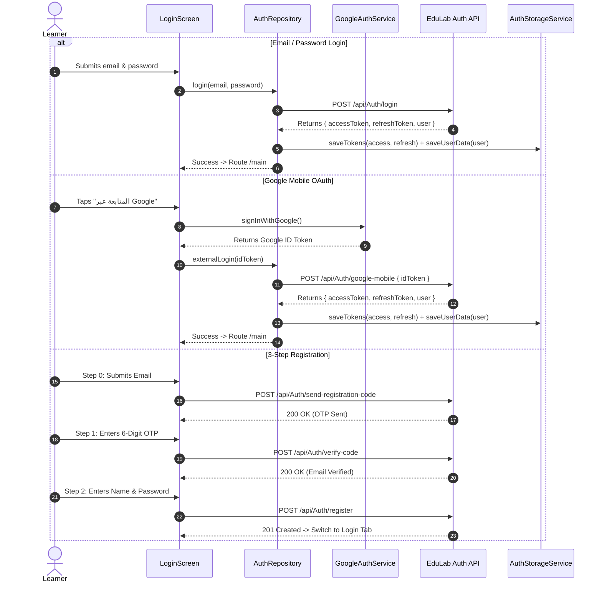

# Mobile Feature Architecture: Authentication & Identity (`Auth`)

> **Feature Directory:** [`apps/mobile/lib/features/auth/`](file:///d:/Programming/MonoRepo%20Porjects/EducationLab/apps/mobile/lib/features/auth/)  
> **Key Screens:** [`LoginScreen`](file:///d:/Programming/MonoRepo%20Porjects/EducationLab/apps/mobile/lib/features/auth/presentation/screens/login_screen.dart)  
> **Repositories & Services:** [`AuthRepository`](file:///d:/Programming/MonoRepo%20Porjects/EducationLab/apps/mobile/lib/core/repositories/auth_repository.dart), [`AuthStorageService`](file:///d:/Programming/MonoRepo%20Porjects/EducationLab/apps/mobile/lib/core/services/auth_storage_service.dart), [`GoogleAuthService`](file:///d:/Programming/MonoRepo%20Porjects/EducationLab/apps/mobile/lib/core/services/google_auth_service.dart), [`AppSessionService`](file:///d:/Programming/MonoRepo%20Porjects/EducationLab/apps/mobile/lib/core/services/app_session_service.dart)  
> **Backend Synchronization:** `/api/Auth` (Login, Register, External OAuth, Send Code, Verify Email, Refresh Token)

---

## 1. Feature Overview & Scope

The `Auth` feature encapsulates identity management, user onboarding, and session security across the EducationLab mobile app. It delivers:
1. **Email & Password Authentication:** Standard login flow exchanging credentials for JWT access and refresh tokens.
2. **3-Step Verified Registration with OTP:** Prevents fake email registration by dispatching an email OTP verification challenge before accepting account credentials.
3. **90-Second Flood Protection Timer:** Enforces client-side rate limiting on code resend requests.
4. **Native Google Mobile OAuth:** Direct OAuth token acquisition without requiring Firebase SDKs, exchanging the Google ID token with `/api/Auth/google-mobile`.
5. **Guest Mode Exploration:** Allows unauthenticated users to browse courses and previews, deferring authentication until checkout or lecture playback.
6. **Encrypted Session Persistence:** Stores tokens in secure storage and updates `ProfileProvider` reactively.

---

## 2. Authentication Flow Architecture

---

## 3. Storage & Interceptor Token Lifecycle

Tokens are managed through `AuthStorageService` using Flutter secure storage and shared preferences:
* **Access Token:** Short-lived JWT (15-60 minutes) injected into every outgoing request via Dio `AuthInterceptor` (`Authorization: Bearer <token>`).
* **Refresh Token:** Long-lived persistent token (30 days) used to silently acquire a new access token upon receiving `401 Unauthorized`.
* **Logout / Invalidation:** `AppSessionService.clearSession(context)` purges stored tokens, disconnects SignalR hubs, and redirects the navigation stack to `/login`.

---

## 4. Security & Edge Case Defense

1. **Brute-Force & Flooding Throttling:**
   * A non-bypassable 90-second countdown timer runs on the client upon OTP dispatch.
   * OTP input cells accept strictly numeric digits (`FilteringTextInputFormatter.digitsOnly`).
2. **Password Complexity Rules:**
   * Minimum 8 characters.
   * At least 1 uppercase letter (`[A-Z]`).
   * At least 1 numeric digit (`[0-9]`).
3. **Session Interception Hygiene:**
   * If token refresh fails on the backend, `AuthInterceptor` flushes cached tokens and triggers global redirection to `LoginScreen` to avoid infinite request retry loops.
