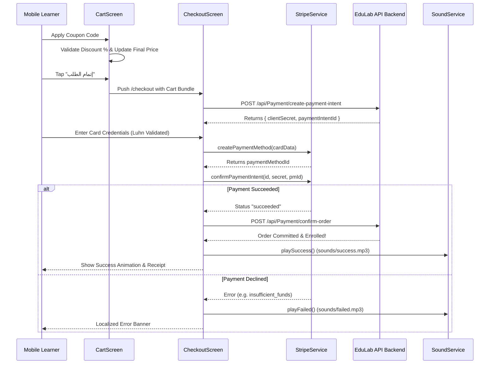

# Mobile Cart & Wishlist Feature Architecture

> **Modules:** `features/cart` & `features/wishlist`  
> **Source Directory:** [`apps/mobile/lib/features/cart/`](file:///d:/Programming/MonoRepo%20Porjects/EducationLab/apps/mobile/lib/features/cart/) & [`apps/mobile/lib/features/wishlist/`](file:///d:/Programming/MonoRepo%20Porjects/EducationLab/apps/mobile/lib/features/wishlist/)  
> **Key Files:**  
> - Screens: [`cart_screen.dart`](file:///d:/Programming/MonoRepo%20Porjects/EducationLab/apps/mobile/lib/features/cart/presentation/screens/cart_screen.dart) (1,393 lines), [`checkout_screen.dart`](file:///d:/Programming/MonoRepo%20Porjects/EducationLab/apps/mobile/lib/features/cart/presentation/screens/checkout_screen.dart) (3,283 lines), [`wishlist_screen.dart`](file:///d:/Programming/MonoRepo%20Porjects/EducationLab/apps/mobile/lib/features/wishlist/presentation/screens/wishlist_screen.dart)  
> - Providers: [`cart_provider.dart`](file:///d:/Programming/MonoRepo%20Porjects/EducationLab/apps/mobile/lib/features/cart/presentation/providers/cart_provider.dart), [`wishlist_provider.dart`](file:///d:/Programming/MonoRepo%20Porjects/EducationLab/apps/mobile/lib/features/wishlist/presentation/providers/wishlist_provider.dart)  
> - Repositories: [`cart_repository.dart`](file:///d:/Programming/MonoRepo%20Porjects/EducationLab/apps/mobile/lib/features/cart/data/repositories/cart_repository.dart), [`wishlist_repository.dart`](file:///d:/Programming/MonoRepo%20Porjects/EducationLab/apps/mobile/lib/features/wishlist/data/repositories/wishlist_repository.dart)  
> - Services: [`stripe_service.dart`](file:///d:/Programming/MonoRepo%20Porjects/EducationLab/apps/mobile/lib/core/services/stripe_service.dart), [`sound_service.dart`](file:///d:/Programming/MonoRepo%20Porjects/EducationLab/apps/mobile/lib/core/services/sound_service.dart)  
> - Models: [`cart_model.dart`](file:///d:/Programming/MonoRepo%20Porjects/EducationLab/apps/mobile/lib/features/cart/data/models/cart_model.dart), [`wishlist_item_model.dart`](file:///d:/Programming/MonoRepo%20Porjects/EducationLab/apps/mobile/lib/features/wishlist/data/models/wishlist_item_model.dart)

---

## 1. Feature Architecture Overview

The Cart & Checkout module provides an enterprise-grade e-commerce transaction experience with coupon code evaluation, price breakdowns, Luhn-validated card input, Stripe PaymentIntent orchestration, and multi-provider cache invalidation.

---

## 2. Screen Reference & Deep Technical Details

### 2.1 Cart Screen (`CartScreen`)
- **File Path:** [`apps/mobile/lib/features/cart/presentation/screens/cart_screen.dart`](file:///d:/Programming/MonoRepo%20Porjects/EducationLab/apps/mobile/lib/features/cart/presentation/screens/cart_screen.dart)
- **Route:** `/cart`
- **Scale:** 1,393 lines of Dart code.
- **Key Features:**
  - **Item List Tile:** Thumbnail, course title, instructor name, price, and swipe-to-delete action.
  - **Move to Wishlist:** Fast secondary action saving course for later while clearing it from active checkout.
  - **Coupon Engine:** Input field accepting promotional codes (`EDULAB20`, `SUPER50`, `WELCOME`). Calculates percentage reduction and applies immediately to subtotal.
  - **Order Breakdown Card:** Subtotal, discount amount, tax/VAT estimation, and bold final total.
  - **Sticky Bottom Bar:** Large primary button navigating directly to `/checkout`.

---

### 2.2 Checkout & Stripe Payment Screen (`CheckoutScreen`)
- **File Path:** [`apps/mobile/lib/features/cart/presentation/screens/checkout_screen.dart`](file:///d:/Programming/MonoRepo%20Porjects/EducationLab/apps/mobile/lib/features/cart/presentation/screens/checkout_screen.dart)
- **Route:** `/checkout`
- **Scale:** 3,283 lines of Dart code.

#### Advanced Input Sanitization & Formatters:
- **`_ArabicDigitsToEnglishFormatter`**: Intercepts Eastern Arabic numerical characters (`٠-٩`) and converts them into standard ASCII digits (`0-9`) to prevent parsing failures on payment gateways.
- **`_CardNumberFormatter`**: Dynamically inspects card prefixes to format spaces in real-time (4-4-4-4 for Visa/Mastercard, 4-6-5 for American Express).
- **`_isValidLuhn(String cardNumber)`**: Verifies checksum validity locally using the Luhn algorithm before transmitting requests over the network.
- **Card Brand Detection**: Dynamically changes leading card icons (Visa, Mastercard, Amex, Discover) as the user types.

#### Payment Gateway Execution:
1. Calls `PaymentRepository.createPaymentIntent(amount, currency)` to obtain the client secret.
2. Involves `StripeService.createPaymentMethod(...)` followed by `StripeService.confirmPaymentIntent(...)`.
3. Handles 3D Secure / OTP scenarios and human-readable decline reason mappings.
4. Triggers `SoundService.playSuccess()` or `SoundService.playFailed()`.
5. Clears `CartProvider`, refreshes `EnrollmentProvider`, and emits local push notification via `NotificationProvider`.

---

### 2.3 Wishlist Screen (`WishlistScreen`)
- **File Path:** [`apps/mobile/lib/features/wishlist/presentation/screens/wishlist_screen.dart`](file:///d:/Programming/MonoRepo%20Porjects/EducationLab/apps/mobile/lib/features/wishlist/presentation/screens/wishlist_screen.dart)
- **Route:** `/wishlist`
- **Functionality:**
  - Displays bookmarked courses.
  - Instant toggle button synchronizing with `/api/Wishlist/toggle/{courseId}`.
  - One-tap `"إضافة إلى السلة"` transferring the saved course into the active cart.
