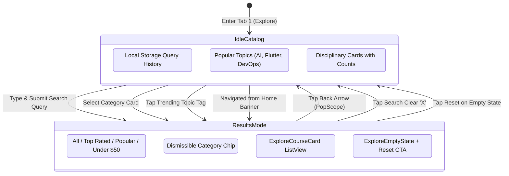

# Mobile Feature Architecture: Catalog & Exploration (`Catalog`)

> **Feature Directory:** [`apps/mobile/lib/features/catalog/`](file:///d:/Programming/MonoRepo%20Porjects/EducationLab/apps/mobile/lib/features/catalog/)  
> **Key Screens:** [`ExploreScreen`](file:///d:/Programming/MonoRepo%20Porjects/EducationLab/apps/mobile/lib/features/catalog/presentation/screens/explore_screen.dart)  
> **State Management:** [`ExploreProvider`](file:///d:/Programming/MonoRepo%20Porjects/EducationLab/apps/mobile/lib/features/catalog/presentation/providers/explore_provider.dart)  
> **Modular Presentation Widgets:** 7 Widgets (`ExploreSearchBar`, `ExploreFilterBar`, `ExploreCategoriesList`, `ExploreCourseCard`, `ExploreRecentSearches`, `ExploreTopSearches`, `ExploreSkeletonLoading`)

---

## 1. Feature Overview & Scope

The `Catalog` feature provides course discovery, keyword search, disciplinary category browsing, and multi-parameter filtering across EducationLab's academic curriculum.

Key capabilities:
1. **Dual-Mode UI Rendering:**
   * **Mode 1 (Idle Discovery):** Recent search query pills, trending platform tags, and categorical grid cards.
   * **Mode 2 (Search Results Feed):** Filter chips (Top Rated, Popular, Budget Under $50), active category badge with dismiss 'X', and paginated course results.
2. **Search History Management:** Saves search queries locally with individual deletion and complete clearing support.
3. **Cross-Feature Parameter Ingestion:** Accepts initialization parameters (`initialCategory`, `initialSearchQuery`, `initialFilterIndex`, `autoFocusSearch`) from banners and category cards across other screens.
4. **Hardware Back Interception (`PopScope`):** Intercepts back navigation in results mode to revert to the idle catalog instead of closing the screen or switching tabs.

---

## 2. Search & Filter State Architecture



---

## 3. Filter Matrix & Criteria Specification

| Filter Chip | Index | Evaluation Rule & Condition |
| :--- | :--- | :--- |
| **الكل (All)** | `0` | All courses matching query or selected category. |
| **الأعلى تقييماً (Top Rated)** | `1` | Courses satisfying `rating >= 4.7`. |
| **الأكثر شعبية (Most Popular)** | `2` | Courses with `isBestseller == true` or `reviewsCount >= 20`. |
| **أقل من $50 (Under $50)** | `3` | Courses with `finalPrice < 50.0` or `isFree == true`. |

---

## 4. UI Insets & Mini-Bar Clearance

To ensure that the floating bottom navigation bar and the [`ContinueLearningMiniBar`](file:///d:/Programming/MonoRepo%20Porjects/EducationLab/apps/mobile/lib/core/widgets/continue_learning_mini_bar.dart) never obscure catalog items, `ExploreScreen` calculates bottom padding dynamically:
```dart
final bool hasContinueLearning = enrollmentProvider.courses.isNotEmpty;
final double bottomPadding = widget.isTab
    ? (hasContinueLearning ? 180.0 : 100.0) + bottomInset
    : 24.0 + bottomInset;
```
