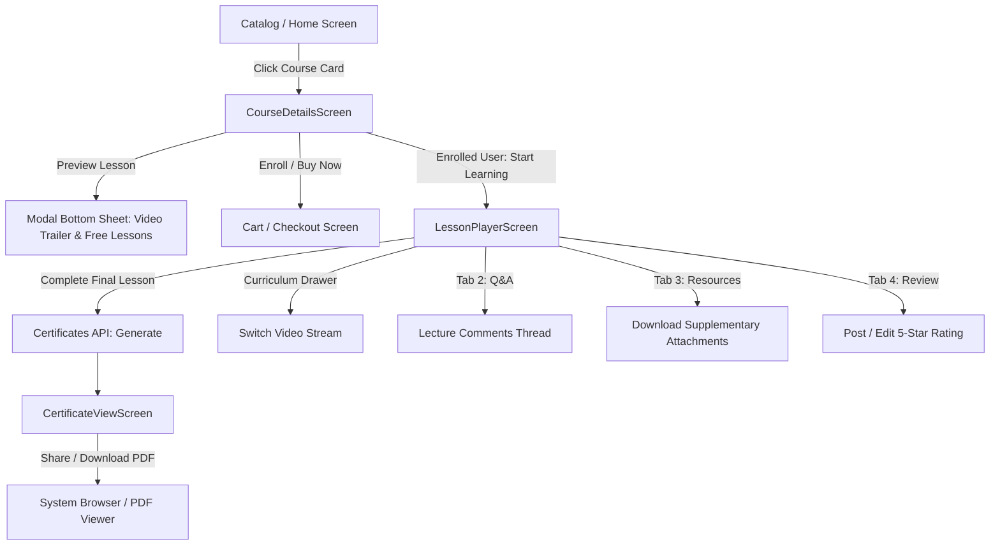

# Mobile Courses Feature Architecture & Implementation

> **Module:** `features/courses`  
> **Source Directory:** [`apps/mobile/lib/features/courses/`](file:///d:/Programming/MonoRepo%20Porjects/EducationLab/apps/mobile/lib/features/courses/)  
> **Key Files:**  
> - Screens: [`course_details_screen.dart`](file:///d:/Programming/MonoRepo%20Porjects/EducationLab/apps/mobile/lib/features/courses/presentation/screens/course_details_screen.dart) (3,008 lines), [`lesson_player_screen.dart`](file:///d:/Programming/MonoRepo%20Porjects/EducationLab/apps/mobile/lib/features/courses/presentation/screens/lesson_player_screen.dart) (3,659 lines), [`assignments_screen.dart`](file:///d:/Programming/MonoRepo%20Porjects/EducationLab/apps/mobile/lib/features/courses/presentation/screens/assignments_screen.dart), [`schedule_screen.dart`](file:///d:/Programming/MonoRepo%20Porjects/EducationLab/apps/mobile/lib/features/courses/presentation/screens/schedule_screen.dart), [`certificate_view_screen.dart`](file:///d:/Programming/MonoRepo%20Porjects/EducationLab/apps/mobile/lib/features/courses/presentation/screens/certificate_view_screen.dart), [`my_certificates_screen.dart`](file:///d:/Programming/MonoRepo%20Porjects/EducationLab/apps/mobile/lib/features/courses/presentation/screens/my_certificates_screen.dart)  
> - Provider: [`course_details_provider.dart`](file:///d:/Programming/MonoRepo%20Porjects/EducationLab/apps/mobile/lib/features/courses/presentation/providers/course_details_provider.dart)  
> - Models: [`course_details_model.dart`](file:///d:/Programming/MonoRepo%20Porjects/EducationLab/apps/mobile/lib/features/courses/data/models/course_details_model.dart), [`certificate_model.dart`](file:///d:/Programming/MonoRepo%20Porjects/EducationLab/apps/mobile/lib/features/courses/data/models/certificate_model.dart), [`course_rating_model.dart`](file:///d:/Programming/MonoRepo%20Porjects/EducationLab/apps/mobile/lib/features/courses/data/models/course_rating_model.dart)

---

## 1. Feature Architecture Overview

The Courses feature represents the core educational consumption engine of EducationLab. It manages the entire learner lifecycle from marketing discovery, syllabus inspection, video trailer preview, purchasing, lesson video playback, quiz interaction, assignment submissions, to cryptographic completion certificate downloads.

---

## 2. Screen Reference & Deep Implementation Details

### 2.1 Course Details Screen (`CourseDetailsScreen`)
- **File Path:** [`apps/mobile/lib/features/courses/presentation/screens/course_details_screen.dart`](file:///d:/Programming/MonoRepo%20Porjects/EducationLab/apps/mobile/lib/features/courses/presentation/screens/course_details_screen.dart)
- **Route:** `/course-details` (Named route accepts `int` courseId or `Map<String, dynamic>`).
- **Scale:** 3,008 lines of Dart code handling comprehensive syllabus presentation and trailer playback.

#### Key Architectural Components:
1. **Hero Media Header (`_buildHeroPreview`)**:
   - Displays cached course banner with gradient overlays.
   - Highlights course duration, total lectures, and difficulty badges.
   - Circular animated play button triggering `_openCoursePreviewModal(...)`.
2. **Tabbed Information Matrix (4 Tabs)**:
   - **Tab 0: Overview:** Course description, requirements checklist, targeted audience, and what you will learn cards.
   - **Tab 1: Curriculum:** Interactive accordion list of `CourseSectionModel` containing all `CourseLectureModel` units with durations and lock/unlock indicators.
   - **Tab 2: Instructor:** Instructor avatar, professional title, biography, social links, and total students count.
   - **Tab 3: Reviews:** Star distribution bar graph (5-star down to 1-star breakdowns) and paginated list of student comments.
3. **Sticky Bottom Action Bar**:
   - If user is **already enrolled**: renders a prominent primary button `"متابعة التعلم"` navigating directly to `LessonPlayerScreen`.
   - If user is **guest / not enrolled**:
     - Displays price and discount tags.
     - Secondary button: `"إضافة للسلة"` (toggles `CartProvider`).
     - Primary button: `"شراء الآن"` (adds to cart and pushes immediately to `/checkout`).
4. **Interactive Free Preview Modal (`_openCoursePreviewModal`)**:
   - Renders a modal bottom sheet equipped with an embedded `VideoPlayerController` streaming free preview lectures.
   - Allows guest learners to experience lessons without committing payment.

---

### 2.2 Lesson Video Player Screen (`LessonPlayerScreen`)
- **File Path:** [`apps/mobile/lib/features/courses/presentation/screens/lesson_player_screen.dart`](file:///d:/Programming/MonoRepo%20Porjects/EducationLab/apps/mobile/lib/features/courses/presentation/screens/lesson_player_screen.dart)
- **Route:** `/lesson-player`
- **Scale:** 3,659 lines of Dart handling robust video playback, gestural scrubbing, fullscreen rotation, and interactive learning tabs.

#### Video Controller & Playback State Machine:
- **`VideoPlayerController` Integration:**
  - Streams network MP4/HLS feeds from backend media CDN.
  - Automatically handles lifecycle state changes via `WidgetsBindingObserver`: pauses video when the app is suspended or placed in background (`AppLifecycleState.paused`).
  - Native video buffer listener tracks `_isBuffering` state to display subtle spinner overlays.
- **Gesture Control & Controls HUD:**
  - Double-tap left/right skips backward/forward by 10 seconds with ripple animations.
  - Auto-hiding HUD timer (disappears after 3.5 seconds of inactivity).
  - Playback speed selector bottom sheet supporting `0.75x`, `1.0x`, `1.25x`, `1.5x`, `2.0x`.
  - Mute/unmute toggle and custom scrubbable `SliderTheme`.
- **Fallback Simulation Engine:**
  - In cases where the lesson does not possess a direct video stream (e.g. text/article lectures or testing environments), the screen activates a built-in `_simulatedTimer` ticking every 500ms to smoothly emulate progress without crashing.
- **Auto-Progress & Completion Synchronization:**
  - When playback crosses 90% duration, issues a background call to `CourseLearningProvider.markLectureAsCompleted(lectureId)`.
  - Automatically queues up and prompts to autoplay the next sequential lesson in the section.
- **Curriculum Playlist Drawer (`EndDrawer`)**:
  - Accessible via the top player toolbar. Allows instant lesson jumping without navigating away from playback.

#### 4 Interactive Content Tabs:
1. **Overview:** Lecture description, learning objectives, and instructor notes.
2. **Q&A Discussions (`_buildCommentsTab`):**
   - Live thread for students to post questions and receive instructor replies.
   - Submits through `CourseLearningProvider.addLectureComment(...)`.
3. **Downloadable Resources (`_buildResourcesTab`):**
   - Displays files (`PDF`, `ZIP`, `DOCX`) with file size and direct download links.
4. **Course Rating & Reviews (`_buildReviewsTab`):**
   - Allows enrolled students to submit or update their 1-5 star review and written feedback via `CourseRatingModel`.

---

### 2.3 Assignments Screen (`AssignmentsScreen`)
- **File Path:** [`apps/mobile/lib/features/courses/presentation/screens/assignments_screen.dart`](file:///d:/Programming/MonoRepo%20Porjects/EducationLab/apps/mobile/lib/features/courses/presentation/screens/assignments_screen.dart)
- **Route:** `/assignments`
- **Functionality:**
  - Lists pending, submitted, and graded practical assignments for an enrolled course.
  - File picker integration allowing students to upload solution ZIP/PDF files.
  - Displays instructor grading, points scored, and submission feedback notes.

---

### 2.4 Study Schedule Screen (`ScheduleScreen`)
- **File Path:** [`apps/mobile/lib/features/courses/presentation/screens/schedule_screen.dart`](file:///d:/Programming/MonoRepo%20Porjects/EducationLab/apps/mobile/lib/features/courses/presentation/screens/schedule_screen.dart)
- **Route:** `/schedule`
- **Functionality:**
  - Calendar agenda view mapping out remaining lessons against user study goals.
  - Integrates with local device reminders to notify learners before daily study sessions.

---

### 2.5 Certificate Presentation & Verification

#### `CertificateViewScreen`
- **File Path:** [`apps/mobile/lib/features/courses/presentation/screens/certificate_view_screen.dart`](file:///d:/Programming/MonoRepo%20Porjects/EducationLab/apps/mobile/lib/features/courses/presentation/screens/certificate_view_screen.dart)
- **Route:** `/certificate-view`
- **Functionality:**
  - Displays high-fidelity digital certificate canvas featuring student name, course title, graduation date, and cryptographic verification code (`EL-CERT-XXXXX`).
  - Action buttons:
    - **Download PDF:** Fetches formal vector PDF via `certificate.downloadUrl`.
    - **Verify Certificate:** Opens public verification web portal via `certificate.fullVerifyUrl`.
    - **Share:** Shares credential link across social media / LinkedIn via system share sheet.

#### `MyCertificatesScreen`
- **File Path:** [`apps/mobile/lib/features/courses/presentation/screens/my_certificates_screen.dart`](file:///d:/Programming/MonoRepo%20Porjects/EducationLab/apps/mobile/lib/features/courses/presentation/screens/my_certificates_screen.dart)
- **Route:** `/my-certificates`
- **Functionality:**
  - Displays the user's completed credentials trophy gallery.
  - Pull-to-refresh integration querying `/api/Certificates/my-certificates`.

---

## 3. Provider State Management: `CourseDetailsProvider`

**File:** [`apps/mobile/lib/features/courses/presentation/providers/course_details_provider.dart`](file:///d:/Programming/MonoRepo%20Porjects/EducationLab/apps/mobile/lib/features/courses/presentation/providers/course_details_provider.dart)

Manages async fetching and caching of course data:
- **State Properties:**
  - `CourseDetailsModel? course`: Active course domain aggregate.
  - `bool isLoading`: Spinner flag.
  - `String? errorMessage`: Localized failure prompt.
- **Methods:**
  - `fetchCourseDetails(int courseId, {bool forceRefresh})`: Calls backend `/api/Course/{id}` and updates listeners.
  - `toggleSection(int sectionId)`: Expands/collapses curriculum chapters in memory without re-fetching.
