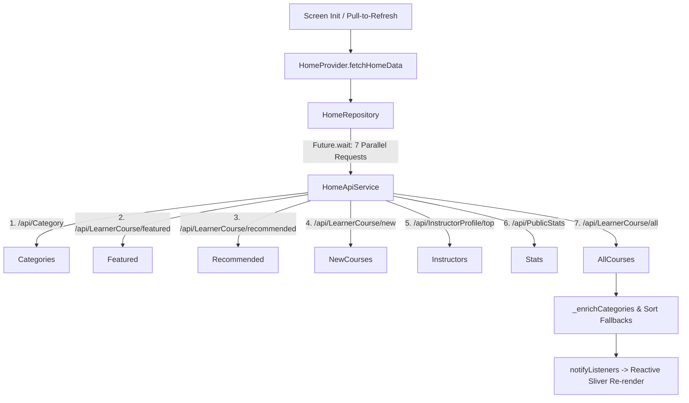

# Mobile Home Feature Architecture & Implementation

> **Module:** `features/home`  
> **Source Directory:** [`apps/mobile/lib/features/home/`](file:///d:/Programming/MonoRepo%20Porjects/EducationLab/apps/mobile/lib/features/home/)  
> **Key Files:**  
> - Screens: [`home_screen.dart`](file:///d:/Programming/MonoRepo%20Porjects/EducationLab/apps/mobile/lib/features/home/presentation/screens/home_screen.dart), [`instructors_screen.dart`](file:///d:/Programming/MonoRepo%20Porjects/EducationLab/apps/mobile/lib/features/home/presentation/screens/instructors_screen.dart), [`instructor_profile_screen.dart`](file:///d:/Programming/MonoRepo%20Porjects/EducationLab/apps/mobile/lib/features/home/presentation/screens/instructor_profile_screen.dart)  
> - Providers: [`home_provider.dart`](file:///d:/Programming/MonoRepo%20Porjects/EducationLab/apps/mobile/lib/features/home/presentation/providers/home_provider.dart), [`instructor_profile_provider.dart`](file:///d:/Programming/MonoRepo%20Porjects/EducationLab/apps/mobile/lib/features/home/presentation/providers/instructor_profile_provider.dart)  
> - Repository: [`home_repository.dart`](file:///d:/Programming/MonoRepo%20Porjects/EducationLab/apps/mobile/lib/features/home/data/repositories/home_repository.dart)  
> - Service: [`home_api_service.dart`](file:///d:/Programming/MonoRepo%20Porjects/EducationLab/apps/mobile/lib/features/home/data/services/home_api_service.dart)  
> - Models: [`home_models.dart`](file:///d:/Programming/MonoRepo%20Porjects/EducationLab/apps/mobile/lib/features/home/data/models/home_models.dart), [`instructor_profile_model.dart`](file:///d:/Programming/MonoRepo%20Porjects/EducationLab/apps/mobile/lib/features/home/data/models/instructor_profile_model.dart)

---

## 1. Feature Architecture Overview

The Home feature acts as the discovery hub for the EducationLab mobile experience. It leverages a customized `CustomScrollView` with slivers to present marketing promo carousels, categorized course grids, top instructor showcases, and interactive popular topic pills with zero jank and fluid pull-to-refresh mechanics.



---

## 2. Screen Reference & Implementations

### 2.1 Home Screen (`HomeScreen`)
- **File Path:** [`apps/mobile/lib/features/home/presentation/screens/home_screen.dart`](file:///d:/Programming/MonoRepo%20Porjects/EducationLab/apps/mobile/lib/features/home/presentation/screens/home_screen.dart)
- **Route:** Rendered as Tab 0 in `MainNavigationScreen`.

#### Sliver Layout Composition:
1. **Top Status Bar Spacer (`SliverToBoxAdapter`)**: Dynamically computes `MediaQuery.paddingOf(context).top` to seamlessly scroll behind the system status bar without clipping.
2. **`HomeHeader`**: Displays branded EducationLab logo, personalized user greeting (`widget.userName`), and notifications bell with unread badge counter.
3. **`HomeSearchBar`**: Tap-through search input triggering `MainNavigationScreen.switchToExplore(context, autoFocusSearch: true)`.
4. **`HomePromoSlider`**: Auto-scrolling carousel showcasing featured seasonal promotions and marketing banners.
5. **`HomeBestsellersSection`**: Horizontal snapping list showing courses with high enrollment rates and `"الأعلى مبيعاً"` badges.
6. **`HomePopularTopics`**: Grid of clickable keyword chips (`Flutter`, `Clean Architecture`, `ASP.NET Core`, `Docker`, `Cybersecurity`).
7. **`HomeRecommendedSection`**: Personalized course recommendations matching learner preferences.
8. **`HomeTopInstructors`**: Instructor avatar cards displaying ratings and student counts. Includes `"عرض الكل"` navigating to `/instructors`.
9. **`HomeNewCoursesSection`**: Recently published courses with `"جديد"` status chips.
10. **`HomeExploreCategories`**: 2-column grid of discipline cards (`Dev`, `Web`, `Mobile`, `Cloud`, `AI`) with dynamic counts.

#### Pull-to-Refresh Multi-Provider Synchronization:
```dart
Future<void> _onRefresh() async {
  final isLoggedIn = context.read<ProfileProvider>().isLoggedIn;
  final futures = <Future>[
    context.read<HomeProvider>().fetchHomeData(forceRefresh: true),
  ];
  if (isLoggedIn) {
    futures.add(context.read<WishlistProvider>().fetchWishlist(forceRefresh: true));
    futures.add(context.read<EnrollmentProvider>().fetchEnrollments(forceRefresh: true));
  }
  await Future.wait(futures);
}
```

---

### 2.2 Instructors Directory (`InstructorsScreen`)
- **File Path:** [`apps/mobile/lib/features/home/presentation/screens/instructors_screen.dart`](file:///d:/Programming/MonoRepo%20Porjects/EducationLab/apps/mobile/lib/features/home/presentation/screens/instructors_screen.dart)
- **Route:** `/instructors`
- **Functionality:**
  - Displays full directory of verified faculty members.
  - Search bar filtering instructors by name or specialty topic.
  - Cards highlight avatar, professional title, star rating, total student count, and course count.
  - Tapping an instructor navigates to `/instructor-profile`.

---

### 2.3 Instructor Public Profile (`InstructorProfileScreen`)
- **File Path:** [`apps/mobile/lib/features/home/presentation/screens/instructor_profile_screen.dart`](file:///d:/Programming/MonoRepo%20Porjects/EducationLab/apps/mobile/lib/features/home/presentation/screens/instructor_profile_screen.dart)
- **Route:** `/instructor-profile` (Receives instructorId string).
- **State Provider:** `InstructorProfileProvider`
- **Sections:**
  - Header with circular avatar, verification badge, rating, and social media handles (`GitHub`, `LinkedIn`, `Twitter`).
  - Biography and credentials narrative.
  - Complete catalogue of published courses authored by this instructor, linking directly into `CourseDetailsScreen`.

---

## 3. Provider State Machine: `HomeProvider`

**File:** [`apps/mobile/lib/features/home/presentation/providers/home_provider.dart`](file:///d:/Programming/MonoRepo%20Porjects/EducationLab/apps/mobile/lib/features/home/presentation/providers/home_provider.dart)

### 3.1 Resilience & Client-Side Fallback Strategy
To guarantee that the Home screen never renders blank sections even if specialized backend recommendation endpoints are undergoing maintenance, `HomeProvider` implements an autonomous fallback system:
1. **Parallel Execution:** Dispatches all 7 network calls simultaneously via `Future.wait`.
2. **Dynamic Category Course Enrichment (`_enrichCategories`)**: Calculates real-time course totals from `_allCourses` and updates each `CategoryItem.coursesCount`.
3. **Smart In-Memory Sorting Fallbacks**:
   - If `_featuredCourses` returns empty: sorts `_allCourses` by `rating` desc, then `reviewsCount` desc.
   - If `_recommended` returns empty: sorts `_allCourses` by `rating` desc.
   - If `_newCourses` returns empty: sorts `_allCourses` by `createdAt` desc.
