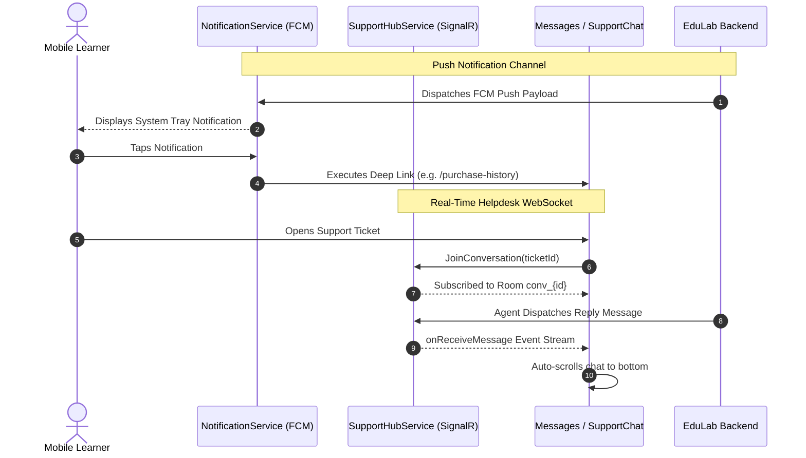

# Mobile Feature Architecture: Inbox & Support (`InboxAndSupport`)

> **Feature Directory:** [`apps/mobile/lib/features/inbox/`](file:///d:/Programming/MonoRepo%20Porjects/EducationLab/apps/mobile/lib/features/inbox/)  
> **Key Screens:** [`NotificationsScreen`](file:///d:/Programming/MonoRepo%20Porjects/EducationLab/apps/mobile/lib/features/inbox/presentation/screens/notifications_screen.dart), [`MessagesScreen`](file:///d:/Programming/MonoRepo%20Porjects/EducationLab/apps/mobile/lib/features/inbox/presentation/screens/messages_screen.dart), [`SupportChatScreen`](file:///d:/Programming/MonoRepo%20Porjects/EducationLab/apps/mobile/lib/features/inbox/presentation/screens/support_chat_screen.dart)  
> **State Management:** [`NotificationProvider`](file:///d:/Programming/MonoRepo%20Porjects/EducationLab/apps/mobile/lib/features/inbox/presentation/providers/notification_provider.dart), [`SupportProvider`](file:///d:/Programming/MonoRepo%20Porjects/EducationLab/apps/mobile/lib/features/inbox/presentation/providers/support_provider.dart)  
> **Real-Time Services:** [`NotificationService`](file:///d:/Programming/MonoRepo%20Porjects/EducationLab/apps/mobile/lib/core/services/notification_service.dart) (FCM), [`SupportHubService`](file:///d:/Programming/MonoRepo%20Porjects/EducationLab/apps/mobile/lib/core/services/support_hub_service.dart) (SignalR)

---

## 1. Feature Overview & Scope

The `InboxAndSupport` feature powers academic notifications, administrative alerts, and real-time customer support messaging. It encompasses:
1. **Push Notifications & Background Handling:** Firebase Cloud Messaging (FCM) integration with background isolate handlers, local notification channels, and deep-link payload routing.
2. **Notification Management Screen:** In-app notification center with category chips (Academic, Invoices, System), swipe-to-delete, mark all as read, and batch clearing confirmation modals.
3. **Support Tickets Console (Messages):** Index of open and resolved inquiry threads, relative timestamp formatting, and new ticket modal creation (`NewConversationSheet`).
4. **Real-Time Support Chat:** Bi-directional WebSockets powered by ASP.NET Core SignalR, auto-scrolling message streams, room join/leave lifecycle, and ticket closure administration.

---

## 2. Notification & Messaging Architecture

---

## 3. Real-Time SignalR Hub Lifecycle

1. **Connection Initialization:** `SupportHubService.init()` configures the `HubConnectionBuilder` using the student's JWT access token with automatic reconnection (`withAutomaticReconnect`).
2. **Room Management:**
   * Entering a chat invokes `hub.invoke('JoinConversation', args: [conversationId])`.
   * Exiting a chat (`PopScope` or back button) invokes `hub.invoke('LeaveConversation', args: [conversationId])`.
3. **Message Dispatch:** `sendMessage()` sends payload via REST API (`POST /api/Support/conversations/{id}/messages`), while the SignalR hub broadcasts the message back to all active room participants.

---

## 4. Security & Privacy Assurance

1. **JWT Room Authorization:**
   * Students cannot join or eavesdrop on conversation rooms belonging to other accounts; the ASP.NET Core SignalR hub enforces claims-based user validation.
2. **Background FCM Isolate Hygiene:**
   * Background push notification payloads are processed in an isolated headless runner without executing UI rendering passes.
