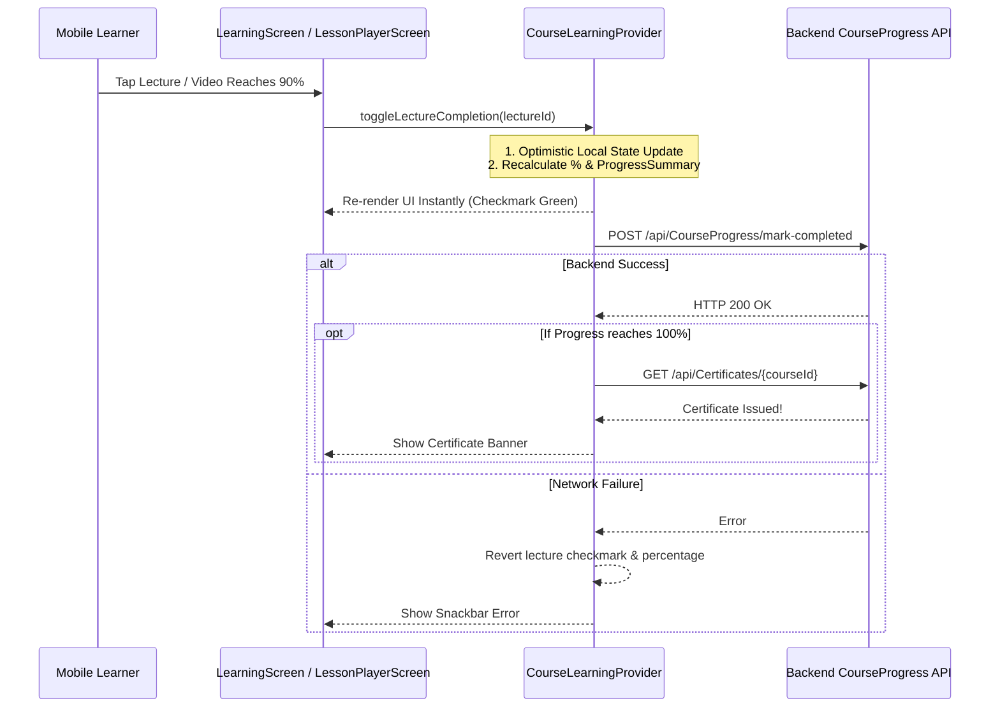

# Mobile Learning & Enrollment Feature Architecture

> **Module:** `features/learning`  
> **Source Directory:** [`apps/mobile/lib/features/learning/`](file:///d:/Programming/MonoRepo%20Porjects/EducationLab/apps/mobile/lib/features/learning/)  
> **Key Files:**  
> - Screen: [`learning_screen.dart`](file:///d:/Programming/MonoRepo%20Porjects/EducationLab/apps/mobile/lib/features/learning/presentation/screens/learning_screen.dart) (2,481 lines)  
> - Providers: [`course_learning_provider.dart`](file:///d:/Programming/MonoRepo%20Porjects/EducationLab/apps/mobile/lib/features/learning/presentation/providers/course_learning_provider.dart), [`enrollment_provider.dart`](file:///d:/Programming/MonoRepo%20Porjects/EducationLab/apps/mobile/lib/features/learning/presentation/providers/enrollment_provider.dart)  
> - Repositories: [`course_learning_repository.dart`](file:///d:/Programming/MonoRepo%20Porjects/EducationLab/apps/mobile/lib/features/learning/data/repositories/course_learning_repository.dart), [`enrollment_repository.dart`](file:///d:/Programming/MonoRepo%20Porjects/EducationLab/apps/mobile/lib/features/learning/data/repositories/enrollment_repository.dart)  
> - Services: [`course_learning_api_service.dart`](file:///d:/Programming/MonoRepo%20Porjects/EducationLab/apps/mobile/lib/features/learning/data/services/course_learning_api_service.dart), [`enrollment_api_service.dart`](file:///d:/Programming/MonoRepo%20Porjects/EducationLab/apps/mobile/lib/features/learning/data/services/enrollment_api_service.dart)  
> - Models: [`course_progress_models.dart`](file:///d:/Programming/MonoRepo%20Porjects/EducationLab/apps/mobile/lib/features/learning/data/models/course_progress_models.dart), [`enrollment_model.dart`](file:///d:/Programming/MonoRepo%20Porjects/EducationLab/apps/mobile/lib/features/learning/data/models/enrollment_model.dart), [`lecture_comment_model.dart`](file:///d:/Programming/MonoRepo%20Porjects/EducationLab/apps/mobile/lib/features/learning/data/models/lecture_comment_model.dart)

---

## 1. Feature Architecture Overview

The Learning module manages the enrolled student's personal study space, tracking real-time syllabus progression, optimistic lecture checkoffs, Q&A discussions, supplementary resource downloads, and automatic completion accreditation.

---

## 2. Screen Reference: `LearningScreen`

- **File Path:** [`apps/mobile/lib/features/learning/presentation/screens/learning_screen.dart`](file:///d:/Programming/MonoRepo%20Porjects/EducationLab/apps/mobile/lib/features/learning/presentation/screens/learning_screen.dart)
- **Route:** Tab 2 in `MainNavigationScreen` (`/learning`).
- **Scale:** 2,481 lines of Dart code managing 3 major student portals.

### 2.1 The 3 Learning Portals (`LearningMainSection`)
1. **My Courses (`myCourses`)**:
   - Lists all enrolled courses with dynamic linear progress bars (`progressRatio`), remaining lectures count, and last accessed timestamps.
   - **Filter Pills (`CourseStatusFilter`)**:
     - `all`: All active enrollments.
     - `inProgress`: Courses with `0 < progressPercentage < 100`.
     - `completed`: 100% completed courses.
     - `notStarted`: Enrolled courses with 0 completed lectures.
   - **Sorting Modal (`CourseSortOption`)**:
     - `recentAccess`: Sorts by `lastActivity` desc.
     - `recentEnrolled`: Sorts by `enrolledAt` desc.
     - `titleAZ`: Alphabetical title sort.
     - `progressHigh`: Highest progress ratio first.
   - Card Action: `"متابعة التعلم"` opens `LessonPlayerScreen` automatically resumed to the first uncompleted lesson.
2. **My Favourite (`myFavourite`)**:
   - Integrated wishlist tab showing saved courses.
   - Provides quick `"نقل إلى السلة"` (move to cart) or removal actions.
3. **My Certificates (`myCertificates`)**:
   - Showcase gallery of earned digital credentials.
   - Tapping any credential opens `CertificateViewScreen` with direct PDF download and cryptographic validation.

---

## 3. Provider State Machines

### 3.1 `CourseLearningProvider`
**File:** [`apps/mobile/lib/features/learning/presentation/providers/course_learning_provider.dart`](file:///d:/Programming/MonoRepo%20Porjects/EducationLab/apps/mobile/lib/features/learning/presentation/providers/course_learning_provider.dart)
- **Intelligent Lesson Resumption (`_locateInitialLecture`)**:
  - When opening a course, scans the syllabus tree against `_lectureStatuses`.
  - Automatically identifies and navigates to the first lesson that has not yet been marked completed.
- **Sequential Auto-Navigation**:
  - `playNextLesson()`: Advances to the next lecture in current section, or traverses into index 0 of the succeeding section. Returns `false` upon reaching the syllabus end.
  - `playPreviousLesson()`: Steps backward across chapters.
- **Q&A Discussions Threading**:
  - `addLectureComment(lectureId, content)`: Posts question bubble to `/api/LectureComments`.
  - `addCommentReply(commentId, content)`: Submits nested reply to instructor thread.
- **Course Rating Submission**:
  - `submitRating(rating, review)`: Issues POST to `/api/CourseRating` updating the course score and student testimonial.

### 3.2 `EnrollmentProvider`
**File:** [`apps/mobile/lib/features/learning/presentation/providers/enrollment_provider.dart`](file:///d:/Programming/MonoRepo%20Porjects/EducationLab/apps/mobile/lib/features/learning/presentation/providers/enrollment_provider.dart)
- Manages global enrollment cache across the app.
- Methods: `fetchEnrollments({bool forceRefresh})`, `isEnrolledInCourse(int courseId)`, `getEnrollment(int courseId)`.
- Used by `CourseDetailsScreen` to immediately replace `"شراء الآن"` with `"متابعة التعلم"`.
