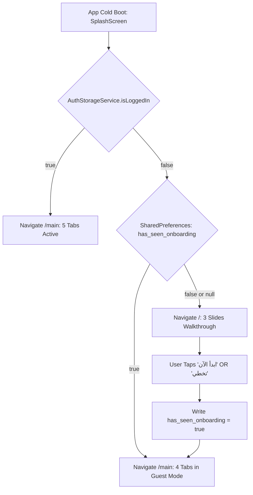
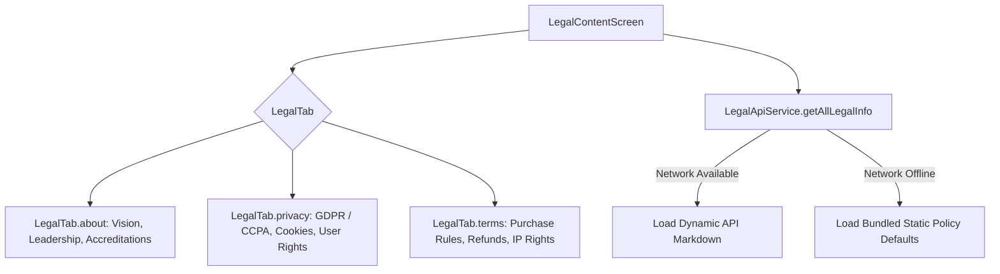

# Mobile Feature Architecture: Legal & Onboarding (`LegalAndOnboarding`)

> **Feature Directory:** [`apps/mobile/lib/features/onboarding/`](file:///d:/Programming/MonoRepo%20Porjects/EducationLab/apps/mobile/lib/features/onboarding/), [`apps/mobile/lib/features/legal/`](file:///d:/Programming/MonoRepo%20Porjects/EducationLab/apps/mobile/lib/features/legal/), [`apps/mobile/lib/features/splash/`](file:///d:/Programming/MonoRepo%20Porjects/EducationLab/apps/mobile/lib/features/splash/)  
> **Key Screens:** [`SplashScreen`](file:///d:/Programming/MonoRepo%20Porjects/EducationLab/apps/mobile/lib/features/splash/presentation/screens/splash_screen.dart), [`OnboardingScreen`](file:///d:/Programming/MonoRepo%20Porjects/EducationLab/apps/mobile/lib/features/onboarding/presentation/screens/onboarding_screen.dart), [`LegalContentScreen`](file:///d:/Programming/MonoRepo%20Porjects/EducationLab/apps/mobile/lib/features/legal/presentation/screens/legal_content_screen.dart)  
> **State & Services:** `LegalApiService`, `SharedPreferences`, `AuthStorageService`

---

## 1. Feature Overview & Scope

The `LegalAndOnboarding` feature controls initial user adoption, first-time application launch orientation, and institutional regulatory transparency. It coordinates:
1. **Cold-Boot Routing (Splash Screen):** Validates authentication state and onboarding completion flags to deterministically launch users into either Onboarding (`'/'`), Guest Mode, or Authenticated Home (`'/main'`).
2. **Interactive Onboarding Walkthrough:** 3-slide value proposition carousel with breathing glow animations (`_pulseController`), orbiting satellite particle effects (`_orbitController`), and auto-advancing slide timers.
3. **Institutional Legal Console:** Three-tab legal policy viewer (About Us, Privacy Policy, Terms of Service) backed by `LegalApiService` with offline bundled fallbacks.

---

## 2. Bootstrapping Decision Architecture

---

## 3. Legal Information Architecture

---

## 4. Compliance & App Store Review Readiness

1. **GDPR & Privacy Compliance:**
   * All privacy and terms documents are accessible without requiring account creation or login, meeting Apple App Store Review Guideline 5.1.1 and Google Play User Data policies.
2. **Zero-Failure Offline Architecture:**
   * Static policy definitions (`LegalApiService.getDefaultDoc`) ensure the legal tab never renders a blank screen even under total network failure.
