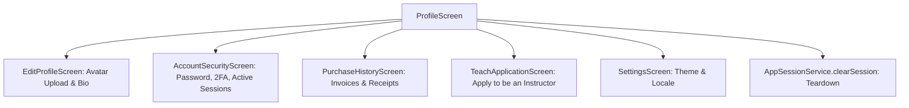

# Mobile Profile & Settings Feature Architecture

> **Module:** `features/profile`  
> **Source Directory:** [`apps/mobile/lib/features/profile/`](file:///d:/Programming/MonoRepo%20Porjects/EducationLab/apps/mobile/lib/features/profile/)  
> **Key Files:**  
> - Screens: [`profile_screen.dart`](file:///d:/Programming/MonoRepo%20Porjects/EducationLab/apps/mobile/lib/features/profile/presentation/screens/profile_screen.dart), [`edit_profile_screen.dart`](file:///d:/Programming/MonoRepo%20Porjects/EducationLab/apps/mobile/lib/features/profile/presentation/screens/edit_profile_screen.dart), [`account_security_screen.dart`](file:///d:/Programming/MonoRepo%20Porjects/EducationLab/apps/mobile/lib/features/profile/presentation/screens/account_security_screen.dart) (1,200 lines), [`purchase_history_screen.dart`](file:///d:/Programming/MonoRepo%20Porjects/EducationLab/apps/mobile/lib/features/profile/presentation/screens/purchase_history_screen.dart), [`teach_application_screen.dart`](file:///d:/Programming/MonoRepo%20Porjects/EducationLab/apps/mobile/lib/features/profile/presentation/screens/teach_application_screen.dart), [`settings_screen.dart`](file:///d:/Programming/MonoRepo%20Porjects/EducationLab/apps/mobile/lib/features/profile/presentation/screens/settings_screen.dart)  
> - Providers: [`profile_provider.dart`](file:///d:/Programming/MonoRepo%20Porjects/EducationLab/apps/mobile/lib/features/profile/presentation/providers/profile_provider.dart), [`teach_application_provider.dart`](file:///d:/Programming/MonoRepo%20Porjects/EducationLab/apps/mobile/lib/features/profile/presentation/providers/teach_application_provider.dart)  
> - Repositories: [`profile_repository.dart`](file:///d:/Programming/MonoRepo%20Porjects/EducationLab/apps/mobile/lib/features/profile/data/repositories/profile_repository.dart), [`security_repository.dart`](file:///d:/Programming/MonoRepo%20Porjects/EducationLab/apps/mobile/lib/features/profile/data/repositories/security_repository.dart), [`payment_repository.dart`](file:///d:/Programming/MonoRepo%20Porjects/EducationLab/apps/mobile/lib/features/profile/data/repositories/payment_repository.dart)  
> - Models: [`user_profile_model.dart`](file:///d:/Programming/MonoRepo%20Porjects/EducationLab/apps/mobile/lib/features/profile/data/models/user_profile_model.dart), [`security_models.dart`](file:///d:/Programming/MonoRepo%20Porjects/EducationLab/apps/mobile/lib/features/profile/data/models/security_models.dart), [`payment_model.dart`](file:///d:/Programming/MonoRepo%20Porjects/EducationLab/apps/mobile/lib/features/profile/data/models/payment_model.dart), [`instructor_application_models.dart`](file:///d:/Programming/MonoRepo%20Porjects/EducationLab/apps/mobile/lib/features/profile/data/models/instructor_application_models.dart)

---

## 1. Feature Architecture Overview

The Profile & Settings feature manages user identity, account security (passwords, 2FA TOTP, session revocation), transactional billing histories, instructor recruitment onboarding, and global app personalization (theme & language).

---

## 2. Screen Reference & Implementations

### 2.1 Profile Screen (`ProfileScreen`)
- **File Path:** [`apps/mobile/lib/features/profile/presentation/screens/profile_screen.dart`](file:///d:/Programming/MonoRepo%20Porjects/EducationLab/apps/mobile/lib/features/profile/presentation/screens/profile_screen.dart)
- **Route:** Tab 3 in `MainNavigationScreen` (`/profile`).
- **Functionality:**
  - Header displays circular profile avatar, verified student/instructor badge, email, and joined date.
  - Quick action links to Edit Profile, Certificates, Wishlist, Purchase History, Security, and Settings.
  - Teardown: Bottom sheet confirmation invoking `AppSessionService.clearSession(context)`.

---

### 2.2 Edit Profile Screen (`EditProfileScreen`)
- **File Path:** [`apps/mobile/lib/features/profile/presentation/screens/edit_profile_screen.dart`](file:///d:/Programming/MonoRepo%20Porjects/EducationLab/apps/mobile/lib/features/profile/presentation/screens/edit_profile_screen.dart)
- **Route:** `/edit-profile`
- **Features:**
  - **Multipart Avatar Upload:** Uses `image_picker` to select camera or gallery photo, compressing and dispatching via `ApiClient.postFormDataSafe` to `/api/Profile/upload-avatar`.
  - **Social Links Form:** Handles GitHub, LinkedIn, Twitter, and Facebook handles, applying `SocialLinksModel.cleanUrl` before submission to avoid ASP.NET URL validation rejections.
  - **Biographical & Contact Info:** Form validation for full name, phone number, location, and postal code.

---

### 2.3 Account Security Screen (`AccountSecurityScreen`)
- **File Path:** [`apps/mobile/lib/features/profile/presentation/screens/account_security_screen.dart`](file:///d:/Programming/MonoRepo%20Porjects/EducationLab/apps/mobile/lib/features/profile/presentation/screens/account_security_screen.dart)
- **Route:** `/account-security`
- **Scale:** 1,200 lines of Dart code.
- **Three Pillars of Security:**
  1. **Password Change:** Secure current vs new password form with minimum character and special symbol validation.
  2. **Two-Factor Authentication (2FA TOTP):**
     - Queries `/api/Security/2fa-setup` to retrieve TOTP secret key and QR code image URL.
     - Displays recovery codes with one-tap clipboard copy.
     - Verification code input to activate or disable 2FA protection.
  3. **Active Devices & Session Revocation:**
     - Displays active sessions list with device name, IP address, approximate geographical location, and last active timestamp.
     - Highlights current device with `"هذا الجهاز"`.
     - Remote session revocation button terminating unauthorized logins via `/api/Security/revoke-session/{id}`.

---

### 2.4 Purchase History Screen (`PurchaseHistoryScreen`)
- **File Path:** [`apps/mobile/lib/features/profile/presentation/screens/purchase_history_screen.dart`](file:///d:/Programming/MonoRepo%20Porjects/EducationLab/apps/mobile/lib/features/profile/presentation/screens/purchase_history_screen.dart)
- **Route:** `/purchase-history`
- **Features:**
  - Lists past transactions with course title, purchase date, payment method, amount paid, and invoice receipt download button.

---

### 2.5 Instructor Application (`TeachApplicationScreen`)
- **File Path:** [`apps/mobile/lib/features/profile/presentation/screens/teach_application_screen.dart`](file:///d:/Programming/MonoRepo%20Porjects/EducationLab/apps/mobile/lib/features/profile/presentation/screens/teach_application_screen.dart)
- **Route:** `/teach-application`
- **Features:**
  - Form collecting applicant biography, field of teaching expertise, and previous instructional experience.
  - Document file picker allowing applicants to attach PDF resume/CV files.
  - Submits dossier to `/api/InstructorApplication` and tracks review status (`Pending`, `Approved`, `Rejected`).

---

### 2.6 App Settings Screen (`SettingsScreen`)
- **File Path:** [`apps/mobile/lib/features/profile/presentation/screens/settings_screen.dart`](file:///d:/Programming/MonoRepo%20Porjects/EducationLab/apps/mobile/lib/features/profile/presentation/screens/settings_screen.dart)
- **Route:** `/settings`
- **Features:**
  - **Theme Mode Selection:** Light, Dark, or Match System OS via `ThemeService`.
  - **Language Selection:** Arabic (`ar`) vs English (`en`) via `LocaleService`.
  - **Push Notification Switches:** Toggles marketing, course progress, and discussion notification channels.
