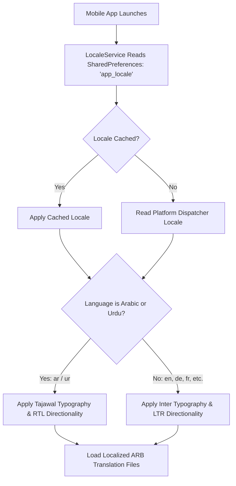

# Mobile Localization & Internationalization (i18n / l10n)

> **Module Path:** [`apps/mobile/lib/l10n/`](file:///d:/Programming/MonoRepo%20Porjects/EducationLab/apps/mobile/lib/l10n/)  
> **Supported Locales:** 20 Languages  
> **Typography Engines:** `Tajawal` (Arabic & Urdu) / `Inter` (Latin, Cyrillic, Asian scripts)  
> **State Controller:** [`LocaleService`](file:///d:/Programming/MonoRepo%20Porjects/EducationLab/apps/mobile/lib/core/services/locale_service.dart)  
> **Extension:** [`localization_ext.dart`](file:///d:/Programming/MonoRepo%20Porjects/EducationLab/apps/mobile/lib/core/extensions/localization_ext.dart) (`context.loc`, `context.isArabic`)

---

## 1. Architectural Overview & Design Objectives

The EducationLab mobile application features an internationalization system supporting **20 distinct languages** natively. It enforces bi-directional (LTR / RTL) layout mirroring, dynamic typography switching, digit sanitization, and localized date/number formatting.



---

## 2. Complete Catalog of Supported Locales

| Language Name (Native) | English Name | ISO Code | Script Direction | Primary Font Family | Translation File |
| :--- | :--- | :--- | :--- | :--- | :--- |
| **العربية** | Arabic | `ar` | **RTL** | `Tajawal` | `app_ar.arb` |
| **English** | English | `en` | **LTR** | `Inter` | `app_en.arb` |
| **Deutsch** | German | `de` | **LTR** | `Inter` | `app_de.arb` |
| **Español** | Spanish | `es` | **LTR** | `Inter` | `app_es.arb` |
| **Français** | French | `fr` | **LTR** | `Inter` | `app_fr.arb` |
| **Italiano** | Italian | `it` | **LTR** | `Inter` | `app_it.arb` |
| **Português** | Portuguese | `pt` | **LTR** | `Inter` | `app_pt.arb` |
| **Nederlands** | Dutch | `nl` | **LTR** | `Inter` | `app_nl.arb` |
| **Türkçe** | Turkish | `tr` | **LTR** | `Inter` | `app_tr.arb` |
| **Русский** | Russian | `ru` | **LTR** | `Inter` | `app_ru.arb` |
| **Українська** | Ukrainian | `uk` | **LTR** | `Inter` | `app_uk.arb` |
| **Polski** | Polish | `pl` | **LTR** | `Inter` | `app_pl.arb` |
| **Bahasa Indonesia** | Indonesian | `id` | **LTR** | `Inter` | `app_id.arb` |
| **Bahasa Melayu** | Malay | `ms` | **LTR** | `Inter` | `app_ms.arb` |
| **हिन्दी** | Hindi | `hi` | **LTR** | `Inter` | `app_hi.arb` |
| **اردو** | Urdu | `ur` | **RTL** | `Tajawal` | `app_ur.arb` |
| **中文** | Chinese | `zh` | **LTR** | `Inter` | `app_zh.arb` |
| **日本語** | Japanese | `ja` | **LTR** | `Inter` | `app_ja.arb` |
| **한국어** | Korean | `ko` | **LTR** | `Inter` | `app_ko.arb` |
| **Tiếng Việt** | Vietnamese | `vi` | **LTR** | `Inter` | `app_vi.arb` |

---

## 3. Dynamic Typography Switching & Directionality

Typography is handled dynamically at the root `MaterialApp` level. Rather than enforcing a static font, `AppTheme` inspects the active locale:

```dart
String getFontFamily(Locale locale) {
  if (locale.languageCode == 'ar' || locale.languageCode == 'ur') {
    return 'Tajawal';
  }
  return 'Inter';
}
```

### Layout Mirroring Rules
1. **Paddings & Insets:** All directional paddings utilize `EdgeInsetsDirectional` (`start` and `end`) rather than hardcoded `left` and `right`.
2. **Icons:** Navigation chevrons flip automatically via `Icons.arrow_back_ios_new_rounded` vs `Icons.arrow_forward_ios_rounded` depending on `Directionality.of(context) == TextDirection.rtl`.
3. **Number Conversions:** Phone and payment inputs enforce Latin digits (`0-9`) using `_ArabicDigitsToEnglishFormatter` to avoid API rejection.

---

## 4. Developer API & Syntactic Sugar

The extension [`localization_ext.dart`](file:///d:/Programming/MonoRepo%20Porjects/EducationLab/apps/mobile/lib/core/extensions/localization_ext.dart) provides instant access to localized strings:

```dart
extension LocalizationContext on BuildContext {
  AppLocalizations get loc => AppLocalizations.of(this)!;
  bool get isArabic => Localizations.localeOf(this).languageCode == 'ar';
  bool get isRtl => Directionality.of(this) == TextDirection.rtl;
}
```

### Usage Example:
```dart
Text(context.loc.loginTitle, style: TextStyle(fontFamily: context.isArabic ? 'Tajawal' : 'Inter'));
```
