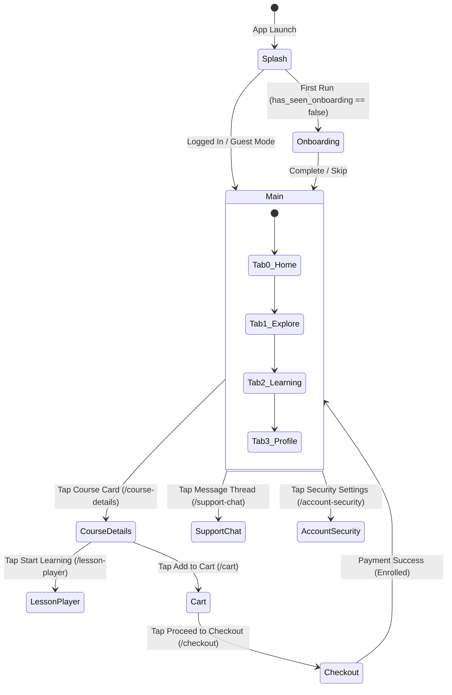

# Mobile Navigation & Routing Architecture

> **Framework:** Flutter Declarative Routing  
> **Route Registry:** [`apps/mobile/lib/app.dart:73-108`](file:///d:/Programming/MonoRepo%20Porjects/EducationLab/apps/mobile/lib/app.dart#L73-L108)  
> **Transitions:** `CupertinoPageRoute` on iOS and smooth predictive back on Android  
> **Navigation Bar:** Custom floating bottom navigation (`flutter_floating_bottom_bar`)

This document details the navigation architecture, page transitions, argument contracts, and deep linking mechanisms of the EducationLab mobile client.

---

## 1. Routing Architecture & Main Shell

The application employs a centralized named route dictionary mapped in `EducationLabApp` (`app.dart`).

---

## 2. Exhaustive Named Routes Catalog (28 Routes)

| Route Name | Screen Widget | Expected Arguments | Description |
| :--- | :--- | :--- | :--- |
| `'/'` | `OnboardingScreen` | `null` | 3-step value proposition onboarding flow. |
| `'/splash'` | `SplashScreen` | `null` | Initial launch animation and session routing. |
| `'/login'` | `LoginScreen` | `null` | Authentication screen (Login / 2-step OTP Register). |
| `'/main'` | `MainNavigationScreen` | `null` | 4-tab shell with floating bottom navigation bar. |
| `'/course-details'` | `CourseDetailsScreen`| `int courseId` or `Map` | Syllabus, instructor profile, reviews, and trailer preview. |
| `'/lesson-player'` | `LessonPlayerScreen` | `Map{courseId, initialLectureId}` | Video player, gestural scrubbing, speed, comments thread. |
| `'/cart'` | `CartScreen` | `null` | Shopping cart, coupon discounts, order summary. |
| `'/checkout'` | `CheckoutScreen` | `null` | Stripe payment gateway, card input formatters, Luhn check. |
| `'/wishlist'` | `WishlistScreen` | `null` | Saved bookmarked courses gallery. |
| `'/learning'` | `LearningScreen` | `int? initialTab` | My Courses / My Favourite / My Certificates portals. |
| `'/profile'` | `ProfileScreen` | `null` | User credentials, avatar, and navigation hub. |
| `'/edit-profile'` | `EditProfileScreen` | `null` | Profile editing and image picker avatar upload. |
| `'/account-security'`| `AccountSecurityScreen`| `null` | Password change, 2FA TOTP QR setup, session revocation. |
| `'/purchase-history'`| `PurchaseHistoryScreen`| `null` | Billing history and transaction receipts. |
| `'/settings'` | `SettingsScreen` | `null` | Theme mode selector, language toggling, push channels. |
| `'/teach-application'`| `TeachApplicationScreen`| `null` | Instructor onboarding application with PDF CV upload. |
| `'/notifications'` | `NotificationsScreen` | `null` | System updates, grade alerts, and study reminders. |
| `'/messages'` | `MessagesScreen` | `null` | Support tickets directory and new conversation modal. |
| `'/support-chat'` | `SupportChatScreen` | `SupportConversationModel` | Live interactive SignalR chat with support staff. |
| `'/instructors'` | `InstructorsScreen` | `null` | Faculty directory with keyword search. |
| `'/instructor-profile'`| `InstructorProfileScreen`| `String instructorId` | Public instructor bio and authored course catalog. |
| `'/certificate-view'`| `CertificateViewScreen`| `CertificateModel` | High-fidelity digital certificate canvas with PDF export. |
| `'/my-certificates'` | `MyCertificatesScreen` | `null` | User trophies and issued credentials list. |
| `'/assignments'` | `AssignmentsScreen` | `int courseId` | Homework assignments and submission uploads. |
| `'/schedule'` | `ScheduleScreen` | `int courseId` | Calendar study agenda and session scheduling. |
| `'/legal-content'` | `LegalContentScreen` | `LegalTab` | Localized About Us, Privacy Policy, Terms of Service tabs. |
| `'/explore'` | `ExploreScreen` | `CategoryItem?`, `query` | Full-text debounced catalog search. |
| `'/error'` | `Scaffold (Error)` | `String? message` | Fallback route for unhandled route transitions. |

---

## 3. Shell Navigation: `MainNavigationScreen`

**File:** [`apps/mobile/lib/features/main/presentation/screens/main_navigation_screen.dart`](file:///d:/Programming/MonoRepo%20Porjects/EducationLab/apps/mobile/lib/features/main/presentation/screens/main_navigation_screen.dart)

- **Floating Glassmorphic Bar:** Implemented via `flutter_floating_bottom_bar` to provide an un-clipped view of content beneath navigation tabs.
- **Tab Layout:**
  - Index 0: `HomeScreen` (Discovery)
  - Index 1: `ExploreScreen` (Catalog & Search)
  - Index 2: `LearningScreen` (Enrolled Courses & Certificates)
  - Index 3: `ProfileScreen` (User Account & Settings)
- **Deep Programmatic Tab Switching:**
  - `MainNavigationScreen.switchToExplore(context, {category, autoFocusSearch, filterIndex})`: Allows banners or search inputs on the Home screen to jump smoothly to Explore with pre-filtered parameters.
