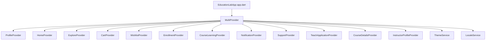

# Mobile State Management & Providers Reference

> **Framework:** Flutter 3.x / Dart 3.11  
> **Pattern:** `ChangeNotifier` + `Provider` (`provider: ^6.1.2`)  
> **Registration Root:** MultiProvider tree in [`apps/mobile/lib/app.dart:54-68`](file:///d:/Programming/MonoRepo%20Porjects/EducationLab/apps/mobile/lib/app.dart#L54-L68)  
> **Total Providers:** 12 Active ViewModels / State Controllers

This document provides an exhaustive, code-level architectural reference for all 12 providers governing UI state, optimistic mutations, background synchronization, and network caching across the EducationLab mobile app.

---

## 1. Provider Tree & Lifecycle

The app registers all global view models above the `MaterialApp` widget in `app.dart` to allow cross-cutting state consumption and unified session teardown:

---

## 2. Complete Catalog of All 12 Providers

### 2.1 `CartProvider`
**File:** [`apps/mobile/lib/features/cart/presentation/providers/cart_provider.dart`](file:///d:/Programming/MonoRepo%20Porjects/EducationLab/apps/mobile/lib/features/cart/presentation/providers/cart_provider.dart)  
**Dependencies:** `CartRepository`

Manages the learner's shopping cart, promotional coupon discounts, and subtotal calculations.

| State Property | Type | Description |
| :--- | :--- | :--- |
| `_cart` | `CartModel?` | Active server-side cart instance. |
| `_items` | `List<CartItemModel>` | Local cart items array. |
| `_isLoading` | `bool` | Network fetch spinner flag. |
| `_isApplyingCoupon` | `bool` | Coupon redemption in progress. |
| `_appliedCouponCode`| `String?` | Validated promo code string. |
| `_discountPercent` | `double` | Applied percentage deduction (e.g. 20.0 for 20%). |
| `_errorMessage` | `String?` | Localized error prompt. |

#### Methods & State Mutations:
- `Future<void> fetchCart({bool forceRefresh = false})`: Queries `CartRepository.getCart()`. Updates `_items`, computes `totalPrice`, and triggers `notifyListeners()`.
- `Future<bool> addToCart(int courseId)`: Sends POST to `/api/Cart/add`. Checks for duplicates. Optimistically updates badge count.
- `Future<bool> removeFromCart(int cartItemId)`: Calls `DELETE /api/Cart/items/{id}`. Removes item from `_items` and recalculates total.
- `Future<bool> clearCart()`: Issues `DELETE /api/Cart` clearing all items.
- `bool applyCoupon(String code)`: Evaluates promotional codes (`EDULAB20`, `SUPER50`, `WELCOME`). If valid, sets `_discountPercent` and recalculates `finalPrice`.
- `void removeCoupon()`: Resets discount to 0.0.
- `void reset()`: Wipes in-memory items on session logout.

---

### 2.2 `ExploreProvider`
**File:** [`apps/mobile/lib/features/catalog/presentation/providers/explore_provider.dart`](file:///d:/Programming/MonoRepo%20Porjects/EducationLab/apps/mobile/lib/features/catalog/presentation/providers/explore_provider.dart)  
**Dependencies:** `ExploreRepository`

Drives multi-criteria course exploration, full-text debounced searches, and category browsing.

| State Property | Type | Description |
| :--- | :--- | :--- |
| `_loadedCourses` | `List<HomeCourseDTO>` | Active query results. |
| `_categoryCache` | `Map<int, List<HomeCourseDTO>>`| Two-tier in-memory category cache. |
| `_searchPoolCache` | `List<HomeCourseDTO>?` | Full catalog pool cached for offline-like local filtering. |
| `_searchQuery` | `String` | Active text filter input. |
| `_activeCategory` | `CategoryItem?` | Currently selected discipline chip. |
| `_selectedFilterIndex`| `int` | Active chip filter (0: All, 1: Top Rated, 2: Bestsellers, 3: <$50). |
| `_recentSearches` | `List<String>` | SharedPreferences-backed query history. |

#### Methods & State Mutations:
- `Future<void> selectCategory(CategoryItem? category, {bool forceRefresh = false})`: Checks `_categoryCache`. If missing, queries `/api/Category/{id}/courses` (up to 50 courses) and caches result.
- `Future<void> onSearchSubmitted(String query)`: Commits query to recent searches, seeds `_searchPoolCache`, and dispatches filtered search.
- `List<CourseItem> getFilteredCourses([BuildContext? context])`: Multi-pass in-memory filter evaluating category ID, substring title/instructor/description match, rating `>= 4.7`, and bestseller status.
- `void clearFilters()`: Instantly clears query, active category, and chip selections without server reload.

---

### 2.3 `CourseDetailsProvider`
**File:** [`apps/mobile/lib/features/courses/presentation/providers/course_details_provider.dart`](file:///d:/Programming/MonoRepo%20Porjects/EducationLab/apps/mobile/lib/features/courses/presentation/providers/course_details_provider.dart)  
**Dependencies:** `CoursesRepository`

Supplies the comprehensive curriculum, syllabus tree, and metadata for `CourseDetailsScreen`.

| State Property | Type | Description |
| :--- | :--- | :--- |
| `_course` | `CourseDetailsModel?` | Course aggregate root (syllabus, sections, lectures). |
| `_isLoading` | `bool` | Loading state flag. |
| `_errorMessage` | `String?` | Error description if fetch fails. |

#### Methods & State Mutations:
- `Future<void> fetchCourseDetails(int courseId, {bool forceRefresh = false})`: Queries `GET /api/Course/{id}` and deserializes complete syllabus tree.
- `void toggleSection(int sectionId)`: Toggles section accordion expand/collapse state in memory without network reload.

---

### 2.4 `HomeProvider`
**File:** [`apps/mobile/lib/features/home/presentation/providers/home_provider.dart`](file:///d:/Programming/MonoRepo%20Porjects/EducationLab/apps/mobile/lib/features/home/presentation/providers/home_provider.dart)  
**Dependencies:** `HomeRepository`

Orchestrates the home screen feed by dispatching 7 parallel requests and handling graceful client-side fallbacks.

| State Property | Type | Description |
| :--- | :--- | :--- |
| `_categories` | `List<HomeCategoryDTO>` | Active category chips with computed counts. |
| `_featuredCourses` | `List<HomeCourseDTO>` | Highest priority promoted courses. |
| `_recommended` | `List<HomeCourseDTO>` | Personalized course suggestions. |
| `_newCourses` | `List<HomeCourseDTO>` | Recently published syllabus entries. |
| `_topInstructors` | `List<HomeInstructorDTO>` | Featured instructors roster. |
| `_stats` | `HomeStatsDTO` | Platform enrollment and course counts. |
| `_allCourses` | `List<HomeCourseDTO>` | General course pool for fallback sorting. |

#### Methods & State Mutations:
- `Future<void> fetchHomeData({bool forceRefresh = false})`: Dispatches `Future.wait` across 7 endpoints (`Category`, `Featured`, `Recommended`, `New`, `Instructors`, `Stats`, `AllCourses`).
- `void _enrichCategories()`: Computes real-time course counts per category from `_allCourses` and sorts categories descending by popularity.
- Fallback Sorting: If dedicated endpoints return empty, autonomously sorts `_allCourses` by rating or creation date.

---

### 2.5 `InstructorProfileProvider`
**File:** [`apps/mobile/lib/features/home/presentation/providers/instructor_profile_provider.dart`](file:///d:/Programming/MonoRepo%20Porjects/EducationLab/apps/mobile/lib/features/home/presentation/providers/instructor_profile_provider.dart)  
**Dependencies:** `HomeRepository`

Manages public instructor credentials, authored courses, student counts, and ratings.
- `fetchInstructorProfile(String instructorId)`: Calls `/api/InstructorProfile/{id}` and updates UI listeners.

---

### 2.6 `NotificationProvider`
**File:** [`apps/mobile/lib/features/inbox/presentation/providers/notification_provider.dart`](file:///d:/Programming/MonoRepo%20Porjects/EducationLab/apps/mobile/lib/features/inbox/presentation/providers/notification_provider.dart)  
**Dependencies:** `NotificationRepository`

Maintains the user's notification inbox and real-time unread badge counts.

| State Property | Type | Description |
| :--- | :--- | :--- |
| `_notifications` | `List<NotificationModel>` | Paginated inbox items. |
| `_unreadCount` | `int` | Dynamic badge count. |
| `_isLoading` | `bool` | Loading spinner flag. |

#### Methods & State Mutations:
- `Future<void> fetchNotifications({bool forceRefresh = false})`: Queries `/api/Notifications` and `/api/Notifications/summary`.
- `Future<void> markAsRead(int notificationId)`: Optimistically marks notification as read; updates unread count; issues background PUT request.
- `Future<void> markAllAsRead()`: Sets all in-memory items to read and resets unread count to 0.
- `Future<void> deleteNotification(int id)`: Removes item from `_notifications` array and calls DELETE endpoint.

---

### 2.7 `SupportProvider`
**File:** [`apps/mobile/lib/features/inbox/presentation/providers/support_provider.dart`](file:///d:/Programming/MonoRepo%20Porjects/EducationLab/apps/mobile/lib/features/inbox/presentation/providers/support_provider.dart)  
**Dependencies:** `SupportRepository`, `SupportHubService`

Drives real-time customer care ticketing and live chat via SignalR WebSockets.

| State Property | Type | Description |
| :--- | :--- | :--- |
| `_conversations` | `List<SupportConversationModel>` | User support ticket threads. |
| `_activeConversation` | `SupportConversationModel?` | Currently opened ticket. |
| `_activeMessages` | `List<SupportMessageModel>` | Chronological message bubbles. |
| `_unreadCount` | `int` | Unread support badge counter. |

#### Methods & State Mutations:
- `Future<void> _initHub()`: Subscribes to `SupportHubService` streams: `onReceiveMessage`, `onUnreadCountChanged`, `onConversationsChanged`.
- `void openConversation(SupportConversationModel conv)`: Invokes SignalR `JoinConversation(conv.id)` and loads messages via `/api/Support/conversations/{id}/messages`.
- `Future<bool> sendMessage(String content)`: Optimistically renders outgoing bubble and dispatches POST.
- `Future<void> toggleConversationStatus()`: Closes or re-opens the active ticket.

---

### 2.8 `CourseLearningProvider`
**File:** [`apps/mobile/lib/features/learning/presentation/providers/course_learning_provider.dart`](file:///d:/Programming/MonoRepo%20Porjects/EducationLab/apps/mobile/lib/features/learning/presentation/providers/course_learning_provider.dart)  
**Dependencies:** `CourseLearningRepository`

Powers the video learning player, gestural navigation, lesson completion tracking, and auto-certificates.

| State Property | Type | Description |
| :--- | :--- | :--- |
| `_course` | `CourseDetailsModel?` | Course syllabus tree. |
| `_progressSummary` | `CourseProgressSummaryModel?` | Real-time completion statistics. |
| `_lectureStatuses` | `Map<int, bool>` | Dictionary mapping `lectureId -> isCompleted`. |
| `_currentSectionIndex`| `int` | Active curriculum section pointer. |
| `_currentLectureIndex`| `int` | Active lecture within current section. |
| `_comments` | `List<LectureCommentModel>` | Active lecture Q&A discussions. |
| `_resources` | `List<LectureResourceModel>` | Downloadable lesson files. |
| `_certificate` | `CertificateModel?` | Earned completion certificate. |

#### Methods & State Mutations:
- `Future<void> loadCourse(int courseId, {int? initialLectureId})`: Loads course, progress, lecture statuses, reviews, and certificate in parallel via `Future.wait`.
- `void _locateInitialLecture(int? targetLectureId)`: Automatically seeks to the first uncompleted lecture in the syllabus.
- `Future<bool> toggleLectureCompletion(int lectureId, {required int courseId})`:
  1. Optimistically updates `_lectureStatuses[lectureId]`.
  2. Recalculates progress percentage synchronously.
  3. Sends POST to `/api/CourseProgress/mark-completed`.
  4. If progress reaches 100%, automatically requests issued certificate.
  5. Reverts local state if the network call rejects.
- `bool playNextLesson()`: Automatically advances to next lecture or shifts to index 0 of the subsequent section.

---

### 2.9 `EnrollmentProvider`
**File:** [`apps/mobile/lib/features/learning/presentation/providers/enrollment_provider.dart`](file:///d:/Programming/MonoRepo%20Porjects/EducationLab/apps/mobile/lib/features/learning/presentation/providers/enrollment_provider.dart)  
**Dependencies:** `EnrollmentRepository`

Maintains the authoritative global list of active course enrollments for the logged-in student.
- `fetchEnrollments({bool forceRefresh})`: Queries `/api/Enrollment/my-courses`.
- `bool isEnrolledInCourse(int courseId)`: Fast in-memory check determining whether to show `"شراء الآن"` or `"متابعة التعلم"`.

---

### 2.10 `ProfileProvider`
**File:** [`apps/mobile/lib/features/profile/presentation/providers/profile_provider.dart`](file:///d:/Programming/MonoRepo%20Porjects/EducationLab/apps/mobile/lib/features/profile/presentation/providers/profile_provider.dart)  
**Dependencies:** `ProfileRepository`

Manages user identity, account roles, and profile editing.
- `fetchProfile({bool forceRefresh})`: Loads user record from `/api/Profile`.
- `updateProfile(UserProfileModel model)`: Submits profile fields and social links.
- `updateAvatar(File imageFile)`: Dispatches multipart avatar form-data upload.
- `logout()`: Clears profile cache and auth tokens.

---

### 2.11 `TeachApplicationProvider`
**File:** [`apps/mobile/lib/features/profile/presentation/providers/teach_application_provider.dart`](file:///d:/Programming/MonoRepo%20Porjects/EducationLab/apps/mobile/lib/features/profile/presentation/providers/teach_application_provider.dart)  
**Dependencies:** `InstructorApplicationRepository`

Handles the instructor recruitment onboarding workflow.
- `submitApplication({required bio, required expertise, required cvFile})`: Uploads candidate dossier to `/api/InstructorApplication`.
- `checkApplicationStatus()`: Retrieves status (`Pending`, `Approved`, `Rejected`).

---

### 2.12 `WishlistProvider`
**File:** [`apps/mobile/lib/features/wishlist/presentation/providers/wishlist_provider.dart`](file:///d:/Programming/MonoRepo%20Porjects/EducationLab/apps/mobile/lib/features/wishlist/presentation/providers/wishlist_provider.dart)  
**Dependencies:** `WishlistRepository`

Maintains bookmarked courses and synchronizes with `/api/Wishlist`.
- `fetchWishlist({bool forceRefresh})`: Retrieves saved course bookmarks.
- `toggleWishlist(int courseId)`: Optimistically adds/removes course and commits via `POST /api/Wishlist/toggle/{courseId}`.
- `isWishlisted(int courseId)`: Synchronous check for favorite heart icons.
