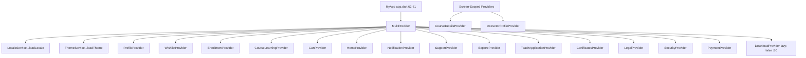

# Mobile State Management & Providers Reference

> **Framework:** Flutter 3.x / Dart 3.11  
> **Pattern:** `ChangeNotifier` + `Provider` (`provider: ^6.1.5+1`)  
> **Registration Root:** `MultiProvider` tree in `apps/mobile/lib/app.dart:62-81` (17 root providers + 2 screen-scoped providers)  
> **Total Providers:** 19 Active ViewModels / State Controllers

This document provides an exhaustive, code-level architectural reference for all providers governing UI state, optimistic mutations, in-flight request deduplication, parallel `Future.wait` loading, offline downloads, and network caching across the EducationLab mobile app.

---

## 1. Provider Tree & Lifecycle

The app registers 17 global providers above the `MaterialApp` widget in `app.dart:62-81` (plus screen-scoped `CourseDetailsProvider` and `InstructorProfileProvider`) to allow cross-cutting state consumption and unified session teardown:

```mermaid
graph TD
    App[MyApp app.dart:62-81] --> MultiProv[MultiProvider]
    MultiProv --> Srv1[LocaleService ..loadLocale]
    MultiProv --> Srv2[ThemeService ..loadTheme]
    MultiProv --> P1[ProfileProvider]
    MultiProv --> P2[WishlistProvider]
    MultiProv --> P3[EnrollmentProvider]
    MultiProv --> P4[CourseLearningProvider]
    MultiProv --> P5[CartProvider]
    MultiProv --> P6[HomeProvider]
    MultiProv --> P7[NotificationProvider]
    MultiProv --> P8[SupportProvider]
    MultiProv --> P9[ExploreProvider]
    MultiProv --> P10[TeachApplicationProvider]
    MultiProv --> P11[CertificatesProvider]
    MultiProv --> P12[LegalProvider]
    MultiProv --> P13[SecurityProvider]
    MultiProv --> P14[PaymentProvider]
    MultiProv --> P15[DownloadProvider lazy: false :80]
    ScreenScoped[Screen-Scoped Providers] --> P16[CourseDetailsProvider]
    ScreenScoped --> P17[InstructorProfileProvider]
```

---

## 2. Complete Catalog of Providers

### 2.1 `CartProvider`
**File:** `apps/mobile/lib/features/cart/presentation/providers/cart_provider.dart`  
**Dependencies:** `CartRepository`

Manages the learner's shopping cart, promotional coupon discounts, and subtotal calculations.

| State Property | Type | Description |
| :--- | :--- | :--- |
| `_cart` | `CartModel?` | Active server-side cart instance. |
| `_items` | `List<CartItemModel>` | Local cart items array. |
| `_isLoading` | `bool` | Network fetch spinner flag. |
| `_isApplyingCoupon` | `bool` | Coupon redemption in progress. |
| `_appliedCouponCode`| `String?` | Validated promo code string. |
| `_discountPercent` | `double` | Applied percentage deduction (e.g. 20.0 for 20%). |
| `_errorMessage` | `String?` | Localized error prompt. |

#### Methods & State Mutations:
- `Future<void> fetchCart({bool forceRefresh = false})`: Queries `CartRepository.getCart()`. Synchronizes `_cart`, updates `appliedCoupon`, `discountAmount`, and computes dynamic `discountPercent`.
- `Future<bool> addToCart(int courseId)`: Sends POST to `/api/Cart/items`. Optimistically updates cart state with server discount data.
- `Future<bool> removeFromCart(int cartItemId)`: Calls `DELETE /api/Cart/items/{id}`. Removes item and syncs recalculated totals.
- `Future<bool> clearCart()`: Issues `DELETE /api/Cart/clear` clearing all items and applied coupons.
- `Future<({bool success, String message})> applyCoupon(String code)`: Evaluates promo code via backend REST endpoint (`POST /api/coupon/apply`). Updates `appliedCoupon`, `discountAmount`, `subtotal`, and `finalPrice` using server calculations.
- `Future<bool> removeCoupon()`: Calls `POST /api/coupon/remove` to detach coupon from active cart on the server.
- `void reset()`: Wipes in-memory cart and coupon state on session logout.

---

### 2.2 `ExploreProvider`
**File:** `apps/mobile/lib/features/catalog/presentation/providers/explore_provider.dart` (`:9-344`)  
**Dependencies:** `ExploreRepository`

Drives multi-criteria course exploration, full-text debounced searches, and category browsing with in-flight search pool deduplication.

| State Property | Type | Description |
| :--- | :--- | :--- |
| `_loadedCourses` | `List<HomeCourseDTO>` | Active query results. |
| `_categoryCache` | `Map<int, List<HomeCourseDTO>>`| Two-tier in-memory category cache. |
| `_searchPoolCache` | `List<HomeCourseDTO>?` | Full catalog pool cached for instant local filtering. |
| `_searchPoolFuture`| `Future<void>?` | In-flight deduplication future for `_ensureSearchPoolLoaded()` (`:44, :192-223`). |
| `_searchQuery` | `String` | Active text filter input. |
| `_activeCategory` | `CategoryItem?` | Currently selected discipline chip. |
| `_selectedFilterIndex`| `int` | Active chip filter (0: All, 1: Top Rated, 2: Bestsellers, 3: <$50). |
| `_recentSearches` | `List<String>` | SharedPreferences-backed query history. |

#### Methods & State Mutations:
- `Future<void> selectCategory(CategoryItem? category, {bool forceRefresh = false})`: Checks `_categoryCache`. If missing, queries `/api/Category/{id}/courses` (up to 50 courses) and caches result.
- **In-Flight Search Pool Deduplication (`_ensureSearchPoolLoaded`, `explore_provider.dart:192-223`)**: If `_searchPoolFuture != null`, concurrent callers await the existing future (`return _searchPoolFuture!`, `:194`) instead of firing duplicate `getCatalogCourses()` requests.
- `Future<void> onSearchSubmitted(String query)`: Commits query to recent searches, awaits `_ensureSearchPoolLoaded()`, and dispatches filtered search.
- `List<CourseItem> getFilteredCourses([BuildContext? context])`: Multi-pass in-memory filter evaluating category ID, substring title/instructor/description match, rating `>= 4.7`, and bestseller status.
- `void clearFilters()`: Instantly clears query, active category, and chip selections without server reload.

---

### 2.3 `CourseDetailsProvider`
**File:** `apps/mobile/lib/features/courses/presentation/providers/course_details_provider.dart` (`:9-122`)  
**Dependencies:** `CoursesRepository`

Supplies the comprehensive curriculum, syllabus tree, ratings, and related courses for `CourseDetailsScreen` using two-stage progressive rendering.

| State Property | Type | Description |
| :--- | :--- | :--- |
| `_course` | `CourseDetailsModel?` | Course aggregate root (syllabus, sections, lectures). |
| `_ratings` | `List<CourseRatingModel>` | Student reviews loaded asynchronously (`:15`). |
| `_ratingSummary` | `CourseRatingSummaryModel?`| Star distribution and average score (`:16`). |
| `_relatedCourses` | `List<HomeCourseDTO>` | Related courses in the same category (`:17`). |
| `_isLoading` | `bool` | Primary course loading state flag. |
| `_isLoadingSupplementary`| `bool` | Secondary loading flag for ratings & related courses (`:20`). |
| `_errorMessage` | `String?` | Error description if fetch fails. |

#### Methods & State Mutations:
- **Two-Stage Progressive Load (`fetchCourseDetails`, `course_details_provider.dart:30-63`)**: Fetches `getCourseDetails(courseId)` first and immediately sets `_isLoading = false; notifyListeners()` (`:51-52`) so the user sees the course header and syllabus right away, then triggers `_fetchSupplementaryData(courseId, _course?.categoryId)` (`:55`).
- **Parallel Supplementary Fetch (`_fetchSupplementaryData`, `course_details_provider.dart:65-98`)**: Executes `getCourseRatings(courseId)`, `getCourseRatingSummary(courseId)`, and `getRelatedCourses(categoryId: categoryId, excludeCourseId: courseId)` concurrently via `Future.wait` (`:72-76`).
- `void toggleSection(int sectionId)`: Toggles section accordion expand/collapse state in memory without network reload.

---

### 2.4 `HomeProvider`
**File:** `apps/mobile/lib/features/home/presentation/providers/home_provider.dart`  
**Dependencies:** `HomeRepository`

Orchestrates the home screen feed via `HomeRepository.getHomeBundleData()` and handles graceful client-side fallbacks.

| State Property | Type | Description |
| :--- | :--- | :--- |
| `_categories` | `List<HomeCategoryDTO>` | Active category chips with computed counts. |
| `_featuredCourses` | `List<HomeCourseDTO>` | Highest priority promoted courses. |
| `_recommended` | `List<HomeCourseDTO>` | Personalized course suggestions. |
| `_newCourses` | `List<HomeCourseDTO>` | Recently published syllabus entries. |
| `_topInstructors` | `List<HomeInstructorDTO>` | Featured instructors roster. |
| `_stats` | `HomeStatsDTO` | Platform enrollment and course counts. |
| `_allCourses` | `List<HomeCourseDTO>` | General course pool for fallback sorting. |

#### Methods & State Mutations:
- `Future<void> fetchHomeData({bool forceRefresh = false})`: Delegates to `HomeRepository.getHomeBundleData()` (`home_repository.dart:40-180`), which runs the 6 core home endpoints in parallel via `Future.wait` (`:43-50`) and fetches the multi-category course pool via `LearnerCourse/approved/by-categories` (`home_api_service.dart:62-76`).
- `void _enrichCategories()`: Computes real-time course counts per category from `_allCourses` and sorts categories descending by popularity.
- Fallback Sorting: If dedicated endpoints return empty, autonomously sorts `_allCourses` by rating or creation date.

---

### 2.5 `InstructorProfileProvider`
**File:** `apps/mobile/lib/features/home/presentation/providers/instructor_profile_provider.dart`  
**Dependencies:** `HomeRepository`

Manages public instructor credentials, authored courses, student counts, and ratings.
- `fetchInstructorProfile(String instructorId)`: Calls `/api/InstructorProfile/{id}` and updates UI listeners.

---

### 2.6 `NotificationProvider`
**File:** `apps/mobile/lib/features/inbox/presentation/providers/notification_provider.dart`  
**Dependencies:** `NotificationRepository`

Maintains the user's notification inbox and real-time unread badge counts.

| State Property | Type | Description |
| :--- | :--- | :--- |
| `_notifications` | `List<NotificationModel>` | Paginated inbox items. |
| `_unreadCount` | `int` | Dynamic badge count. |
| `_isLoading` | `bool` | Loading spinner flag. |

#### Methods & State Mutations:
- `Future<void> fetchNotifications({bool forceRefresh = false})`: Queries `/api/Notifications` and `/api/Notifications/summary`.
- `Future<void> markAsRead(int notificationId)`: Optimistically marks notification as read; updates unread count; issues background PUT request.
- `Future<void> markAllAsRead()`: Sets all in-memory items to read and resets unread count to 0.
- `Future<void> deleteNotification(int id)`: Removes item from `_notifications` array and calls DELETE endpoint.

---

### 2.7 `SupportProvider`
**File:** `apps/mobile/lib/features/inbox/presentation/providers/support_provider.dart` (`:10-332`)  
**Dependencies:** `SupportRepository`, `SupportHubService`

Drives real-time customer care ticketing and live chat via SignalR WebSockets with parallel REST + Hub operations.

| State Property | Type | Description |
| :--- | :--- | :--- |
| `_conversations` | `List<SupportConversationModel>` | User support ticket threads. |
| `_activeConversation` | `SupportConversationModel?` | Currently opened ticket. |
| `_activeMessages` | `List<SupportMessageModel>` | Chronological message bubbles. |
| `_unreadCount` | `int` | Unread support badge counter. |

#### Methods & State Mutations:
- `Future<void> _initHub()`: Subscribes to `SupportHubService` streams: `onReceiveMessage`, `onUnreadCountChanged`, `onConversationsChanged`.
- **Parallel Ticket List + Badge Fetch (`fetchConversations`, `support_provider.dart:110-161`)**: Dispatches `_repository.getConversations()` and `_repository.getUnreadCount()` concurrently via `Future.wait` (`:123-126`).
- **Parallel Room Join + History Fetch (`openConversation`, `support_provider.dart:163-189`)**: Executes `_hubService.joinConversation(conversation.id)` and `_repository.getMessages(conversation.id)` concurrently via `Future.wait` (`:177-180`).
- `Future<bool> sendMessage(String content)`: Optimistically renders outgoing bubble and dispatches POST.
- `Future<void> toggleConversationStatus()`: Closes or re-opens the active ticket.

---

### 2.8 `CourseLearningProvider`
**File:** `apps/mobile/lib/features/learning/presentation/providers/course_learning_provider.dart`  
**Dependencies:** `CourseLearningRepository`

Powers the video learning player, gestural navigation, lesson completion tracking, and auto-certificates.

| State Property | Type | Description |
| :--- | :--- | :--- |
| `_course` | `CourseDetailsModel?` | Course syllabus tree. |
| `_progressSummary` | `CourseProgressSummaryModel?` | Real-time completion statistics. |
| `_lectureStatuses` | `Map<int, bool>` | Dictionary mapping `lectureId -> isCompleted`. |
| `_currentSectionIndex`| `int` | Active curriculum section pointer. |
| `_currentLectureIndex`| `int` | Active lecture within current section. |
| `_comments` | `List<LectureCommentModel>` | Active lecture Q&A discussions. |
| `_resources` | `List<LectureResourceModel>` | Downloadable lesson files. |
| `_certificate` | `CertificateModel?` | Earned completion certificate. |

#### Methods & State Mutations:
- `Future<void> loadCourse(int courseId, {int? initialLectureId})`: Loads course, progress, lecture statuses, reviews, and certificate in parallel via `Future.wait`.
- `void _locateInitialLecture(int? targetLectureId)`: Automatically seeks to the first uncompleted lecture in the syllabus.
- `Future<bool> toggleLectureCompletion(int lectureId, {required int courseId})`:
  1. Optimistically updates `_lectureStatuses[lectureId]`.
  2. Recalculates progress percentage synchronously.
  3. Sends POST to `/api/CourseProgress/mark-completed`.
  4. If progress reaches 100%, automatically requests issued certificate.
  5. Reverts local state if the network call rejects.
- `bool playNextLesson()`: Automatically advances to next lecture or shifts to index 0 of the subsequent section.

---

### 2.9 `EnrollmentProvider`
**File:** `apps/mobile/lib/features/learning/presentation/providers/enrollment_provider.dart`  
**Dependencies:** `EnrollmentRepository`

Maintains the authoritative global list of active course enrollments for the logged-in student.
- `fetchEnrollments({bool forceRefresh})`: Queries `/api/Enrollment/my-courses`.
- `bool isEnrolledInCourse(int courseId)`: Fast in-memory check determining whether to show `"شراء الآن"` or `"متابعة التعلم"`.

---

### 2.10 `ProfileProvider`
**File:** `apps/mobile/lib/features/profile/presentation/providers/profile_provider.dart` (`:9-134`)  
**Dependencies:** `ProfileRepository`

Manages user identity, account roles, and profile editing with in-flight request deduplication.
- **In-Flight Fetch Deduplication (`_inFlightFetch`, `profile_provider.dart:24, 44-60`)**: `fetchProfile({bool forceRefresh = false})` stores the active request in `Future<void>? _inFlightFetch`; if another widget requests the profile while a fetch is already in progress (and `!forceRefresh`), it returns `_inFlightFetch!` (`:45-47`) instead of issuing a duplicate `/api/Profile` call.
- `updateProfile(UserProfileModel model)`: Submits profile fields and social links.
- `updateAvatar(File imageFile)`: Dispatches multipart avatar form-data upload.
- `logout()`: Clears profile cache and auth tokens.

---

### 2.11 `TeachApplicationProvider`
**File:** `apps/mobile/lib/features/profile/presentation/providers/teach_application_provider.dart`  
**Dependencies:** `InstructorApplicationRepository`

Handles the instructor recruitment onboarding workflow.
- `submitApplication({required bio, required expertise, required cvFile})`: Uploads candidate dossier to `/api/InstructorApplication`.
- `checkApplicationStatus()`: Retrieves status (`Pending`, `Approved`, `Rejected`).

---

### 2.12 `WishlistProvider`
**File:** `apps/mobile/lib/features/wishlist/presentation/providers/wishlist_provider.dart`  
**Dependencies:** `WishlistRepository`

Maintains bookmarked courses and synchronizes with `/api/Wishlist`.
- `fetchWishlist({bool forceRefresh})`: Retrieves saved course bookmarks.
- `toggleWishlist(int courseId)`: Optimistically adds/removes course and commits via `POST /api/Wishlist/toggle/{courseId}`.
- `isWishlisted(int courseId)`: Synchronous check for favorite heart icons.

---

### 2.13 `CertificatesProvider`
**File:** `apps/mobile/lib/features/courses/presentation/providers/certificates_provider.dart`  
**Dependencies:** `CertificatesRepository`

Manages issued course completion certificates, QR verification, and PDF downloading.
- `fetchMyCertificates({bool forceRefresh})`: Retrieves all earned certificates from `/api/Certificates/my`.
- `verifyCertificate(String code)`: Verifies certificate authenticity via `/api/Certificates/verify/{code}`.
- `downloadCertificate(String code)`: Downloads certificate document to local device storage.

---

### 2.14 `PaymentProvider`
**File:** `apps/mobile/lib/features/profile/presentation/providers/payment_provider.dart`  
**Dependencies:** `PaymentRepository`

Handles learner purchase transactions, refund requests, and invoice histories.
- `fetchUserPayments({bool forceRefresh})`: Retrieves past transactions and receipts from `/api/Payment/user-payments`.
- `requestRefund(int paymentId, String reason)`: Submits a refund application to `/api/Payment/refund`.
- **Parallel Checkout Tokenization (`checkout_screen.dart:331-344`)**: During card checkout (`CheckoutScreen._processPayment`), the backend `PaymentIntent` (`_paymentRepository.createPaymentIntent()`) and Stripe `PaymentMethod` (`StripeService.createPaymentMethod(...)`) are created concurrently via `Future.wait` before confirming the intent with `StripeService.confirmPaymentIntent(...)`.

---

### 2.15 `SecurityProvider`
**File:** `apps/mobile/lib/features/profile/presentation/providers/security_provider.dart` (`:7-102`)  
**Dependencies:** `SecurityRepository`

Manages 2FA two-factor authentication, active login sessions, and password security.
- **Parallel Security Bootstrap (`loadSecurityData`, `security_provider.dart:23-49`)**: Fetches `_repository.getTwoFactorStatus()` and `_repository.getActiveSessions()` concurrently via `Future.wait` (`:29-32`).
- `setupTwoFactor()`: Retrieves QR code URL and manual setup secret key.
- `enableTwoFactor(String code)`: Verifies OTP code and activates 2FA.
- `disableTwoFactor(String code)`: Deactivates 2FA.
- `revokeSession(String sessionId)` / `revokeAllOtherSessions()`: Remote session termination.

---

### 2.16 `LegalProvider`
**File:** `apps/mobile/lib/features/legal/presentation/providers/legal_provider.dart`  
**Dependencies:** `LegalApiService`

Fetches and caches dynamic legal documents (Terms of Service, Privacy Policy, About EduLab).
- `fetchAbout()`: Retrieves `/api/Legal/about`.
- `fetchPrivacyPolicy()`: Retrieves `/api/Legal/privacy-policy`.
- `fetchTerms()`: Retrieves `/api/Legal/terms`.
- `fetchAll()`: Batch fetches all legal content with memory caching.

---

### 2.17 `DownloadProvider`
**File:** `apps/mobile/lib/features/learning/presentation/providers/download_provider.dart` (`:8-178`)  
**Dependencies:** `DownloadService` (`core/services/download_service.dart`)

Manages offline downloads for lecture videos, resources, and course certificates, registered eagerly (`lazy: false`) in `app.dart:80`.

| State Property / Getter | Type | Description |
| :--- | :--- | :--- |
| `allItems` | `List<DownloadItemModel>` | All active and completed downloads (`:29`). |
| `completedLessons` | `List<DownloadItemModel>` | Completed lecture video/resource downloads (`:33-37`). |
| `completedCertificates` | `List<DownloadItemModel>` | Completed certificate downloads (`:40-44`). |
| `activeDownloads` | `List<DownloadItemModel>` | Currently downloading or queued items (`:47-51`). |
| `totalStorageBytes` | `int` | Total disk bytes consumed by offline files (`:61`). |
| `totalStorageFormatted` | `String` | Human-readable storage string (KB/MB/GB, `:62`). |

#### Methods & State Mutations:
- **Reactive Stream Subscription (`_init`, `download_provider.dart:17-26`)**: Calls `_service.init()` and subscribes to `_service.onProgress` (throttled to `>= 3%` delta or `>= 250ms`) to call `notifyListeners()`.
- `Future<DownloadItemModel?> downloadLecture(...)` (`:65-90`): Starts an offline lecture video/resource download with deterministic ID `'lecture_${courseId}_$lectureId'`.
- `Future<DownloadItemModel?> downloadCertificate(CertificateModel cert, {Uint8List? renderedBytes})` (`:102-156`): Saves client-rendered high-DPI PNG bytes directly via `_service.saveBytesAsDownload(...)` (`:109-121`), or falls back to downloading the server PDF/file from `cert.pdfUrl` (`:124-155`).
- `Future<void> cancelLectureDownload(int courseId, int lectureId)` (`:92-95`): Cancels an in-flight download via `CancelToken`.
- `Future<void> deleteLectureDownload(...)` (`:97-100`), `deleteCertificateDownload(...)` (`:158-161`), and `clearAll()` (`:168-171`): Deletes offline files from disk and updates `SharedPreferences`.
