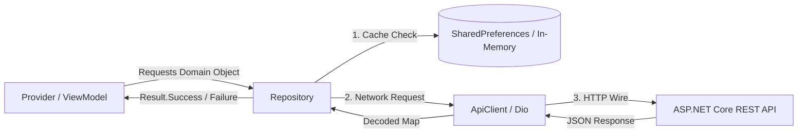

# Mobile Repositories & Data Access Layer Reference

> **Framework:** Flutter 3.x / Dart 3.11  
> **Pattern:** Repository Pattern with functional `Result<T>` envelopes  
> **Source Directory:** `apps/mobile/lib/core/repositories/` & `apps/mobile/lib/features/*/data/repositories/`  
> **Total Repositories:** 15 Active Repositories

This document provides a technical specification of the mobile data access layer, mapping each repository to its corresponding backend REST endpoints, parameter serialization rules, caching strategies, and exception translations.

---

## 1. Architectural Role of Repositories

Repositories in EducationLab encapsulate data access mechanisms and decouple ViewModels (`Provider`) from transport specifics (`ApiClient` Dio wrapper vs local storage):
- **Functional Returns:** Methods return `Result<T>` (`Success<T>` or `Failure<T>`), preventing unhandled exception bubbling in Flutter UI threads.
- **Cache Mediation:** Repositories mediate between network requests, memory caches, and `SharedPreferences`.
- **Payload Sanitization:** Normalizes DTO keys, parses localized string dates, and adapts relative server image paths to full CDN URLs.

---

## 2. Complete Catalog of All 15 Repositories

### 2.1 `AuthRepository`
**File:** [`apps/mobile/lib/core/repositories/auth_repository.dart`](file:///d:/Programming/MonoRepo%20Porjects/EducationLab/apps/mobile/lib/core/repositories/auth_repository.dart)

| Method | HTTP Call | Backend Endpoint | Description |
| :--- | :--- | :--- | :--- |
| `login(email, password)` | POST | `/api/Auth/login` | Authenticates email/password; saves tokens via `AuthStorageService`. |
| `sendRegistrationCode(email, name, password)` | POST | `/api/Auth/send-registration-code` | Initiates 2-step registration and triggers backend email OTP. |
| `register(email, name, password, code)` | POST | `/api/Auth/register` | Commits registration with verified 6-digit OTP code. |
| `googleMobileLogin(idToken)` | POST | `/api/Auth/google-mobile` | Exchanges Google OAuth ID token for EducationLab JWT and refresh tokens. |
| `refreshToken()` | POST | `/api/Auth/refresh-token` | Silent token renewal. |
| `logout()` | POST / Local | `/api/Auth/logout` | Calls server logout and flushes local credentials. |

---

### 2.2 `HomeRepository`
**File:** [`apps/mobile/lib/features/home/data/repositories/home_repository.dart`](file:///d:/Programming/MonoRepo%20Porjects/EducationLab/apps/mobile/lib/features/home/data/repositories/home_repository.dart)

| Method | HTTP Call | Backend Endpoint | Description |
| :--- | :--- | :--- | :--- |
| `getCategories({count})` | GET | `/api/Category` | Returns categories with icon data and count. |
| `getFeaturedCourses({count})` | GET | `/api/LearnerCourse/featured` | Retrieves high-priority promoted courses. |
| `getRecommendedCourses({count})` | GET | `/api/LearnerCourse/recommended` | Retrieves tailored course recommendations. |
| `getNewCourses({count})` | GET | `/api/LearnerCourse/new` | Retrieves latest courses sorted by release date. |
| `getTopInstructors({count})` | GET | `/api/InstructorProfile/top` | Retrieves top faculty members. |
| `getAllCourses()` | GET | `/api/LearnerCourse/all` | Retrieves general course pool for fallback sorting and category totals. |
| `getPublicStats()` | GET | `/api/PublicStats` | Returns system-wide statistics. |

---

### 2.3 `ExploreRepository`
**File:** [`apps/mobile/lib/features/catalog/data/repositories/explore_repository.dart`](file:///d:/Programming/MonoRepo%20Porjects/EducationLab/apps/mobile/lib/features/catalog/data/repositories/explore_repository.dart)

| Method | Storage / HTTP | Target | Description |
| :--- | :--- | :--- | :--- |
| `getCoursesByCategory(id, {count})`| GET | `/api/Category/{id}/courses` | Fetches courses belonging to a specific discipline. |
| `getCatalogCourses()` | GET | `/api/LearnerCourse/all` | Fetches base course pool for client-side search. |
| `getRecentSearches()` | Local Read | `SharedPreferences` | Reads stored search history. |
| `addRecentSearch(query)` | Local Write| `SharedPreferences` | Adds query, deduplicates, and caps at 10 items. |
| `removeRecentSearch(query)` | Local Delete| `SharedPreferences` | Removes a single query. |
| `clearRecentSearches()` | Local Delete| `SharedPreferences` | Flushes all search history. |

---

### 2.4 `CoursesRepository` & `CourseDetailsRepository`
**Files:** [`courses_repository.dart`](file:///d:/Programming/MonoRepo%20Porjects/EducationLab/apps/mobile/lib/features/courses/data/repositories/courses_repository.dart) & [`course_details_repository.dart`](file:///d:/Programming/MonoRepo%20Porjects/EducationLab/apps/mobile/lib/features/courses/data/repositories/course_details_repository.dart)

| Method | HTTP Call | Backend Endpoint | Description |
| :--- | :--- | :--- | :--- |
| `getCourseDetails(courseId)` | GET | `/api/Course/{id}` | Deserializes syllabus, sections, lectures, and instructor details. |
| `getCourseReviews(courseId)` | GET | `/api/CourseRating/{id}/ratings` | Retrieves student ratings and feedback. |
| `getCourseRatingSummary(courseId)`| GET | `/api/CourseRating/{id}/summary` | Returns star distribution and average score. |

---

### 2.5 `CourseLearningRepository`
**File:** [`apps/mobile/lib/features/learning/data/repositories/course_learning_repository.dart`](file:///d:/Programming/MonoRepo%20Porjects/EducationLab/apps/mobile/lib/features/learning/data/repositories/course_learning_repository.dart)

| Method | HTTP Call | Backend Endpoint | Description |
| :--- | :--- | :--- | :--- |
| `getCourseProgress(courseId)` | GET | `/api/CourseProgress/{courseId}` | Real-time completion percentages and watched duration. |
| `getLectureStatuses(courseId)` | GET | `/api/CourseProgress/{courseId}/lectures` | Map of completed lecture IDs. |
| `markLectureCompleted(courseId, lectureId)` | POST | `/api/CourseProgress/mark-completed` | Marks lesson completed; triggers certificate check if 100%. |
| `markLectureIncomplete(courseId, lectureId)` | POST | `/api/CourseProgress/mark-incomplete`| Reverts lesson completion state. |
| `getLectureComments(lectureId)` | GET | `/api/LectureComments/lecture/{id}` | Loads Q&A questions and replies. |
| `addLectureComment(lectureId, content)` | POST | `/api/LectureComments` | Posts a student question. |
| `addCommentReply(commentId, content)` | POST | `/api/LectureComments/{id}/reply` | Posts reply to thread. |
| `submitRating(courseId, rating, review)` | POST | `/api/CourseRating` | Submits 1-5 star course review. |

---

### 2.6 `EnrollmentRepository`
**File:** [`apps/mobile/lib/features/learning/data/repositories/enrollment_repository.dart`](file:///d:/Programming/MonoRepo%20Porjects/EducationLab/apps/mobile/lib/features/learning/data/repositories/enrollment_repository.dart)

| Method | HTTP Call | Backend Endpoint | Description |
| :--- | :--- | :--- | :--- |
| `getMyEnrollments()` | GET | `/api/Enrollment/my-courses` | Fetches all courses student is currently enrolled in. |
| `enrollFreeCourse(courseId)` | POST | `/api/Enrollment/enroll` | Direct zero-cost enrollment for free courses. |

---

### 2.7 `CertificatesRepository`
**File:** [`apps/mobile/lib/features/courses/data/repositories/certificates_repository.dart`](file:///d:/Programming/MonoRepo%20Porjects/EducationLab/apps/mobile/lib/features/courses/data/repositories/certificates_repository.dart)

| Method | HTTP Call | Backend Endpoint | Description |
| :--- | :--- | :--- | :--- |
| `getMyCertificates()` | GET | `/api/Certificates/my-certificates` | Retrieves all completion certificates earned by learner. |
| `getCertificateByCourse(courseId)`| GET | `/api/Certificates/course/{id}` | Retrieves certificate for a specific completed course. |
| `verifyCertificate(code)` | GET | `/api/Certificates/verify/{code}` | Validates cryptographic authenticity of a credential. |

---

### 2.8 `CartRepository` & `WishlistRepository`
**Files:** [`cart_repository.dart`](file:///d:/Programming/MonoRepo%20Porjects/EducationLab/apps/mobile/lib/features/cart/data/repositories/cart_repository.dart) & [`wishlist_repository.dart`](file:///d:/Programming/MonoRepo%20Porjects/EducationLab/apps/mobile/lib/features/wishlist/data/repositories/wishlist_repository.dart)

| Method | HTTP Call | Backend Endpoint | Description |
| :--- | :--- | :--- | :--- |
| `getCart()` | GET | `/api/Cart` | Loads active cart and item list. |
| `addToCart(courseId)` | POST | `/api/Cart/add` | Adds course to shopping cart. |
| `removeFromCart(cartItemId)` | DELETE | `/api/Cart/items/{id}` | Deletes course from cart. |
| `clearCart()` | DELETE | `/api/Cart` | Empties entire cart. |
| `getWishlist()` | GET | `/api/Wishlist` | Fetches bookmarked courses. |
| `toggleWishlist(courseId)` | POST | `/api/Wishlist/toggle/{courseId}` | Toggles bookmark state. |

---

### 2.9 `NotificationRepository` & `SupportRepository`
**Files:** [`notification_repository.dart`](file:///d:/Programming/MonoRepo%20Porjects/EducationLab/apps/mobile/lib/features/inbox/data/repositories/notification_repository.dart) & [`support_repository.dart`](file:///d:/Programming/MonoRepo%20Porjects/EducationLab/apps/mobile/lib/features/inbox/data/repositories/support_repository.dart)

| Method | HTTP Call | Backend Endpoint | Description |
| :--- | :--- | :--- | :--- |
| `getNotifications()` | GET | `/api/Notifications` | Fetches paginated user notifications. |
| `getSummary()` | GET | `/api/Notifications/summary` | Returns unread badge counter. |
| `markAsRead(id)` | PUT | `/api/Notifications/{id}/read` | Updates single notification state. |
| `markAllAsRead()` | PUT | `/api/Notifications/read-all` | Clears all unread badges. |
| `getConversations()` | GET | `/api/Support/conversations` | Retrieves user support tickets. |
| `getMessages(conversationId)` | GET | `/api/Support/conversations/{id}/messages` | Retrieves ticket message history. |
| `sendMessage(conversationId, text)` | POST | `/api/Support/conversations/{id}/messages` | Posts customer support message. |
| `createConversation(subject, msg)`| POST | `/api/Support/conversations` | Creates new support ticket. |

---

### 2.10 `ProfileRepository`, `SecurityRepository`, `PaymentRepository`
**Files:** [`profile_repository.dart`](file:///d:/Programming/MonoRepo%20Porjects/EducationLab/apps/mobile/lib/features/profile/data/repositories/profile_repository.dart), [`security_repository.dart`](file:///d:/Programming/MonoRepo%20Porjects/EducationLab/apps/mobile/lib/features/profile/data/repositories/security_repository.dart), [`payment_repository.dart`](file:///d:/Programming/MonoRepo%20Porjects/EducationLab/apps/mobile/lib/features/profile/data/repositories/payment_repository.dart)

| Method | HTTP Call | Backend Endpoint | Description |
| :--- | :--- | :--- | :--- |
| `getProfile()` | GET | `/api/Profile` | Retrieves user profile, avatar, social handles. |
| `updateProfile(model)` | PUT | `/api/Profile` | Updates user details. |
| `uploadAvatar(imageFile)` | POST (Multipart)| `/api/Profile/upload-avatar` | Uploads profile picture. |
| `changePassword(...)` | POST | `/api/Security/change-password` | Updates account credentials. |
| `getTwoFactorStatus()` | GET | `/api/Security/2fa-status` | Checks if 2FA is active. |
| `getTwoFactorSetup()` | GET | `/api/Security/2fa-setup` | Fetches QR code URL and secret. |
| `getActiveSessions()` | GET | `/api/Security/active-sessions` | Lists devices logged into account. |
| `revokeSession(sessionId)` | POST | `/api/Security/revoke-session/{id}` | Terminates remote login session. |
| `createPaymentIntent(amount, curr)`| POST | `/api/Payment/create-payment-intent` | Initiates Stripe PaymentIntent. |
| `confirmOrder(paymentIntentId)` | POST | `/api/Payment/confirm-order` | Confirms transaction and enrolls student. |
| `getPaymentHistory()` | GET | `/api/Payment/history` | Fetches past billing invoices. |
