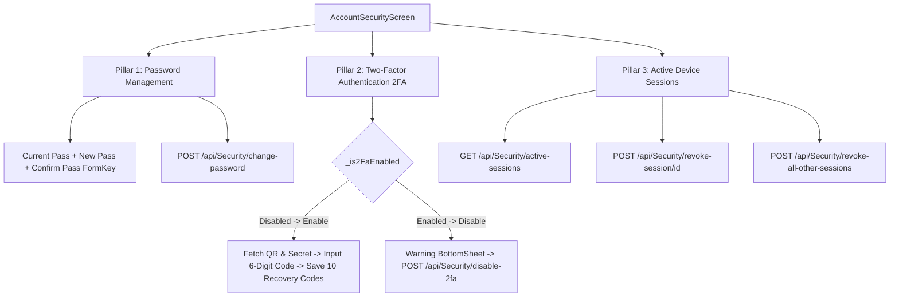
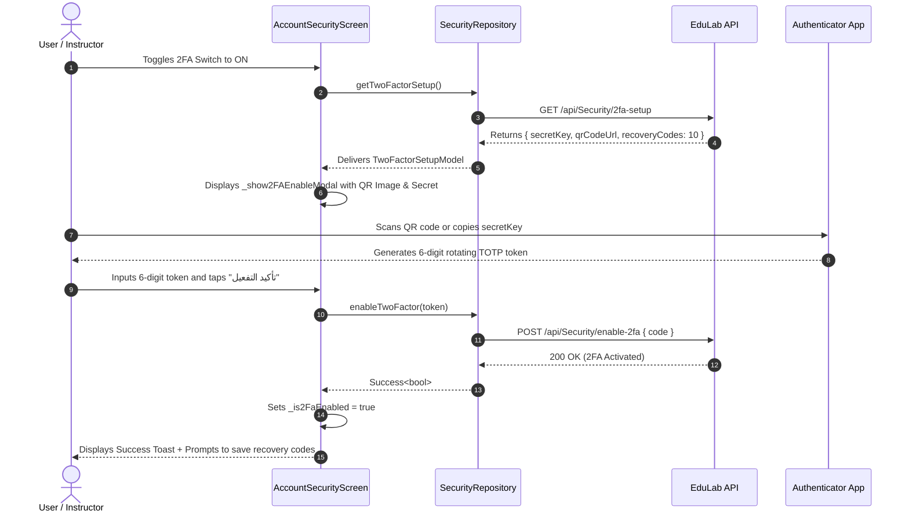
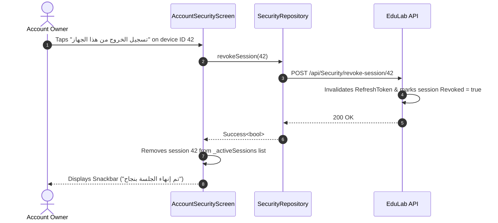

# Mobile Screen Deep-Dive: `AccountSecurityScreen`

> **File Path:** [`apps/mobile/lib/features/profile/presentation/screens/account_security_screen.dart`](file:///d:/Programming/MonoRepo%20Porjects/EducationLab/apps/mobile/lib/features/profile/presentation/screens/account_security_screen.dart)  
> **Route Name:** `'/account-security'`  
> **Scale:** 1,200 lines of Dart code  
> **State Management:** `ProfileProvider`  
> **Repositories & Services:** `SecurityRepository`, `ApiClient`, `AuthStorageService`  
> **Authentication Scope:** Bank-grade account security, 2FA TOTP authentication, active session revocation

---

## 1. Overview & Business Objective

`AccountSecurityScreen` provides student and instructor accounts with defense-in-depth protection. It centralizes three mission-critical security pillars:

1. **Credential Management (Password Update):** Enforces password rotation with strict complexity rules (length, uppercase, lowercase, numeric digits, and special characters) while requiring current password verification.
2. **Two-Factor Authentication (2FA TOTP):** Time-based One-Time Password integration compatible with Google Authenticator, Microsoft Authenticator, and Authy. Implements QR code provisioning, base32 secret entry, and generates 10 single-use emergency backup recovery codes.
3. **Active Device Session Audit & Remote Revocation:** Displays real-time device sessions holding active JWT refresh tokens with IP address geolocation, device models, and browser fingerprints. Enables users to instantly terminate suspicious or lost device sessions remotely.

---

## 2. Screen Architecture & State Machine



### 2.1 State Variables Registry

| Variable Name | Type | Lines | Initial Value | Scope & Lifecycle Purpose |
| :--- | :--- | :--- | :--- | :--- |
| `_securityRepo` | `SecurityRepository` | [:22](file:///d:/Programming/MonoRepo%20Porjects/EducationLab/apps/mobile/lib/features/profile/presentation/screens/account_security_screen.dart#L22) | `SecurityRepository()` | Service handling security API operations (`changePassword`, `getTwoFactorSetup`, etc.). |
| `_passwordFormKey` | `GlobalKey<FormState>` | [:23](file:///d:/Programming/MonoRepo%20Porjects/EducationLab/apps/mobile/lib/features/profile/presentation/screens/account_security_screen.dart#L23) | `GlobalKey()` | Validates current, new, and confirmation password inputs before API submission. |
| `_currentPasswordController` | `TextEditingController` | [:25](file:///d:/Programming/MonoRepo%20Porjects/EducationLab/apps/mobile/lib/features/profile/presentation/screens/account_security_screen.dart#L25) | Empty | Holds user's current password; cleared immediately after successful change. |
| `_newPasswordController` | `TextEditingController` | [:26](file:///d:/Programming/MonoRepo%20Porjects/EducationLab/apps/mobile/lib/features/profile/presentation/screens/account_security_screen.dart#L26) | Empty | Holds candidate new password; validated against regex complexity rules. |
| `_confirmPasswordController` | `TextEditingController` | [:27](file:///d:/Programming/MonoRepo%20Porjects/EducationLab/apps/mobile/lib/features/profile/presentation/screens/account_security_screen.dart#L27) | Empty | Verifies exact string equality against `_newPasswordController`. |
| `_obscureCurrent` | `bool` | [:29](file:///d:/Programming/MonoRepo%20Porjects/EducationLab/apps/mobile/lib/features/profile/presentation/screens/account_security_screen.dart#L29) | `true` | Visibility toggle state for current password text field. |
| `_obscureNew` | `bool` | [:30](file:///d:/Programming/MonoRepo%20Porjects/EducationLab/apps/mobile/lib/features/profile/presentation/screens/account_security_screen.dart#L30) | `true` | Visibility toggle state for new password text field. |
| `_obscureConfirm` | `bool` | [:31](file:///d:/Programming/MonoRepo%20Porjects/EducationLab/apps/mobile/lib/features/profile/presentation/screens/account_security_screen.dart#L31) | `true` | Visibility toggle state for confirm password text field. |
| `_isLoadingData` | `bool` | [:33](file:///d:/Programming/MonoRepo%20Porjects/EducationLab/apps/mobile/lib/features/profile/presentation/screens/account_security_screen.dart#L33) | `false` | Indicates initial data fetch loading state (2FA status & device sessions). |
| `_isChangingPassword` | `bool` | [:34](file:///d:/Programming/MonoRepo%20Porjects/EducationLab/apps/mobile/lib/features/profile/presentation/screens/account_security_screen.dart#L34) | `false` | Displays button loading spinner while submitting password change request. |
| `_is2FaEnabled` | `bool` | [:35](file:///d:/Programming/MonoRepo%20Porjects/EducationLab/apps/mobile/lib/features/profile/presentation/screens/account_security_screen.dart#L35) | `false` | Active state of two-factor TOTP protection reported by backend. |
| `_isToggling2FA` | `bool` | [:36](file:///d:/Programming/MonoRepo%20Porjects/EducationLab/apps/mobile/lib/features/profile/presentation/screens/account_security_screen.dart#L36) | `false` | Prevents rapid consecutive taps on the 2FA switch during network handshakes. |
| `_showAllDevices` | `bool` | [:37](file:///d:/Programming/MonoRepo%20Porjects/EducationLab/apps/mobile/lib/features/profile/presentation/screens/account_security_screen.dart#L37) | `false` | Collapses/expands active session list if greater than 3 devices. |
| `_activeSessions` | `List<ActiveSessionModel>` | [:39](file:///d:/Programming/MonoRepo%20Porjects/EducationLab/apps/mobile/lib/features/profile/presentation/screens/account_security_screen.dart#L39) | `[]` | Array of parsed device sessions holding active refresh tokens. |

---

## 3. UI Component Hierarchy & Layout Tree

```
Scaffold (backgroundColor: dynamic dark/light)
├── AppBar
│   ├── Leading: Back button / Pop handler
│   └── Title: "الأمان وحماية الحساب" / "Account Security"
└── Body: SingleChildScrollView (BouncingScrollPhysics)
    ├── SECTION 1: Change Password Card
    │   ├── Section Header: Shield Icon + "تغيير كلمة المرور"
    │   ├── Current Password TextFormField + Visibility Toggle
    │   ├── New Password TextFormField + Visibility Toggle
    │   │   └── Real-time Complexity Guide (Min 8 chars, A-Z, 0-9, Symbol)
    │   ├── Confirm New Password TextFormField + Visibility Toggle
    │   └── Submit Button: AppButton with Loading Spinner
    ├── SECTION 2: Two-Factor Authentication (2FA) Card
    │   ├── Section Header: Mobile Security Icon + 2FA Title
    │   ├── SwitchListTile: "المصادقة الثنائية (2FA)"
    │   │   ├── Active Badge: "مفعلة وآمنة" (Green) vs "غير مفعلة" (Gray)
    │   │   └── Switch Control -> triggers _toggle2FA()
    │   └── Security Benefit Explainer Note
    └── SECTION 3: Active Device Sessions Card
        ├── Section Header: Devices Icon + "الأجهزة والجلسات النشطة"
        ├── Action: "تسجيل الخروج من جميع الأجهزة الأخرى" (Red Action Button)
        ├── Shimmer Skeleton (if _isLoadingData)
        ├── Sessions List:
        │   └── Active Session Item Card:
        │       ├── Device Icon (Smartphone, Laptop, Tablet, Desktop)
        │       ├── Device Model & OS Name (e.g. "iPhone 15 Pro - iOS 17.4")
        │       ├── Location & IP Address (e.g. "Cairo, Egypt • 197.38.xxx.xxx")
        │       ├── Active Tag: "هذا الجهاز" (Current Device Badge)
        │       └── Revoke Action: "تسجيل الخروج" Icon Button (Remote Revocation)
        └── Expand/Collapse Button (if sessions count > 3)
```

---

## 4. Workflows & Runtime Behavior

### 4.1 Two-Factor TOTP Enablement Workflow



### 4.2 Remote Device Session Revocation



---

## 5. Method Catalog & Action Handlers

| Method Name | Signature | Lines | Description & Mutations |
| :--- | :--- | :--- | :--- |
| `_loadSecurityData` | `Future<void> _loadSecurityData()` | [:55-75](file:///d:/Programming/MonoRepo%20Porjects/EducationLab/apps/mobile/lib/features/profile/presentation/screens/account_security_screen.dart#L55-L75) | Concurrently queries `getTwoFactorStatus()` and `getActiveSessions()`; updates `_is2FaEnabled` and `_activeSessions`. |
| `_changePassword` | `void _changePassword() async` | [:78-111](file:///d:/Programming/MonoRepo%20Porjects/EducationLab/apps/mobile/lib/features/profile/presentation/screens/account_security_screen.dart#L78-L111) | Validates `_passwordFormKey`, sets `_isChangingPassword = true`, dispatches update to `/api/Security/change-password`, clears input controllers on success. |
| `_toggle2FA` | `void _toggle2FA(bool value) async` | [:114-178](file:///d:/Programming/MonoRepo%20Porjects/EducationLab/apps/mobile/lib/features/profile/presentation/screens/account_security_screen.dart#L114-L178) | Manages full 2FA toggle lifecycle: requests setup credentials on activation, or requests confirmation modal before disabling. |
| `_show2FAEnableModal` | `Future<String?> _show2FAEnableModal(...)` | [:181-350](file:///d:/Programming/MonoRepo%20Porjects/EducationLab/apps/mobile/lib/features/profile/presentation/screens/account_security_screen.dart#L181-L350) | Displays bottom sheet containing QR code graphic, base32 secret key copy box, recovery codes, and 6-digit OTP confirmation field. |
| `_showLogoutAllConfirmModal` | `Future<bool?> _showLogoutAllConfirmModal()` | [:450-539](file:///d:/Programming/MonoRepo%20Porjects/EducationLab/apps/mobile/lib/features/profile/presentation/screens/account_security_screen.dart#L450-L539) | Renders red warning bottom sheet before mass revocation of all non-current device sessions. |
| `_showDisable2FAModal` | `Future<bool?> _showDisable2FAModal()` | [:542-600](file:///d:/Programming/MonoRepo%20Porjects/EducationLab/apps/mobile/lib/features/profile/presentation/screens/account_security_screen.dart#L542-L600) | Displays amber warning modal explaining the loss of two-factor protection before deactivation. |

---

## 6. Security, Validation & Edge Cases

1. **Password Validation Rules:**
   * Minimum length: **8 characters**.
   * Requires at least 1 uppercase letter (`RegExp(r'[A-Z]')`).
   * Requires at least 1 numeric digit (`RegExp(r'[0-9]')`).
   * Requires at least 1 special character (`RegExp(r'[^a-zA-Z0-9]')`).
   * Immediate string equality comparison between new password and confirmation password.
2. **Current Device Protection:**
   * The active device currently running the app is tagged with `isCurrentDevice = true`.
   * Mass revocation (`revokeAllOtherSessions`) explicitly excludes the active token, preventing the user from accidentally locking themselves out of the mobile app.
3. **Sensitive Data In-Memory Lifecycle:**
   * Password text controllers are cleared immediately following submission (`_currentPasswordController.clear()`), preventing credential retention in garbage collection memory.
4. **QR Code Rendering Resilience:**
   * Encodes TOTP URI parameter (`Uri.encodeComponent(setup.qrCodeUrl)`) before passing to QR image generator. If offline, the secret key is displayed textually with one-tap clipboard copy.
