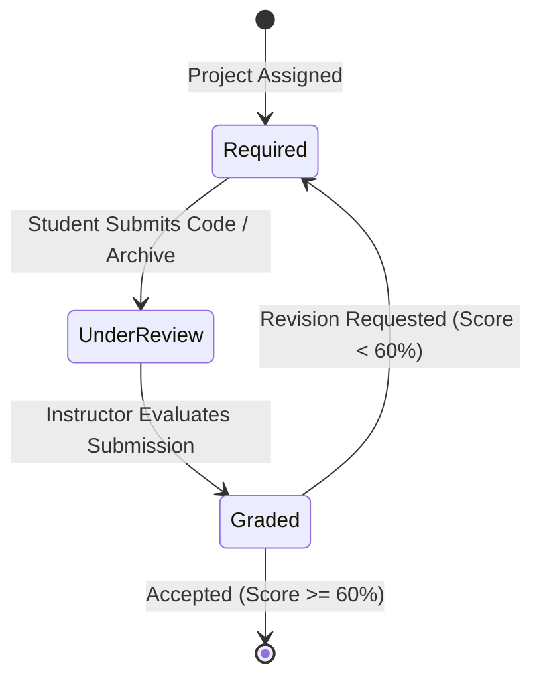

# Mobile Screen Deep-Dive: `AssignmentsScreen`

> **File Path:** [`apps/mobile/lib/features/courses/presentation/screens/assignments_screen.dart`](file:///d:/Programming/MonoRepo%20Porjects/EducationLab/apps/mobile/lib/features/courses/presentation/screens/assignments_screen.dart)  
> **Route Name:** `'/assignments'`  
> **Scale:** 91 lines of Dart code  
> **Scope:** Practical Coding Tasks, Project Submissions, Assignment Evaluation Tracking

---

## 1. Overview & Business Objective

`AssignmentsScreen` enables students to track, upload, and review hands-on coding tasks, engineering homework, and capstone project assignments across their enrolled courses.

Key capabilities:
1. **Assignment Lifecycle Tracking:** Categorizes student homework into:
   * **مطلوب (Required):** Pending project submissions with deadline notices.
   * **قيد المراجعة (Under Review):** Submissions currently being assessed by course instructors.
   * **تم التقييم (Graded):** Completed projects with percentage score grades and faculty feedback.
2. **Project Submission Gateway:** "تسليم الكود والمشروع" action buttons initiating file attachment or GitHub repository submission flows.
3. **Course Badging:** Color-coded course badges identifying the syllabus associated with each task.

---

## 2. Screen Architecture & Component Tree

```
Scaffold (backgroundColor: dynamic dark/light)
├── AppBar
│   ├── Leading: Back button
│   └── Title: "الواجبات والمشاريع العملية" / "Assignments & Projects"
└── Body: ListView.builder (padding: 16)
    └── Assignment Card:
        ├── Top Row: Course Tag (Inter font) + Status Chip (مطلوب / قيد المراجعة / تم التقييم)
        ├── Title: Project Description (e.g. "بناء تطبيق متجر متكامل مع سلة الشراء")
        └── Submit Action:
            └── ElevatedButton.icon: "تسليم الكود والمشروع" (Upload file icon)
```

---

## 3. Data Schema & Assignment Lifecycle Model



Each project assignment is represented by the following structure:

| Field Name | Type | Purpose & Constraints |
| :--- | :--- | :--- |
| `title` | `String` | Project title and prompt description (e.g., "بناء تطبيق متجر متكامل مع سلة الشراء"). |
| `course` | `String` | Associated syllabus name (e.g., "Flutter & Dart", "Python AI", "UI/UX Design"). |
| `status` | `String` | Active submission state: `'مطلوب'` (Required), `'قيد المراجعة'` (Under Review), `'تم التقييم (98%)'` (Graded). |
| `color` | `Color` | Visual status accent color (`Colors.orange` for required, `Colors.blue` for pending, `Colors.green` for passed). |

---

## 4. UI Rendering & Interaction Details

1. **Card Layout Structure:**
   - **Course Header:** Bold typography rendered in `AppColors.primary` alongside a modern chip with low-opacity colored background (`color.withValues(alpha: 0.1)`).
   - **Project Title:** Prominent 14px bold Tajawal typography.
   - **Action CTA:** Elevated primary button (`AppColors.primary`) with upload icon (`Icons.upload_file`) initiating code archive submission dialogs.
2. **Dynamic RTL Navigation:**
   - Leading app bar icon automatically flips between `Icons.arrow_forward_rounded` (Arabic RTL) and `Icons.arrow_back_rounded` (English LTR).
   - Safe route popping checks `Navigator.of(context).canPop()`; if false, cleanly replaces route with `'/main'`.
