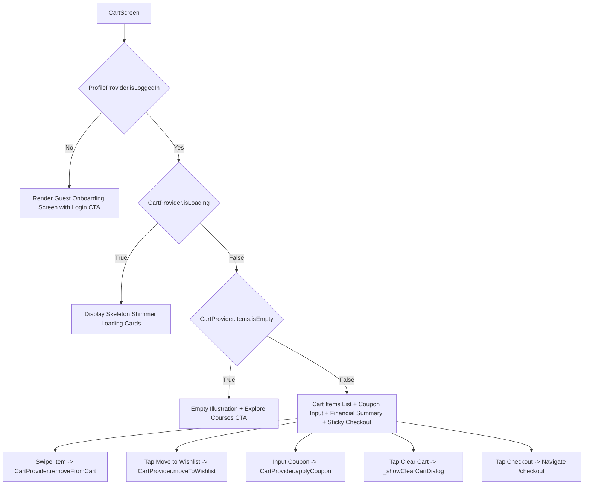
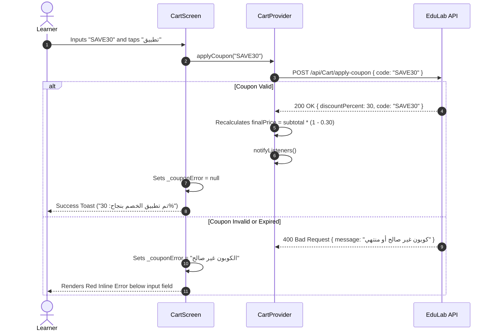
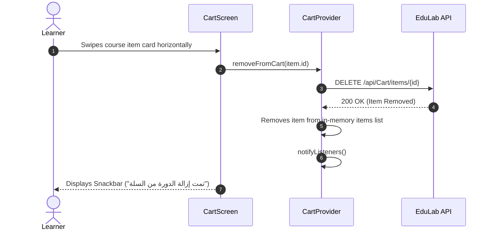

# Mobile Screen Deep-Dive: `CartScreen`

> **File Path:** [`apps/mobile/lib/features/cart/presentation/screens/cart_screen.dart`](file:///d:/Programming/MonoRepo%20Porjects/EducationLab/apps/mobile/lib/features/cart/presentation/screens/cart_screen.dart)  
> **Route Name:** `'/cart'`  
> **Scale:** 1,393 lines of Dart code  
> **State Management:** `CartProvider`, `WishlistProvider`, `ProfileProvider`  
> **Backend Integration:** Synchronized with `/api/Cart` (items, coupons, clearing)  
> **Navigation Mode:** Operates both as an independent route (`'/cart'`) and an embedded main tab (`isTab: true`)

---

## 1. Overview & Business Objective

`CartScreen` is the commercial conversion staging area where learners review selected courses before entering the financial checkout funnel.

Key functional capabilities include:
1. **Interactive Course Dismissals:** `Dismissible` gesture support allowing learners to swipe items away to remove them, paired with immediate tactile haptic feedback.
2. **Promotional Coupon Engine:** Real-time client & server coupon validation, dynamic discount deduction recalculations, and visual discount percentage badges.
3. **Cross-Feature Migration to Wishlist:** Fast transfer of cart items directly into the user's wishlist if they wish to postpone a purchase without losing the course.
4. **Comprehensive Order Breakdown:** Transparent cost summary showing original subtotal, active coupon savings, platform processing taxes, and final payable balance.
5. **Irreversible Cart Clearing Protection:** Modal confirmation bottom sheet preventing accidental mass cart deletions.
6. **Guest Account State Handling:** Context-aware rendering displaying a dedicated guest onboarding call-to-action when users explore without an authenticated session.

---

## 2. Screen Architecture & State Machine



### 2.1 State Variables Registry

| Variable Name | Type | Lines | Initial Value | Scope & Lifecycle Purpose |
| :--- | :--- | :--- | :--- | :--- |
| `_couponController` | `TextEditingController` | [:24](file:///d:/Programming/MonoRepo%20Porjects/EducationLab/apps/mobile/lib/features/cart/presentation/screens/cart_screen.dart#L24) | Empty | Input controller for voucher code entry; auto-trimmed on submission. |
| `_couponError` | `String?` | [:25](file:///d:/Programming/MonoRepo%20Porjects/EducationLab/apps/mobile/lib/features/cart/presentation/screens/cart_screen.dart#L25) | `null` | Holds rejection reason string when an invalid or expired coupon is entered. |
| `widget.isTab` | `bool` | [:16](file:///d:/Programming/MonoRepo%20Porjects/EducationLab/apps/mobile/lib/features/cart/presentation/screens/cart_screen.dart#L16) | `false` | Determines whether to render the top AppBar back arrow or hide it. |

---

## 3. UI Component Hierarchy & Layout Tree

```
Scaffold (backgroundColor: dynamic dark/light)
├── AppBar
│   ├── Leading: Conditional back button (shown only if !widget.isTab)
│   ├── Title: "سلة التسوق" / "Shopping Cart"
│   └── Actions: "تفريغ السلة" (Trash Can Icon - visible only when cart has items)
└── Body: Column
    ├── Expanded: RefreshIndicator (Pull-to-Refresh)
    │   └── ListView (BouncingScrollPhysics)
    │       ├── SECTION 1: Items Count & Notice Header
    │       │   ├── Item count tag (e.g. "لديك 3 دورات في السلة")
    │       │   └── 30-day money-back guarantee trust badge
    │       ├── SECTION 2: Cart Items List (ListView.builder)
    │       │   └── Dismissible Item Card:
    │       │       ├── Background: Red swipe container with trash icon
    │       │       └── Card Surface:
    │       │           ├── Thumbnail with CachedNetworkImage & Shimmer fallback
    │       │           ├── Course Title & Instructor Name
    │       │           ├── Star Rating & Reviews Count
    │       │           ├── Price Display (Original strikethrough vs Sale price)
    │       │           └── Row of Quick Actions:
    │       │               ├── "نقل إلى المفضلة" (Move to Wishlist)
    │       │               └── "حذف" (Remove from Cart)
    │       ├── SECTION 3: Coupon Redemption Card
    │       │   ├── State A: Input Field + "تطبيق" (Apply) Action Button
    │       │   └── State B (Applied): Emerald Tag ("EDULAB20 - خصم 20%") + "إزالة" Button
    │       └── SECTION 4: Order Cost Summary Card
    │           ├── Subtotal Amount
    │           ├── Coupon Discount Row (Green text, e.g. "-$19.99")
    │           ├── Estimated VAT / Taxes
    │           ├── Divider
    │           └── Bold Final Payable Amount
    └── Bottom Navigation Bar: Sticky Checkout CTA Container
        ├── Column: Total Label + Final Price in primary brand color
        └── Elevated Button: "إتمام الطلب" -> routes directly to CheckoutScreen
```

---

## 4. Workflows & Runtime Behavior

### 4.1 Coupon Code Application & Discount Calculation



### 4.2 Item Swipe Dismissal & Undo Lifecycle



---

## 5. Method Catalog & Action Handlers

| Method Name | Signature | Lines | Description & Mutations |
| :--- | :--- | :--- | :--- |
| `_applyCoupon` | `void _applyCoupon()` | [:43-62](file:///d:/Programming/MonoRepo%20Porjects/EducationLab/apps/mobile/lib/features/cart/presentation/screens/cart_screen.dart#L43-L62) | Reads trimmed coupon string, calls `CartProvider.applyCoupon(code)`. On success, plays light haptic feedback and displays discount snackbar. On failure, sets `_couponError`. |
| `_removeCoupon` | `void _removeCoupon()` | [:64-71](file:///d:/Programming/MonoRepo%20Porjects/EducationLab/apps/mobile/lib/features/cart/presentation/screens/cart_screen.dart#L64-L71) | Calls `CartProvider.removeCoupon()`, clears `_couponController` text, and resets `_couponError = null`. |
| `_removeItem` | `void _removeItem(CartItemModel item) async` | [:73-84](file:///d:/Programming/MonoRepo%20Porjects/EducationLab/apps/mobile/lib/features/cart/presentation/screens/cart_screen.dart#L73-L84) | Dispatches item removal with medium haptic feedback and provides user confirmation toast. |
| `_showClearCartDialog` | `Future<void> _showClearCartDialog() async` | [:86-273](file:///d:/Programming/MonoRepo%20Porjects/EducationLab/apps/mobile/lib/features/cart/presentation/screens/cart_screen.dart#L86-L273) | Displays a destructive action confirmation modal with red sweep icon, explanation of consequence, and confirm button calling `CartProvider.clearCart()`. |

---

## 6. Security, Validation & Edge Cases

1. **Guest Browsing Isolation:**
   * When an unauthenticated guest visits `/cart`, `CartScreen` catches the unauthenticated state early and presents a clean login invitation without triggering network unauthorized (401) errors.
2. **Double-Click & Rapid Removal Protection:**
   * Individual dismiss actions and clear operations disable subsequent tap events during active server communication, preventing race conditions in cart quantity synchronization.
3. **Empty Cart Fallback:**
   * If items reach 0 (either through checkout completion, swipe dismissal, or cart clearing), the screen immediately swaps from the active order view to the empty cart state, hiding the checkout sticky bar.
