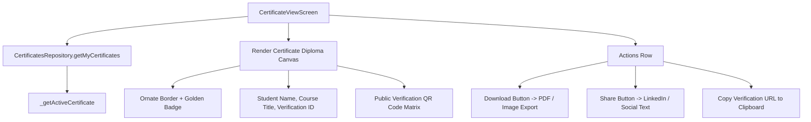

# Mobile Screen Deep-Dive: `CertificateViewScreen`

> **File Path:** [`apps/mobile/lib/features/courses/presentation/screens/certificate_view_screen.dart`](file:///d:/Programming/MonoRepo%20Porjects/EducationLab/apps/mobile/lib/features/courses/presentation/screens/certificate_view_screen.dart)  
> **Route Name:** `'/certificate-view'`  
> **Scale:** 911 lines of Dart code  
> **State Management:** `CertificatesRepository`  
> **Visual Engineering:** Guilloche border frame vector, golden seal watermark, QR verification matrix

---

## 1. Overview & Business Objective

`CertificateViewScreen` is the digital credential rendering and verification viewer. It provides students with an accredited certificate of graduation upon 100% course syllabus completion.

Key capabilities:
1. **Realistic Diploma Canvas Rendering:** Vector frame borders, institutional watermark seal, student full name in large typography, course syllabus title, and authorized signatory seals.
2. **Dynamic Multi-Certificate Carousel:** Enables students to horizontally swipe between multiple earned certificates directly inside the viewer.
3. **Public Verification QR Code:** Generates dynamic QR matrices linking directly to the backend accreditation route `/verify/{code}` for third-party employer verification.
4. **Export & Sharing Hub:** Download modal offering PDF and high-res image exports, along with instant LinkedIn certification sharing copy.

---

## 2. Screen Architecture & State Machine



---

## 3. UI Component Hierarchy & Layout Tree

```
Scaffold (backgroundColor: dynamic dark/light)
├── AppBar
│   ├── Leading: Back button
│   ├── Title: "شهادة الإتمام الأكاديمية" / "Certificate"
│   └── Actions: Share Icon Button -> _shareCertificate()
└── Body: SingleChildScrollView (BouncingScrollPhysics, padding: 16)
    ├── SECTION 1: Certificate Canvas Card
    │   ├── Container (Aspect Ratio 1.414 - A4 landscape format):
    │   │   ├── Double Gold Foil Guilloche Border
    │   │   ├── Watermark Seal Background
    │   │   ├── Institution Header: "منصة إديولاب للتعليم الاحترافي"
    │   │   ├── "شهادة إتمام وتفوق معتمدة"
    │   │   ├── Student Full Name (Bold Tajawal 22px)
    │   │   ├── Course Syllabus Title (Primary Color Accent)
    │   │   ├── Issuance Date & Unique Verification Code
    │   │   ├── Authorized Signatures (Lead Instructor + Academic Dean)
    │   │   └── Verification QR Code Matrix
    ├── SECTION 2: Horizontal Certificate Switcher (if user has > 1 certificates)
    │   └── ListView (Horizontal scroll of earned certificate thumbnails)
    └── SECTION 3: Action Buttons
        ├── Primary Action: "تحميل الشهادة (PDF / صورة)" -> _downloadCertificate()
        ├── Secondary Action: "مشاركة على LinkedIn"
        └── Tertiary Action: "نسخ رابط التحقق المباشر"
```

---

## 4. Security & Verification Assurance

1. **Tamper-Proof Verification ID:**
   * Every certificate includes a unique verification code (`EL-YYYYMMDD-XXXXX`). Tapping or scanning the code verifies authenticity via the backend `GET /api/Certificates/verify/{code}` endpoint, preventing credential fraud.
