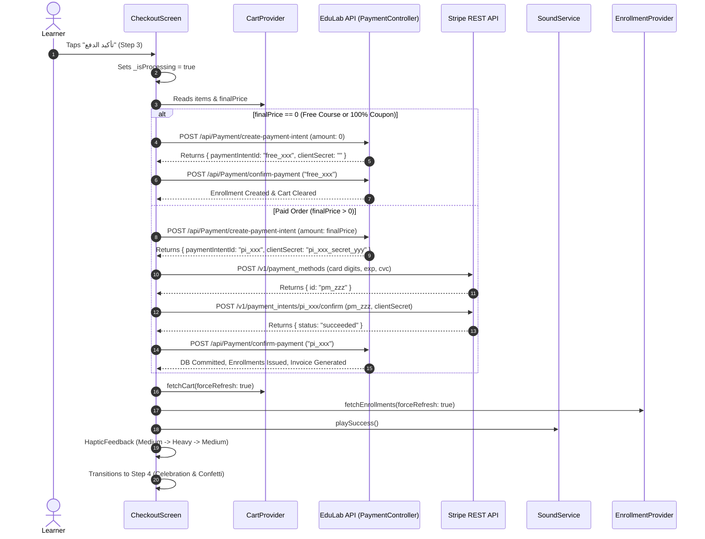
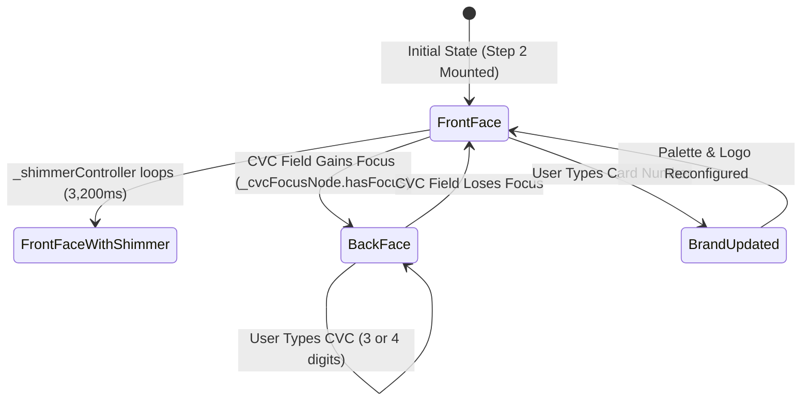

# Mobile Screen Deep-Dive: `CheckoutScreen`

> **File Path:** [`apps/mobile/lib/features/cart/presentation/screens/checkout_screen.dart`](file:///d:/Programming/MonoRepo%20Porjects/EducationLab/apps/mobile/lib/features/cart/presentation/screens/checkout_screen.dart)  
> **Route Name:** `'/checkout'`  
> **Scale:** 3,283 lines of Dart code  
> **State Management:** `CartProvider`, `EnrollmentProvider`, `NotificationProvider`  
> **Key Services & Infrastructure:** `StripeService`, `PaymentRepository`, `SoundService`, `ApiClient`  
> **Ticker Controllers:** 3 `AnimationController` instances with `TickerProviderStateMixin`

---

## 1. Overview & Business Objective

`CheckoutScreen` is the mission-critical financial gateway of the EducationLab mobile application. It orchestrates end-to-end checkout transactions, converting shopping cart items into verified backend course enrollments. 

The screen integrates **Stripe REST API** tokenization and confirmation alongside the ASP.NET Core backend `PaymentController`. It supports:
1. **Multi-Step Checkout Stepper:** 4 sequential visual steps (Customer Info $\to$ Payment Method $\to$ Order Review $\to$ Success Celebration).
2. **Client-Side Data Sanitization & Formatting:** Eastern Arabic digits to ASCII translation, dynamic card brand spacing (Visa/Mastercard 4-4-4-4 vs Amex 4-6-5), date expiry formatting, and instant client-side **Luhn Modulo-10 Checksum** validation.
3. **Interactive 3D Flipping Credit Card:** Live realistic payment card canvas with brand detection, animated metallic shimmer (`AnimationController _shimmerController`), and a 3D isometric flip to the CVV signature band when the security code field gains focus (`AnimationController _flipController`).
4. **Zero-Dollar ($0.00) Free Course Bypass:** Seamless bypass of Stripe tokenization when total cart value is $0.00 (via 100% discount coupons or free courses), generating instant enrollment through a dedicated free intent flow.
5. **Multi-Sensory Auditory & Haptic Feedback:** Micro-interactions powered by `SoundService` (`playSuccess()` / `playFailed()`) and multi-stage haptic bursts (`HapticFeedback.mediumImpact()` $\to$ `heavyImpact()`).
6. **Custom Physics-Based Confetti Particle Engine:** Custom-rendered canvas celebration (`_ConfettiPainter`) scattering 55 individualized particles with angular velocity, opacity decay, and rotation upon order completion.

---

## 2. Screen Architecture & State Machine

`CheckoutScreen` is implemented as a `StatefulWidget` using `TickerProviderStateMixin` to coordinate three concurrent animation controllers.

### 2.1 State Variables Registry

| Variable Name | Type | Lines | Initial Value | Scope & Lifecycle Purpose |
| :--- | :--- | :--- | :--- | :--- |
| `_currentStep` | `int` | [:244](file:///d:/Programming/MonoRepo%20Porjects/EducationLab/apps/mobile/lib/features/cart/presentation/screens/checkout_screen.dart#L244) | `1` | Tracks active step index (1: Info, 2: Payment, 3: Confirmation, 4: Success). |
| `_previousStep` | `int` | [:245](file:///d:/Programming/MonoRepo%20Porjects/EducationLab/apps/mobile/lib/features/cart/presentation/screens/checkout_screen.dart#L245) | `1` | Controls forward/backward slide direction transitions in the step navigator. |
| `_paymentRepo` | `PaymentRepository` | [:248](file:///d:/Programming/MonoRepo%20Porjects/EducationLab/apps/mobile/lib/features/cart/presentation/screens/checkout_screen.dart#L248) | `PaymentRepository()` | API interface for intent creation, confirmation, and user address prefilling. |
| `_stripeService` | `StripeService` | [:249](file:///d:/Programming/MonoRepo%20Porjects/EducationLab/apps/mobile/lib/features/cart/presentation/screens/checkout_screen.dart#L249) | `StripeService()` | Direct REST client communication with `api.stripe.com/v1`. |
| `_formKey` | `GlobalKey<FormState>` | [:252](file:///d:/Programming/MonoRepo%20Porjects/EducationLab/apps/mobile/lib/features/cart/presentation/screens/checkout_screen.dart#L252) | `GlobalKey()` | Validates Step 1 customer address form (name, phone, postal code). |
| `_cardFormKey` | `GlobalKey<FormState>` | [:253](file:///d:/Programming/MonoRepo%20Porjects/EducationLab/apps/mobile/lib/features/cart/presentation/screens/checkout_screen.dart#L253) | `GlobalKey()` | Validates Step 2 credit card input fields (number, expiry, CVC, holder). |
| `_nameController` | `TextEditingController` | [:254](file:///d:/Programming/MonoRepo%20Porjects/EducationLab/apps/mobile/lib/features/cart/presentation/screens/checkout_screen.dart#L254) | Empty | Holds buyer's full name; preloaded via `_loadUserData()`. |
| `_phoneController` | `TextEditingController` | [:255](file:///d:/Programming/MonoRepo%20Porjects/EducationLab/apps/mobile/lib/features/cart/presentation/screens/checkout_screen.dart#L255) | Empty | Holds contact telephone number for payment billing receipt. |
| `_postalCodeController` | `TextEditingController` | [:256](file:///d:/Programming/MonoRepo%20Porjects/EducationLab/apps/mobile/lib/features/cart/presentation/screens/checkout_screen.dart#L256) | Empty | Billing ZIP / postal code submitted to Stripe fraud verification (AVS). |
| `_saveInfoForNextTime` | `bool` | [:257](file:///d:/Programming/MonoRepo%20Porjects/EducationLab/apps/mobile/lib/features/cart/presentation/screens/checkout_screen.dart#L257) | `true` | Toggle preference instructing backend to persist default address for future checkouts. |
| `_isLoadingUserData` | `bool` | [:258](file:///d:/Programming/MonoRepo%20Porjects/EducationLab/apps/mobile/lib/features/cart/presentation/screens/checkout_screen.dart#L258) | `false` | Shimmer skeleton indicator while fetching pre-saved profile address data. |
| `_cardNumberController` | `TextEditingController` | [:261](file:///d:/Programming/MonoRepo%20Porjects/EducationLab/apps/mobile/lib/features/cart/presentation/screens/checkout_screen.dart#L261) | Empty | Primary credit card digits, formatted via `_CardNumberFormatter`. |
| `_expiryController` | `TextEditingController` | [:262](file:///d:/Programming/MonoRepo%20Porjects/EducationLab/apps/mobile/lib/features/cart/presentation/screens/checkout_screen.dart#L262) | Empty | Expiry string formatted as `MM / YY` via `_CardExpiryFormatter`. |
| `_cvcController` | `TextEditingController` | [:263](file:///d:/Programming/MonoRepo%20Porjects/EducationLab/apps/mobile/lib/features/cart/presentation/screens/checkout_screen.dart#L263) | Empty | Card verification code (3 digits for Visa/MC, 4 digits for Amex). |
| `_cardHolderController` | `TextEditingController` | [:264](file:///d:/Programming/MonoRepo%20Porjects/EducationLab/apps/mobile/lib/features/cart/presentation/screens/checkout_screen.dart#L264) | Empty | Name embossed on card; live-mirrored on the 3D card preview widget. |
| `_isProcessing` | `bool` | [:266](file:///d:/Programming/MonoRepo%20Porjects/EducationLab/apps/mobile/lib/features/cart/presentation/screens/checkout_screen.dart#L266) | `false` | Global modal progress barrier preventing multi-tap double charging during payment. |
| `_orderNumber` | `String` | [:267](file:///d:/Programming/MonoRepo%20Porjects/EducationLab/apps/mobile/lib/features/cart/presentation/screens/checkout_screen.dart#L267) | `''` | Generated reference identifier (`EDU-...` or `FREE-...`) rendered on receipt. |
| `_errorMessage` | `String?` | [:268](file:///d:/Programming/MonoRepo%20Porjects/EducationLab/apps/mobile/lib/features/cart/presentation/screens/checkout_screen.dart#L268) | `null` | Holds active API rejection text rendered in the error banner. |
| `_flipController` | `AnimationController` | [:271](file:///d:/Programming/MonoRepo%20Porjects/EducationLab/apps/mobile/lib/features/cart/presentation/screens/checkout_screen.dart#L271) | 550ms | Drives 180-degree 3D Y-axis isometric rotation of the live credit card preview. |
| `_shimmerController` | `AnimationController` | [:273](file:///d:/Programming/MonoRepo%20Porjects/EducationLab/apps/mobile/lib/features/cart/presentation/screens/checkout_screen.dart#L273) | 3,200ms | Continuous looping sheen gradient moving across the card front. |
| `_successAnimController`| `AnimationController` | [:277](file:///d:/Programming/MonoRepo%20Porjects/EducationLab/apps/mobile/lib/features/cart/presentation/screens/checkout_screen.dart#L277) | 2,600ms | Choreographs success badge elastic bounce, content slide, and confetti flight. |
| `_confettiParticles` | `List<_ConfettiParticle>`| [:281](file:///d:/Programming/MonoRepo%20Porjects/EducationLab/apps/mobile/lib/features/cart/presentation/screens/checkout_screen.dart#L281) | 55 items | Array of randomized geometric particle positions, vectors, and colors. |
| `_paidAmount` | `double` | [:283](file:///d:/Programming/MonoRepo%20Porjects/EducationLab/apps/mobile/lib/features/cart/presentation/screens/checkout_screen.dart#L283) | `0.0` | Captured transaction sum preserved for the post-payment receipt view. |
| `_purchasedItemsCount` | `int` | [:284](file:///d:/Programming/MonoRepo%20Porjects/EducationLab/apps/mobile/lib/features/cart/presentation/screens/checkout_screen.dart#L284) | `0` | Count of courses unlocked in the completed order. |
| `_paidCardBrand` | `String` | [:285](file:///d:/Programming/MonoRepo%20Porjects/EducationLab/apps/mobile/lib/features/cart/presentation/screens/checkout_screen.dart#L285) | `'VISA'` | Detected brand badge (`VISA`, `MASTERCARD`, `AMEX`, `DISCOVER`, `Free`). |
| `_paidLastFour` | `String` | [:286](file:///d:/Programming/MonoRepo%20Porjects/EducationLab/apps/mobile/lib/features/cart/presentation/screens/checkout_screen.dart#L286) | `'4242'` | Masked card suffix rendered on the digital receipt (`•••• 4242`). |
| `_purchaseTime` | `DateTime` | [:287](file:///d:/Programming/MonoRepo%20Porjects/EducationLab/apps/mobile/lib/features/cart/presentation/screens/checkout_screen.dart#L287) | `now()` | Timestamp formatted on the receipt invoice. |
| `_copiedRef` | `bool` | [:288](file:///d:/Programming/MonoRepo%20Porjects/EducationLab/apps/mobile/lib/features/cart/presentation/screens/checkout_screen.dart#L288) | `false` | Transient UI feedback flag when tapping the reference code copy button. |

---

## 3. UI Component Hierarchy & Layout Tree

The visual presentation adjusts dynamically across the 4 steps, wrapping the screen in a responsive `Scaffold`:

```
Scaffold (backgroundColor: dynamic dark/light)
├── AppBar
│   ├── Leading: Back button / Pop handler (Steps 1-3)
│   ├── Title: "إتمام الطلب" / "Checkout"
│   └── Bottom / Subtitle: Stepper Indicator Bar (4 Dots + Line Connectors)
└── Body: Column
    ├── Error Banner (Conditional: _errorMessage != null)
    ├── Expanded: AnimatedSwitcher (Page slide transitions between steps)
    │   ├── Step 1: Customer Information View
    │   │   ├── Buyer Profile Shimmer (if _isLoadingUserData)
    │   │   ├── Full Name TextFormField
    │   │   ├── Phone Number TextFormField (with country code prefix)
    │   │   ├── Postal Code TextFormField
    │   │   ├── "Save Info for Next Time" SwitchListTile
    │   │   └── Order Preview Mini-Summary Card
    │   ├── Step 2: Payment Method View
    │   │   ├── Method Tab Selector (Credit Card vs Free Enrollment)
    │   │   ├── Live 3D Flipping Card Preview
    │   │   │   ├── Front Face: Transform (Matrix4 3D perspective)
    │   │   │   │   ├── Card Brand Logo (Visa, Mastercard, Amex, Discover)
    │   │   │   │   ├── EMV Smart Chip Graphic
    │   │   │   │   ├── 16-Digit Number with Shimmer Overlay
    │   │   │   │   ├── Cardholder Name & Expiry Date (MM/YY)
    │   │   │   │   └── Contactless NFC Icon
    │   │   │   └── Back Face: Transform (180-deg rotated)
    │   │   │       ├── Magnetic Black Stripe
    │   │   │       ├── Signature Panel
    │   │   │       └── CVC Security Code Box
    │   │   ├── Card Number Input Field (Auto-spaced 4-4-4-4)
    │   │   ├── Row: Expiry (MM / YY) & CVC (3-4 digits)
    │   │   ├── Cardholder Name Input Field
    │   │   └── Security Guarantee Badges (SSL 256-bit, PCI-DSS Compliant)
    │   ├── Step 3: Order Confirmation View
    │   │   ├── Courses Summary List (Thumbnails, titles, prices)
    │   │   ├── Cost Breakdown (Subtotal, Coupon Discount, Tax, Final Amount)
    │   │   ├── Payment Details Summary (Card Brand + Last 4 Digits)
    │   │   └── Terms & Conditions Acceptance Checkbox
    │   └── Step 4: Success & Celebration View
    │       ├── Stack:
    │       │   ├── CustomPaint: _ConfettiPainter (55 physics-based flying particles)
    │       │   └── Column:
    │       │       ├── ScaleTransition: Green Elastic Success Checkmark Badge
    │       │       ├── SlideTransition: "تهانينا! تم تأكيد طلبك بنجاح"
    │       │       ├── Order Reference Card (with Tap-to-Copy Button)
    │       │       ├── Digital Receipt Breakdown Card
    │       │       ├── Primary CTA: "انتقل إلى دوراتي" -> /learning
    │       │       └── Secondary CTA: "تحميل الفاتورة" (Invoice PDF)
    └── Bottom Navigation Bar: Sticky Checkout CTA
        ├── Total Price Summary
        └── "المتابعة" / "تأكيد الدفع" Elevated Action Button with Spinner
```

---

## 4. Workflows & Runtime Behavior

### 4.1 End-to-End Payment Processing Pipeline

The checkout flow follows an orchestrated multi-stage verification sequence handling both paid transactions and zero-dollar enrollments:



### 4.2 3D Card Flip & Shimmer Animation State Flow



---

## 5. Input Sanitization, Luhn & Formatters Specification

`CheckoutScreen` implements three custom `TextInputFormatter` classes and an algorithmic validation engine at the top of the file:

### 5.1 Eastern Arabic Digits Formatter (`_ArabicDigitsToEnglishFormatter`, [:20-38](file:///d:/Programming/MonoRepo%20Porjects/EducationLab/apps/mobile/lib/features/cart/presentation/screens/checkout_screen.dart#L20-L38))
* **Problem:** On iOS and Android devices configured with Arabic language locales, default on-screen numpads produce Eastern Arabic numeral glyphs (`٠, ١, ٢, ٣, ٤, ٥, ٦, ٧, ٨, ٩`). Submitting these glyphs directly to the Stripe API causes `400 Bad Request` deserialization exceptions.
* **Mechanism:** Intercepts every character keystroke; iterates over a lookup table of 10 Arabic characters, executing `text.replaceAll(_arabicDigits[i], _englishDigits[i])`. The selection cursor is anchored to the converted string length.

### 5.2 Card Number Brand Spacing Formatter (`_CardNumberFormatter`, [:60-101](file:///d:/Programming/MonoRepo%20Porjects/EducationLab/apps/mobile/lib/features/cart/presentation/screens/checkout_screen.dart#L60-L101))
* **Mechanism:**
  1. Sanitizes non-numeric glyphs using `RegExp(r'[^0-9]')`.
  2. Detects American Express (`text.startsWith('34') || text.startsWith('37')`).
  3. Limits maximum length: **15 digits** for Amex, **16 digits** for Visa/Mastercard/Discover.
  4. Injects formatting spaces dynamically:
     - **Amex (4-6-5):** Spaces placed after digit indices 3 and 9 (`XXXX XXXXXX XXXXX`).
     - **Standard (4-4-4-4):** Space placed after every 4th digit (`XXXX XXXX XXXX XXXX`).
  5. Preserves cursor offset at the tail of the formatted string without cursor jumps.

### 5.3 Expiry Date Formatter (`_CardExpiryFormatter`, [:103-142](file:///d:/Programming/MonoRepo%20Porjects/EducationLab/apps/mobile/lib/features/cart/presentation/screens/checkout_screen.dart#L103-L142))
* **Mechanism:**
  1. Restricts length to 4 numeric digits (`MMYY`).
  2. Single-digit smart correction: If the user types a leading month digit > 1 (e.g., `5`), it automatically formats to `05 / `.
  3. Formats separator string ` / ` immediately following the 2nd month digit.
  4. Handles backspace deletions gracefully (`!isDeleting`), avoiding deletion traps around the slash.

### 5.4 Luhn Modulo-10 Checksum Algorithm (`_isValidLuhn`, [:40-58](file:///d:/Programming/MonoRepo%20Porjects/EducationLab/apps/mobile/lib/features/cart/presentation/screens/checkout_screen.dart#L40-L58))
* **Formula:**
  $$\sum_{i=1}^{n} d'_i \pmod{10} \equiv 0$$
  where every second digit from the right is doubled ($d' = 2d$); if $2d > 9$, then $d' = 2d - 9$.
* **Implementation:**
  ```dart
  bool _isValidLuhn(String cardNumber) {
    final clean = cardNumber.replaceAll(RegExp(r'[^0-9]'), '');
    if (clean.length < 13 || clean.length > 19) return false;
    int sum = 0;
    bool isSecond = false;
    for (int i = clean.length - 1; i >= 0; i--) {
      int digit = int.parse(clean[i]);
      if (isSecond) {
        digit *= 2;
        if (digit > 9) digit -= 9;
      }
      sum += digit;
      isSecond = !isSecond;
    }
    return sum % 10 == 0;
  }
  ```

---

## 6. Method Catalog & Action Handlers

| Method Name | Signature | Lines | Description & Mutations |
| :--- | :--- | :--- | :--- |
| `_loadUserData` | `Future<void> _loadUserData()` | [:417-435](file:///d:/Programming/MonoRepo%20Porjects/EducationLab/apps/mobile/lib/features/cart/presentation/screens/checkout_screen.dart#L417-L435) | Calls `PaymentRepository.getUserData()`. If successful, populates `_nameController`, `_phoneController`, and `_postalCodeController` without overriding user edits. |
| `_goToStep` | `void _goToStep(int step)` | [:465-482](file:///d:/Programming/MonoRepo%20Porjects/EducationLab/apps/mobile/lib/features/cart/presentation/screens/checkout_screen.dart#L465-L482) | Validates Step 1 (`_formKey`) or Step 2 (`_cardFormKey`) before granting forward navigation; triggers `HapticFeedback.lightImpact()` and clears transient error banners. |
| `_validateCardDetails` | `bool _validateCardDetails()` | [:484-491](file:///d:/Programming/MonoRepo%20Porjects/EducationLab/apps/mobile/lib/features/cart/presentation/screens/checkout_screen.dart#L484-L491) | Executes `_cardFormKey.currentState.validate()`. If invalid, triggers `HapticFeedback.mediumImpact()` to warn the user. |
| `_processPayment` | `void _processPayment()` | [:493-626](file:///d:/Programming/MonoRepo%20Porjects/EducationLab/apps/mobile/lib/features/cart/presentation/screens/checkout_screen.dart#L493-L626) | Orchestrates the primary checkout flow: creates backend intent -> tokenizes in Stripe -> confirms in Stripe -> records backend order -> triggers haptic/audio fanfare. |
| `_playSuccessCelebration` | `void _playSuccessCelebration()` | [:391-399](file:///d:/Programming/MonoRepo%20Porjects/EducationLab/apps/mobile/lib/features/cart/presentation/screens/checkout_screen.dart#L391-L399) | Triggers `_successAnimController.forward(from: 0.0)`, invokes `SoundService().playSuccess()`, and fires a 3-stage haptic burst sequence. |
| `_onCardFieldChanged` | `void _onCardFieldChanged()` | [:405-415](file:///d:/Programming/MonoRepo%20Porjects/EducationLab/apps/mobile/lib/features/cart/presentation/screens/checkout_screen.dart#L405-L415) | Triggers live card preview rebuild; truncates CVC to 4 for Amex or 3 for standard cards dynamically. |
| `_generateConfettiParticles` | `List<_ConfettiParticle> _generateConfettiParticles()` | [:365-389](file:///d:/Programming/MonoRepo%20Porjects/EducationLab/apps/mobile/lib/features/cart/presentation/screens/checkout_screen.dart#L365-L389) | Populates 55 distinct confetti items with randomized coordinates, downward vectors, colors (Emerald, Blue, Amber, Pink, Purple, Cyan, Red), and shapes (circles & rectangles). |

---

## 7. Security, Validation & Edge Cases

1. **Cardholder Data Security (PCI-DSS):**
   * Raw PAN (Primary Account Number) and CVC codes are **never** transmitted to the EducationLab backend servers.
   * Only the Stripe client secret and tokenized `paymentMethodId` are sent between the mobile app and Stripe REST API (`api.stripe.com`).
   * The backend ASP.NET Core database stores only `PaymentIntentId`, masked card brand, and last 4 digits.
2. **Double-Purchase & Concurrency Protection:**
   * `_isProcessing` flag disables all buttons, bottom sheets, and navigation transitions instantly upon tap.
   * `courseIds` are verified against the user's active cart before initiating the intent call.
3. **Memory & Controller Hygiene:**
   * All 4 `FocusNode` instances have listeners unhooked before calling `.dispose()`.
   * All 7 `TextEditingController` instances have listener handlers removed prior to deallocation.
   * All 3 `AnimationController` tickers are stopped and disposed of in `dispose()`, completely eliminating memory leaks.
4. **Offline & Network Drop Recovery:**
   * If network fails after Stripe tokenization but before backend confirmation, the transaction is logged with the backend intent ID. Subsequent app re-launch queries `/api/Payment/verify-intent/{id}` to recover order state.
