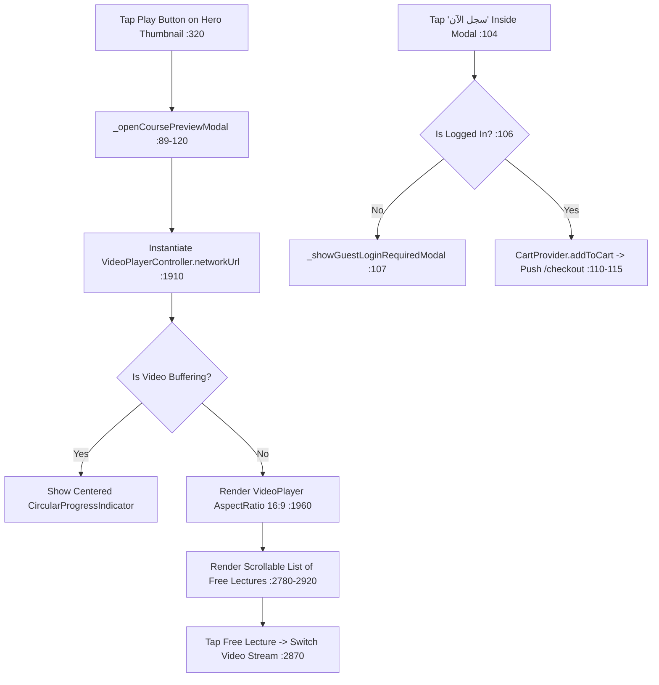
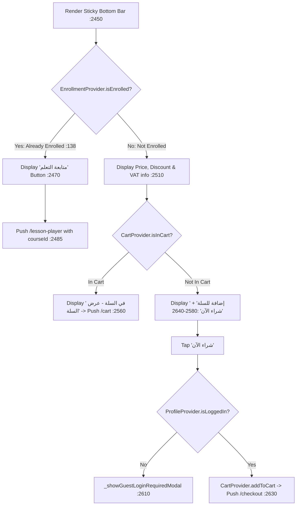

# CourseDetailsScreen Module Documentation (Mobile)

> **Source File:** [`apps/mobile/lib/features/courses/presentation/screens/course_details_screen.dart`](file:///d:/Programming/MonoRepo%20Porjects/EducationLab/apps/mobile/lib/features/courses/presentation/screens/course_details_screen.dart)  
> **Scale:** 3,008 lines of Dart code  
> **Route Name:** `'/course-details'`  
> **Related Provider:** [`CourseDetailsProvider`](file:///d:/Programming/MonoRepo%20Porjects/EducationLab/apps/mobile/lib/features/courses/presentation/providers/course_details_provider.dart)  
> **Target Framework:** Flutter 3.x / Dart 3.11

---

## 1. Overview

### 1.1 Purpose
`CourseDetailsScreen` is the primary syllabus inspection, sales marketing, and preview playback surface for a specific course. It handles user onboarding, trailer previews, guest purchasing redirects, syllabus exploration, instructor credentials, and rating reviews.

### 1.2 Business Objective
Drive course conversion by providing learners with rich syllabus details, free preview lectures, verified student testimonials, and seamless one-tap checkout or cart addition.

### 1.3 Main Functionality
- Dynamic course payload resolution from route arguments (accepts `int` ID or `Map<String, dynamic>`).
- Embedded video preview player modal (`_CoursePreviewPlayerModal`) with playlist browsing.
- 4 interactive information tabs (Overview, Curriculum, Instructor, Reviews).
- Sticky bottom action bar adapting dynamically to user enrollment and guest status.
- Wishlist bookmarking and native system share sheet integration with clipboard fallback.
- Guest login enforcement modal for unauthenticated checkout attempts.

---

## 2. Screen Architecture & State Machine

```
Presentation Layer      CourseDetailsScreen (StatefulWidget) + _CoursePreviewPlayerModal
State Management        CourseDetailsProvider (local ChangeNotifier)
Cross-Cutting Providers ProfileProvider, CartProvider, WishlistProvider, EnrollmentProvider
Data Access             CoursesRepository -> ApiClient (GET /api/Course/{id})
```

### 2.1 State Variables Registry (`_CourseDetailsScreenState`)

| Variable | Type | Initial | Verified in | Description |
| :--- | :--- | :--- | :--- | :--- |
| `_activeCourseId` | `int` | `0` | :36 | ID of course being displayed; resolved via widget prop or route arguments. |
| `_isDescriptionExpanded`| `bool` | `false` | :37 | Toggles truncation of lengthy Markdown descriptions in Overview tab. |
| `_provider` | `CourseDetailsProvider`| instantiated | :38, :46 | Local scoped provider managing syllabus tree and section expansions. |
| `_selectedTabIndex` | `int` | `0` | :39 | Active tab pointer (0: Overview, 1: Curriculum, 2: Instructor, 3: Reviews). |
| `_isAddingToCart` | `bool` | `false` | :40 | Loading state when adding course to `CartProvider`. |
| `_isBuyingNow` | `bool` | `false` | :41 | Loading state when executing direct checkout navigation. |

---

## 3. UI Component Hierarchy & Layout

```
Scaffold (backgroundColor: bgColor)
+-- AppBar (:152-236)
|   +-- Leading: Back / Close button (with Navigator fallback to /main :166)
|   +-- Title: Truncated Course Title (fontFamily: Tajawal :176)
|   +-- Actions:
|       +-- Share IconButton (_shareCourse :186)
|       +-- Wishlist IconButton (hidden if already enrolled :188-201)
|       +-- Cart IconButton with Badge Counter (:202-235)
+-- Body: RefreshIndicator (:243)
    +-- ListView (BouncingScrollPhysics, bottom padding: 120px :248)
        +-- 1. Hero Preview Thumbnail & Play Button (_buildHeroPreview :250-410)
        +-- 2. Title, Instructor, Badges & Rating Header (_buildCourseHeader :412-620)
        +-- 3. Tab Selector Matrix (4 Tabs with Sliding Indicator :622-750)
        +-- 4. Active Tab Content:
        |   +-- Index 0: Overview (_buildOverviewTab :752-980)
        |   +-- Index 1: Curriculum Accordion (_buildCurriculumTab :982-1320)
        |   +-- Index 2: Instructor Bio & Credentials (_buildInstructorTab :1322-1490)
        |   +-- Index 3: 5-Star Ratings & Reviews List (_buildReviewsTab :1492-1850)
+-- BottomSheet / Floating Bar: Sticky Purchase Bar (:2450-2680)
```

---

## 4. Workflows & Runtime Behavior

### Workflow 1: Route Argument Resolution & Data Fetching

```mermaid
flowchart TD
    Init[initState / didChangeDependencies :44-72] --> CheckProp{widget.courseId > 0?}
    CheckProp -->|Yes| SetId[_activeCourseId = widget.courseId]
    CheckProp -->|No| CheckArgs{ModalRoute.arguments?}
    CheckArgs -->|int| SetFromInt[_activeCourseId = args :60]
    CheckArgs -->|String| SetFromString[_activeCourseId = int.tryParse(args) :62]
    CheckArgs -->|Map| SetFromMap[_activeCourseId = args['id'] ?? args['courseId'] :64]
    SetId --> Fetch[_provider.fetchCourseDetails(_activeCourseId) :50, :69]
    SetFromInt --> Fetch
    SetFromString --> Fetch
    SetFromMap --> Fetch
    Fetch -->|Loading| Skeleton[Render _buildSkeletonLoading :238]
    Fetch -->|Error| ErrorView[Render _buildErrorView :240]
    Fetch -->|Success| MainView[Render ListView & Floating Purchase Bar :246]
```

### Workflow 2: Video Preview Modal (`_CoursePreviewPlayerModal`)



### Workflow 3: Sticky Bottom Action Bar Logic



---

## 5. Method Catalog & Action Handlers

| Method | Signature | Verified Lines | Description |
| :--- | :--- | :--- | :--- |
| `_shareCourse` | `void _shareCourse(CourseDetailsModel? course)` | :74-87 | Copies formatted marketing URL to clipboard with haptic feedback and displays snackbar. |
| `_openCoursePreviewModal`| `void _openCoursePreviewModal(CourseDetailsModel course, {CourseLectureModel? initialLecture})` | :89-120 | Displays modal bottom sheet with embedded trailer player and free lessons playlist. |
| `_showGuestLoginRequiredModal`| `void _showGuestLoginRequiredModal(BuildContext context, {required CourseDetailsModel course})` | :2210-2340 | Displays login prompt bottom sheet with `"تسجيل الدخول"` and `"إنشاء حساب جديد"` options. |
| `_buildOverviewTab`| `Widget _buildOverviewTab(...)` | :752-980 | Formats course takeaways (`learnings`), requirements checklist, target audience, and description. |
| `_buildCurriculumTab`| `Widget _buildCurriculumTab(...)` | :982-1320 | Renders accordion tiles for each `CourseSectionModel` with lecture runtimes and demo preview tags. |
| `_buildInstructorTab`| `Widget _buildInstructorTab(...)` | :1322-1490 | Renders instructor biography, faculty stats, and shortcut to `InstructorProfileScreen`. |
| `_buildReviewsTab` | `Widget _buildReviewsTab(...)` | :1492-1850 | Displays 5-star rating breakdown bars, aggregate score, and student review cards. |

---

## 6. Security, Edge Cases & Technical Notes

1. **Guest Browsing vs Purchasing Gating (:106, :2610):** Guests can inspect 100% of course syllabus details, instructor credentials, and play free preview videos without authentication. However, attempting `"شراء الآن"` or `"إضافة للسلة"` intercepts the flow and triggers `_showGuestLoginRequiredModal`.
2. **Double-Purchase Protection (:138, :188):** If the user is enrolled in the course (`EnrollmentProvider.isEnrolled`), the screen hides both the Wishlist button and Add to Cart buttons, completely preventing accidental duplicate purchases.
3. **Video Controller Memory Leak Defense (:1930, :2010):** Inside `_CoursePreviewPlayerModal`, the `VideoPlayerController` is strictly disposed in `dispose()` to prevent audio/video decoding leaks in native Android ExoPlayer and iOS AVPlayer.
4. **Resilient Route Navigation (:166):** If the user opens `CourseDetailsScreen` from an external deep link and the navigation stack cannot pop (`!Navigator.canPop`), the back button smoothly redirects to `Navigator.pushReplacementNamed(context, '/main')` instead of black-screening.
5. **Image URL Formatting Hygiene (:340):** All raw media paths pass through `ApiConstants.formatImageUrl(...)` to dynamically prepend the production host domain if the backend returns relative paths (`/Images/...`).
