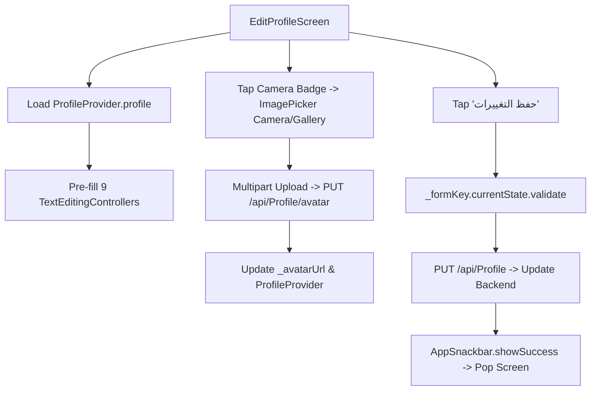

# Mobile Screen Deep-Dive: `EditProfileScreen`

> **File Path:** [`apps/mobile/lib/features/profile/presentation/screens/edit_profile_screen.dart`](file:///d:/Programming/MonoRepo%20Porjects/EducationLab/apps/mobile/lib/features/profile/presentation/screens/edit_profile_screen.dart)  
> **Route Name:** `'/edit-profile'`  
> **Scale:** 886 lines of Dart code  
> **State Management:** `ProfileProvider`  
> **Hardware Features:** Camera & Gallery Image Picker via `ImagePicker`  
> **DTO Contract:** Maps 1:1 with ASP.NET Core `ProfileDTO`

---

## 1. Overview & Business Objective

`EditProfileScreen` enables learners and instructors to modify their personal details, professional biographies, contact information, social links, and profile photos.

Key capabilities:
1. **Interactive Avatar Upload:** Direct photo capture or gallery selection using `ImagePicker`, followed by multipart upload to `/api/Profile/avatar` with real-time uploading spinner.
2. **Comprehensive Bio & Credentials Management:** Edits full name, professional headline, biography, location, phone number, and social profiles (GitHub, LinkedIn, Twitter/X, Facebook).
3. **Immutable Identity Fields:** Email address is displayed in a read-only locked tile with security lock badge to prevent unauthorized email identity takeover without formal 2-step email verification.
4. **Instant In-Memory Synchronicity:** Updates local `ProfileProvider` immediately on success, automatically refreshing headers across the Home and Profile tabs.

---

## 2. Screen Architecture & State Machine



### 2.1 State Variables Registry

| Variable Name | Type | Lines | Initial Value | Scope & Lifecycle Purpose |
| :--- | :--- | :--- | :--- | :--- |
| `_formKey` | `GlobalKey<FormState>` | [:23](file:///d:/Programming/MonoRepo%20Porjects/EducationLab/apps/mobile/lib/features/profile/presentation/screens/edit_profile_screen.dart#L23) | `GlobalKey()` | Validates required fields before submitting to backend. |
| `_fullNameController` | `TextEditingController` | [:27](file:///d:/Programming/MonoRepo%20Porjects/EducationLab/apps/mobile/lib/features/profile/presentation/screens/edit_profile_screen.dart#L27) | User full name | Holds buyer / instructor full name. |
| `_headlineController` | `TextEditingController` | [:28](file:///d:/Programming/MonoRepo%20Porjects/EducationLab/apps/mobile/lib/features/profile/presentation/screens/edit_profile_screen.dart#L28) | Title string | Professional title / headline (e.g. "Senior Software Architect"). |
| `_bioController` | `TextEditingController` | [:29](file:///d:/Programming/MonoRepo%20Porjects/EducationLab/apps/mobile/lib/features/profile/presentation/screens/edit_profile_screen.dart#L29) | About text | Multi-line biography text. |
| `_githubController` | `TextEditingController` | [:30](file:///d:/Programming/MonoRepo%20Porjects/EducationLab/apps/mobile/lib/features/profile/presentation/screens/edit_profile_screen.dart#L30) | GitHub handle | GitHub social profile handle or link. |
| `_linkedInController` | `TextEditingController` | [:31](file:///d:/Programming/MonoRepo%20Porjects/EducationLab/apps/mobile/lib/features/profile/presentation/screens/edit_profile_screen.dart#L31) | LinkedIn handle | LinkedIn social profile handle or link. |
| `_twitterController` | `TextEditingController` | [:32](file:///d:/Programming/MonoRepo%20Porjects/EducationLab/apps/mobile/lib/features/profile/presentation/screens/edit_profile_screen.dart#L32) | Twitter handle | X / Twitter profile handle. |
| `_facebookController` | `TextEditingController` | [:33](file:///d:/Programming/MonoRepo%20Porjects/EducationLab/apps/mobile/lib/features/profile/presentation/screens/edit_profile_screen.dart#L33) | Facebook link | Facebook profile link. |
| `_phoneController` | `TextEditingController` | [:34](file:///d:/Programming/MonoRepo%20Porjects/EducationLab/apps/mobile/lib/features/profile/presentation/screens/edit_profile_screen.dart#L34) | Telephone | Contact phone number. |
| `_locationController` | `TextEditingController` | [:35](file:///d:/Programming/MonoRepo%20Porjects/EducationLab/apps/mobile/lib/features/profile/presentation/screens/edit_profile_screen.dart#L35) | City/Country | Geographic residence location. |
| `_isUploadingAvatar` | `bool` | [:38](file:///d:/Programming/MonoRepo%20Porjects/EducationLab/apps/mobile/lib/features/profile/presentation/screens/edit_profile_screen.dart#L38) | `false` | Displays circular progress ring over avatar during image upload. |
| `_userEmail` | `String` | [:39](file:///d:/Programming/MonoRepo%20Porjects/EducationLab/apps/mobile/lib/features/profile/presentation/screens/edit_profile_screen.dart#L39) | Account email | Read-only account email address. |
| `_avatarUrl` | `String?` | [:40](file:///d:/Programming/MonoRepo%20Porjects/EducationLab/apps/mobile/lib/features/profile/presentation/screens/edit_profile_screen.dart#L40) | Profile photo | Active CDN URL of user avatar. |

---

## 3. UI Component Hierarchy & Layout Tree

```
Scaffold (backgroundColor: dynamic dark/light)
├── AppBar
│   ├── Leading: Back button
│   └── Title: "تعديل الملف الشخصي" / "Edit Profile"
└── Body: Form (Key: _formKey)
    └── SingleChildScrollView (BouncingScrollPhysics, padding: 20)
        ├── SECTION 1: Interactive Avatar Picker
        │   ├── Stack:
        │   │   ├── CircleAvatar (CachedNetworkImage or uploaded preview)
        │   │   ├── CircularProgressIndicator (if _isUploadingAvatar)
        │   │   └── Positioned Camera Badge Button -> opens ImagePicker sheet
        │   └── "اضغط لتغيير الصورة الشخصية"
        ├── SECTION 2: Basic Identity Information
        │   ├── Full Name TextFormField (Required, user icon)
        │   ├── Professional Headline TextFormField (Brief title)
        │   ├── Biography TextFormField (Multi-line, 4 rows)
        │   └── Read-Only Email Container (Padlock icon + non-editable text)
        ├── SECTION 3: Contact & Location
        │   ├── Phone Number TextFormField (Phone icon)
        │   └── Location TextFormField (Location pin icon)
        ├── SECTION 4: Social Profiles & Links
        │   ├── LinkedIn URL TextFormField (FontAwesome LinkedIn icon)
        │   ├── GitHub Username TextFormField (FontAwesome GitHub icon)
        │   ├── Twitter/X Handle TextFormField (FontAwesome Twitter icon)
        │   └── Facebook Profile TextFormField (FontAwesome Facebook icon)
        └── SECTION 5: Sticky Save Action
            └── AppButton: "حفظ التغييرات" (Loading spinner when _isLoading)
```

---

## 4. Security & Edge Case Resilience

1. **Email Immutability:**
   * Email is never editable from this screen to prevent account hijacking; changes must proceed through the security verification workflow.
2. **Controller Cleanup:**
   * All 9 `TextEditingController` instances are explicitly disposed in `dispose()`, preventing memory leaks.
